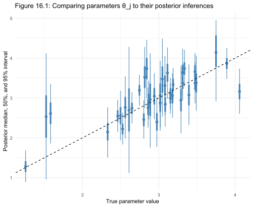
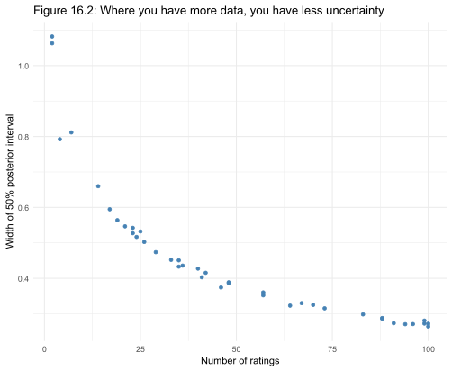
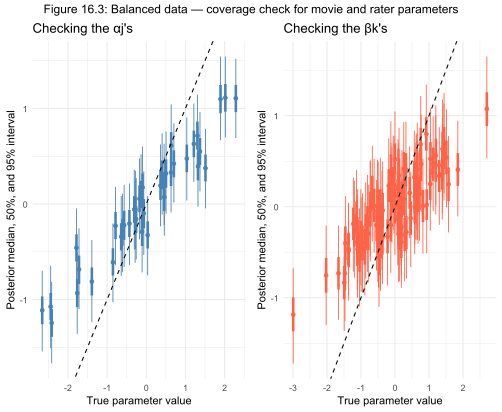
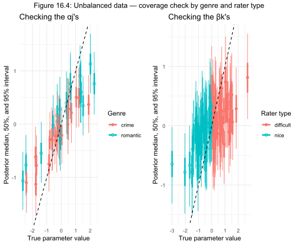
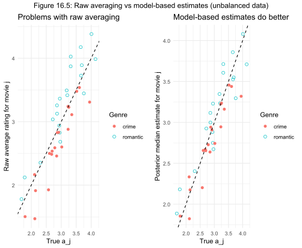

# Chapter 16 Case Study: Simulated Movie Ratings

*Based on Gelman, Vehtari et al., Bayesian Workflow (2026), Chapter 16.*
*Implemented using RBayesflow and brms in R.*

---

## The Question

Imagine you want to see a movie tonight. You check two options online. Both have an average rating of 4 out of 5 stars. But one has been rated by 2 people, and the other by 100. Which should you trust?

Most people instinctively trust the one with more ratings — and they are right. But why, exactly? And how much more should we trust it? This case study answers those questions using Bayesian statistics, then extends the problem to show how simple averaging can mislead you in more realistic settings.

The analysis builds three progressively more realistic models, each one exposing a limitation of the previous approach.

---

## What Is RBayesflow?

RBayesflow is a guided framework for running Bayesian statistical analyses in R. Instead of writing all your code from scratch, RBayesflow walks you through a standard sequence of steps — declaring your goal, specifying your prior beliefs, fitting a model, checking that the fitting process worked correctly, and producing a report. At each step it checks whether the analysis is on solid ground before letting you proceed to the next one.

The analysis in this case study was run in **learn mode**, which means RBayesflow provided extra guidance and explanations at each step rather than simply producing output.

---

## Setting Up: Phase 1

The first thing RBayesflow asks you to do is declare your goal. For this case study the data are simulated — invented by the code itself — so there is no real dataset to load. RBayesflow has a shortcut for this: `run_phase1(wf, simulated = TRUE)`.

```r
wf <- init_workflow(mode = "learn", stage = "explore")
wf <- run_phase1(wf, simulated = TRUE)
```

`init_workflow()` creates a workflow state object — a record that will track every decision made during the analysis. `run_phase1()` logs the goal and skips the off-ramp assessment (the check that asks whether a simpler method would do just as well), since when data are simulated from a known model there is no ambiguity about which method to use.

At any point during the analysis you can ask RBayesflow where you are and what to do next:

```r
guide(wf)
```

This prints three lines: the current phase, what you should expect to see, and the exact next step to take.

---

## Model 1: Two Movies

### The Data

The data for this model are not random. They are fixed numbers chosen so that both movies have exactly the same average rating of 4.0 out of 5.

- **Movie 1** received 2 ratings: a 3 and a 5. Average: 4.0.
- **Movie 2** received 100 ratings: ten 2s, twenty 3s, thirty 4s, and forty 5s. Average: 4.0.

```r
y_1 <- c(3, 5)
y_2 <- rep(c(2, 3, 4, 5), c(10, 20, 30, 40))
```

### The Model

We assume each movie has a true underlying popularity — the rating it would receive on average if everyone in the world watched and rated it. We call this θ (the Greek letter theta). We cannot observe θ directly; we can only estimate it from the ratings we have.

The mathematical statement of the model is:

$$y_i \sim \text{normal}(\theta_{j[i]},\, \sigma_y)$$

This says: each individual rating $y_i$ is drawn from a bell-shaped (normal) distribution centred on the true popularity $\theta_j$ of whatever movie $j$ was rated, with some spread $\sigma_y$ that captures how much individual ratings vary around the true mean.

### Prior Beliefs

Before seeing any data, we tell the model what we already believe. These starting beliefs are called **priors** (see Glossary). We believe movies typically get ratings around 3 stars, with most true popularities falling between 1 and 5. We also believe ratings don't vary wildly from one person to the next.

```r
priors_m1 <- c(
  brms::prior(normal(3, 1),   class = b,     lb = 0, ub = 5),
  brms::prior(normal(0, 2.5), class = sigma, lb = 0)
)
```

The first line says: our prior belief about each movie's true popularity is a bell curve centred at 3, with a spread of 1, and it cannot go below 0 or above 5 (the rating scale). The second line says: the typical spread of individual ratings around the true mean is somewhere between 0 and about 5, with smaller values being more plausible.

### Phase 2: Checking the Priors

Before fitting the model to the data, RBayesflow runs a **prior predictive check** — it simulates what ratings the model would generate using only the prior beliefs, ignoring the actual data. This is a sanity check: if the simulated ratings look wildly unrealistic (say, ratings of 50 or -20), the priors need tightening.

```r
wf <- run_phase2(wf, formula = y ~ 0 + movie, family = gaussian(),
                 priors = priors_m1, data = dat_m1, seed = 42)
```

The plot showed most simulated ratings concentrated between 0 and 5, which matches a realistic rating scale. The priors passed the check.

### Phase 3: Fitting the Model

RBayesflow then fits the model — it finds the combination of θ values and σ that are most consistent with both the data and the prior beliefs. This is done using a technique called Markov Chain Monte Carlo (MCMC), which explores the space of possible parameter values and builds up a picture of which ones are plausible.

```r
result_m1 <- run_phase3(wf, formula = y ~ 0 + movie, family = gaussian(),
                        priors = priors_m1, data = dat_m1, seed = 42,
                        chains = 4, iter = 2000, warmup = 1000)
```

`chains = 4` means the MCMC process runs four independent explorations simultaneously. `iter = 2000` means each chain takes 2000 steps, and `warmup = 1000` means the first 1000 steps of each chain are discarded (the chain needs time to find the right region before its samples are useful).

### Phase 4: Checking the Fitting Process

RBayesflow will not show you the results until it has verified that the fitting process worked correctly. It checks several diagnostic numbers automatically:

```r
wf <- run_diagnostics(fit_m1, wf)
print(wf)
```

The diagnostics passed: Rhat was 1.002 (should be near 1.0) and ESS was 1701 (should be above 400). Only then does RBayesflow display the results.

### The Result

| Parameter | Our estimate | Book estimate | What it means |
|---|---|---|---|
| θ[Movie 1] | 3.63, 95% CI (2.48, 4.70) | 3.63, 90% CI (2.70, 4.53) | True popularity of Movie 1 |
| θ[Movie 2] | 4.00, 95% CI (3.78, 4.20) | 3.99, 90% CI (3.82, 4.15) | True popularity of Movie 2 |
| σ_y | 1.02 | 1.02 | Typical spread of individual ratings |

Our estimates match the book's to two decimal places. The key lesson is visible in the intervals: Movie 1's interval spans about 2.2 stars wide, while Movie 2's spans only 0.4 stars wide — five times narrower — even though both movies have the same average rating of 4.0. With only 2 ratings, there is genuine uncertainty about whether Movie 1 is a hidden gem or merely lucky. With 100 ratings, Movie 2's quality is well established.

---

## Model 2: Forty Movies

### Extending the Problem

Model 1 had only 2 movies. Model 2 extends this to 40 movies, each receiving a random number of ratings between 0 and 100. The true popularities are generated by the computer from a bell curve centred at 3 with a spread of 0.5, meaning most movies are genuinely similar in quality. Individual ratings scatter around the true popularity with a spread of 2.0 — much more variable than in Model 1.

```r
set.seed(42)
J         <- 40
N_ratings <- sample(0:100, J, replace = TRUE)
theta_true <- rnorm(J, 3.0, 0.5)
y_m2      <- rnorm(N_m2, theta_true[movie_idx], 2.0)
```

`set.seed(42)` fixes the random number generator so the simulation is reproducible — anyone running this code will get the same simulated data.

The model structure is identical to Model 1; only the number of movies changes. RBayesflow runs through the same phases: prior check, fitting, diagnostics.

### Figure 16.1: Do the Estimates Match the Truth?

Because the data are simulated, we know the true popularity of every movie. This lets us check whether the model's estimates are correct — something impossible with real data. Figure 16.1 plots the model's estimate (vertical axis) against the true value (horizontal axis) for all 40 movies. Each movie appears as a dot (the median estimate) with a thick bar (the range containing 50% of plausible values) and a thin bar (the range containing 95% of plausible values).



If the model is working correctly, the dots should scatter around the diagonal dashed line (where estimate = truth), and roughly half the thick bars and nearly all the thin bars should cross the diagonal. This is exactly what we see.

### Figure 16.2: More Data, Less Uncertainty

Figure 16.2 shows how the width of the uncertainty interval depends on the number of ratings each movie received.



The pattern is clear and follows a precise mathematical law: uncertainty shrinks in proportion to the square root of the number of ratings. A movie with 4 ratings has half the uncertainty of one with 1 rating; a movie with 100 ratings has one-tenth the uncertainty of one with 1 rating. The scatter around the smooth curve exists because the intervals are estimated from simulation, not computed exactly.

---

## Model 3: Raters and Movies Together

### The Problem with Simple Averaging

Models 1 and 2 assume that ratings are a random sample from the general population. In reality, people choose which movies to watch — and that choice is not random. Fans of romantic comedies are more likely to watch and rate romantic comedies. Fans of crime thrillers are more likely to rate crime movies. If tough critics tend to prefer crime movies and lenient reviewers tend to prefer romantic comedies, then raw average ratings will be systematically biased: romantic comedies will look better than they are, and crime movies will look worse.

Model 3 is designed to detect and correct for this bias.

### The Model

This model assigns two parameters to every observation: a movie quality parameter (α, alpha) that represents how good the movie truly is, and a rater difficulty parameter (β, beta) that represents how tough the rater's standards are. The rating is then:

$$y_i \sim \text{normal}(\mu + \sigma_a \alpha_{j[i]} - \sigma_b \beta_{k[i]},\, \sigma_y)$$

Reading this left to right: the expected rating for movie $j$ by rater $k$ equals the overall average rating $\mu$, plus a movie quality adjustment $\sigma_a \alpha_j$, minus a rater strictness adjustment $\sigma_b \beta_k$. A tough rater (high $\beta_k$) pulls the expected rating down; a high-quality movie (high $\alpha_j$) pushes it up.

This is called an **item-response model** — the same family of models used to analyse exam scores (where items are questions and responses are answers).

In RBayesflow, this model is expressed as:

```r
y ~ 1 + (1 | movie) + (1 | rater)
```

The `(1 | movie)` part says: allow each movie to have its own adjustment to the overall mean. The `(1 | rater)` part says: allow each rater to have their own adjustment. This is called a **crossed random effects model** (see Glossary) because every rater rates every movie.

### Balanced Data: Everyone Rates Everything

The first version of Model 3 uses balanced data — all 100 raters rate all 40 movies, producing 4000 ratings. The true parameters are:

| Parameter | True value | What it means |
|---|---|---|
| μ | 3 | Average rating across all movies and raters |
| σ_a | 0.5 | How much movies vary in true quality |
| σ_b | 0.5 | How much raters vary in strictness |
| σ_y | 2 | How much individual ratings vary around the expected value |

After fitting, the model recovers all four parameters accurately. Figure 16.3 shows the coverage check for the movie quality parameters (α, left panel) and the rater difficulty parameters (β, right panel).



Both panels show points tracking the diagonal, confirming that the model correctly identifies both movie quality and rater strictness from the data alone.

### Unbalanced Data: Who Rates What Depends on Who They Are

The second version introduces deliberate selection bias. Movies are divided into two genres: 20 romantic comedies and 20 crime movies. Tough raters (those with high β) are much more likely to rate crime movies (70% chance) than romantic comedies (20% chance). Lenient raters are the reverse.

```r
genre <- rep(c("romantic", "crime"), c(20, 20))

prob_of_rated <- ifelse(
  beta[rater_idx_3] > 0,
  ifelse(genre[movie_idx_3] == "romantic", 0.2, 0.7),
  ifelse(genre[movie_idx_3] == "romantic", 0.7, 0.2)
)
```

This means crime movies are disproportionately reviewed by people who give lower ratings, and romantic comedies are disproportionately reviewed by people who give higher ratings. The raw average rating for each movie is now misleading.

Figure 16.4 shows that the model still recovers the true parameters correctly despite this bias.



The two genres (open circles for romantic, filled circles for crime) and two rater types (teal for nice, salmon for difficult) are distinguished by colour and shape. Both groups track the diagonal equally well, showing the model has accounted for the selection bias.

### Figure 16.5: The Punchline

Figure 16.5 is the chapter's central demonstration. It compares two approaches to estimating movie quality from the unbalanced data.



**Left panel — Raw averaging:** The average rating for each movie is plotted against its true quality. Romantic comedies (open circles) cluster above the diagonal — their raw averages are inflated by lenient reviewers. Crime movies (filled circles) cluster below the diagonal — their raw averages are deflated by tough reviewers. Raw averaging is systematically wrong in different directions for the two genres.

**Right panel — Model-based estimates:** The model's estimate of each movie's quality is plotted against its true quality. Both genres now track the diagonal closely. The model has correctly separated movie quality from rater bias.

The practical implication: if you only look at raw average ratings on a website where different types of viewers tend to watch different types of movies, you will systematically overrate some genres and underrate others. A model that accounts for who rates what gives you a fairer picture.

---

## How RBayesflow Guided the Analysis

RBayesflow enforced a consistent discipline across all three models:

1. **Phase 1 (Goal Declaration):** The analysis goal was logged before any fitting began.
2. **Phase 2 (Prior Check):** Simulated data from the priors were inspected before fitting to confirm the priors were reasonable.
3. **Phase 3 (Fitting):** The model was fitted using four independent MCMC chains.
4. **Phase 4 (Diagnostics):** RBayesflow checked that the fitting process converged before displaying any results. All three models passed with Rhat near 1.0 and ESS well above the minimum threshold.
5. **Workflow state tracking:** At every step, the `wf` object recorded what had been done, what decisions had been made, and whether each phase had passed its checks. This audit trail makes the analysis reproducible and reviewable.

The `guide(wf)` function was available at any point to print the current phase and exact next step, preventing the user from getting lost in the sequence.

---

## Glossary

**Audit trail:** A record of every decision made during an analysis — which model was chosen, what priors were used, whether diagnostics passed. RBayesflow stores this in the `wf` object.

**Balanced data:** A dataset where every combination of groups is equally represented — here, every rater rates every movie. Contrasted with unbalanced data.

**[Bayesian inference](https://en.wikipedia.org/wiki/Bayesian_inference):** A way of updating beliefs in the light of evidence. You start with a prior belief, observe data, and combine the two to get a [posterior belief](https://insightful-data-lab.com/2025/08/28/posterior-belief/) that is more informed than either alone.

**[brms](https://paulbuerkner.com/brms/):** An R package that lets you specify statistical models in a concise formula language and compiles them into Stan programs automatically. RBayesflow uses brms as its primary fitting engine. The **brms** package provides an interface to fit Bayesian generalized multivariate (non-)linear multilevel models using **Stan**, which is a C++ package for obtaining full Bayesian inference (see https://mc-stan.org/).

**Chains ([MCMC chains](https://tutorials.pumas.ai/html/bayesian/04-mcmc_convergence.html)):** Independent runs of the sampling algorithm. Running multiple chains and checking that they agree is the primary way to verify that the algorithm found the right answer.

**Coverage check:** A test of whether a model's uncertainty intervals are well-calibrated. If a model says "90% interval," then 90% of those intervals should contain the true value when the data are simulated from the model.

**Crossed random effects:** A model structure where two grouping variables (here, movies and raters) are crossed — every unit of one group can appear with every unit of the other. Contrasted with nested effects, where groups are contained within other groups.

**Diagnostic gate:** RBayesflow's rule that coefficient output is withheld until the user has confirmed that the MCMC diagnostics passed. This prevents drawing conclusions from a failed fit.

**ESS (Effective Sample Size):** A measure of how much independent information the MCMC samples contain. A chain of 1000 steps where each step is highly similar to the last may contain the equivalent of only 200 independent samples. ESS should be above 400 for reliable estimates.

**Item-response model:** A statistical model originally developed for educational testing that separates the difficulty of a question (or, here, the strictness of a rater) from the ability of the respondent (or the quality of the movie).

**MCMC ([Markov Chain Monte Carlo](https://www.publichealth.columbia.edu/research/population-health-methods/markov-chain-monte-carlo)):** A family of algorithms for exploring the space of possible parameter values. Instead of computing a single best estimate, MCMC produces thousands of plausible values, giving a complete picture of uncertainty.

**[Normal distribution](https://en.wikipedia.org/wiki/Normal_distribution):** A bell-shaped probability distribution described by a mean (the center) and a standard deviation (the spread). Used here to model both ratings and prior beliefs about parameters.

**[Non-centered parameterization](https://discourse.mc-stan.org/t/what-does-non-centered-parameterization-actually-do-how-to-interpret-model-brms/22266):** A mathematical re-expression of a hierarchical model that separates the scale of the parameters from their shape. Used in Model 3 to improve the efficiency of the MCMC sampler.

**Phase (RBayesflow phase):** One of the seven sequential steps in the RBayesflow workflow: goal declaration, prior specification, fitting, diagnostics, posterior predictive check, model comparison, and reporting.

**Posterior:** The updated belief about a parameter after combining the prior with the data. In this case study, the posterior for θ[Movie 1] is a distribution centred around 3.6 with a 95% interval of (2.5, 4.7).

**Posterior predictive check:** A test of whether the fitted model can reproduce the kind of data that was actually observed. If the model generates data that looks nothing like the real data, something is wrong with the model.

**Prior:** A probability distribution expressing what we believe about a parameter before seeing any data. In this case study, the prior on θ said "movies probably get ratings around 3, and almost certainly between 0 and 5."

**Prior predictive check:** A simulation of what data the model would generate using only the prior, before fitting. Used to verify that the priors are not wildly unrealistic.

**[Rhat](https://mc-stan.org/rstan/reference/Rhat.html) (R-hat):** A diagnostic number that measures whether multiple MCMC chains converged to the same answer. Values near 1.0 indicate convergence; values above 1.01 suggest a problem.

**Random effects:** Parameters that vary by group (here, by movie or by rater) and are assumed to come from a shared distribution. They allow each group to have its own adjustment while pooling information across groups.

**Selection bias:** A distortion that occurs when the data are not a random sample — here, when certain types of raters systematically choose certain types of movies. Selection bias causes raw averages to misrepresent the true values.

**Seed (random seed):** A number that fixes the starting point of a random number generator, making simulation results reproducible. `set.seed(42)` means anyone running the code will get exactly the same simulated dataset.

**Shrinkage:** The tendency of a hierarchical model to pull estimates toward the overall mean, especially for groups with little data. A movie with 2 ratings gets pulled toward the average more than a movie with 100 ratings.

**[Stan](https://mc-stan.org/):** A programming language for Bayesian statistical modelling. brms compiles R model formulas into Stan programs and runs them automatically.

**Unbalanced data:** A dataset where different combinations of groups have different amounts of data — here, where some raters rate some movies but not others, and the pattern of who rates what is not random.

**Workflow state (`wf`):** The central object in RBayesflow that records the current phase, all model specifications, diagnostic results, and audit trail for an analysis session.
