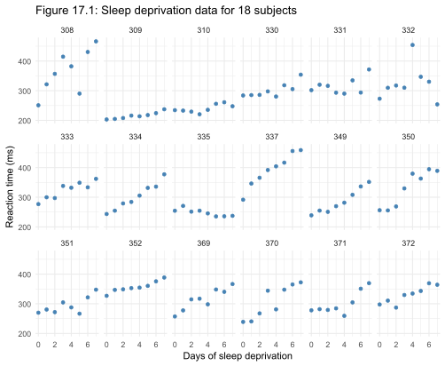
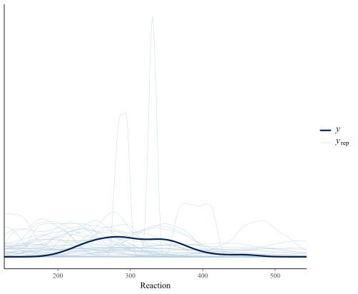
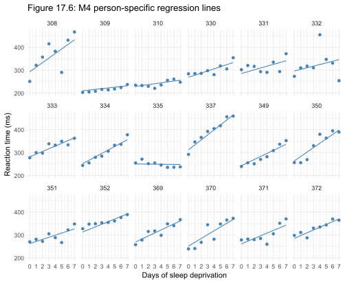
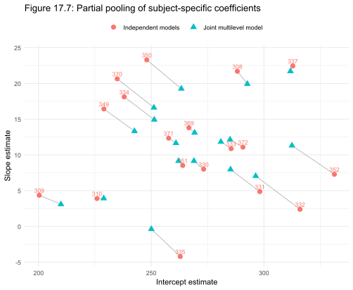

# Chapter 17 Case Study: Prior Specification for a Sleep Study

*Based on Gelman, Vehtari et al., Bayesian Workflow (2026), Chapter 17.*
*Implemented using RBayesflow and brms in R.*

---

## The Question

How do you decide what to believe before you see the data?

In Bayesian statistics, every analysis requires you to state your prior beliefs about the model parameters in the form of probability distributions. These are called **priors**. Choosing them well matters — a prior that rules out plausible values will distort your conclusions; a prior that allows absurd values will slow down the computation and produce unreliable estimates.

This case study uses a real dataset — the reaction times of 18 people undergoing sleep deprivation — to show how to think through prior specification step by step, and how that thinking changes as the model grows in complexity. We build three models of increasing realism. Each one exposes a new prior that needs to be chosen, and each prior choice is grounded in what we actually know about reaction times before we look at the data.

---

## The Data

The `sleepstudy` dataset (Belenky et al., 2003) ships with the R package [`lme4`.](https://github.com/lme4/lme4/) It records the average reaction time in milliseconds for 18 subjects on a simple test, measured each day over a period of sleep deprivation (less than 3 hours of sleep per night). Following the book, we drop the first two "adaptation" days and re-centre the time axis so Day 0 is the first day of genuine sleep deprivation:

```r
data("sleepstudy", package = "lme4")
sleepstudy       <- subset(sleepstudy, Days >= 2)
sleepstudy$Days  <- sleepstudy$Days - 2
```

This leaves N = 144 observations: 18 subjects × 8 days. Each subject contributes 8 measurements, which means the observations are **not independent** — the same person appears 8 times, and their reaction times on consecutive days are more similar to each other than to a different person's times.

### Figure 17.1: The Data



Most subjects show a clear upward trend — reaction times increase as sleep deprivation accumulates. But the trend varies substantially between people: subject 335 is nearly flat, while subjects 337 and 370 rise steeply. Any model that ignores this between-person variation is misspecifying reality.

---

## What Is RBayesflow?

RBayesflow is a guided framework for running Bayesian analyses in R. It walks you through a fixed sequence of steps — declaring your goal, specifying priors, fitting a model, checking that the fitting worked, and reporting. At each step it verifies that the analysis is on solid ground before allowing you to proceed.

This case study was run in **learn mode**, which provides extra explanations and shows prior-vs-posterior overlay plots rather than raw coefficient tables.

---

## Setting Up: Phase 1

```r
wf <- init_workflow(mode = "learn", stage = "explore")
wf <- run_phase1(wf, simulated = FALSE)
```

`simulated = FALSE` tells RBayesflow this is real data and triggers the off-ramp assessment — a check of whether a simpler method (t-test, ordinary linear regression) would serve just as well. For this case study we select `full_stan` and proceed with a Bayesian analysis. The goal and that choice are both logged to the workflow state object `wf`.

---

## Model 1: Simple Linear Regression

### The Model

We start by ignoring the repeated-measures structure entirely. Each of the 144 reaction time measurements is treated as independent. The model says:

$$y_n \sim \text{normal}(\mu_n,\, \sigma)$$
$$\mu_n = b_0 + b_1 \cdot \text{Days}_n$$

where $y_n$ is the reaction time for observation $n$, $b_0$ is the intercept (the expected reaction time on Day 0), $b_1$ is the slope (how many milliseconds reaction time increases per extra day of sleep deprivation), and $\sigma$ is the residual standard deviation — how much individual observations scatter around the fitted line.

### Choosing the Priors

Before looking at the data, we ask: what do we know about reaction times?

**Intercept $b_0$:** On Day 0 of real deprivation (roughly day 3.5 of the original study), subjects are mildly sleep-deprived. Typical alert reaction times run around 200–300 ms. We encode this as:

$$b_0 \sim \text{normal}(250,\, 100)$$

This puts about 68% prior probability on $b_0 \in (150, 350)$ ms and 95% prior probability on $b_0 \in (50, 450)$ ms — a broad but not absurd range.

**Slope $b_1$:** We expect sleep deprivation to slow reactions, so positive slopes are more plausible than negative ones. However, rather than encoding that direction into the prior (which would make the analysis less informative about what the data alone say), we centre the prior at zero and make it wide:

$$b_1 \sim \text{normal}(0,\, 20)$$

This puts 95% prior probability on the per-day change in $(-40, +40)$ ms/day, which rules out implausible extremes while being otherwise agnostic.

**Residual standard deviation $\sigma$:** Reaction times within a person on the same day vary by roughly 50 ms in typical psychophysics experiments. We encode this with a prior whose mean is 50 ms:

$$\sigma \sim \text{exponential}(1/50) = \text{exponential}(0.02)$$

The exponential distribution has mean equal to $1/\lambda$, so $\lambda = 0.02$ gives mean 50 ms. It is also constrained to be positive, which is appropriate for a standard deviation.

```r
priors_m1 <- c(
  brms::prior(normal(250, 100),  class = Intercept),
  brms::prior(normal(0, 20),     class = b),
  brms::prior(exponential(0.02), class = sigma)
)
```

### Phase 2: Prior Predictive Check

Before fitting, RBayesflow simulates 100 datasets from the priors alone and plots their distributions against the observed data. This is Figure 17.2.



The thick dark line is the observed data density — a smooth bell centred around 300 ms. The light blue lines are 100 prior predictive draws. Most are wide and flat, a few spike narrowly. The spikes occur when a draw happens to pick a very small $\sigma$ from the exponential prior's right tail, producing a very concentrated density. This is acceptable: the priors are deliberately vague, and the observed data fall well within the range the prior considers plausible.

### Phase 3: Fitting

```r
result_m1 <- run_phase3(wf, formula = Reaction ~ 1 + Days,
                        family = gaussian(), priors = priors_m1,
                        data = sleepstudy, seed = 42,
                        chains = 4, iter = 2000, warmup = 1000)
```

Four MCMC chains each take 2000 steps. The first 1000 steps of each chain (the warmup) are discarded while the sampler finds the right region; the remaining 1000 steps per chain (4000 total) are used for inference.

### Phase 4: Diagnostics

```
Diagnostics: PASSED (Rhat_max = 1.002 | ESS_bulk_min = 1701 | divergences = NA)
```

[Rhat](https://mc-stan.org/rstan/reference/Rhat.html) is within 0.003 of 1.0 and ESS is well above the 400 minimum. RBayesflow releases the results.

### Results

| Parameter | Our estimate | Book estimate | What it means |
|---|---|---|---|
| $b_0$ (Intercept) | 267.88, 95% CI (252.30, 282.29) | 268.17, 95% CI (253.03, 283.38) | Expected reaction time on Day 0 |
| $b_1$ (Days) | 11.39, 95% CI (7.81, 15.01) | 11.34, 95% CI (7.62, 15.10) | ms increase per day of deprivation |
| $\sigma$ | 51.16, 95% CI (45.45, 57.58) | 51.21, 95% CI (45.71, 57.85) | Residual scatter around fitted line |

All three match the book to within Monte Carlo noise. The estimated slope of about 11 ms per day is consistent with the psychophysics literature on sleep deprivation.

**The limitation of this model:** $\sigma = 51$ ms absorbs everything — the genuine day-to-day variability within a person, and the fact that different people have very different baseline reaction times. Subject 309 starts around 200 ms; subject 308 starts around 320 ms. Treating that 120 ms gap as random noise rather than a real between-person difference inflates $\sigma$ and widens the uncertainty on $b_1$ unnecessarily.

---

## Model 3: Varying Intercepts

### The Model

We now give each subject their own intercept. Subject $j$'s intercept $b_{0j}$ is drawn from a shared distribution — a **hierarchical prior** — rather than being either fixed or completely free:

$$y_n \sim \text{normal}(\mu_n,\, \sigma)$$
$$\mu_n = b_{0j[n]} + b_1 \cdot \text{Days}_n$$
$$b_{0j} \sim \text{normal}(b_0,\, \tau_0)$$

Here $b_0$ is the population-average intercept and $\tau_0$ is the standard deviation of intercepts across subjects. Both are estimated from the data along with everything else. This is called a **multilevel model** because there are two levels: individual observations within subjects, and subjects within the population.

brms samples this using the non-centered parameterization (see Glossary), which is mathematically equivalent but more efficient for Hamiltonian Monte Carlo:

$$b_{0j} = b_0 + \tau_0 z_{0j}, \quad z_{0j} \sim \text{normal}(0, 1)$$

### Choosing the Priors

The intercept and slope priors are unchanged. The new challenge is the $\sigma$ prior. In Model 1, $\sigma$ captured both within-person variability and between-person differences in baseline. Now that between-person differences have their own parameter $\tau_0$, we split the original $\text{exponential}(0.02)$ (mean 50 ms) into two priors each with mean 25 ms:

$$\tau_0 \sim \text{exponential}(0.04) \quad \text{(between-subject sd of intercepts)}$$
$$\sigma \sim \text{exponential}(0.04) \quad \text{(within-subject residual sd)}$$

The reasoning: if the total variation was roughly 50 ms in Model 1, and we're now splitting it equally between between-person and within-person components, each component should have a prior centred around half of 50 ms.

```r
priors_m3 <- c(
  brms::prior(normal(250, 100),  class = Intercept),
  brms::prior(normal(0, 20),     class = b),
  brms::prior(exponential(0.04), class = sd,    group = Subject),
  brms::prior(exponential(0.04), class = sigma)
)

result_m3 <- run_phase3(wf, formula = Reaction ~ 1 + Days + (1 | Subject), ...)
```

### Phase 4: Diagnostics

```
Diagnostics: PASSED (Rhat_max = 1.004 | ESS_bulk_min = 569 | divergences = NA)
```

### Results

| Parameter | Our estimate | Book estimate | What it means |
|---|---|---|---|
| $b_0$ (Intercept) | 267.78, 95% CI (245.37, 289.85) | 267.56, 95% CI (245.89, 288.50) | Population-average reaction time on Day 0 |
| $b_1$ (Days) | 11.40, 95% CI (9.17, 13.59) | 11.41, 95% CI (9.14, 13.57) | ms increase per day |
| $\tau_0$ (sd Intercept) | 42.31, 95% CI (29.75, 60.36) | 43.56, 95% CI (30.90, 62.07) | Between-subject sd of baseline times |
| $\sigma$ | 30.46, 95% CI (26.90, 34.77) | 30.46, 95% CI (26.95, 34.77) | Within-subject residual sd |

Two things are worth noting. First, $\sigma$ dropped from 51 ms to 30 ms — because between-person differences in baseline are now modelled explicitly by $\tau_0 \approx 42$ ms rather than being absorbed into the residual. Second, the uncertainty on the slope $b_1$ tightened: the standard error dropped from 1.83 (Model 1) to 1.12. Modelling the within-subject structure correctly gives us a more precise estimate of the effect of sleep deprivation.

---

## Model 4: Varying Intercepts and Slopes

### The Model

Figure 17.1 shows that not only do subjects differ in baseline reaction time — they also differ in how steeply sleep deprivation affects them. Subject 335 shows almost no increase over 8 days; subject 337 increases rapidly. Model 3 forces everyone to share the same slope $b_1$. Model 4 lets slopes vary:

$$y_n \sim \text{normal}(\mu_n,\, \sigma)$$
$$\mu_n = b_{0j[n]} + b_{1j[n]} \cdot \text{Days}_n$$

Each subject now has their own intercept $b_{0j}$ and slope $b_{1j}$. Because people who react slowly at baseline may also be more (or less) sensitive to sleep deprivation, the two parameters may be correlated. We model this jointly:

$$(b_{0j},\, b_{1j}) \sim \text{MVN}\!\left((b_0,\, b_1),\, \Sigma\right)$$

where MVN denotes the [multivariate normal distribution](https://mc-stan.org/docs/2_21/functions-reference/multivariate-normal-distribution.html) and $\Sigma$ is a 2×2 covariance matrix decomposed as:

$$\Sigma = \text{diag}(\tau_0, \tau_1)\; C\; \text{diag}(\tau_0, \tau_1)$$

$\tau_0$ and $\tau_1$ are the standard deviations of the intercepts and slopes across subjects, and $C$ is the correlation matrix:

$$C = \begin{pmatrix} 1 & \rho \\ \rho & 1 \end{pmatrix}$$

The single correlation $\rho$ captures whether subjects with high baseline times tend to have steeper (or shallower) slopes.

### Choosing the Priors

The prior on the slope standard deviation $\tau_1$ needs separate thought. Day-to-day slopes vary across people — looking at Figure 17.1, a range of roughly ±10 ms/day is plausible. We encode:

$$\tau_1 \sim \text{exponential}(0.1) \quad \text{(mean 10 ms/day)}$$

This is tighter than the $\tau_0$ prior (mean 25 ms) because slope variation is on a different scale than intercept variation.

For the correlation matrix $C$ we use the **[LKJ prior](https://mc-stan.org/docs/2_18/functions-reference/lkj-correlation.html)** with shape parameter $\eta = 1$:

$$C \sim \text{LKJ}(1)$$

$\text{LKJ}(1)$ is uniform over all valid 2×2 correlation matrices — it assigns equal prior probability to $\rho = 0$ (no correlation), $\rho = 0.9$ (strong positive correlation), and $\rho = -0.5$ (moderate negative correlation). It expresses genuine ignorance about the sign and magnitude of the relationship between baseline and sensitivity.

```r
priors_m4 <- c(
  brms::prior(normal(250, 100),  class = Intercept),
  brms::prior(normal(0, 20),     class = b),
  brms::prior(exponential(0.04), class = sd,  group = Subject, coef = Intercept),
  brms::prior(exponential(0.1),  class = sd,  group = Subject, coef = Days),
  brms::prior(lkj(1),            class = cor, group = Subject),
  brms::prior(exponential(0.04), class = sigma)
)

result_m4 <- run_phase3(wf,
  formula = Reaction ~ 1 + Days + (1 + Days | Subject), ...)
```

### Phase 4: Diagnostics

```
Diagnostics: PASSED (Rhat_max = 1.004 | ESS_bulk_min = 875 | divergences = NA)
```

### Results

| Parameter | Our estimate | Book estimate | What it means |
|---|---|---|---|
| $b_0$ (Intercept) | 267.31, 95% CI (250.92, 283.76) | 267.54, 95% CI (250.72, 284.84) | Population-average reaction time on Day 0 |
| $b_1$ (Days) | 11.29, 95% CI (7.23, 15.27) | 11.26, 95% CI (7.18, 15.21) | Population-average ms increase per day |
| $\tau_0$ (sd Intercept) | 31.73, 95% CI (19.35, 48.70) | 31.72, 95% CI (19.96, 48.80) | Between-subject sd of baselines |
| $\tau_1$ (sd Days) | 7.13, 95% CI (4.17, 11.03) | 7.25, 95% CI (4.23, 11.44) | Between-subject sd of slopes |
| $\rho$ (cor Intercept, Days) | 0.22, 95% CI (−0.39, 0.80) | 0.21, 95% CI (−0.38, 0.78) | Correlation between baseline and slope |
| $\sigma$ | 25.90, 95% CI (22.74, 29.70) | 25.93, 95% CI (22.70, 29.73) | Within-subject residual sd |

All six parameters match the book to within Monte Carlo noise.

Notice that the uncertainty on $b_1$ has widened again compared to Model 3 (sd 2.01 vs 1.12). This is not a failure — it is the model correctly accounting for the fact that the population-average slope is now estimated from 18 subject-specific slopes, which themselves carry uncertainty. Model 3 forced everyone to share one slope, artificially concentrating information. Model 4 is more honest about what the data can tell us.

The correlation $\rho \approx 0.21$ is positive but the 95% interval spans (−0.39, 0.78) — essentially the full range of plausible values. The data are consistent with a mild positive correlation (people with slower baseline times tend to be more sensitive to deprivation), but 18 subjects is not enough to pin it down.

---

## Figure 17.6: Person-Specific Regression Lines



Each panel shows the data for one subject with their Model 4 posterior-median regression line overlaid. The variation in slopes is now explicit: subject 335's line is nearly horizontal, while subjects 337 and 370 rise steeply. The lines do not pass exactly through all the data points — they are pulled toward the population mean by the hierarchical prior, particularly for subjects whose data are noisy or unusual.

---

## Figure 17.7: Partial Pooling



This figure compares two approaches to estimating each subject's intercept and slope:

**Pink circles — no pooling:** A separate `lm()` is fitted to each subject's 8 data points independently. Each estimate uses only that subject's data with no information from anyone else.

**Teal triangles — partial pooling (Model 4):** The multilevel model estimates each subject's parameters jointly, allowing information to flow between subjects through the hierarchical prior.

The grey lines connect each subject's two estimates, showing the direction and magnitude of the pooling effect. The most dramatic example is subject 335: the independent `lm()` gives a slope of about −5 ms/day (reaction times appear to *improve* with deprivation, which is physiologically implausible). The multilevel model pulls this toward the population mean, producing a slope near 0. With only 8 data points, an anomalous estimate is quite possible; the hierarchical prior acts as a regularizer, saying "this estimate is so far from everyone else's that we should be skeptical of it."

Subjects near the center of the cloud (330, 333, 372) are barely moved — their no-pooling estimates are already close to the population mean, so the prior has little leverage.

This is called **partial pooling**: each subject's estimate is a compromise between their own data and the group average, with the balance determined by how much data the subject has and how variable the population is. It is one of the central practical advantages of multilevel modelling.

---

## How the Priors Evolved Across Models

The table below shows how prior reasoning accumulated as the model grew:

| Model | New parameter | Prior | Reasoning |
|---|---|---|---|
| M1 | $b_0$ | normal(250, 100) | Reaction times on mildly deprived day ~250 ms; allow ±100 ms uncertainty |
| M1 | $b_1$ | normal(0, 20) | Slopes likely within ±40 ms/day; centered at zero to avoid encoding direction |
| M1 | $\sigma$ | exponential(0.02) | Total variability ~50 ms; single component absorbs everything |
| M3 | $\tau_0$ | exponential(0.04) | Split the M1 $\sigma$ prior in half; between-subject component gets mean 25 ms |
| M3 | $\sigma$ | exponential(0.04) | Within-subject component also gets mean 25 ms |
| M4 | $\tau_1$ | exponential(0.1) | Slope variation is on a different scale; ±10 ms/day between subjects is plausible |
| M4 | $C$ | LKJ(1) | No prior knowledge of the intercept-slope correlation; uniform prior |

Each new prior was grounded in subject-matter knowledge about reaction times, not in generic defaults. That is the core lesson of this chapter.

---

## How RBayesflow Guided the Analysis

RBayesflow enforced a consistent discipline across all three models:

1. **Phase 1 (Goal Declaration):** The analysis goal and data source were logged before any fitting began. The off-ramp assessment was run and `full_stan` was selected.
2. **Phase 2 (Prior Predictive Check):** Simulated data from the priors were plotted against the observed data before fitting, confirming the priors were not wildly unrealistic.
3. **Phase 3 (Fitting):** Each model was fitted using four independent MCMC chains with 1000 warmup and 1000 post-warmup iterations per chain.
4. **Phase 4 (Diagnostics):** RBayesflow checked Rhat, ESS, and divergences before displaying any results. All three models passed cleanly.
5. **Workflow state tracking:** The `wf` object recorded every decision — priors used, diagnostic outcomes, phases completed — providing a reproducible audit trail.

At any point during the analysis, calling `guide(wf)` printed the current phase, what to expect, and the exact next step.

---

## Extensions for the Student

The script covers the core of Chapter 17. Several threads are left for the reader to explore:

- **Prior sensitivity (Figs 17.3–17.4):** The `priorsense` package can test how much the posterior changes when you tighten or loosen each prior by a factor. Try it on Model 1 to see which prior matters most.
- **Lognormal family:** Reaction times must be positive, but the Gaussian model can predict negative values. Chapter 17 shows how to translate priors to the log scale and fit a lognormal model (`family = lognormal()`). The prior-translation exercise (matching quantiles across scales) is instructive and non-trivial.
- **Student-t residuals:** A few subjects in Figure 17.6 have data points far from their fitted lines. Replacing `gaussian()` with `student()` adds a degrees-of-freedom parameter that accommodates heavy tails. The book shows this model wins decisively on LOO-CV.
- **Model comparison with LOO:** Run `loo()` on all fitted models and `loo_compare()` to rank them by out-of-sample predictive accuracy.

---

## Glossary

**Adaptation days:** The first two days of the sleep deprivation experiment, during which subjects adjust to the laboratory environment. Following the book, these are dropped from the analysis, leaving Days 2–9 (re-labelled 0–7).

**[Bayesian inference](https://en.wikipedia.org/wiki/Bayesian_inference):** A way of updating beliefs in the light of evidence. You start with a prior belief, observe data, and combine the two to get a posterior belief that is more informed than either alone.

**[brms](https://paulbuerkner.com/brms/):** An R package that lets you specify statistical models in a concise formula language and compiles them into Stan programs automatically. RBayesflow uses brms as its primary fitting engine.

**Chains ([MCMC chains](https://tutorials.pumas.ai/html/bayesian/04-mcmc_convergence.html)):** Independent runs of the sampling algorithm. Running four chains and checking they agree is the primary way to verify the algorithm found the right region of parameter space.

**Covariance matrix:** A matrix that describes the variance of each parameter (on the diagonal) and the covariance between pairs of parameters (off the diagonal). In Model 4, the 2×2 covariance matrix of intercepts and slopes is decomposed into standard deviations and a correlation matrix.

**Diagnostic gate:** RBayesflow's rule that coefficient output is withheld until the user has confirmed that the MCMC diagnostics passed. This prevents drawing conclusions from a failed fit.

**ESS (Effective Sample Size):** A measure of how much independent information the MCMC samples contain. A chain of 1000 correlated steps may contain the equivalent of only a few hundred independent samples. ESS should be above 400 for reliable estimates.

**Exponential distribution:** A probability distribution for positive-valued quantities, parameterised by a rate $\lambda$. Its mean is $1/\lambda$ and its standard deviation equals its mean, encoding substantial uncertainty. Used here as a prior for standard deviation parameters.

**Hierarchical prior:** A prior on a group of parameters that treats them as drawn from a shared distribution, whose own parameters are estimated from the data. This allows information to flow between groups (partial pooling) without forcing all groups to be identical (complete pooling).

**[LKJ prior](https://distribution-explorer.github.io/multivariate_continuous/lkj.html):** A prior distribution over correlation matrices, named for Lewandowski, Kurowicka, and Joe (2009). The shape parameter $\eta$ controls how concentrated the prior is around the identity matrix (zero correlations). $\eta = 1$ gives a uniform prior over all valid correlation matrices.

**MCMC ([Markov Chain Monte Carlo](https://www.publichealth.columbia.edu/research/population-health-methods/markov-chain-monte-carlo)):** A family of algorithms for exploring the space of possible parameter values. Instead of computing a single best estimate, MCMC produces thousands of plausible values, giving a complete picture of uncertainty.

**Multilevel model:** A model with parameters at more than one level — here, observations within subjects, and subjects within the population. Also called a hierarchical model or mixed-effects model.

**Multivariate normal distribution (MVN):** A generalisation of the normal distribution to multiple variables. Used in Model 4 to model the joint distribution of each subject's intercept and slope, allowing them to be correlated.

**[Non-centred parameterisation](https://discourse.mc-stan.org/t/what-does-non-centered-parameterization-actually-do-how-to-interpret-model-brms/22266):** A mathematically equivalent re-expression of a hierarchical model that separates the scale of the group-level parameters from their deviations. Used by brms automatically to improve MCMC efficiency.

**[Normal distribution](https://en.wikipedia.org/wiki/Normal_distribution):** A bell-shaped probability distribution described by a mean (the centre) and a standard deviation (the spread). Used here as the data model for reaction times and as the prior for regression coefficients.

**Partial pooling:** The compromise between no pooling (each group estimated independently) and complete pooling (all groups forced to share one estimate). A multilevel model achieves partial pooling: each group's estimate is pulled toward the population mean, with the degree of pull determined by the group's sample size and the population variance.

**Phase (RBayesflow phase):** One of the seven sequential steps in the RBayesflow workflow: goal declaration, prior specification, fitting, diagnostics, posterior predictive check, model comparison, and reporting.

**Posterior:** The updated belief about a parameter after combining the prior with the data.

**Prior:** A probability distribution expressing what we believe about a parameter before seeing any data. In this case study, the prior on $b_1$ said "the per-day change in reaction time is probably within ±40 ms/day."

**Prior predictive check:** A simulation of what data the model would generate using only the prior, before fitting. Used to verify that the priors are not wildly unrealistic.

**Prior sensitivity:** A test of how much the posterior changes when the prior is varied. If a small change to the prior produces a large change in the posterior, the prior is informative in ways you may not have intended.

**[Rhat](https://mc-stan.org/rstan/reference/Rhat.html) (R-hat):** A diagnostic number that measures whether multiple MCMC chains converged to the same answer. Values near 1.0 indicate convergence; values above 1.01 suggest a problem.

**Repeated measures:** A dataset where the same subject contributes multiple observations. Ignoring repeated measures inflates the apparent sample size and underestimates uncertainty, because observations from the same person are not independent.

**[Stan](https://mc-stan.org/):** A probabilistic programming language for Bayesian statistical modelling. brms compiles R model formulas into Stan programs and runs them automatically.

**Varying intercepts / varying slopes:** Terms for a multilevel model where the intercept (or slope) is allowed to differ by group. A varying-intercepts model accounts for different baseline levels; a varying-slopes model accounts for different rates of change.

**Warmup:** The initial phase of MCMC sampling, during which the algorithm explores the parameter space to find the right region. Warmup samples are discarded before inference begins.

**Workflow state (`wf`):** The central object in RBayesflow that records the current phase, all model specifications, diagnostic results, and audit trail for an analysis session.
