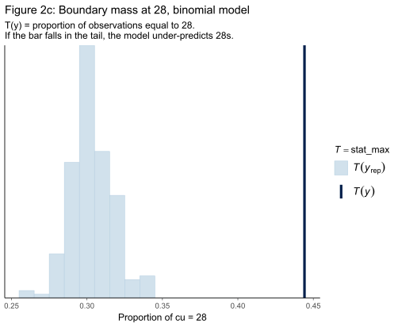
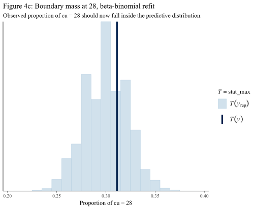

Here is a puzzle. You have count data — the number of days someone used cannabis in the past 28 days. The outcome is an integer between 0 and 28, bounded, discrete, the kind of data a statistician's eye immediately routes to a binomial model. You fit it. The model converges. Then you compare it to a plain Gaussian regression — a continuous model that can predict negative days of cannabis use, or more than 28, neither of which is physically possible. The Gaussian wins. By a lot.

How is that possible?

This question sits at the heart of Chapter 18 of Gelman et al.'s *[Bayesian Workflow](https://users.aalto.fi/~ave/Bayesian-Workflow.pdf)*, a case study built around a real clinical trial of nabiximols — a cannabis-derived mouth spray — versus placebo in treating [cannabis-use disorder](https://pubmed.ncbi.nlm.nih.gov/32768992/). Working through this case study in R with the RBayesflow workflow toolkit reveals something important: the family of a statistical model matters far less than whether that model is *calibrated*. A calibrated model's uncertainty intervals contain the true value at the rate they claim. An uncalibrated model can look plausible and still mislead you about the very thing you are trying to estimate.

## The Trial and the Data

The trial enrolled 128 participants divided into placebo and nabiximols groups. Each participant reported the number of days of cannabis use (`cu`) in the previous 28 days at four time points: baseline (week 0), and weeks 4, 8, and 12. The primary question was whether nabiximols reduced cannabis use more than placebo.


>


Figure 1 shows the data immediately tells you something is going to be difficult. Look at the bars piled up at 0 and 28. These are real clinical phenomena: some participants abstained completely during the recall window; others used cannabis every day. A model that treats days-of-use as a smooth continuous quantity has no natural way to represent those boundary spikes. A binomial model knows the outcome is bounded by 28 trials, but as we are about to see, knowing the range is not the same as knowing the shape.

Before fitting any model, RBayesflow's off-ramp assessment presents the equally-weighted alternatives:

```
=== Off-Ramp Assessment ===
Outcome type: count
n = 385
Goal: Estimate treatment effect of nabiximols vs placebo...

Available analysis paths (no preference implied):

  [1] Poisson GLM + quasi-likelihood
      Count outcome. Quasi-likelihood corrects for overdispersion without MCMC.

  [2] Negative binomial GLM
      Count outcome. Directly models overdispersion via NegBin family.

  [3] Full Bayesian (Stan via brms)
      Count outcome. Bayesian approach allows full prior specification
      and uncertainty propagation.
```

None of these alternatives is marked as recommended. We choose the Bayesian path because Chapter 18 is a study in model criticism — the question is not which method wins but how to tell when a method is failing.

## Three Models, One Dataset

Following §18.1 of the book, we fit three models to the full dataset in R using [`brms`](https://www.jstatsoft.org/article/view/v080i01):

**Model 1: Gaussian** A normal linear mixed model with a participant-level random intercept. This model does not know the outcome is bounded.

```r
fit_normal <- brm(
  formula = cu ~ group * week + (1 | id),
  data    = cu_df, family = gaussian(),
  prior   = c(prior(normal(14, 1.5), class = Intercept),
              prior(normal(0, 11),   class = b),
              prior(cauchy(1, 2),    class = sd)),
  backend = "cmdstanr", seed = 1234
)
```

**Model 2: Binomial** A binomial model with logit link, treating each day as a Bernoulli trial out of 28.

```r
fit_binomial <- brm(
  formula = cu | trials(set) ~ group * week + (1 | id),
  data    = cu_df, family = binomial(link = "logit"),
  prior   = c(prior(normal(0, 1.5), class = Intercept),
              prior(normal(0, 1),   class = b),
              prior(cauchy(0, 2),   class = sd)),
  backend = "cmdstanr", seed = 1234
)
```

**Model 3: Beta-binomial** An overdispersed version of the binomial that allows the probability of use to vary across the 28 days within a participant. This is the key extension — the binomial model assumes each of the 28 days is an independent trial with the same success probability, which is almost certainly wrong for human behaviour.

```r
fit_betabinomial <- brm(
  formula = cu | trials(set) ~ group * week + (1 | id),
  data    = cu_df, family = beta_binomial(),
  prior   = c(prior(normal(0, 3), class = Intercept),
              prior(normal(0, 3), class = b),
              prior(normal(0, 3), class = sd)),
  backend = "cmdstanr", seed = 1234
)
```

## The Diagnostic Gate

Before looking at any results, RBayesflow runs the binomial model through its diagnostic gate. Rhat — the potential scale reduction factor, a convergence diagnostic that should be close to 1.0 for a healthy chain — was 1.05. Bulk effective sample size was 69, far below the threshold of 400. The workflow withholds all output:

```
!!! DIAGNOSTIC FAILURE !!!
Failed criteria:
  Rhat_max = 1.0512 (threshold < 1.01)
  bulk_ESS_min = 69 (threshold > 400)
  tail_ESS_min = 173 (threshold > 400)
-> Call wf$diagnose() to review the failing checks.
```

This is RBayesflow's learn mode behaving as designed. A student cannot read coefficient output from a failed fit — not because the numbers are inaccessible, but because they are not trustworthy. The model must be understood before it is believed. Only after explicitly acknowledging the diagnostic failure does the system proceed, and even then, in learn mode, no coefficient table appears — only the failure message with an acknowledgment note.

## Why the Binomial Model Fails

With the convergence problems flagged, we turn to what the model is actually predicting. [Posterior predictive checking](https://www.cs.princeton.edu/courses/archive/fall09/cos597A/papers/GelmanMengStern1996.pdf) asks: if the model were the true data-generating process, what data would it produce? Those simulated datasets should look like the real data.


>


Figure 2a shows the problem plainly. The observed data has a bimodal shape — heavy at 0 and heavy at 28 — but the binomial model's predictive draws cluster in the middle of the 0–28 range. The boundary bunching that is visible in Figure 1 is invisible to the model.

We can quantify this with test statistics. Define $T(y) = \text{proportion of observations equal to 0}$ and separately for 28. A well-calibrated model should produce predictive distributions for these statistics that bracket the observed values.


>





The binomial model under-predicts both boundaries by a large margin. This is the signature of *underdispersion*: the model thinks observations should cluster tightly around a central value, but the real data is more spread out than that, with mass piling up at the extremes.

The [LOO-PIT calibration](https://arxiv.org/abs/1507.04544) plot makes the same point in a different way. PIT stands for Probability Integral Transform — if a model is well calibrated, the probability that the observed value falls below each leave-one-out predictive quantile should be uniform across participants.


>


The U-shape in Figure 3 is the textbook signature of underdispersion. The model is overconfident: its predictive intervals are too narrow, so observed values frequently fall outside them.

## The Beta-Binomial Solution

The binomial model's error is a modelling assumption so natural it is easy to miss. The model treats each of the 28 days in a recall window as an independent Bernoulli trial with the same probability of use for a given participant at a given time point. But human behaviour doesn't work that way. A participant who uses cannabis on day 1 of a recall window is probably more likely to use it on day 2 than the model's average probability would suggest — there is within-person clustering that the binomial model ignores.

The beta-binomial distribution handles this by letting the probability of use vary around a participant-level mean, following a Beta distribution. The additional dispersion parameter $\phi$ (phi) controls how much the daily probabilities vary. When $\phi$ is large, the beta-binomial reduces to the binomial. When $\phi$ is small, it allows the bimodal patterns we see in the data.

After refining the model to move the baseline week-0 measurement into the predictors — since treatment cannot affect the baseline, including it in the treatment interaction term was a modelling error — the beta-binomial refit produces strikingly different posteriors:


>


>




>


## The LOO Comparison

[Leave-one-out cross-validation](https://arxiv.org/abs/1507.04544) provides a single-number summary of predictive accuracy. Higher expected log predictive density (elpd) is better; the differences in Table 1 are on the log-probability scale, so they can be large even for models that look similar.

| Model | elpd_diff | se_diff |
|---|---|---|
| Beta-binomial | 0.0 | 0.0 |
| Gaussian | −539.1 | 34.4 |
| Binomial | −839.6 | 109.1 |

Table 1: LOO comparison of the three models fit to the full dataset. The beta-binomial wins by a wide margin. The binomial — despite being the "correct" family for bounded count data — has the worst predictive performance.

The ranking answers the opening puzzle. The binomial model knows the outcome is bounded by 28, but its assumption of independent daily trials forces the predictive mass into the middle of the range. The Gaussian is wrong about the range but happens to spread mass in a way that is less wrong about the boundary spikes. The beta-binomial is right about both.

This is why Bayesian workflow emphasises checking predictive distributions rather than just choosing the right-looking likelihood family. The right family, used naively, can produce a worse model than the wrong family used carefully.

## What the Student Explores Next

This walkthrough covers §18.1 and §18.2 of the case study. The remaining sections extend the analysis in four instructive directions:

**Prior-likelihood sensitivity (§18.2).** The priors used above are narrow relative to the data. [Power-scaling diagnostics](https://link.springer.com/article/10.1007/s11222-023-10366-5) reveal potential prior-likelihood conflict for every global parameter. The fix is simple — wider weakly informative priors — but the lesson is that "potential conflict" is a prompt to think, not an error to suppress.

**Treatment effect inference (§18.3).** With a model we trust, we can ask the clinical question: what does the treatment do for a new participant? The posterior predictive distribution for a new individual includes aleatoric uncertainty (the irreducible randomness of that person's behaviour) alongside epistemic uncertainty (our uncertainty about the parameters). Separating these two gives a much sharper picture of the treatment effect.

**Sensitivity to the data model (§18.4).** Fitting the Gaussian model with the same refinements as the beta-binomial refit reveals that the two models give different posteriors for the treatment effect. The Gaussian underestimates the magnitude and reports a narrower posterior. A model with better calibrated predictions does not always change the posterior — but without building the better model, you would not know that.

**Does treatment matter at all? (§18.5).** Fitting the beta-binomial without the group variable and comparing via LOO produces a negligible difference in predictive performance. This seems to contradict the treatment effect — but it reflects the large aleatoric uncertainty in predicting individual 28-day counts. Focusing on the expected treatment effect (averaging over many hypothetical individuals) rather than the individual prediction restores the signal.

## The Workflow Lesson

The central argument of this case study is stated plainly in §18.6 of the book: "We should trust our model before making final conclusions based on the posterior." The diagnostic sequence in this article — convergence checks, posterior predictive checks, boundary-mass test statistics, LOO-PIT calibration, LOO comparison — is not a checklist to complete before publishing. It is the process by which we decide whether a model is trustworthy enough to report.

RBayesflow's learn mode enforces this sequence literally: it withholds coefficient output from a model with failed diagnostics, requires explicit acknowledgment before proceeding, and offers equally-weighted non-Bayesian alternatives at the outset. These constraints can feel like friction. They are friction — deliberate friction that teaches the epistemic discipline that Bayesian workflow is designed to instil.

The binomial model for cannabis-use days is not a silly model. It is the first model a careful statistician would reach for. It was wrong. The workflow showed us why, and the beta-binomial refit showed us what to do about it. That is the workflow working as intended.

