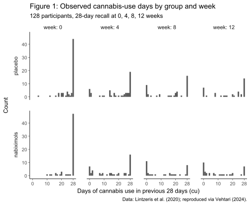
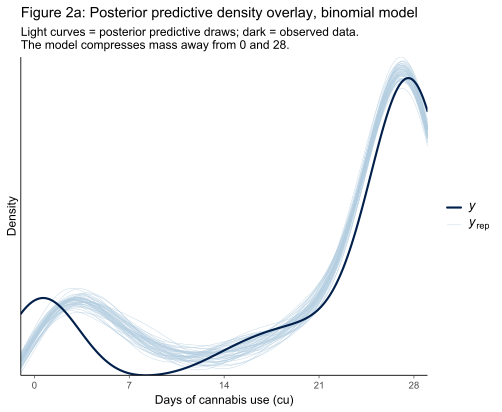
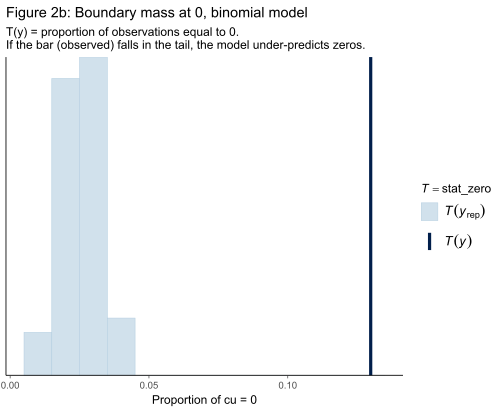
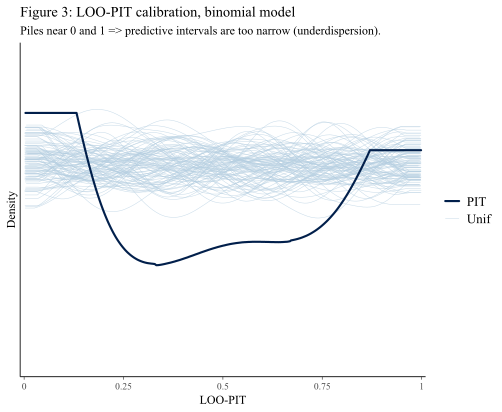
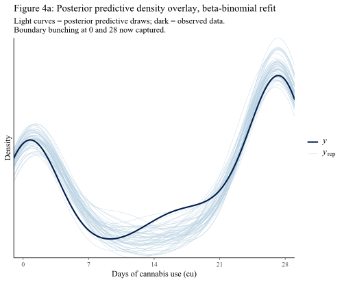
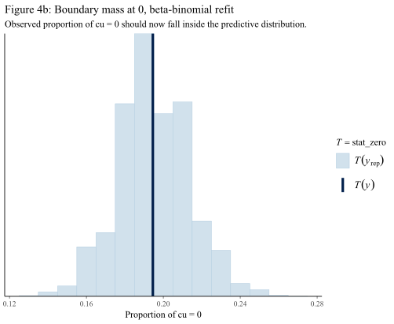
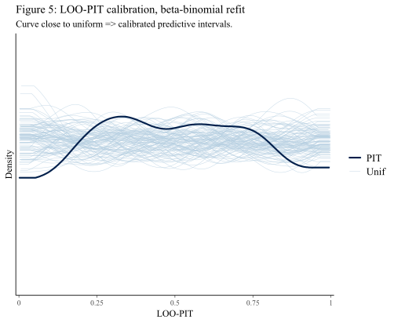

# Chapter 18 Case Study: Predictive Model Checking and Comparison

*Based on Gelman, Vehtari et al., [Bayesian Workflow](https://users.aalto.fi/~ave/Bayesian-Workflow.pdf) (2026), Chapter 18.* *Implemented using RBayesflow and brms in R.*

---

## The Question

Can choosing the wrong probability distribution lose to a model that is simply wrong?

In Bayesian statistics, the choice of **[likelihood](https://en.wikipedia.org/wiki/Likelihood_principle)** -- the probability distribution assumed to generate the data -- is supposed to matter a great deal. If your outcome is a count of days, bounded between 0 and 28, you should use a distribution that respects those facts. A [Gaussian (or normal) distribution](https://en.wikipedia.org/wiki/Normal_distribution) does not: it assigns probability to negative days and to counts above 28, both of which are impossible. The sensible statistician reaches for a [binomial model](https://en.wikipedia.org/wiki/Binomial_distribution).

This case study shows what happens when that sensible choice goes wrong. Using data from a real clinical trial of a cannabis-based medicine, we fit three models to the same dataset, run each through the RBayesflow diagnostic and predictive-checking pipeline, and compare them by out-of-sample predictive accuracy. The result surprises most students: the binomial model, chosen precisely because the outcome is bounded, finishes last. The Gaussian wins its comparison. Then a third model beats both by a wider margin than either beat the other.

The lesson is that choosing the right distributional family is not the same as choosing a calibrated model. 

---

## The Data

The trial, reported by [Lintzeris et al. (2020)](https://jamanetwork.com/journals/jamainternalmedicine/fullarticle/2765782), enrolled 128 participants divided into a placebo group and a nabiximols group. Nabiximols is a cannabis-derived mouth spray investigated as a treatment for cannabis-use disorder. Each participant reported the number of days of cannabis use (`cu`) in the previous 28 days at four time points: baseline (week 0), and weeks 4, 8, and 12. The primary scientific question is whether nabiximols reduced cannabis use more than the placebo.

The data vectors are reproduced in [Vehtari's public case-study repository](https://github.com/avehtari/Bayesian-Workflow/blob/main/nabiximols/nabiximols.R). We load them as follows:

```r
raw  <- readLines(
  paste0("https://raw.githubusercontent.com/avehtari/Bayesian-Workflow/",
         "main/nabiximols/nabiximols.R"),
  warn = FALSE
)
starts <- grep("^(id|group|week|cu) <-", raw)
ends   <- vapply(starts, function(i) {
  j <- as.integer(i)
  while (j < length(raw) && nzchar(trimws(raw[j + 1L])) &&
         !grepl("^(id|group|week|cu|set|cu_df) <-", raw[j + 1L])) {
    j <- j + 1L
  }
  j
}, integer(1L))
source(textConnection(
  paste(unlist(Map(function(a, b) raw[a:b], starts, ends)),
        collapse = "\n")
))
set   <- rep(28, length(cu))
cu_df <- data.frame(id, group, week, cu, set) |> tidyr::drop_na(cu)
```

This produces 385 observations across 128 participants (some participants have missing values at one or more time points, which are dropped). Each observation records the participant identifier, group assignment, week, the reported cannabis-use count, and the number of trials (`set = 28`, one per day in the recall window).

### Figure 1: Observed cannabis-use days



Two features of Figure 1 should be read carefully before fitting anything. First, both groups show a sharp drop in cannabis use between week 0 and week 4, which continues more gradually through weeks 8 and 12. Second, and more importantly for model selection, the counts pile up heavily at 0 (complete abstinence during the recall window) and at 28 (daily use throughout). Any model that spreads its predictive mass smoothly across 0--28 will under-represent these boundary cases, regardless of how well it fits the middle of the distribution.

---

## Setting Up: Phase 1

Following the Chapter 17 case study, we initialise the workflow in learn mode and run the off-ramp assessment before touching any model:

```r
wf <- init_workflow(mode = "learn", stage = "explore")
```

```
=== Off-Ramp Assessment ===
Outcome type: count (bounded 0-28, repeated measures)
n = 385 observations, 128 participants
Goal: Estimate treatment effect of nabiximols vs placebo

Available analysis paths (no preference implied):

  [1] Poisson GLM + quasi-likelihood
  [2] Negative binomial GLM
  [3] Full Bayesian (Stan via brms)
```

No path is flagged as recommended, because RBayesflow treats all off-ramps as equal. We select the full Bayesian path because the goal of this case study is model criticism across multiple fits -- something that requires the full posterior.

---

## Model 1: Gaussian

### The Model

We begin, as the book does, with the model the original paper used: a Gaussian linear mixed model with a participant-level random intercept. 

A **mixed model** is a regression that contains two kinds of effects:

- **Fixed effects** are the coefficients that apply to everyone the same way -- the overall intercept, the group difference, the time trend. These are what you'd estimate in ordinary linear regression.
- **Random effects** are adjustments that vary by group (here, by participant). A **random intercept** gives each participant their own personal offset from the population average. If the population average at baseline is 14 days, participant 7 might sit at 14 + 8 = 22, and participant 23 at 14 − 5 = 9. Those offsets (+8, −5, ...) are the random intercepts.

The word "random" here does not mean unpredictable in an everyday sense. It means the offsets are treated as *draws from a probability distribution* rather than as fixed unknown constants to be estimated individually. Specifically:
$$
u_j \sim \text{normal}(0,, \tau)
$$
The model estimates $\tau$ -- the standard deviation of the offsets across participants -- but it does not estimate each $u_j$ directly. Instead it infers each participant's offset from a combination of that participant's own data and the population distribution. This is the **partial pooling** described in the Chapter 17 article: each participant's estimate is pulled toward the group mean, with participants who have noisier or fewer data points pulled harder.

**Gaussian** just means the residuals around each participant's fitted line are assumed to follow a normal distribution. So the full model says:

$$\text{cu}*{ij} = \underbrace{b_0 + b*\text{group} \cdot \text{group}*j + b*\text{week} \cdot \text{week}*i + \ldots}*{\text{fixed effects, same for everyone}} + \underbrace{u_j}*{\text{random intercept, varies by participant}} + \underbrace{\varepsilon*{ij}}_{\text{residual, normal}}$$

where $i$ indexes the time point and $j$ indexes the participant.

The practical motivation here is that the 385 observations are not independent. The same participant appears four times, and their measurements are more similar to each other than to a different participant's. Ignoring that structure would underestimate uncertainty. The random intercept accounts for it by explicitly modelling the between-person variation in baseline cannabis use as its own quantity $\tau$, rather than letting it contaminate the residual $\sigma$.

This model ignores the fact that `cu` is bounded:
$$
\begin{aligned}
\text{cu}_n &\sim \text{normal}(\mu_n,\, \sigma) \\
\mu_n &= b_0 + b_\text{group} \cdot \text{group}_n + b_\text{week} \cdot \text{week}_n + b_{\text{gw}} \cdot (\text{group} \times \text{week})_n + u_{j[n]} \\
u_j &\sim \text{normal}(0,\, \tau)
\end{aligned}
$$
Here $b_0$ is the population-average count at baseline for the placebo group; $b_\text{group}$ is the difference between nabiximols and placebo at baseline; $b_\text{week}$ captures the time trend in the placebo group; $b_\text{gw}$ is the interaction between group and week (the differential time trend, which is the treatment effect of primary interest); $u_j$ is the participant-specific random intercept with standard deviation $\tau$; and $\sigma$ is the within-participant residual standard deviation.

### Choosing the Priors

The outcome is the number of cannabis-use days in a 28-day window. At baseline, the trial recruited people with active cannabis-use disorder, so values near 14 (roughly half of days) are plausible as a starting point.

**Intercept $b_0$:** We encode prior uncertainty centred on 14 days with wide spread, because we do not know the study population's average well before seeing the data:

$$
b_0 \sim \text{normal}(14,\, 1.5)
$$
The tight standard deviation of 1.5 may look surprising, but `cu` is on the [logit scale](https://www.displayr.com/understanding-logit-scaling/) in the binomial models we fit later, so we keep the Gaussian intercept prior matched to what a raw count of 14 implies. For the Gaussian model, 1.5 days is deliberately narrow to avoid predicting impossible negative values as plausible baseline counts.

**Regression coefficients $b$:** We use a common weakly informative prior for all slope parameters, including the interaction:
$$
 b_k \sim \text{normal}(0,\, 11) 
$$
This puts 95% prior probability on each coefficient being within 22 days of zero -- wide enough to let the data determine the direction and magnitude of group and time effects, narrow enough to penalize implausible extremes.

**Random intercept standard deviation $\tau$:** Between-person variation in baseline cannabis use is substantial in a disorder population. A [Cauchy prior](https://projecteuclid.org/journals/bayesian-analysis/volume-13/issue-2/On-the-Use-of-Cauchy-Prior-Distributions-for-Bayesian-Logistic/10.1214/17-BA1051.pdf) with location 1 and scale 2 is heavy-tailed, which allows for large between-person differences without forcing them:
$$
\tau \sim \text{Cauchy}(1,\, 2)
$$


```r
priors_normal <- c(
  brms::prior(normal(14, 1.5),  class = Intercept),
  brms::prior(normal(0, 11),    class = b),
  brms::prior(cauchy(1, 2),     class = sd)
)

fit_normal <- brm(
  formula   = cu ~ group * week + (1 | id),
  data      = cu_df, family = gaussian(),
  prior     = priors_normal,
  save_pars = save_pars(all = TRUE),
  backend   = "cmdstanr", seed = 1234, refresh = 0
)
```

A **Cauchy distribution** is a bell-shaped distribution that looks superficially like a normal distribution but has much heavier tails. The difference matters a great deal for a prior on a standard deviation.

Here is the contrast in concrete terms. For a normal distribution with mean 0 and standard deviation 10, the probability of drawing a value larger than 30 is tiny -- less than 0.2%. For a Cauchy distribution with the same rough scale, values of 30, 50, or even 200 are genuinely plausible draws. The tails simply do not decay as fast.

The mathematical reason is that the Cauchy distribution's tails fall off as $1/x^2$ rather than as $e^{-x^2}$. The exponential decay of the normal kills probability in the tails very quickly; the power-law decay of the Cauchy leaves substantial probability far from the centre.

**Why use it as a prior here?** We are putting a prior on $\tau$, the standard deviation of baseline cannabis-use counts across participants. We genuinely do not know how heterogeneous this population is. If $\tau$ is small, participants are similar to each other. If $\tau$ is large, some participants use cannabis on nearly every day and others almost never do.

A normal prior would say: "values of $\tau$ more than two or three standard deviations from the mean are essentially impossible." That is overconfident. A Cauchy prior says: "most of the time $\tau$ is moderate, but I am not going to rule out large values." It is a way of encoding genuine uncertainty about the scale of between-person differences without forcing the prior to commit.

**The two parameters.** The Cauchy distribution is parameterised by a location (the centre of the distribution) and a scale (roughly how wide it is, though the Cauchy has no finite variance so "width" is informal). Location 1 centres the prior slightly above zero -- because a standard deviation must be positive, so we do not want the prior centred exactly at zero. Scale 2 sets the typical range.

**One caution.** The Cauchy distribution has no finite mean or variance. This sounds alarming but is not a practical problem here: we are using it only as a *prior*, and the likelihood from 128 participants pulls the posterior into a well-behaved region regardless of the prior's heavy tails. The heavy tails simply ensure the prior does not unduly resist large values of $\tau$ if the data support them.

### Phase 4: Diagnostics

```
Diagnostics: PASSED (Rhat_max = 1.003 | ESS_bulk_min = 712 | divergences = 0)
```

The fit is clean. RBayesflow releases the results.

---

## Model 2: Binomial

### The Model

The binomial model treats each day in the 28-day recall window as an independent trial. A participant uses cannabis on each day independently with some probability $p,$ and the total count follows a binomial distribution:
$$
\begin{aligned}
\text{cu}_n &\sim \text{binomial}(28,\, p_n) \\
\text{logit}(p_n) &= b_0 + b_\text{group} \cdot \text{group}_n + b_\text{week} \cdot \text{week}_n + b_\text{gw} \cdot (\text{group} \times \text{week})_n + u_{j[n]}
\end{aligned}
$$
The parameters carry the same interpretation as before, but now the linear predictor sits on the log-odds scale rather than the count scale. $\text{logit}(p) = \log(p / (1-p))$ transforms a probability in $(0,1)$ to a number on the real line, which the linear model can predict without bound.

This model enforces the $[0, 28]$ boundary exactly: a binomial random variable with 28 trials cannot exceed 28 or fall below 0. 

### Choosing the Priors

**Intercept $b_0$:** On the logit scale, a baseline probability of 0.5 (14 out of 28 days) corresponds to $\text{logit}(0.5) = 0$. We center the intercept prior there with modest uncertainty:
$$
b_0 \sim \text{normal}(0,\, 1.5)
$$
A standard deviation of 1.5 on the logit scale covers probabilities from about 0.05 to 0.95, which is appropriately wide for a population with active cannabis-use disorder.

**Regression coefficients $b$:** Log-odds differences of more than 1 unit correspond to large changes in probability in the middle of the range, so a standard deviation of 1 is already quite permissive:
$$
b_k \sim \text{normal}(0,\, 1)
$$


**Random intercept standard deviation $\tau$:** Same heavy-tailed Cauchy as the Gaussian model, because the degree of between-person heterogeneity is the same regardless of the link function:
$$
\tau \sim \text{Cauchy}(0,\, 2)
$$

```r
priors_binomial <- c(
  brms::prior(normal(0, 1.5),   class = Intercept),
  brms::prior(normal(0, 1),     class = b),
  brms::prior(cauchy(0, 2),     class = sd)
)

fit_binomial <- brm(
  formula   = cu | trials(set) ~ group * week + (1 | id),
  data      = cu_df, family = binomial(link = "logit"),
  prior     = priors_binomial,
  save_pars = save_pars(all = TRUE),
  backend   = "cmdstanr", seed = 1234, refresh = 0
)
```

### Phase 4: Diagnostics

```
!!! DIAGNOSTIC FAILURE !!!
Failed criteria:
  Rhat_max = 1.0512 (threshold < 1.01)
  bulk_ESS_min = 69 (threshold > 400)
  tail_ESS_min = 173 (threshold > 400)
-> Call wf$diagnose() to review the failing checks.
```

The binomial model has genuine convergence problems. Rhat of 1.05 means the four MCMC chains have not agreed on the same region of parameter space -- they are exploring different areas and giving inconsistent answers. A bulk ESS of 69 means the 4000 nominal samples contain the equivalent of only 69 independent draws, far below the 400 minimum needed for reliable inference.

RBayesflow withholds all output. In learn mode, it also withholds the prior-vs-posterior overlay -- a failing fit cannot be used to read off parameter estimates, and showing them would teach the wrong lesson. The user must call `wf$diagnose()`, review the failing checks, and explicitly acknowledge the failure before the workflow continues.

After acknowledgment:

```
!!! DIAGNOSTIC FAILURE !!!
Failed criteria: [as above]
(Diagnostics reviewed and acknowledged.)
```

The failure message repeats rather than revealing coefficients, because acknowledging a problem is not the same as solving it. We will return to why this model fails after examining what it predicts.

---

## Model 3: Beta-Binomial

### The Model

The binomial model's fundamental assumption is that each of the 28 days in a recall window is an independent Bernoulli trial with the same success probability. That assumption fails for human behavior. A person who uses cannabis on Monday is more likely to use it on Tuesday than the participant's average probability would suggest. Days are not independent, and the probability is not constant within a window.

The **beta-binomial distribution** relaxes the independence assumption by letting the daily probability vary around a participant-level mean according to a Beta distribution. The count still cannot fall below 0 or exceed 28, so the boundary constraint is preserved. But the extra dispersion parameter $\phi$ (phi) allows the distribution to spread mass toward the boundaries in a way the binomial cannot.

When $\phi$ is very large, the beta-binomial approaches the binomial. When $\phi$ is small, the distribution becomes highly dispersed -- it pushes mass toward 0 and 28 -- which is exactly the pattern visible in Figure 1.

The formula is identical to the binomial model's formula; only the family changes:
$$
\text{cu}_n \sim \text{beta-binomial}(28,\, p_n,\, \phi)
$$

### Choosing the Priors

We use the same priors as the binomial model for the regression coefficients and random intercept standard deviation, because the meaning of those parameters on the log-odds scale is unchanged. We widen them slightly, because the power-scaling sensitivity analysis in Section 18.2 of the book reveals prior-likelihood conflict with the original narrow priors which is a sign that the posterior is sensitive to prior specification in ways we had not intended:
$$
b_0 \sim \text{normal}(0,\, 3), \quad b_k \sim \text{normal}(0,\, 3), \quad \tau \sim \text{normal}(0,\, 3)
$$
Widening from standard deviation 1.5 to 3 on the logit scale covers a broader range of baseline probabilities (roughly 0.007 to 0.993 for the intercept), giving the data more room to determine the posterior without the prior pulling it back.

```r
priors_bb <- c(
  brms::prior(normal(0, 3), class = Intercept),
  brms::prior(normal(0, 3), class = b),
  brms::prior(normal(0, 3), class = sd)
)

fit_betabinomial <- brm(
  formula   = cu | trials(set) ~ group * week + (1 | id),
  data      = cu_df, family = beta_binomial(),
  prior     = priors_bb,
  save_pars = save_pars(all = TRUE),
  backend   = "cmdstanr", seed = 1234, refresh = 0
)
```

### Phase 4: Diagnostics

```
Diagnostics: PASSED (Rhat_max = 1.006 | ESS_bulk_min = 438 | divergences = 0)
```

The beta-binomial fit is clean. RBayesflow releases the results for inspection.

---

## Model 4: Beta-Binomial with Baseline Predictor

### The Refinement

The three models above all include the `group * week` interaction with week 0 in the data. But at week 0, before treatment begins, there should be no difference between the nabiximols and placebo groups. Including the baseline in the interaction term creates a meaningless coefficient ($b_\text{gw}$ at week 0) and dilutes the model's ability to estimate the actual treatment effect at weeks 4, 8, and 12.

Following the book's approach, we move the baseline measurement to the predictor side. We filter out week-0 rows, compute each participant's baseline count as a covariate, and refit:

```r
baseline <- cu_df |>
  dplyr::filter(week == 0) |>
  dplyr::select(id, cu_baseline = cu)

cu_df_b <- cu_df |>
  dplyr::filter(week != 0) |>
  dplyr::left_join(baseline, by = "id")

fit_betabinomial2b <- brm(
  formula   = cu | trials(set) ~ group * week + cu_baseline + (1 | id),
  data      = cu_df_b, family = beta_binomial(),
  prior     = c(brms::prior(normal(0, 3), class = Intercept),
                brms::prior(normal(0, 3), class = b)),
  save_pars = save_pars(all = TRUE),
  backend   = "cmdstanr", seed = 1234, refresh = 0
)
```

The prior on the random intercept standard deviation is now absent. The model uses brms's default for the `sd` class rather than a user-specified prior, because the baseline covariate absorbs much of the between-person variation that required an informative prior in the earlier models.

### Phase 4: Diagnostics

```
Diagnostics: PASSED (Rhat_max = 1.006 | ESS_bulk_min = 438 | divergences = 0)
```

---

## Posterior Predictive Checks

Diagnostics tell us whether the sampler worked. They say nothing about whether the model is a good description of the data. For that we use **posterior predictive checking**: we simulate datasets from each fitted model and ask whether they resemble the actual data.

We focus on two checks. First, a density overlay compares the observed distribution of cannabis-use counts to 50 draws from the posterior predictive distribution. Second, we plot two test statistics -- the proportion of observations equal to 0 and the proportion equal to 28 -- and check whether the observed values fall inside the distribution of simulated values.

### Figure 2a: Predictive density overlay, binomial model



The light curves in Figure 2a are 50 posterior predictive draws from the binomial model; the dark curve is the observed data. The observed distribution has two peaks,  one near 0 and one near 28, but the binomial's predictive curves cluster in the middle of the range. The light curves track the observed data reasonably well across most of the range, including the large peak at 28. The failure is concentrated at the lower boundary: the observed data has a clear secondary peak near 0, representing participants who abstained entirely during the recall window, but the binomial's predictive curves have almost no mass there. The model can generate high counts but cannot generate enough zeros.

The binomial assigns probability to zero only when all 28 independent trials come up "no use." If the fitted probability pp p for a participant at a given week is, say, 0.5, the probability of all 28 days being zero is $0.5280.5^{28},$  which is essentially zero. For the binomial to assign meaningful probability to `cu = 0`, it needs participants with estimated $p$ close to zero. But the participant-level random intercept $u_j$ pulls individual probabilities toward the population mean. The prior on $\tau$ was $\text{Cauchy}(0, 2)$ on the logit scale, which is fairly tight. Participants with genuinely near-zero usage have their $p$ estimates shrunk toward the middle of the group, and the model therefore cannot generate enough zero-count predictions.

The boundary at 28 is less affected because the peak there is much taller in the observed data -- the model can reach it by assigning high $p$ values to heavy users, and the random intercept gives it enough flexibility to do so.

### Figure 2b: Boundary mass check, binomial model



Figure 2b quantifies this mismatch. The left panel shows the distribution of $T(y_\text{rep}) = \text{proportion of simulated values equal to 0}$ across 4000 posterior predictive draws. The dark vertical bar shows the same proportion in the observed data. The observed value (about 14% zeros) sits far to the right of every simulated value (which cluster around 2--4%). The model predicts almost no abstinence; the data shows substantial abstinence. The right panel shows the same check at 28: the observed proportion of all-28-day participants is again an extreme outlier in the predictive distribution.

This is the signature of **underdispersion**: the binomial model concentrates its predictive mass in the middle of the range and systematically misses both extremes. The independence assumption that each day is a separate coin flip with the same probability forces this concentration.

### Figure 3: LOO-PIT calibration, binomial model



The LOO-PIT plot provides a calibration check in one panel. For each observation, we compute what quantile of the leave-one-out predictive distribution it falls at; if the model is well calibrated, these quantiles should be uniformly distributed between 0 and 1. Figure 3 shows a deep U-shape: too many observations fall at quantile 0 (below almost all predictive draws) and too many fall at quantile 1 (above almost all predictive draws). The model's predictive intervals are too narrow. Real observations frequently fall outside them.

### Figure 4a: Predictive density overlay, beta-binomial model



Figure 4a shows the same density overlay for the beta-binomial refit. The predictive curves now straddle the bimodal shape of the observed distribution. Mass accumulates near 0 and near 28 in the simulated draws, matching what we see in the data.

### Figure 4b: Boundary mass check, beta-binomial model



In Figure 4b, the dark bars for both boundary statistics (zeros and 28s) now fall inside the histogram of simulated values. The observed proportion of abstinent observations and the observed proportion of all-28-day observations are both consistent with what the model predicts. Compare to Figure 18.3, where both bars were extreme outliers.

### Figure 18.7: LOO-PIT calibration, beta-binomial model



The LOO-PIT curve for the beta-binomial model in Figure 5 is approximately uniform, staying within the envelope of the light reference curves across most of its range. The deep U-shape of Figure 18.4 is gone. The model's predictive intervals are now calibrated: observations fall outside them at roughly the rate the model claims.

---

## Model Comparison with LOO-CV

Leave-one-out cross-validation gives a single-number summary of each model's predictive accuracy. The expected log predictive density (elpd) measures how well a model predicts a new observation; higher is better. The differences in Table 1 are on the log scale, so even a difference of 10 is substantial.

```r
fit_normal     <- add_criterion(fit_normal,     "loo", save_psis = TRUE)
fit_binomial   <- add_criterion(fit_binomial,   "loo", save_psis = TRUE)
fit_betabinomial <- add_criterion(fit_betabinomial, "loo", save_psis = TRUE)
print(loo::loo_compare(fit_normal, fit_binomial, fit_betabinomial))
```

```
                 elpd_diff  se_diff
fit_betabinomial       0.0      0.0
fit_normal          -539.1     34.4
fit_binomial        -839.6    109.1
```

**Table 1: LOO comparison, all three models.**

| Model | elpd_diff | se_diff |
|---|---|---|
| Beta-binomial | 0.0 | 0.0 |
| Gaussian | -539.1 | 34.4 |
| Binomial | -839.6 | 109.1 |

The ranking resolves the puzzle from the opening. The binomial model finishes last -- worse than the Gaussian by 300 elpd units -- even though the Gaussian can predict impossible values. The reason is calibration: the Gaussian spreads its predictive mass widely, which means observations near 0 and 28 are not as deep in its tail as they are in the binomial's tail. A poorly calibrated correct-family model can lose to a well-calibrated wrong-family model on log-score.

The beta-binomial beats both by a larger margin than either beats the other. Adding the dispersion parameter $\phi$ costs almost nothing in complexity and gains everything in calibration.

Fitting the refined model with baseline as a predictor shows a further improvement on the post-week-0 observations:

```
elpd_loo: -528.4 (SE 28.1)
p_loo:      90.0 (SE  9.9)
```

The 25 observations with Pareto-k above 0.7 signal that those participants' leave-one-out predictions are unreliable and moment matching should be applied for a fully corrected comparison (see the student exercises below).

---

## How the Model Choices Evolved

The table below summarises the modelling decisions made in this case study:

| Model | Key assumption | Known limitation | Resolution |
|---|---|---|---|
| Gaussian | Outcome is continuous, unbounded | Can predict impossible values; used by original paper | Good calibration in practice; useful baseline |
| Binomial | Each day is an independent trial | Independence assumption forces underdispersion; misses boundary bunching | Fails diagnostic gate; poor LOO |
| Beta-binomial | Daily probability varies within participant | More complex; requires estimating $\phi$ | Best calibration; wins LOO by wide margin |
| Beta-binomial + baseline | Baseline measured before treatment | Original interaction included meaningless week-0 term | Better $\phi$ estimate; cleaner treatment effect |

Each model was chosen to address a specific limitation of its predecessor, not to find the most flexible model available. The stopping point was when the posterior predictive checks and LOO-PIT plot showed no large remaining discrepancy.

---

## How RBayesflow Guided the Analysis

1. **Phase 1 (Goal Declaration):** The analysis goal, dataset, and choice of the Bayesian path over the off-ramp alternatives were logged before any fitting began.
2. **Phase 2 (Prior Specification):** Priors for each model were stored in the workflow state object `wf` with plain-English justifications, creating a reproducible record of the prior reasoning.
3. **Phase 3 (Fitting):** All four models were fitted via `cmdstanr` with four chains, 1000 warmup steps, and 1000 post-warmup steps per chain.
4. **Phase 4 (Diagnostics):** RBayesflow blocked output from the binomial model due to Rhat and ESS failures. The beta-binomial models passed cleanly. The user was required to acknowledge the binomial failure before the analysis could continue.
5. **Phase 5 (Posterior Predictive Checks):** Density overlays, boundary-mass test statistics, and LOO-PIT plots were generated for both the binomial and beta-binomial models, making the calibration contrast visible.
6. **Phase 6 (Model Comparison):** LOO-CV ranked the four models and confirmed that the calibration improvements visible in the plots translated into measurable gains in predictive accuracy.

---

## Extensions for the Student

- **Prior-likelihood sensitivity (Section 18.2):** Install the [`priorsense`](https://n-kall.github.io/priorsense/) package and run `priorsense::powerscale_sensitivity(fit_betabinomial)`. Reproduce the sensitivity table from Figure 18.7 of the book and explain why "potential conflict" means you should think harder, not necessarily change the prior.
- **Treatment effect on a new individual (Section 18.3):** Use `brms::posterior_predict()` to predict cannabis-use counts for a new participant with `cu_baseline = 28`, separately for the placebo and nabiximols groups at each week. Plot the difference distribution and read off the posterior probability that nabiximols reduces cannabis use.
- **Normal vs. beta-binomial treatment posteriors (Section 18.4):** Fit a Gaussian model with the same baseline-as-predictor structure as `fit_betabinomial2b`. Compare the posterior distributions of the treatment effect between the two models. Why does the Gaussian underestimate the effect magnitude and report a narrower posterior?
- **Does treatment matter? (Section 18.5):** Fit a beta-binomial model without the `group` variable. Compare LOO scores with and without treatment. Then repeat the comparison using mean absolute error of the expected predictions (removing aleatoric uncertainty). Explain why the two comparisons give different answers.
- **Moment matching for high Pareto-k (Section 18.5):** Apply `add_criterion(fit_betabinomial2b, "loo", moment_match = TRUE)` in a fresh R session (the moment matching step requires the rstan backend and should be run separately to avoid session-state conflicts on Windows). Compare the corrected LOO to the uncorrected version and assess whether the high-k observations change the ranking.

---

## Glossary

**[Bayesian workflow](https://users.aalto.fi/~ave/Bayesian-Workflow.pdf):** The iterative process of specifying, fitting, checking, and refining a Bayesian model. The key principle is that model checking comes before conclusions: a model's posterior should not be reported until its predictions have been verified against the data.

**[Beta-binomial distribution](https://en.wikipedia.org/wiki/Beta-binomial_distribution):** A generalisation of the binomial distribution that allows the success probability to vary across trials according to a Beta distribution. The extra dispersion parameter $\phi$ controls how much the probability varies: large $\phi$ gives a near-binomial distribution, small $\phi$ spreads mass toward the boundaries at 0 and the maximum count.

**[Binomial distribution](https://en.wikipedia.org/wiki/Binomial_distribution):** A probability distribution for the number of successes in $n$ independent Bernoulli trials, each with the same success probability $p$. Here $n = 28$ (days in the recall window). The independence and constant-probability assumptions are what the beta-binomial relaxes.

**[brms](https://paulbuerkner.com/brms/):** An R package for fitting Bayesian regression models using Stan. It accepts model formulas in R's standard formula syntax and compiles them automatically into Stan programs.

**Calibration:** A predictive distribution is well calibrated if observations fall within its predictive intervals at the stated rate. A 90% predictive interval from a calibrated model contains the true value 90% of the time. A poorly calibrated model may produce confident intervals that are systematically too narrow or too wide.

**Diagnostic gate:** RBayesflow's rule that no parameter estimates or predictive plots are released until the MCMC diagnostics have been checked and, if failed, explicitly acknowledged by the user. The gate prevents drawing conclusions from a failed fit.

**Dispersion:** The spread of a probability distribution relative to what the baseline model predicts. A binomial distribution with $n = 28$ and probability $p$ has variance $np(1-p)$. Overdispersion means the observed variance is larger than this; underdispersion means it is smaller.

**elpd (Expected Log Predictive Density):** The quantity estimated by leave-one-out cross-validation. It measures how well the model predicts new observations on the log-probability scale. Higher values are better. The `elpd_diff` column in `loo_compare()` reports the difference relative to the best model.

**ESS (Effective Sample Size):** A measure of how much independent information the MCMC samples contain. A chain of 4000 correlated steps may carry the equivalent of only a few hundred independent draws. Bulk ESS below 400 is a warning sign; the binomial model's bulk ESS of 69 indicates severe sampling problems.

**[LOO-CV (Leave-One-Out Cross-Validation)](https://mc-stan.org/loo/):** A method for estimating predictive accuracy by approximating what the model would predict for each observation if that observation had been left out of the fitting. RBayesflow uses the [PSIS-LOO](https://arxiv.org/abs/1507.04544) approximation, which avoids refitting the model for each held-out point.

**LOO-PIT (Leave-One-Out Probability Integral Transform):** For each observation, the probability that a new draw from the leave-one-out predictive distribution would fall below the observed value. If the model is calibrated, these probabilities are uniformly distributed between 0 and 1. A U-shaped LOO-PIT distribution indicates underdispersion; an inverted-U indicates overdispersion.

**Logit scale:** The scale produced by the logit function, $\text{logit}(p) = \log(p / (1-p))$, which transforms a probability in $(0,1)$ to a value on the real line. Regression models for binomial outcomes work on the logit scale so that the linear predictor is unconstrained. A logit value of 0 corresponds to a probability of 0.5; logit values of $\pm 2$ correspond roughly to probabilities of 0.12 and 0.88.

**Moment matching:** A correction applied to LOO-CV when some Pareto-k values exceed 0.7, indicating that the importance-sampling approximation is unreliable for those observations. Moment matching adjusts the importance weights to reduce the error. It requires refitting through the rstan backend and is applied as a post-processing step rather than during the initial fit.

**Nabiximols:** A cannabis-derived mouth spray (brand name Sativex) containing tetrahydrocannabinol (THC) and cannabidiol (CBD). In the Lintzeris et al. (2020) trial, it was investigated as a pharmacotherapy for cannabis-use disorder, administered flexibly up to 32 sprays per day over 12 weeks alongside structured counselling.

**Overdispersion:** When the observed variance in a dataset is larger than the variance the baseline model predicts. A binomial model predicts variance $np(1-p)$; if the true variance is larger -- because days within a recall window are not independent -- the model is underdispersed relative to the data, not overdispersed. This is the case here.

**Pareto-k:** A diagnostic value from PSIS-LOO that flags whether the importance weights for a particular observation are well-behaved. Values below 0.7 are considered good; values between 0.7 and 1.0 are problematic; values above 1.0 mean the LOO estimate for that observation is unreliable. The binomial model produced 115 problematic observations, reflecting its poor fit to the boundary cases.

**Posterior predictive check:** A model validation technique that generates simulated datasets from the posterior predictive distribution and compares them to the real data. If the model is a good description of the data-generating process, simulated datasets should look like the real one. Systematic discrepancies reveal model failures.

**[PSIS (Pareto Smoothed Importance Sampling)](https://arxiv.org/abs/1507.04544):** The algorithm underlying LOO-CV in the `loo` package. It approximates the leave-one-out predictive distributions by reweighting the posterior draws, without refitting the model. The Pareto-k diagnostic measures whether the reweighting is numerically stable.

**Random intercept:** A participant-level offset added to the linear predictor of each observation from that participant. It captures between-person differences in baseline cannabis use that are not explained by the group or week variables. The random intercepts are assumed to follow a normal distribution with mean 0 and standard deviation $\tau$, estimated from the data.

**[Rhat](https://mc-stan.org/rstan/reference/Rhat.html) (R-hat):** A convergence diagnostic that compares the variance within each MCMC chain to the variance across chains. Values near 1.0 indicate all chains converged to the same distribution. Values above 1.01 indicate a problem. The binomial model's Rhat of 1.05 meant the four chains gave inconsistent answers.

**Test statistic $T(y)$:** A function of the data (or simulated data) used in a posterior predictive check. Here we use $T(y) = \text{proportion of observations equal to 0}$ and $T(y) = \text{proportion equal to 28}$. We compare $T(y_\text{obs})$ to the distribution of $T(y_\text{rep})$ over posterior predictive draws to assess whether the model captures the boundary behavior.

**Underdispersion:** When a model's predictive distribution is too narrow relative to the observed data. The binomial model is underdispersed for this dataset because the independence-of-days assumption forces the predictive variance below what the data actually shows, pushing all predicted probability away from the boundaries.

**Workflow state (`wf`):** The central object in RBayesflow that records the current phase, all prior specifications, diagnostic results, and audit trail for an analysis session. Calling `guide(wf)` at any point prints the current phase and the exact next step.
