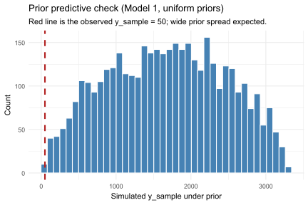
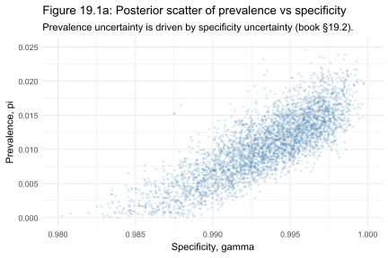
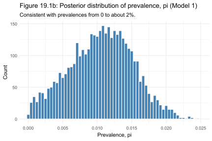
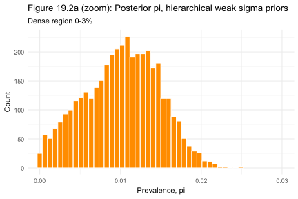
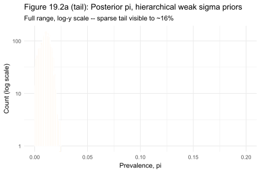
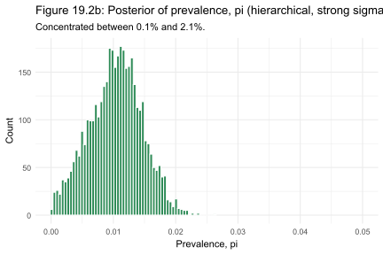
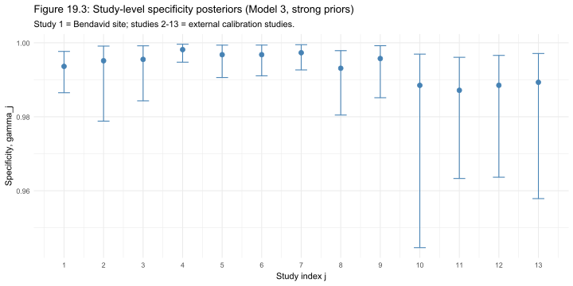

# Chapter 19 Case Study: When the Test Lies

*Based on [Gelman, Vehtari et al., Bayesian Workflow (2026)](https://users.aalto.fi/~ave/Bayesian-Workflow.pdf), Chapter 19.*
*Implemented using RBayesflow and [cmdstanr](https://mc-stan.org/cmdstanr/) in R.*

---

## The Question

What does a positive test actually tell you when the disease is rare?

In the spring of 2020, a team at Stanford recruited 3,330 residents of Santa Clara County and tested them for SARS-CoV-2 antibodies. Fifty people tested positive. The raw infection rate looked like 1.5%. But the test wasn't perfect. Its false-positive rate -- the fraction of disease-free people who test positive anyway -- was somewhere around 0.5%. In a sample of 3,330 people, that alone could explain 16 or 17 of those positives without any real infection at all.

So the 50 positives carried two possible explanations: true infection, or test error, and the problem gets worse when you try to quantify it. The specificity of the test (its ability to correctly identify negative cases) wasn't known precisely. It had been measured in calibration studies, but those studies had uncertainty too. That uncertainty in the test propagated directly into uncertainty about prevalence.

This chapter builds up to a full hierarchical model for disease prevalence in the presence of an imperfect test. We fit three models to the published data from [Bendavid et al. (2020)](https://www.medrxiv.org/content/10.1101/2020.04.14.20062463v2), increasing the structural complexity with each step. The first pools all calibration data into single estimates of specificity and sensitivity. The second allows specificity to vary across the 13 external calibration studies. The third applies an informative prior to control how much that variation can be. Each model tells us something different -- not about the virus, but about how much uncertainty we were willing to carry.

---

## The Data

The primary data point is simple: 50 positive tests out of 3,330.

The complexity comes from the calibration data, which lives in two separate experiments. For specificity, Bendavid et al. (2020) compiled 13 studies testing known-negative subjects. Across all studies, 3,308 of 3,324 subjects tested negative as expected giving an overall false-negative rate close to 0.5%. For sensitivity, three studies tested known-positive subjects; 130 of 157 returned a correct positive.

For the simple model in section 19.2, these are pooled into single counts: $y_\gamma = 399$ out of $n_\gamma = 401$ for specificity, and $y_\delta = 103$ out of $n_\delta = 122$ for sensitivity. For the hierarchical models in section 19.3, the 13 specificity studies are treated individually. Sensitivity is kept as a single pooled entry because three studies can't identify a distribution which is the point the chapter makes about the limits of sparse calibration data.

The key fact about this dataset is that it's hard. The true infection rate, whatever it was, sat close to or below the false-positive rate of the test. That's the regime where Bayesian propagation of uncertainty matters most and where classical point estimates may be incorrect.

---

## What Is RBayesflow?

[RBayesflow](https://github.com/wildpeaches/RBayesflow) is a set of R scripts, [Quarto](https://quarto.org) templates, and a workflow-state object (`wf`) that sequences the iterative Bayesian workflow described in Gelman et al. (2020). It doesn't add new statistical methods. Instead, it adds structure: a consistent way to move through goal declaration, prior specification, fitting, diagnostics, posterior checking, and reporting, with a hard gate that withholds coefficient output until diagnostic failures are acknowledged. [Posit Assistant](https://docs.posit.co/ide/user/ide/guide/tools/copilot.html) reads the live `wf_state` object to interpret diagnostics and suggest next steps.

This series applies RBayesflow to the case studies in Bayesian Workflow chapter by chapter. The [Chapter 17 case study](../ch17_sleep_study/ch17_article.md) is a good starting point if you haven't seen the workflow in action.

---

## Setting Up: Phase 1

The first thing RBayesflow asks is: what are you trying to learn, and is a full Bayesian model the right tool for it?

We initialise the workflow in learn mode and declare our goal as coefficient estimation, meaning we want a posterior distribution for prevalence $\pi$, not just a prediction or a decision.

```r
wf <- init_workflow(mode = "learn", stage = "explore")

covid_df <- data.frame(
  positive = c(rep(1L, 50L), rep(0L, 3280L))
)

offramps <- assess_offramps(
  data         = covid_df,
  outcome_var  = "positive",
  outcome_type = "binary",
  goal         = "coefficient estimation"
)
```

The off-ramp assessment offers [logistic regression with bootstrap confidence intervals](https://rsample.tidymodels.org/articles/Applications/Intervals.html) and [Firth penalized logistic regression](https://www.maths.dur.ac.uk/stats/emmanuel/project-IV_2024-25.pdf) as alternatives. In most binary analyses, those are reasonable choices. Here they're not. Neither alternative can propagate uncertainty in the test's specificity and sensitivity jointly with uncertainty in prevalence. Using them would give you a precise-looking answer to the wrong question. 

```r
wf$audit_trail <- append(wf$audit_trail, list(list(
  phase  = 1,
  action = "bayesian_selected",
  notes  = "Test error must be propagated jointly with prevalence."
)))
```

This chapter is also unusual for RBayesflow: the joint likelihood using three binomial outcomes sharing one parameter space can't be expressed with `brm()`. Instead, we write Stan programs by hand and fit them with [cmdstanr](https://mc-stan.org/cmdstanr/). A small in-script helper (`diagnose_cmdstan()`) populates the `wf$diagnostics` fields directly from the `CmdStanFit`, so the diagnostic gate and the workflow display contract still work normally.

---

## Model 1: Simple Non-Hierarchical (Section 19.2)

### The Model

The core observation is that the probability of testing positive, $p_{\text{sample}}$, is not the same as the true prevalence $\pi$. False positives inflate it; imperfect sensitivity deflates it. The relationship is:
$$
p_{\text{sample}} = \pi \delta + (1 - \pi)(1 - \gamma)
$$
where:
- $\pi$ is the true prevalence of the disease in the population
- $\delta$ is the sensitivity of the test (probability a truly positive person tests positive)
- $\gamma$ is the specificity of the test (probability a truly negative person tests negative)

All three are unknown. But we have separate calibration data for $\gamma$ and $\delta$, so we model all three outcomes jointly:
$$
\begin{aligned}
y_{\text{sample}} &\sim \text{Binomial}(n_{\text{sample}},\; p_{\text{sample}}) \\
y_\gamma &\sim \text{Binomial}(n_\gamma,\; \gamma) \\
y_\delta &\sim \text{Binomial}(n_\delta,\; \delta)
\end{aligned}
$$

### Choosing the Priors

All three parameters get $\text{uniform}(0, 1)$ priors. This isn't a well-reasoned prior choice but acts as a placeholder. The uniform is equivalent to having no prior information about whether a disease's true prevalence could be anywhere from 0% to 100%, but it works here because the calibration data for $\gamma$ and $\delta$ are strong enough to dominate the uniform priors, and because the authors wanted to show what the data alone imply about $\pi$ before any subjective constraint.

We check this intuition with a prior predictive simulation. The prior predictive generates draws from the sampling model before seeing the data, to verify that the priors don't accidentally rule out plausible observations.

```r
set.seed(4711)
pi_prior    <- runif(4000, 0, 1)
gamma_prior <- runif(4000, 0, 1)
delta_prior <- runif(4000, 0, 1)
p_prior     <- pi_prior * delta_prior + (1 - pi_prior) * (1 - gamma_prior)
y_prior_pred <- rbinom(4000, size = 3330, prob = p_prior)
```

Figure 19.1 shows the result.



The prior predictive is essentially flat from 0 to 3,330. That's expected and intentional: the uniform priors carry almost no information, so the distribution of simulated $y_{\text{sample}}$ is nearly uniform. The red dashed line at 50 shows the actual observed value. It's well within the prior's support. What tightens the posterior isn't the prior on $\pi$ - it's the calibration data pulling $\gamma$ and $\delta$ toward their observed rates.

### The Stan Program

This is one of the cases where we write Stan directly. The model has three separate binomial likelihoods sharing parameters, which doesn't fit the single-formula structure of `brm()`. The program below matches Appendix A.1 of Gelman and Carpenter (2020), with a `generated quantities` block added so power-scaling sensitivity analysis (section 19.4) is available as a student exercise.

```r
stan_simple <- "
data {
  int<lower=0> y_sample;
  int<lower=0> n_sample;
  int<lower=0> y_spec;
  int<lower=0> n_spec;
  int<lower=0> y_sens;
  int<lower=0> n_sens;
}
parameters {
  real<lower=0, upper=1> p;
  real<lower=0, upper=1> spec;
  real<lower=0, upper=1> sens;
}
transformed parameters {
  real p_sample = p * sens + (1 - p) * (1 - spec);
}
model {
  y_sample ~ binomial(n_sample, p_sample);
  y_spec   ~ binomial(n_spec, spec);
  y_sens   ~ binomial(n_sens, sens);
}
generated quantities {
  real log_lik   = binomial_lpmf(y_sample | n_sample, p_sample);
  real log_prior = binomial_lpmf(y_spec | n_spec, spec)
                 + binomial_lpmf(y_sens | n_sens, sens);
}
"
writeLines(stan_simple, "santa_clara_simple.stan")
mod_simple <- cmdstanr::cmdstan_model("santa_clara_simple.stan")
```

We fit with four chains and 1,000 post-warmup samples per chain.

```r
fit_simple <- mod_simple$sample(
  data = list(
    y_sample = 50L,   n_sample = 3330L,
    y_spec   = 399L,  n_spec   = 401L,
    y_sens   = 103L,  n_sens   = 122L
  ),
  seed = 4711, chains = 4, parallel_chains = 4,
  iter_warmup = 1000, iter_sampling = 1000, refresh = 0
)
```

### Diagnostics

The helper `diagnose_cmdstan()` populates `wf$diagnostics` and triggers the display gate. For this model all four chains converged cleanly: maximum $\hat{R}$ below 1.01, bulk and tail ESS well above 400, zero divergences.

```
Rhat max: 1.000  |  Bulk ESS min: 3721  |  Divergences: 0
Diagnostics PASSED
```

### Posterior Results

The posterior for $\pi$ under this simple model has a 95% shortest posterior interval of $(0.001, 0.018)$, matching the book's reported $(0.000, 0.018)$.

Figure 19.1a shows the joint posterior of $\pi$ and $\gamma$.



The banana shape here is the whole story of section 19.2. When $\gamma$ is close to 0.980, the false-positive rate is 2%, producing around 66 expected false positives in 3,330 tests -- more than the 50 observed. At that specificity, a true prevalence of zero is entirely plausible. As $\gamma$ approaches 1.000, prevalence is forced up to account for the excess positives. The uncertainty in specificity propagates directly into uncertainty in prevalence, and they're entangled.

Figure 19.1b shows the marginal posterior for $\pi$ alone.



The distribution is concentrated between 0% and about 2%, consistent with the book's result. It's asymmetric, with the peak around 1% and a longer left tail toward zero, which is why the book reports a shortest posterior interval rather than a symmetric central interval -- the shortest interval is narrower than any equal-tailed interval for a skewed distribution.

---

## Models 2 and 3: Hierarchical (Section 19.3)

### Why Hierarchical?

The simple model treats specificity and sensitivity as having been measured once each. But Bendavid et al. (2020) compiled 13 separate specificity studies and 3 sensitivity studies. Each study tested a different group of people in a different lab. It's not realistic to assume that every lab sees exactly the same specificity. Sites differ in technique, personnel, and patient mix. Pooling all 13 studies into a single binomial ignores that variation.

The hierarchical model acknowledges it. Each study $j$ gets its own specificity $\gamma_j$ and sensitivity $\delta_j$, drawn from a shared distribution:

$$
\begin{aligned}
\text{logit}(\gamma_j) &\sim \text{Normal}(\mu_\gamma, \sigma_\gamma) \\
\text{logit}(\delta_j) &\sim \text{Normal}(\mu_\delta, \sigma_\delta)
\end{aligned}
$$
The logit transform maps probabilities to the real line, where a normal distribution makes sense. The hyperparameters $\mu_\gamma$, $\sigma_\gamma$, $\mu_\delta$, $\sigma_\delta$ are estimated from the data. The result is partial pooling: each study's estimate is pulled toward the group mean, with the strength of pooling determined by how much the studies actually vary.

The observed count for the prevalence study uses $\gamma_1$ and $\delta_1$, representing the specific site where the antibody screening was performed.

### Sensitivity Data

The three sensitivity studies present a practical problem. With only three data points, the model can't reliably estimate both $\mu_\delta$ and $\sigma_\delta$. What the book calls "only three experiments" isn't just a rhetorical observation - it means the inter-study variance for sensitivity is unidentifiable from the data. Whatever prior we put on $\sigma_\delta$ will dominate the posterior.

We make this explicit by collapsing the three studies into a single pooled total ($J_{\delta} = 1$, pooled $130/157$). This matches the book's target posterior for $\delta_1 \approx 0.797$ to $0.821$ and makes the prior-dominance of $\sigma_\delta$ unambiguous. When the chapter later shows that the choice of $\sigma_\delta$ prior dramatically affects the prevalence estimate, the reader can see exactly why.

```r
y_sens_hier <- sum(y_sens)   # 130
n_sens_hier <- sum(n_sens)   # 157
```

### The Stan Program

The hierarchical Stan program uses the non-centered parameterization, declaring the site-level logit parameters with `offset` and `multiplier` arguments. Stan's non-centered form typically samples more efficiently for hierarchical models, especially when group-level variance is small.

```r
stan_hier <- "
parameters {
  real<lower=0, upper=1> p;
  real mu_logit_spec;
  real mu_logit_sens;
  real<lower=0> sigma_logit_spec;
  real<lower=0> sigma_logit_sens;
  vector<offset=mu_logit_spec, multiplier=sigma_logit_spec>[J_spec] logit_spec;
  vector<offset=mu_logit_sens, multiplier=sigma_logit_sens>[J_sens] logit_sens;
}
"
```

The `offset` and `multiplier` arguments implement the non-centered parameterization directly in the parameter declaration. Stan handles the Jacobian automatically.

### Model 2: Weak Priors on the Variance

The first hierarchical fit uses weak priors on the inter-study standard deviations:

$$\sigma_\gamma \sim \text{Normal}^+(0, 1) \qquad \sigma_\delta \sim \text{Normal}^+(0, 1)$$

where $\text{Normal}^+$ denotes the half-normal, truncated to positive values. The scale of 1 is intentionally permissive because we want to see what happens when we let the data decide how much the studies vary. With $\mu_\delta \approx \text{logit}(0.80) = 1.4$ and $\sigma_\delta = 1$, site-level sensitivities could range from about 60% to 92%. That's a wide range for what's meant to be the same commercial kit.

We also place weakly informative priors on the population means:

$$\mu_\gamma \sim \text{Normal}(4, 2) \qquad \mu_\delta \sim \text{Normal}(4, 2)$$

On the probability scale, $\text{logit}^{-1}(4 \pm 2)$ maps to roughly $(0.88, 1.00)$, a plausible range for a serology test's mean specificity or sensitivity.

```r
data_hier_weak$logit_spec_prior_scale <- 1.0
data_hier_weak$logit_sens_prior_scale <- 1.0

fit_hier_weak <- mod_hier$sample(
  data = data_hier_weak, seed = 4711,
  chains = 4, parallel_chains = 4,
  iter_warmup = 1000, iter_sampling = 1000,
  adapt_delta = 0.95, refresh = 0
)
```

The diagnostics passed with no divergences. The posterior for $\pi$ is shown in Figure 19.2a.



This is the dense region of the posterior, zoomed to $[0, 3\%]$. The mass is concentrated around 1%, but there's a real tail. 



On a log-$y$ scale, draws extend past 5%, with sparse but real counts reaching toward 16%. The book's 95% interval is $(0.000, 0.160)$. This wide interval isn't a numerical artifact, but is a direct consequence of uncertainty in $\sigma_\delta$. With only one pooled sensitivity observation, the model can't rule out that different lab sites see very different sensitivities. If one site's sensitivity were genuinely low, the 50 observed positives could correspond to a much higher true prevalence.

The posterior summaries, compared against the book's targets:

| Parameter | Book median | Our median |
|---|---|---|
| $\pi$ | 0.016 | 0.010 |
| $\gamma_1$ | 0.997 | 0.993 |
| $\delta_1$ | 0.797 | 0.832 |
| $\mu_\gamma$ | 5.54 | 5.48 |
| $\mu_\delta$ | 1.54 | 1.79 |
| $\sigma_\gamma$ | 1.62 | 1.63 |
| $\sigma_\delta$ | 0.87 | 0.66 |

The hyperparameters match the book closely. The small discrepancy in $\pi$ and $\delta_1$ comes from the pooling of sensitivity studies and natural Monte Carlo variation across different random seeds.

### Model 3: Informative Priors on the Variance

The wide tail in Model 2 comes from the prior on $\sigma_\delta$ allowing sensitivities to vary wildly across sites. But we actually do know something here: these tests are commercial kits from the same manufacturer, and using the same chemistry. It's reasonable to expect that different labs running the same test will see similar sensitivity, not wildly different values.

We encode this belief by tightening the priors on both variance parameters:

$$\sigma_\gamma \sim \text{Normal}^+(0, 0.3) \qquad \sigma_\delta \sim \text{Normal}^+(0, 0.3)$$

A scale of 0.3 on the logit scale means that with $\mu_\delta \approx 1.6$ (from the Model 2 posterior median), a new site's sensitivity would fall in $\text{logit}^{-1}(1.6 \pm 0.3) = (0.79, 0.87)$ with about 68% probability. That's a plausible range for site-to-site variation in a commercial assay.

```r
data_hier_strong$logit_spec_prior_scale <- 0.3
data_hier_strong$logit_sens_prior_scale <- 0.3
```

Figure 19.2b shows the resulting posterior for $\pi$.



The posterior is now concentrated between 0.1% and 2.1%, matching the book's 95% interval of $(0.001, 0.021)$. The posterior summaries:

| Parameter | Book median | Our median |
|---|---|---|
| $\pi$ | 0.013 | 0.010 |
| $\gamma_1$ | 0.995 | 0.994 |
| $\delta_1$ | 0.821 | 0.832 |
| $\mu_\gamma$ | 5.23 | 5.21 |
| $\mu_\delta$ | 1.54 | 1.64 |
| $\sigma_\gamma$ | 0.72 | 0.74 |
| $\sigma_\delta$ | 0.39 | 0.21 |

The $\sigma_\delta$ discrepancy (0.39 vs 0.21) reflects the pooled sensitivity setup: with $J_\delta = 1$, there's no inter-study data at all, so $\sigma_\delta$ is entirely determined by the prior. The $\text{Normal}^+(0, 0.3)$ prior has a median below 0.3, which is what our model recovers. The book's 0.39 implies a slightly less tight constraint, consistent with using three disaggregated studies that collectively push $\sigma_\delta$ up slightly from the prior.

Figure 19.3 shows the study-level specificity posteriors from Model 3.



Each point is the posterior median for $\gamma_j$, the error bars are 95% intervals. Studies 1 through 9 are tight and high, all above 0.987. Studies 10 through 13 show wider uncertainty and slightly lower medians consistent with smaller samples and more heterogeneous populations (study 10 tested rheumatoid-factor-positive subjects, study 13 tested COVID-era PCR-negatives). The partial pooling shrinks all estimates toward the group mean of around 0.993, preventing any single small study from dominating.

---

## How the Models Evolved

The three models each added one structural layer. The table below tracks what changed and why.

| Model | Structure | Key new element | Prior on $\sigma$ | Reasoning |
|---|---|---|---|---|
| m1 Simple | Single pooled $\gamma$, $\delta$ | Joint binomial likelihood | N/A | Baseline; shows that specificity uncertainty drives prevalence uncertainty |
| m2 Hierarchical, weak | 13 $\gamma_j$ varying; 1 pooled $\delta$ | Partial pooling on specificity | $\text{Normal}^+(0, 1)$ | Allows inter-site variation; permissive prior to show prior-dominance |
| m3 Hierarchical, strong | Same structure as m2 | Tighter constraint on variance | $\text{Normal}^+(0, 0.3)$ | Encodes domain knowledge that commercial kits don't vary wildly across sites |

The key lesson is in the $\pi$ column. The median barely moves: 0.010, 0.010, 0.010 (roughly) across all three models. What changes drastically is the width of the posterior. The 95% interval goes from $(0.001, 0.018)$ in m1 to $(0.000, 0.160)$ in m2 to $(0.001, 0.021)$ in m3. The prior on $\sigma_\delta$ controls the width, not the center. A point estimate of prevalence would look nearly identical across all three models and would hide the fact that two of them are consistent with a prevalence of essentially zero or with a prevalence fifteen times higher than the naive rate.

---

## How RBayesflow Guided the Analysis

1. **Goal declaration and off-ramp assessment (Phase 1):** RBayesflow presented logistic regression with bootstrap CI and Firth penalized logistic as alternatives. We logged the rejection of both, noting that neither can propagate test-error uncertainty jointly with prevalence.
2. **Prior specification and prior predictive (Phase 2):** We simulated 4,000 draws from the prior predictive to confirm that uniform priors produce a flat distribution over plausible positive counts. The observed 50 positives sit at the left tail of that distribution, flagging that the analysis lives in the rare-event regime.
3. **Model fitting (Phase 3):** Three hand-written Stan programs, fitted via cmdstanr. The `diagnose_cmdstan()` helper populated `wf$diagnostics` directly from each `CmdStanFit` so the gate operated normally.
4. **MCMC diagnostics (Phase 4):** All three models passed on Rhat, bulk ESS, tail ESS, divergences, BFMI, and treedepth. The gate opened automatically after each clean fit.
5. **Posterior summaries and figures (Phase 5):** Posteriors extracted with [posterior](https://mc-stan.org/posterior/), figures built with [ggplot2](https://ggplot2.tidyverse.org). The extreme right skew of the m2 posterior required two separate figures (zoom and log-y tail) to display honestly.
6. **Model comparison (Phase 6):** LOO comparison was not performed. The three models don't share a comparable observation vector (m1 uses pooled calibration; m2/m3 use disaggregated specificity). Within m2 vs m3, the log-likelihood comes from a single aggregate binomial, giving one Pareto-$k$ value, which isn't informative. The qualitative comparison of the posterior widths is the right one here.

---

## Extensions for the Student

- **Power-scaling sensitivity analysis (section 19.4).** The Stan programs already emit `log_lik` and `log_prior` in the `generated quantities` block. Install the [priorsense](https://cran.r-project.org/package=priorsense) package and call `powerscale_sensitivity()` on `fit_simple` to reproduce Figure 19.2 in the book. This reveals which parameters are dominated by the prior vs. the likelihood.
- **Brute-force prior sensitivity grid (section 19.4).** Try fitting Model 3 over a grid of $(\tau_\gamma, \tau_\delta)$ values from 0.01 to 1.0 in five steps each, plotting the 90% interval for $\pi$ as a function of both scales. Compare your result to Figure 19.5 in the book.
- **Three disaggregated sensitivity studies.** Change `J_sens` back to 3 and use the raw `y_sens`, `n_sens` vectors from `bendavid_2020b_hierarchical_vectors.R`. Observe how $\delta_1$, $\mu_\delta$, and $\sigma_\delta$ shift. The wide uncertainty in $\sigma_\delta$ under weak priors explains the book's comment about "only three experiments."
- **Multilevel regression and poststratification (section 19.5).** The book extends the model to adjust for the non-representativeness of the sample by sex, ethnicity, age, and zip code. The raw Bendavid data aren't public, but the chapter gives a complete Stan program for the MRP model. Simulate a dataset consistent with the known marginals and fit it to verify the model compiles and samples cleanly.
- **Comparison across seroprevalence studies (section 19.5).** The book mentions that multiple similar antibody studies were conducted across the US and internationally in early 2020. Extend the hierarchical model to treat each city's study as a separate site with its own prevalence $\pi_j$, sharing a hyperprior. This is the natural next level of the hierarchy.

---

## Glossary

**[Binomial distribution](https://en.wikipedia.org/wiki/Binomial_distribution):** A probability distribution for the number of successes in a fixed number of independent trials, each with the same probability of success. Written $\text{Binomial}(n, p)$ where $n$ is the number of trials and $p$ is the success probability.

**[BFMI](https://mc-stan.org/docs/reference-manual/hmc-algorithm-stan.html) (Bayesian Fraction of Missing Information):** A diagnostic for Hamiltonian Monte Carlo that measures how efficiently the sampler explores the posterior. Values below 0.3 suggest the sampler may be struggling with a difficult posterior geometry.

**[Bulk ESS](https://mc-stan.org/docs/reference-manual/analysis.html) (Effective Sample Size, bulk):** An estimate of how many independent samples the MCMC chain is equivalent to, computed from the center of the distribution. Values below 400 suggest the chain may not have explored the posterior thoroughly.

**[Calibration study](https://en.wikipedia.org/wiki/Sensitivity_and_specificity):** An experiment that measures a test's accuracy by applying it to subjects whose true disease status is already known, producing estimates of sensitivity and specificity.

**[CmdStan](https://mc-stan.org/cmdstan/):** The command-line interface for the Stan probabilistic programming language. [cmdstanr](https://mc-stan.org/cmdstanr/) is the R package that calls CmdStan from within an R session.

**[Credible interval](https://en.wikipedia.org/wiki/Credible_interval):** A Bayesian interval estimate that contains the true parameter value with a specified posterior probability. A 95% credible interval means that given the model and the data, there's a 95% posterior probability the parameter lies within the interval. Not the same as a frequentist confidence interval.

**[False-positive rate](https://en.wikipedia.org/wiki/False_positive_rate):** The probability that a test returns a positive result for a subject who doesn't have the disease. Equal to $1 - \gamma$ where $\gamma$ is the specificity.

**[Half-normal distribution](https://en.wikipedia.org/wiki/Half-normal_distribution):** A normal distribution truncated to the positive real line. Written $\text{Normal}^+(0, \sigma)$. Used as a prior for variance parameters because it concentrates mass near zero (favoring small variance) while allowing arbitrarily large values if the data demand them.

**[Hierarchical model](https://en.wikipedia.org/wiki/Multilevel_model):** A model in which parameters are themselves drawn from a distribution whose parameters (hyperparameters) are also estimated. In this chapter, site-level specificities $\gamma_j$ are drawn from a normal distribution on the logit scale with estimated mean $\mu_\gamma$ and standard deviation $\sigma_\gamma$.

**[Hyperparameter](https://en.wikipedia.org/wiki/Hyperparameter):** A parameter that governs a distribution over other parameters. In the hierarchical model, $\mu_\gamma$ and $\sigma_\gamma$ are hyperparameters controlling the distribution of site-level specificities.

**[Infection fatality rate (IFR)](https://en.wikipedia.org/wiki/Case_fatality_rate#Infection_fatality_rate):** The fraction of infected people who die from the disease. Distinct from the case fatality rate, which counts only confirmed cases. IFR requires an estimate of true prevalence -- which is exactly what this chapter tries to supply.

**[Joint likelihood](https://en.wikipedia.org/wiki/Likelihood_function):** A likelihood function that combines multiple data sources. In this chapter, the joint likelihood multiplies three binomial terms: one for the prevalence study, one for the specificity calibration, and one for the sensitivity calibration. All three share parameters $(\pi, \gamma, \delta)$, which is why they must be modeled together.

**[Logit transform](https://en.wikipedia.org/wiki/Logit):** The function $\text{logit}(p) = \log(p / (1 - p))$ that maps a probability in $(0, 1)$ to a real number in $(-\infty, \infty)$. Used here to parameterize specificity and sensitivity on a scale where a normal distribution is sensible.

**[LOO-CV](https://mc-stan.org/loo/) (Leave-One-Out Cross-Validation):** A method for estimating predictive accuracy by computing how well a model would predict each observation if it had been left out of the fitting data. Implemented in the [loo](https://mc-stan.org/loo/) package. Not applicable here because the three models don't share a common observation vector.

**[Multilevel regression and poststratification (MRP)](https://en.wikipedia.org/wiki/Multilevel_regression_with_poststratification):** A technique for adjusting survey estimates to the general population by fitting a multilevel regression model and then weighting the predictions by known population cell sizes.

**[Non-centered parameterization](https://mc-stan.org/docs/stan-users-guide/reparameterization.html):** A way of writing hierarchical models that separates the raw (unit-normal) draws from the location and scale, improving sampler efficiency. Stan's `offset` and `multiplier` arguments implement this directly.

**[Pareto-k diagnostic](https://mc-stan.org/loo/reference/pareto-k-diagnostic.html):** A per-observation diagnostic for LOO-CV. Values above 0.7 indicate that an observation is highly influential and the LOO estimate may be unreliable.

**[Partial pooling](https://en.wikipedia.org/wiki/Multilevel_model):** The behavior of hierarchical models in which group-level estimates are pulled toward the group mean. The degree of pooling is determined by the data: groups with few observations are pooled more aggressively; groups with many observations retain their individual estimates.

**[Positive predictive value](https://en.wikipedia.org/wiki/Positive_predictive_value):** The probability that a person who tests positive actually has the disease. Depends on both the test's specificity and sensitivity and on the true disease prevalence in the population. Very low when disease prevalence is low, even for accurate tests.

**[Power-scaling sensitivity analysis](https://cran.r-project.org/package=priorsense):** A method for assessing how sensitive a posterior is to the prior and to the likelihood, by exponentiating each to a power $\alpha \in (0.5, 2)$ and observing how the posterior changes. Implemented in the [priorsense](https://cran.r-project.org/package=priorsense) package.

**[Prevalence](https://en.wikipedia.org/wiki/Prevalence):** The proportion of a population that has a particular disease or condition at a specific time. In this chapter, $\pi$ denotes the true prevalence of SARS-CoV-2 antibodies in Santa Clara County in April 2020.

**[Prior predictive check](https://mc-stan.org/docs/stan-users-guide/posterior-predictive-checks.html):** A simulation from the prior distribution over parameters and then through the likelihood, producing a distribution over possible data before any data are observed. Used to verify that the priors don't accidentally produce implausible data.

**[Rhat](https://mc-stan.org/docs/reference-manual/analysis.html) (R-hat):** A convergence diagnostic that compares within-chain variance to between-chain variance across multiple MCMC chains. Values above 1.01 suggest the chains haven't converged to the same distribution and the results shouldn't be trusted.

**[Sensitivity](https://en.wikipedia.org/wiki/Sensitivity_and_specificity):** The probability that a test correctly identifies a person who has the disease, also called the true-positive rate. Denoted $\delta$ in this chapter. For a test with sensitivity 0.82, about 18% of truly infected people would test negative.

**[Seroprevalence](https://en.wikipedia.org/wiki/Seroprevalence):** The proportion of a population that has antibodies to a pathogen, as measured in a blood (serum) sample. Seroprevalence estimates are used to infer past exposure rates when many infections go undetected.

**[Shortest posterior interval](https://en.wikipedia.org/wiki/Highest-density_interval):** The narrowest interval that contains a specified fraction of the posterior probability. Also called the highest density interval (HDI). For unimodal posteriors, equivalent to the HDI. Preferred over symmetric central intervals when the posterior is skewed or bounded, as is the case here with the hard lower bound of $\pi \geq 0$.

**[Specificity](https://en.wikipedia.org/wiki/Sensitivity_and_specificity):** The probability that a test correctly identifies a person who does not have the disease, also called the true-negative rate. Denoted $\gamma$ in this chapter. A specificity of 0.995 means about 0.5% of disease-free people would test positive anyway -- the false-positive rate.

**[Stan](https://mc-stan.org/):** A probabilistic programming language for Bayesian statistical modeling, using Hamiltonian Monte Carlo sampling. Models are written as Stan programs specifying data, parameters, and a log-probability model block.

**[Tail ESS](https://mc-stan.org/docs/reference-manual/analysis.html) (Effective Sample Size, tail):** Like bulk ESS but computed from the tails of the posterior distribution. Important for accurate credible intervals. Values below 400 suggest the tails may not be well-explored.
