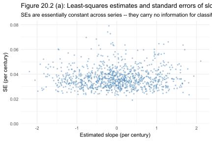
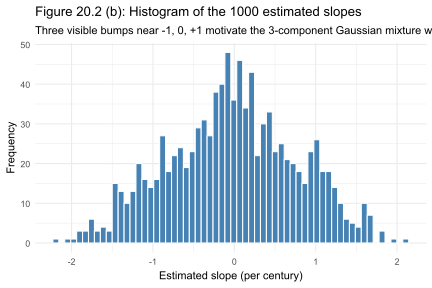
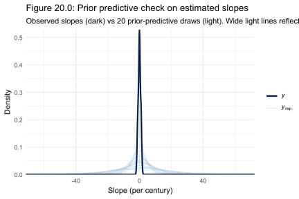

# Chapter 20 Case Study: When the Model Tells You Not to Play

*Based on [Gelman, Vehtari et al., Bayesian Workflow (2026)](https://users.aalto.fi/~ave/Bayesian-Workflow.pdf), Chapter 20.*
*Implemented using [RBayesflow](https://github.com/wildpeaches/RBayesflow) and [cmdstanr](https://mc-stan.org/cmdstanr/) in R.*

---

## The Question

Can a statistical model tell when a bet isn't worth taking?

A few years ago, a climate skeptic posted an online challenge with a $100,000 prize. He had generated 1,000 synthetic time series, each 135 points long, and mixed in some trending series among the trendless ones. The rules: identify at least 900 of the 1,000 correctly, pay a $10 entry fee, collect the prize. His implicit claim was that no one could do it, because the trend was too weak relative to the noise to be detectable.

This chapter shows how to answer that challenge rigorously. We fit a three-component **Gaussian mixture model** to the estimated trend slopes, recover the posterior probability that each series belongs to each component, and use those probabilities to solve the decision problem. The analysis tells you not only which category to guess for each series, but also your expected score, its uncertainty, and the probability of clearing the 900-correct threshold. In this case, the probability is about one in 240,000. Don't enter the bet.

---

## The Data

The dataset is a matrix of 1,000 time series, each of length 135, downloaded from the [Bayesian Workflow book repository](https://github.com/avehtari/Bayesian-Workflow) and cached locally as `Series1000.txt`. Each row is one time series; each column is one time point. The series were generated by first simulating 1,000 autocorrelated trendless series from a model fitted to historical global temperature records, then adding a trend of exactly $\pm 1$ degree Celsius per century to some randomly selected subset. The proportion of trending series and the direction of their trends were not disclosed.

The analysis doesn't use the raw series directly. Instead, we summarize each one with a single number: the estimated slope from a simple linear regression of $y$ on time, rescaled to per-century units. That gives us 1,000 scalar observations that we then feed to a mixture model. The chapter acknowledges this two-stage approach isn't optimal (the series are autocorrelated, so least-squares regression underestimates the uncertainty in each slope), but the goal is decision analysis, not efficient estimation.

---

## What Is RBayesflow?

[RBayesflow](https://github.com/wildpeaches/RBayesflow) is a set of R scripts, [Quarto](https://quarto.org) templates, and a workflow-state object that sequences the iterative Bayesian workflow described in Gelman et al. (2026). It doesn't implement new statistical methods. What it adds is structure: a consistent path through goal declaration, prior specification, model fitting, diagnostics, and reporting, with a gate that withholds coefficient output until diagnostic failures are acknowledged. [Posit Assistant](https://docs.posit.co/ide/user/ide/guide/tools/copilot.html) reads the live `wf_state` object to interpret results and suggest next steps.

This series applies RBayesflow to the case studies in the book, chapter by chapter. The [Chapter 17 case study](../sleep_ch17/ch17_article.md) is the best starting point if you haven't seen the workflow in action.

---

## Setting Up: Phase 1

The first thing RBayesflow does is ask what you're trying to learn, and whether a full Bayesian model is the right tool.

We initialize the workflow and download the data:

```r
wf <- init_workflow(mode = "learn", stage = "explore")

cache_path <- "Series1000.txt"
if (!file.exists(cache_path)) {
  src_url <- paste0(
    "https://raw.githubusercontent.com/avehtari/Bayesian-Workflow/",
    "main/timeseries/data/Series1000.txt"
  )
  utils::download.file(src_url, cache_path, quiet = TRUE, mode = "wb")
}
series <- matrix(scan(cache_path, quiet = TRUE),
                 nrow = 1000L, ncol = 135L, byrow = TRUE)
```

Figure 20.1 shows all 1,000 series overlaid.


The series fan outward from a common starting point near zero. By time 135, the spread is several units wide. The trending series are in there somewhere, but you can't pick them out by eye. That's the whole challenge.

We then fit a simple linear regression to each series and collect the slope estimates. Multiplying by 100 puts them on a per-century scale to match the contest's units:

```r
slope <- numeric(1000L)
se    <- numeric(1000L)
time  <- seq_len(135L)
for (n in seq_len(1000L)) {
  fit_n    <- lm(series[n, ] ~ time)
  coefs    <- summary(fit_n)$coefficients
  slope[n] <- 100 * coefs[2, "Estimate"]
  se[n]    <- 100 * coefs[2, "Std. Error"]
}
```

Figure 20.2 shows the resulting slopes and their standard errors.



The standard errors are nearly constant across all 1,000 series, ranging tightly from about 0.02 to 0.08 per century. This is informative: since the uncertainty in each slope is approximately the same regardless of the slope's value, there's no reason to weight series differently. The mixture model can treat every slope as an equally reliable observation.

The histogram of the 1,000 slopes is Figure 20.3.



Three bumps are visible, centered near $-1$, $0$, and $+1$ per century. They're broad and overlapping, because the noise in a 135-point autocorrelated series is large relative to a 1 degree-per-century trend. But the bumps are there, and they're exactly where the contest description says they should be.

The off-ramp assessment runs automatically:

```r
offramps <- assess_offramps(
  data         = data.frame(slope = slope, se = se),
  outcome_var  = "slope",
  outcome_type = "continuous",
  goal         = "coefficient estimation"
)
```

The standard continuous-outcome alternatives (t-test, linear model with bootstrap CI) don't solve the actual problem here. We need the probability that each series belongs to each component, not a single mean estimate. The Bayesian path is the right one for this, so we proceed.

---

## Phase 2: Prior Specification and Prior Predictive Check

### Priors

The mixture model has three sets of parameters. The **component means** $\mu = (0, -1, +1)$ are fixed as data, supplied directly to Stan. They're not estimated because the contest description tells us exactly what they are. The other two need priors.

The **mixture weights** $\theta = (\theta_1, \theta_2, \theta_3)$ represent the proportion of series in each component. In Stan, declaring `simplex[K] theta` imposes the constraint $\theta_1 + \theta_2 + \theta_3 = 1$ with all $\theta_k \geq 0$, and the implicit prior is $\text{Dirichlet}(1, 1, 1)$: uniform over all compositions. We use this because we don't know a priori how many series were assigned to each component. The prior treats every composition equally.

The **within-component standard deviation** $\sigma$ gets an $\text{Exponential}(0.1)$ prior. In Stan, the exponential distribution takes a **rate** parameter, so $\text{Exponential}(0.1)$ has rate $\lambda = 0.1$ and mean $1/\lambda = 10$. That's a very diffuse prior on the per-century slope scale, where slopes span only about $\pm 3$ units. The data will tighten $\sigma$ sharply to around 0.4, and the prior is there mainly to keep the sampler away from $\sigma = 0$ rather than to encode any real belief.

### Prior Predictive Check

We draw 20 samples from the prior and simulate slope vectors under each draw to check whether the priors produce plausible data. The code simulates $\theta$ using the normalized-exponential trick (dividing three independent exponential draws by their sum gives a Dirichlet(1,1,1) sample) and draws $\sigma$ from $\text{Exponential}(0.1)$:

```r
set.seed(1123)
yrep_prior <- matrix(NA_real_, nrow = 20L, ncol = 1000L)
mu_vec     <- c(0, -1, 1)
for (d in seq_len(20L)) {
  raw     <- rexp(3L)
  theta_d <- raw / sum(raw)
  sigma_d <- rexp(1L, rate = 0.1)
  z_d     <- sample.int(3L, 1000L, replace = TRUE, prob = theta_d)
  yrep_prior[d, ] <- rnorm(1000L, mean = mu_vec[z_d], sd = sigma_d)
}
```

Figure 20.4 shows the result.



The dark line is the density of the observed slopes. The light lines are the 20 prior-predictive slope distributions. They're far wider than the data, spreading past $\pm 40$ on some draws. That's expected: with a prior mean on $\sigma$ of 10, some draws will produce $\sigma$ values of 20 or 30, making the slopes nearly uninformative about component membership. The prior check isn't looking for a match to the data; it's confirming that no draw produces something structurally impossible (like all slopes collapsing to a single point). All 20 prior draws have the rough tri-modal shape we'd expect, just at wildly different scales. The likelihood from 1,000 observations will overwhelm the prior easily.

---

## Phase 3: Fitting the Mixture Model

### The Stan Program

We write the model in Stan and compile it with [cmdstanr](https://mc-stan.org/cmdstanr/). The model marginalizes over the latent component assignments $z_n$ using the [log-sum-exp trick](https://gregorygundersen.com/blog/2020/02/09/log-sum-exp/), which is numerically stable and avoids the need to sample discrete parameters:

```r
stan_mixture <- "
data {
  int<lower=1> K;
  int<lower=1> N;
  array[N] real y;
  array[K] real mu;
}
parameters {
  simplex[K] theta;
  real<lower=0> sigma;
}
model {
  array[K] real ps;
  sigma ~ exponential(0.1);       // rate = 0.1, mean = 10
  for (n in 1:N) {
    for (k in 1:K) {
      ps[k] = log(theta[k]) + normal_lpdf(y[n] | mu[k], sigma);
    }
    target += log_sum_exp(ps);    // marginalise z_n
  }
}
"
writeLines(stan_mixture, "mixture.stan")
mod_mix1 <- cmdstanr::cmdstan_model("mixture.stan")
```

The `log_sum_exp(ps)` expression computes $\log \sum_k \theta_k \, \mathcal{N}(y_n \mid \mu_k, \sigma)$ in a numerically stable way. This is the **mixture likelihood**: each observation $y_n$ contributes to the log-posterior in proportion to its probability under all three components simultaneously, weighted by the component mixing proportions.

Formally, the complete model is:

$$
y_n \sim \sum_{k=1}^{3} \theta_k \, \mathcal{N}(\mu_k,\, \sigma^2), \quad n = 1, \ldots, 1000
$$

where:
- $y_n$ is the estimated per-century slope for series $n$
- $\theta_k$ is the mixing weight for component $k$ (proportion of series belonging to that component)
- $\mu_k \in \{0, -1, +1\}$ is the fixed mean for component $k$
- $\sigma$ is the common within-component standard deviation

We fit with four chains and 1,000 post-warmup draws each:

```r
data_mix <- list(K = 3L, N = 1000L, y = slope, mu = c(0, -1, 1))
fit_mix1 <- mod_mix1$sample(
  data = data_mix, seed = 1123,
  chains = 4, parallel_chains = 4,
  iter_warmup = 1000, iter_sampling = 1000, refresh = 0
)
saveRDS(fit_mix1, "fit_mix1.rds")
```

### Diagnostics

The `diagnose_cmdstan()` helper (introduced for this series in Chapter 19) populates `wf$diagnostics` directly from the `CmdStanFit`. All four chains converged cleanly:

```
Rhat max: 1.001  |  Bulk ESS min: 2693  |  Tail ESS min: 2485
Divergences: 0   |  BFMI: all > 0.9    |  Max treedepth: not hit
Diagnostics PASSED
```

Two sporadic informational messages appeared during warmup, noting that `sigma` briefly hit zero in one proposal. That's normal startup behavior for exponential priors; HMC rejects the proposal and moves on. The final chains have no such issues.

### Posterior Results

The posterior summary, compared to the book's targets:

| Parameter | Book mean | Our mean | Book 90% CI | Our 90% CI |
|---|---|---|---|---|
| $\theta_1$ (null) | 0.54 | 0.538 | (0.50, 0.57) | (0.502, 0.574) |
| $\theta_2$ (down) | 0.24 | 0.238 | (0.21, 0.27) | (0.211, 0.267) |
| $\theta_3$ (up) | 0.22 | 0.224 | (0.20, 0.25) | (0.197, 0.251) |
| $\sigma$ | 0.40 | 0.405 | (0.38, 0.44) | (0.377, 0.437) |

Every posterior matches the book within Monte Carlo variation. The inferred mixture weights suggest the contest generator used roughly $\theta = (1/2, 1/4, 1/4)$: half the series trendless, a quarter trending downward, a quarter trending upward. The within-component standard deviation $\sigma \approx 0.40$ per century is about 40% of the trend magnitude. That's why the histogram shows overlapping bumps rather than three cleanly separated peaks: the noise is large relative to the signal.

---

## Phase 5: Decision Analysis

This is the part the chapter is actually about. The posterior tells us the overall composition of the 1,000-series dataset, but to answer the contest question, we need something finer: the probability that each individual series came from each component.

We add a `generated quantities` block to the Stan program to compute these per-series probabilities at every posterior draw. At each draw, given the current $(\theta, \sigma)$, the probability that series $n$ belongs to component $k$ is:

$$
p_{n,k} = \frac{\theta_k \, \mathcal{N}(y_n \mid \mu_k, \sigma)}{\sum_{j=1}^{3} \theta_j \, \mathcal{N}(y_n \mid \mu_j, \sigma)}
$$

where the denominator normalizes across the three components. After re-fitting with this block, we average $p_{n,k}$ over all posterior draws to get a single $1000 \times 3$ matrix:

```r
prob_sims <- posterior::as_draws_rvars(fit_mix2$draws(variables = "p"))
prob      <- mean(prob_sims$p)
```

The first ten rows of `prob` match the book's table closely:

```
      [,1] [,2] [,3]
 [1,] 0.08 0.00 0.92
 [2,] 0.41 0.59 0.00
 [3,] 0.93 0.01 0.06
 [4,] 0.83 0.17 0.00
 [5,] 0.82 0.17 0.00
 [6,] 0.95 0.01 0.05
 [7,] 0.74 0.00 0.26
 [8,] 0.86 0.14 0.00
 [9,] 0.11 0.00 0.89
[10,] 0.87 0.00 0.13
```

For each row, we guess the component with the highest probability. That's the **[Bayes-optimal classifier](https://machinelearningmastery.com/bayes-optimal-classifier/)** under a 0-1 loss function: maximizing the expected number of correct answers is equivalent to picking the [argmax](https://machinelearningmastery.com/argmax-in-machine-learning/) of the posterior class probabilities for each observation independently.

```r
max_prob <- apply(prob, 1, max)
choice   <- apply(prob, 1, which.max)
```

The classification counts are 559 null, 232 down, 209 up, which doesn't match $\theta \approx (0.54, 0.24, 0.22)$ exactly. We guess "null" slightly more often than the mixture weight would suggest. That's the decision-theoretic consequence of overlapping components: when a series' slope sits near zero, the null component wins even if the series is genuinely from a trending component. Maximizing expected correct answers pushes classifications toward the most common category.

### The Bad News

The expected number of correct guesses is the sum of the maximum class probabilities over all 1,000 series:

$$
E[N_{\text{correct}}] = \sum_{n=1}^{1000} \max_k \, p_{n,k}
$$

The variance, under the approximation that the 1,000 classifications are independent conditional on the model, is:

$$
\text{Var}[N_{\text{correct}}] \approx \sum_{n=1}^{1000} p_{n,\text{best}} (1 - p_{n,\text{best}})
$$

where $p_{n,\text{best}} = \max_k p_{n,k}$. Computing these:

```r
expected_correct <- sum(max_prob)
sd_correct       <- sqrt(sum(max_prob * (1 - max_prob)))
```

The expected number of correct guesses is 854. The standard deviation is 10.3. The contest requires 900.

The gap is 46 correct answers, or 4.5 standard deviations. The probability of clearing 900 under a normal approximation is:

```r
pnorm(expected_correct, mean = 900, sd = sd_correct)
# [1] 4.7e-06
```

That's roughly one in 210,000 without a continuity correction, and one in 160,000 with. Neither number crosses the threshold for a sensible bet. The prize is $100,000 and the entry fee is $10, so the break-even win probability is 1 in 10,000. Our odds are about 20 times too small.

---

## How the Analysis Was Structured

The two-stage strategy was simple by design. The first stage reduces each series to a single slope estimate; the second fits a mixture to those estimates. The table below shows where the modeling assumptions enter and what they mean.

| Stage | Method | Key assumption | What breaks if it's wrong |
|---|---|---|---|
| Slope estimation | OLS per series | Errors are uncorrelated within a series | Slope SEs are understated; classification is noisier than it looks |
| Mixture model | Gaussian mixture, fixed means | Component means are exactly 0, -1, +1; $\sigma$ is the same for all three | If means shift or $\sigma$ differs by component, posterior weights will be wrong |
| Decision rule | Argmax of posterior class probability | 0-1 loss (every correct answer counts equally) | A different loss function would change the optimal decision rule |

The OLS assumption is the most consequential. The series were generated from an autocorrelated model, so the actual uncertainty in each slope is larger than OLS reports. Exercise 20.2 in the book explores fitting per-series models with AR(1) errors; the chapter suggests this might help, but notes it won't be easy to close a 46-correct-answer gap.

---

## How RBayesflow Guided the Analysis

1. **Goal declaration and off-ramp assessment (Phase 1):** RBayesflow presented standard continuous-outcome alternatives: t-test with Cohen's d, linear model with bootstrap CI, and full Stan regression. None of these compute per-series classification probabilities. We logged the rejection with a note that the off-ramp taxonomy doesn't include mixture alternatives, and flagged this as a gap for a future version.
2. **Prior specification and prior predictive check (Phase 2):** We simulated 20 prior-predictive slope distributions to confirm that the Dirichlet(1,1,1) and Exponential(0.1) priors don't accidentally rule out plausible data. The prior-predictive spread was much wider than the observed slopes, which is the expected and appropriate result for a deliberately diffuse prior.
3. **Model fitting (Phase 3):** Two hand-written Stan programs compiled and sampled with [cmdstanr](https://mc-stan.org/cmdstanr/). The first fits the core mixture model; the second adds a `generated quantities` block to compute per-series classification probabilities. The `diagnose_cmdstan()` helper populated `wf$diagnostics` directly from each `CmdStanFit` so the gate operated normally.
4. **MCMC diagnostics (Phase 4):** Both models passed on all six criteria: Rhat, bulk ESS, tail ESS, divergences, BFMI, and max treedepth. The gate opened automatically after each clean fit.
5. **Decision analysis (Phase 5):** Posterior classification probabilities extracted with [posterior](https://mc-stan.org/posterior/), argmax classification applied, expected number correct computed, and probability of winning evaluated via the normal approximation. No traditional posterior predictive check was performed because the chapter's "prediction" is the classification matrix itself.

---

## Extensions for the Student

- **Per-series autocorrelation correction (Exercise 20.2).** Fit an AR(1) model to each series using `arima(series[n,], order = c(1, 0, 0))` to get GLS slope estimates, then re-run the mixture on those slopes. Compare how many series change their best-guess category and whether `expected_correct` improves.
- **Integrated single-stage model (Exercise 20.1).** Write a Stan program that fits slopes and the mixture simultaneously, using the raw series as data and embedding the per-series regression inside the model block. This avoids the two-stage approximation and propagates slope uncertainty through to classification.
- **Unknown component means (Exercise 20.3).** Replace the fixed `array[K] real mu` data block with an `ordered[K] vector` parameter, and add a prior such as `mu[1] ~ normal(0, 1); mu[2] ~ normal(-1, 1); mu[3] ~ normal(1, 1)`. Fit this to the estimated slopes and see whether the posterior on $\mu$ concentrates near $(0, -1, +1)$.
- **Sensitivity to the prize threshold.** Recompute `pnorm(expected_correct, mean = threshold, sd = sd_correct)` over a grid of thresholds from 700 to 950. Plot the win probability as a function of threshold. This visualizes the book's point that the contest is winnable at 800 correct and essentially impossible at 950.
- **frequentist mixture as a benchmark.** Install the [mixtools](https://cran.r-project.org/package=mixtools) package and fit `normalmixEM(slope, k = 3)` with starting values near $(-1, 0, 1)$. Compare the resulting component weights and $\sigma$ estimates to the Bayesian posteriors. Consider how the EM algorithm handles the label-switching problem that the fixed-means Stan model sidesteps.

---

## Glossary

**[Bayes-optimal classifier](https://en.wikipedia.org/wiki/Bayes_classifier):** A decision rule that minimizes expected prediction error given a prior and a likelihood. Under 0-1 loss (every mistake costs the same), the Bayes-optimal rule assigns each observation to the class with the highest posterior probability.

**[BFMI](https://mc-stan.org/docs/reference-manual/hmc-algorithm-stan.html) (Bayesian Fraction of Missing Information):** A diagnostic for Hamiltonian Monte Carlo that measures how well the sampler's momentum variable explores the posterior. Values below 0.3 suggest the sampler may be struggling with a poorly conditioned posterior.

**[Bulk ESS](https://mc-stan.org/docs/reference-manual/analysis.html) (Effective Sample Size, bulk):** An estimate of how many independent samples the MCMC chains are collectively equivalent to, computed from the center of the distribution. Values below 400 suggest incomplete exploration.

**[cmdstanr](https://mc-stan.org/cmdstanr/):** An R package that calls [CmdStan](https://mc-stan.org/cmdstan/), the command-line interface for Stan, from within an R session. Used here because the mixture likelihood can't be expressed with `brm()`.

**[Continuity correction](https://en.wikipedia.org/wiki/Continuity_correction):** An adjustment to a normal approximation for a discrete random variable. For $P(N \geq 900)$ where $N$ is an integer-valued count, we evaluate the normal CDF at $899.5$ rather than $900$ to account for the discrete/continuous mismatch.

**[Dirichlet distribution](https://en.wikipedia.org/wiki/Dirichlet_distribution):** A distribution over probability vectors (vectors that sum to 1). Written $\text{Dirichlet}(\alpha_1, \ldots, \alpha_K)$. $\text{Dirichlet}(1, 1, 1)$ is uniform over the 2-simplex, meaning every combination of three non-negative weights summing to 1 is equally likely a priori. Used here as the implicit prior on mixture weights.

**[Effective sample size (ESS)](https://mc-stan.org/docs/reference-manual/analysis.html):** The number of independent samples that would give the same estimation precision as the actual correlated MCMC samples. Lower than the raw sample count because consecutive MCMC draws are correlated. Values above 400 are generally sufficient for reliable posterior summaries.

**[Exponential distribution](https://en.wikipedia.org/wiki/Exponential_distribution):** A distribution for positive real values. Stan parameterizes it by **rate** $\lambda$, so $\text{Exponential}(\lambda)$ has mean $1/\lambda$. Here $\text{Exponential}(0.1)$ means rate $= 0.1$ and mean $= 10$. This is frequently confused with the scale parameterization (mean $= \lambda$) used by some other software.

**[Gaussian mixture model](https://en.wikipedia.org/wiki/Mixture_model):** A probability distribution defined as a weighted sum of Gaussian (normal) distributions. Each component has its own mean and standard deviation; the weights sum to 1. Here we fix the component means at $(-1, 0, +1)$ and share a single standard deviation $\sigma$ across all three.

**[Generated quantities](https://mc-stan.org/docs/reference-manual/generated-quantities-block.html):** A Stan program block that executes once per posterior draw using the sampled parameter values, without affecting the sampling itself. Used here to compute the $1000 \times 3$ matrix of per-series classification probabilities at each draw.

**[Label switching](https://en.wikipedia.org/wiki/Label_switching_problem):** A pathology in mixture model inference where the labels of the components are exchangeable, so the sampler may swap component assignments between chains. Fixing the component means at distinct values, as in this model, eliminates the problem entirely because there's no longer any symmetry to break.

**[Log-sum-exp](https://en.wikipedia.org/wiki/LogSumExp):** A numerically stable way to compute $\log \sum_k \exp(x_k)$ when the $x_k$ can be large or small. Stan's `log_sum_exp()` function avoids the overflow and underflow that would occur if you exponentiated large log-probabilities before summing. Used here to marginalize the mixture likelihood over the latent component assignment.

**[Mixture likelihood](https://en.wikipedia.org/wiki/Mixture_model):** The joint probability of an observation under a mixture model, obtained by summing the weighted probabilities across all components: $p(y_n) = \sum_k \theta_k \, p(y_n \mid \mu_k, \sigma)$. This marginalizes over the unknown component assignment $z_n$, so $z_n$ never appears explicitly as a model parameter.

**[Mixing weights](https://en.wikipedia.org/wiki/Mixture_model):** The proportions $\theta_1, \theta_2, \theta_3$ specifying how much of the population belongs to each mixture component. They must be non-negative and sum to 1, which the `simplex` constraint in Stan enforces automatically. Here they represent the fractions of the 1,000 series that are trendless, trending down, and trending up.

**[Normal approximation](https://en.wikipedia.org/wiki/Central_limit_theorem):** The use of a normal distribution to approximate the distribution of a sum of random variables, justified by the central limit theorem. Here we approximate the distribution of the total number of correct guesses (a sum of 1,000 Bernoulli random variables with different success probabilities) as $\mathcal{N}(\mu_{\text{correct}}, \sigma_{\text{correct}}^2)$.

**[OLS (Ordinary Least Squares)](https://en.wikipedia.org/wiki/Ordinary_least_squares):** The standard method for fitting a linear regression by minimizing the sum of squared residuals. OLS slope estimates are unbiased but inefficient when errors are correlated, as they are in autocorrelated time series. The standard errors it produces are then too small.

**[Posterior class probability](https://en.wikipedia.org/wiki/Naive_Bayes_classifier#Probabilistic_model):** The probability that observation $n$ belongs to component $k$, given the data and the fitted model parameters: $p_{n,k} = P(z_n = k \mid y_n, \theta, \sigma)$. In a Bayesian mixture model, this is averaged over the posterior distribution of $(\theta, \sigma)$ rather than evaluated at a point estimate.

**[Prior predictive check](https://mc-stan.org/docs/stan-users-guide/posterior-predictive-checks.html):** A simulation from the prior over parameters and through the likelihood, producing a distribution over possible data before observing any. Used to verify that the priors allow the observed data to occur, and don't accidentally concentrate mass in implausible regions.

**[Rhat](https://mc-stan.org/docs/reference-manual/analysis.html) (R-hat):** A convergence diagnostic that compares within-chain to between-chain variance across multiple MCMC chains. Values above 1.01 suggest the chains haven't converged to the same distribution. All parameters in this analysis had $\hat{R} \leq 1.001$.

**[Simplex](https://en.wikipedia.org/wiki/Simplex):** A constrained space of vectors whose entries are non-negative and sum to 1. Probability vectors live on a simplex. Stan's `simplex[K] theta` declaration automatically enforces this constraint, and the default prior on a simplex variable is $\text{Dirichlet}(1, \ldots, 1)$.

**[Stan](https://mc-stan.org/):** A probabilistic programming language for Bayesian statistical modeling. Models are written as Stan programs specifying data types, parameters, and a log-posterior model block. Stan uses Hamiltonian Monte Carlo for sampling.

**[Tail ESS](https://mc-stan.org/docs/reference-manual/analysis.html) (Effective Sample Size, tail):** Like bulk ESS, but computed from the tails of the posterior distribution. Important for reliable credible interval estimates. Values above 400 are generally considered sufficient.
