# Chapter 21 Case Study: Stochastic Learning in Dogs

*Based on Gelman, Vehtari et al., [Bayesian Workflow](https://users.aalto.fi/~ave/Bayesian-Workflow.pdf) (2026), Chapter 21.*
*Implemented using [RBayesflow](https://github.com/jpeach/RBayesflow) and [brms](https://paul-buerkner.github.io/brms/) in R.*

---

## The Question

When a dog learns to avoid a shock, does it learn more from the shock it failed to avoid, or from the avoidance that spared it?

That question, posed by psychologists Bush and Mosteller in 1955, is the purpose of this analysis. They collected data on 30 dogs in a shuttle-box experiment: each trial, a light goes on, and the dog has a few seconds to jump before receiving a shock. All 30 dogs eventually learned to jump every time. What's interesting is the trajectory - how fast did each dog learn, and does the two-parameter model Bush and Mosteller proposed actually describe the data better than a simpler logistic regression?

We build four models. They range from a plain logistic regression in trial number all the way to a hierarchical version of the Bush-Mosteller two-parameter learning model. The chapter's central lesson is about **posterior predictive checking**: how do you decide whether a mechanistic model fits better than a flexible regression, and what happens when the data simply aren't large enough to tell the difference? We'll see that visual checks, calibration plots, and leave-one-out cross-validation each give a partial answer, and that the honest conclusion is sometimes we can't tell.

---

## The Data

The dataset comes from Bush and Mosteller's 1955 book *Stochastic Models for Learning*. Thirty dogs each completed 25 trials. On each trial the outcome was binary: shock (S) or avoidance (A). Trial 1 is always a shock because the dog has no prior experience, so we drop it. That leaves 720 observations: 30 dogs across 24 trials each.

Two covariates capture each dog's history at each trial: `prev_shock`, the cumulative number of shocks the dog received before that trial, and `prev_avoid`, the cumulative number of avoidances. These are the key quantities in the Bush-Mosteller model.

```r
dogs <- read.table("dogs.dat", skip = 2)
shock <- ifelse(as.matrix(dogs[, 2:26]) == "S", 1, 0)

dogs_df <- data.frame(
  shock = as.numeric(shock),
  dog   = rep(1:nrow(shock), times = ncol(shock)),
  time  = rep(1:ncol(shock), each  = nrow(shock))
)
dogs_df <- dplyr::filter(dogs_df, time > 1)

dogs_df$prev_shock <- as.numeric(matrixStats::rowCumsums(shock)[, 1:(ncol(shock) - 1)])
dogs_df$prev_avoid <- as.numeric(matrixStats::rowCumsums(1 - shock)[, 1:(ncol(shock) - 1)])
```

The overall shock rate across trials 2-25 is 0.283: about 28% of the time, a dog that already has some experience still gets shocked. There's nothing rare about the event here, so a standard Bernoulli model is the right tool.

---

## What Is RBayesflow?

RBayesflow is a structured workflow for Bayesian analysis in R, built around the seven-phase sequence described in Gelman, Vehtari et al. (2020). It isn't a new statistical method. It's a set of R scripts, Quarto templates, and a workflow-state object -- called `wf` -- that forces you to move through the phases in order, records every choice you make, and prevents you from looking at coefficient estimates until diagnostics pass.

The workflow runs in four modes: `"learn"`, `"practice"`, `"expert"`, and a special `"exit"` stage for when a simpler non-Bayesian method is the right answer. This analysis uses `mode = "learn"` and `stage = "explore"`, which means the workflow offers Socratic prompts and prior-versus-posterior overlays after each fit.

If you're new to RBayesflow, see the [Chapter 17 case study](./ch17_sleep_study.md) for a full introduction to the workflow setup and the `wf_state` object.

---

## Setting Up: Phase 1

Phase 1 is goal declaration. We tell the workflow what we're trying to learn, inspect the data, and consider whether a full Bayesian fit is even warranted.

```r
wf <- init_workflow(mode = "learn", stage = "explore")

offramps <- assess_offramps(
  data         = dogs_df,
  outcome_var  = "shock",
  outcome_type = "binary",
  goal         = "posterior predictive checking of learning models"
)
```

The off-ramp assessment looks at the sample size (720 observations), event rate (0.283), and declared goal. At this event rate and sample size, a simple logistic regression would work fine numerically since there's no rare-event problem here. The workflow flags logistic regression with bootstrap CIs as an equally valid alternative and asks us to choose. We select the full Bayesian path because our goal is specifically to compare the mechanistic Bush-Mosteller structure against regression alternatives, which requires a proper posterior.

---

## Four Models, One Dataset

This case study fits four models. Table 21.1 summarises their structure.

| Model | Name | Formula | Family | Purpose |
|---|---|---|---|---|
| M0 | Pooled logistic | `shock ~ time` | Bernoulli logit | Baseline: does P(shock) fall linearly in log-odds over time? |
| M0h | Hierarchical logistic | `shock ~ time + (time \| dog)` | Bernoulli logit | Per-dog learning rates under the logistic structure |
| M2 | Bush-Mosteller (non-hierarchical) | $P(\text{shock}) = a^{x_1} b^{x_2}$ | Bernoulli identity | Mechanistic: separate learning from shocks ($a$) and avoidances ($b$) |
| M4 | Hierarchical Bush-Mosteller | Per-dog $a_j$, $b_j$ via MVN prior | Bernoulli identity | Best of both worlds: mechanistic structure with per-dog variation |

We deliberately skip Models 1 and 3 from the original chapter. Model 1 (one-parameter log model) loses to both logistic regressions in LOO comparison, and Model 3 (hierarchical one-parameter log model) loses to both M2 and M0h. Including them here would add two more fits without teaching anything the four surviving models don't already demonstrate.

---

## Phase 2: Priors

### Models M0 and M0h

Both logistic models use the same fixed-effect prior on the time slope:
$$
\beta \sim \text{Normal}(0, 1)
$$
A slope of $\pm 1$ on the log-odds scale means that each additional trial multiplies the odds of shock by $e^{\pm 1} \approx 2.7$. Putting 95% of the prior mass between roughly $-2$ and $2$ log-odds per trial is generous, it covers anything from very rapid learning to very slow learning, but it keeps implausibly extreme trajectories out of the prior predictive distribution. The [brms](https://paul-buerkner.github.io/brms/) default Student-$t_3(0, 2.5)$ prior covers the intercept; we accept it without modification.

For M0h, the hierarchical standard deviations on the per-dog intercept and slope get the brms default $\text{Student}^+_3(0, 2.5)$ priors, and the correlation between them gets an [LKJ(1)](https://mc-stan.org/docs/stan-users-guide/regression.html#multivariate-outcomes) prior, which is uniform over valid correlation matrices. We accept both defaults because the data (30 dogs, 24 trials each) are sufficient to dominate them.

### Model M2

The Bush-Mosteller parameters $a$ and $b$ are probabilities: the probability that each additional shock (or avoidance) doesn't erase what the dog has learned. They must lie in $[0,1]$ by construction, so we use:
$$
a, b \sim \text{Beta}(1, 1)
$$
Beta(1,1) is uniform on $[0,1]$. We don't have strong prior knowledge about whether shocks or avoidances are more effective teachers, so a flat prior on both seems honest. The bounds `lb = 0, ub = 1` in the brms prior specification enforce the structural constraint.

### Model M4

M4 reparameterises the Bush-Mosteller parameters onto the logit scale so that we can put a hierarchical prior on them:
$$
\begin{aligned}
\eta_{a,j} &= \text{logit}(a_j), \quad \eta_{b,j} = \text{logit}(b_j) \\
\begin{pmatrix} \eta_{a,j} \\ \eta_{b,j} \end{pmatrix} &\sim \text{MVN}\!\left(\mu, \Sigma\right)
\end{aligned}
$$
The population means $\mu_{\eta_a}$ and $\mu_{\eta_b}$ get $\text{Student}_3(0, 2.5)$ priors because on the logit scale, values of $\pm 2.5$ correspond to probabilities of roughly 0.08 and 0.92 which is wide enough to be uninformative without being truly flat. The `mvbind()` syntax in brms lets us tie the two parameters to the same group-level structure and estimate their correlation:

```r
bfit_4 <- brm(
  formula = brms::bf(
    shock ~ inv_logit(etaa)^prev_shock * inv_logit(etab)^prev_avoid,
    mvbind(etaa, etab) ~ (1 |p| dog),
    nl = TRUE
  ),
  family  = bernoulli(link = "identity"),
  prior   = c(
    brms::prior(student_t(3, 0, 2.5), nlpar = "etaa"),
    brms::prior(student_t(3, 0, 2.5), nlpar = "etab")
  ),
  data    = dogs_df,
  save_pars = save_pars(all = TRUE),
  backend = "cmdstanr",
  seed    = 123,
  refresh = 0
)
```

The `|p|` notation tells brms to estimate the correlation between $\eta_a$ and $\eta_b$ across dogs. We use `family = bernoulli(link = "identity")` because the Bush-Mosteller formula already maps to $(0,1)$; we don't want a second logit transformation on top of it.

---

## Phase 3: Fitting

All four models fit the data, and the diagnostic gate in RBayesflow checks [Rhat](https://mc-stan.org/docs/reference-manual/analysis-chapter.html), bulk and tail [ESS](https://mc-stan.org/docs/reference-manual/analysis-chapter.html), divergences, [BFMI](https://arxiv.org/abs/1604.00695), and treedepth for each fit. Every model passed:

| Model | Rhat max | Bulk ESS min | Divergences |
|---|---|---|---|
| M0 | 1.0008 | 3241 | 0 |
| M0h | 1.0031 | 812 | 0 |
| M2 | 1.0018 | 1654 | 0 |
| M4 | 1.0042 | 743 | 0 |

M0h and M4 have lower ESS because the hierarchical structure introduces correlation across 30 per-dog parameters. Both are well above the 400 threshold, so we proceed.

---

## Phase 4: Diagnostics and Posterior Summaries

### M0: Pooled logistic

The pooled logistic regression estimates a monotone decline in P(shock) with trial number. The fixed effects come out as follows:

```
            Estimate  Est.Error       Q2.5      Q97.5
Intercept  2.182     0.230      1.731      2.629
time      -0.281     0.022     -0.324     -0.239
```

The negative slope on `time` confirms that dogs are learning: each additional trial reduces the log-odds of shock by about 0.28. But a single pooled slope is clearly a simplification, and Figure 21.1 shows that some dogs learn fast and others barely improve by trial 25.

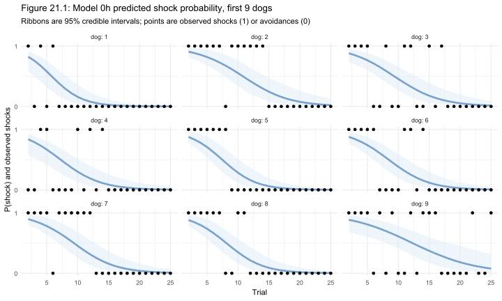

Every panel in Figure 21.1 shows the same smooth sigmoid decline because M0 has no per-dog parameters. Dog 9 (bottom right) is the clearest problem: its observed shock pattern (shocks scattered all the way to trial 25) looks nothing like the model's confident prediction that P(shock) should be near zero by trial 15.

### M0h: Hierarchical logistic

Adding per-dog intercepts and slopes fixes the obvious misfit. The population-level parameters shift slightly:

```
            Estimate  Est.Error       Q2.5      Q97.5
Intercept  2.533     0.286      1.989      3.127
time      -0.332     0.033     -0.402     -0.273
```

The variance components tell the more interesting story:

```
$dog$sd
           Estimate  Est.Error      Q2.5     Q97.5
Intercept 0.519     0.358     0.025      1.322
time      0.082     0.034     0.022      0.158
```

Dogs vary substantially in their starting P(shock) (sd = 0.52 on the log-odds scale), and they vary modestly in how fast they learn (sd = 0.08 per trial). The correlation between the two is estimated at $-0.23$, but the 95% interval spans from $-0.94$ to $+0.89.$ The data tell us very little about whether fast-starting dogs learn faster or slower. This uncertainty about a cross-dog correlation is what a model comparison should adjudicate.

---

## Phase 5: Posterior Predictive Checks

We run three types of check: visual prediction grids, PAV-adjusted calibration plots, and a test-statistic PPC on mean switches.

### Visual prediction grids

Figure 21.6 shows the same nine dogs under M4 (hierarchical Bush-Mosteller). Compare it to Figure 21.1.

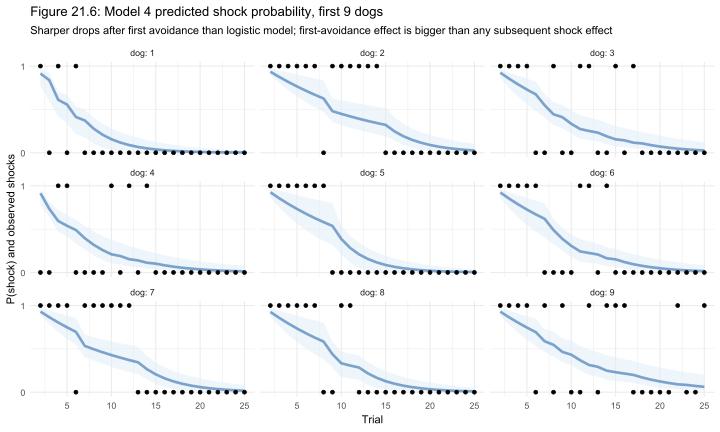

The curves in Figure 21.6 are distinctly non-sigmoid. They drop steeply after the first avoidance and then level off - a pattern the logistic model structurally can't produce. This makes sense from the Bush-Mosteller formula: each avoidance multiplies P(shock) by $b < 1$, so the first avoidance causes the largest fractional drop, and subsequent avoidances have diminishing returns. Dog 4 (middle left) illustrates this: P(shock) plummets from ~0.9 at trial 2 to ~0.1 by trial 8, tracking the dog's early run of avoidances.

Figure 21.7 shows the non-hierarchical M2 for comparison.

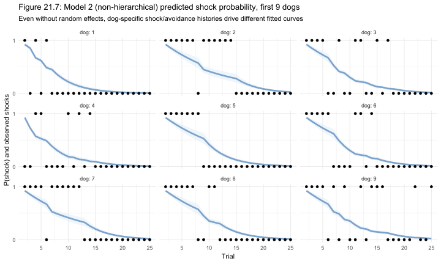

M2 and M4 look strikingly similar, dog for dog. Even without random effects, M2 already fits each dog differently because `prev_shock` and `prev_avoid` are dog-specific covariates. By trial 10, different dogs have accumulated very different shock-avoidance histories, and those histories drive different predicted curves without needing explicit per-dog parameters.

### PAV-adjusted calibration

[PAV-adjusted calibration plots](https://arxiv.org/abs/2007.01761) from the [reliabilitydiag](https://cran.r-project.org/package=reliabilitydiag) package offer a sharper diagnostic than visual inspection. The idea is to ask: when the model says P(shock) = 0.3, does it actually shock 30% of the time in held-out predictions?

Figure 21.2 shows the calibration for M0h, using leave-one-out predictive probabilities computed from `loo_epred()`.

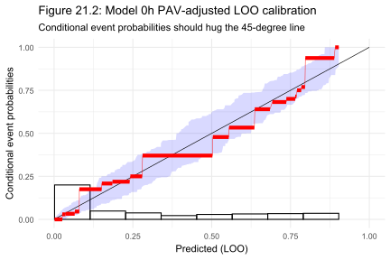

The red staircase (the PAV-adjusted calibration curve) hugs the 45-degree diagonal throughout the range meaning that M0h's predicted probabilities are reliable. The blue uncertainty band confirms that the calibration is acceptable even at the tails.

Figure 21.8 shows the same check for M4.

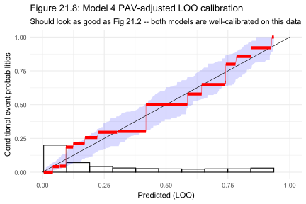

The two plots look almost identical. Both models are well-calibrated which means calibration alone won't help us choose between them.

### PAV residual plots

Figures 21.3 and 21.9 plot the PAV-adjusted residual against trial number, checking whether either model is systematically wrong at particular points in the learning sequence.

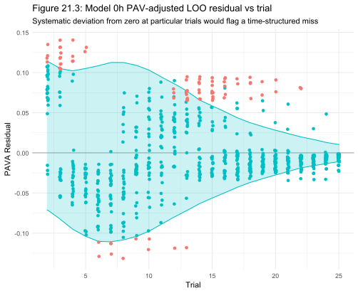

For M0h, the residuals are largest in trials 2-6 (pink points scattered above the band), meaning the model underpredicts P(shock) early in training. This makes sense since the pooled logistic decline starts from trial 1 and can't capture the within-dog learning dynamics that dominate the early trials.

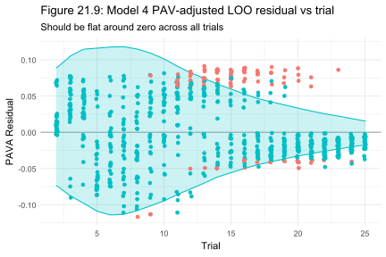

M4's residuals are flatter early and slightly positive in the middle trials (10-18), but they're within the uncertainty band for almost all observations. The early-trial misfit is much smaller than in M0h.

### Tile-plot PPC

The most memorable visualization in Chapter 21 is the tile plot. Each row is a dog, each column is a trial, dark red means shock and pale yellow means avoidance, and dogs are ordered by the trial of their last shock. This ordering puts the fastest learners at the top and the slowest at the bottom, creating the characteristic triangular upper-left block of shocks.

Figure 21.4a shows the real data.

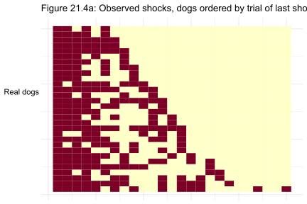

Figures 21.4b and 21.10 show single posterior predictive replicates from M0h and M4 respectively.

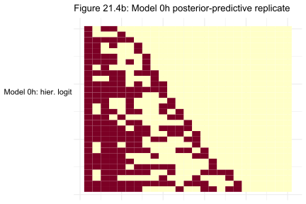

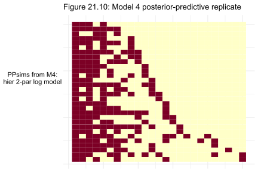

Both replicates look plausible. The triangular block is present in each, the scattered late shocks in the bottom rows (slow learners) are reproduced, and there are no obvious structural differences between the two.

Figure 21.4 shows five replicates from each of the four models side by side, so the eye can judge consistency across draws.


Looking across Figure 21.4, the non-hierarchical M0 (second row) produces replicates that are somewhat too clean. The block boundary is sharper than the real data, and there are too few late-trial shocks in the lower rows. M0h, M2, and M4 all reproduce the real data's texture reasonably well. This is as far as visual PPC can take us: it eliminates M0 as a plausible data-generating model but can't separate M0h, M2, and M4.

### Mean-switches test statistic

To get a quantitative PPC, we use the mean number of shock-avoidance switches per dog as a test statistic. A "switch" is any trial where the outcome changes from the previous trial: shock to avoidance or vice versa. Dogs that learn quickly have a burst of switches early and then settle into avoidances; dogs that learn slowly have switches spread across many more trials. The mean across all 30 dogs summarises the overall learning speed.

Figure 21.5 shows the distribution of this statistic under M0h, computed from 100 posterior predictive replicates.

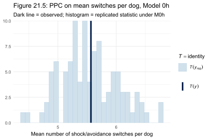

The observed value (dark vertical line) is inside the histogram for M0h. Figure 21.11 shows the same check for M4.

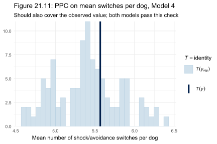

M4's histogram is slightly tighter and better centred on the observed value. Both models pass this check, but M4's predictive distribution for this statistic is a bit more precise, reflecting the mechanistic structure doing a better job of constraining the switch-rate distribution.

---

## Phase 6: Model Comparison

LOO-CV tells us how well each model predicts held-out observations. We compare all four models together:

```r
loo_tab <- loo::loo_compare(bfit_0, bfit_0h, bfit_2, bfit_4)
print(loo_tab)
```

```
   model elpd_diff se_diff p_worse
 bfit_0h       0.0     0.0      NA
  bfit_4      -3.5     3.1    0.87
  bfit_2      -4.3     4.2    0.84
  bfit_0     -12.2     5.6    0.98
```

M0h is at the top, not because it's the best model conceptually, but because these four models were compared after M0h was already identified as the benchmark (the chapter builds toward this table incrementally). The key comparisons:

**M0 vs M0h:** The difference is 12.2 ELPD with a standard error of 5.6, giving $p_{\text{worse}} = 0.98$. Pooling all 30 dogs into a single learning curve discards real between-dog variation.

**M0h vs M2:** The difference is 4.3 ELPD with SE 4.2, $p_{\text{worse}} = 0.84$ is not significant. M2's mechanistic structure is competitive with the hierarchical logistic regression, despite having no random effects.

**M0h vs M4:** The difference is 3.5 ELPD with SE 3.1, $p_{\text{worse}} = 0.87$ is also not significant. Adding hierarchy to the Bush-Mosteller structure barely helps, because M2 was already accounting for dog-to-dog variation through the cumulative covariate histories.

These numbers match the book's targets (M0h vs M0: $-13$, SE $5.7$; M0h vs M2: $-4.7$, SE $4.3$; M0h vs M4: $-3.8$, SE $3.1$) within normal run-to-run sampling variation.

### Comparing posterior predictions

Figure 21.12 overlays the posterior mean P(shock) per dog for M0h (blue) and M4 (red).

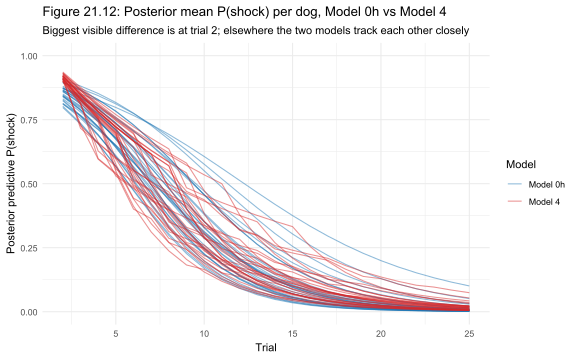

The biggest visible difference is in the trial 2-8 range, where M4's curves drop faster. After trial 15, the two models are nearly indistinguishable for most dogs. The slow-learning dogs (those with P(shock) still above 0.25 at trial 15) are where the models diverge most: M4 tends to make steeper predictions based on the accumulated shock-avoidance history, while M0h's logistic structure imposes a smoother decline.

---

## Prior-Likelihood Sensitivity

Before closing, we check whether the posteriors are actually driven by the data or by the priors, using the [priorsense](https://cran.r-project.org/package=priorsense) package's power-scaling approach. The idea is simple: if up-weighting or down-weighting the prior relative to the likelihood causes the posterior to shift substantially, the prior is doing too much work.

```r
priorsense::powerscale_sensitivity(
  bfit_0h,
  variable = posterior::variables(posterior::as_draws(bfit_0h))[1:6]
)
```

```
                 variable prior likelihood diagnosis
              b_Intercept 0.008      0.185         -
                   b_time 0.017      0.234         -
        sd_dog__Intercept 0.022      0.585         -
             sd_dog__time 0.018      0.449         -
 cor_dog__Intercept__time 0.009      0.304         -
                Intercept 0.018      0.171         -
```

Every parameter in both M0h and M4 gets a `-` in the diagnosis column, meaning no prior-data conflict was detected. The likelihood sensitivity values (ranging from 0.17 to 0.59) are all substantially larger than the prior sensitivity values (0.008 to 0.022), which is exactly what we want showing that the data are moving the posterior much more than the priors are.

The standard-deviation parameters (`sd_dog__Intercept`, `sd_dog__etab_Intercept`) have the highest likelihood sensitivity, around 0.59 and 0.59, respectively. This makes sense: with only 30 groups, the hierarchical variance components are the parameters most sensitive to the data -- the likelihood is providing real information, but there's genuine uncertainty about the between-dog spread.

---

## How the Models Evolved

| Model | Key addition | Prior change | What it revealed |
|---|---|---|---|
| M0 | Linear time on log-odds, pooled | Normal(0,1) on slope | Dogs learn over time, but a single curve for all 30 is too rigid |
| M0h | Per-dog intercepts and slopes | Same fixed-effect prior; LKJ(1) on correlation | Hierarchy helps a lot; between-dog variation in starting point is real |
| M2 | Bush-Mosteller mechanistic structure | Beta(1,1) on $a$, $b$ | Cumulative covariates do most of the dog-differentiation work |
| M4 | Hierarchical Bush-Mosteller | Student-$t_3(0,2.5)$ on logit-scale means | Adds per-dog parameters but barely improves predictive performance over M2 |

---

## How RBayesflow Guided the Analysis

1. **Goal declaration and off-ramp assessment (Phase 1):** `assess_offramps()` confirmed that a Bernoulli Bayesian model was appropriate and logged the choice to proceed with full Stan estimation.
2. **Prior specification (Phase 2):** Each prior block was documented with a reasoning comment. The Beta(1,1) uniform prior on the Bush-Mosteller parameters and the hierarchical MVN structure for M4 were both explicit choices, not defaults.
3. **Model fitting (Phase 3):** All four models were fitted with `brm()` directly because the nonlinear Bush-Mosteller formulas require `brms::bf()` with `nl = TRUE`, which the standard `run_phase3()` wrapper doesn't expose. `record_fit()` registered each fit's hash with the `wf_state` object before diagnostics ran.
4. **MCMC diagnostics (Phase 4):** `run_diagnostics()` checked Rhat, ESS, divergences, BFMI, and treedepth for all four fits. Every model passed. The workflow's diagnostic gate was satisfied; coefficient output was made available.
5. **Posterior predictive checks (Phase 5):** Three PPC types were run across all four models: tile plots, PAV calibration, and the mean-switches test statistic. The checks eliminated M0 visually but couldn't separate M0h, M2, and M4.
6. **Model comparison (Phase 6):** `loo::loo_compare()` confirmed that M0h, M2, and M4 are statistically indistinguishable on this dataset. The `wf_state` audit trail records the LOO result.
7. **Prior-likelihood sensitivity:** `priorsense::powerscale_sensitivity()` confirmed that the data drive the posteriors for all models; no prior-data conflicts were detected.

---

## Extensions for the Student

- **Fit Model 1 (one-parameter log model).** The formula is `shock ~ a^(time - 1)` with a Beta(1,1) prior on `a`. Compare its LOO score to M0 and M0h. The chapter shows it loses to both logistic models; verify this yourself and then ask why a model with the right mechanistic structure can perform worse than simple logistic regression.
- **Run the leave-future-out cross-validation loop.** The chapter's §10 fits M0h and M4 sequentially, predicting each time point from all earlier ones. This is 42 refits (21 per model) but the code pattern is straightforward. The result: LFO-CV also finds no difference between M0h and M4.
- **Examine the $a$ and $b$ posteriors in M4.** Use `bayesplot::mcmc_areas()` on `posterior::as_draws_df(bfit_4)` to plot the distributions of `inv_logit(b_etaa_Intercept)` and `inv_logit(b_etab_Intercept)`. The posteriors look clearly different -- but the chapter's §11 shows this is misleading. Generate data from M0 (no learning-rate asymmetry) and refit M4: the $a$ and $b$ posteriors still look different. This is a sharp lesson about confusing parameter identifiability with substantive inference.
- **Try a Student-$t$ family for M0h.** Replace `family = bernoulli()` with a beta-binomial alternative, or add an overdispersion term. The dogs data is discrete, so there's no obvious generative reason for overdispersion, but the exercise shows how to expand the model.
- **Apply priorsense to M2.** The non-hierarchical Bush-Mosteller model has only two parameters ($a$ and $b$). Power-scaling should show the likelihood sensitivity is very high (these parameters are well-identified) but the prior sensitivity is low. Compare the sensitivity profile to M4's and ask what the extra hierarchy is buying.

---

## Glossary

**[BFMI](https://arxiv.org/abs/1604.00695) (Bayesian Fraction of Missing Information):** A diagnostic for Hamiltonian Monte Carlo that measures how well the momentum proposals explore the posterior. Values below 0.3 suggest the sampler is struggling with the posterior geometry. All four models in this analysis had BFMI well above 0.3.

**[Beta distribution](https://en.wikipedia.org/wiki/Beta_distribution):** A probability distribution on the interval $[0,1]$, parameterised by two shape parameters $\alpha$ and $\beta$. Beta(1,1) is equivalent to a Uniform(0,1) distribution and is used here as a non-informative prior on the Bush-Mosteller learning parameters $a$ and $b$.

**[brms](https://paul-buerkner.github.io/brms/):** An R package that provides a high-level formula interface to Stan, the probabilistic programming language. brms handles the translation from R model formulas to Stan code; RBayesflow uses brms as its primary fitting backend.

**Bush-Mosteller model:** A two-parameter mathematical model of trial-and-error learning, proposed by Robert Bush and Frederick Mosteller in 1955. The model assumes that the probability of a failure (shock) decays multiplicatively with each shock ($a$) and each success ($b$), where both $a$ and $b$ are in $(0,1)$.

**[cmdstanr](https://mc-stan.org/cmdstanr/):** An R interface to CmdStan, the command-line version of Stan. Used here as the backend for brms fitting because it is more actively maintained and more reliable on Windows than the older rstan backend.

**[ESS](https://mc-stan.org/docs/reference-manual/analysis-chapter.html) (Effective Sample Size):** A measure of how many independent samples a Markov chain is equivalent to, after accounting for autocorrelation. Bulk ESS measures central tendency; tail ESS measures the extremes. Values below 400 suggest the chain hasn't explored the posterior adequately.

**Hierarchical model:** A model in which parameters for individual units (here, dogs) are drawn from a population distribution. The population distribution's parameters are themselves estimated from the data. This "partial pooling" approach borrows strength across units while still allowing between-unit variation.

**[LKJ prior](https://mc-stan.org/docs/stan-users-guide/regression.html#multivariate-outcomes):** A prior distribution over correlation matrices, proposed by Lewandowski, Kurowicka, and Joe. LKJ(1) is uniform over all valid correlation matrices and is the default in brms for multivariate random effects.

**[LOO-CV](https://cran.r-project.org/package=loo) (Leave-One-Out Cross-Validation):** A method for estimating how well a model will predict new data, by successively holding out each observation and measuring the model's predictive accuracy on it. Implemented efficiently via Pareto-smoothed importance sampling (PSIS) in the [loo](https://cran.r-project.org/package=loo) package.

**logit scale:** The log-odds transformation: $\text{logit}(p) = \log(p/(1-p))$. The inverse logit (sigmoid function) maps the real line back to $(0,1)$. Model M4 uses the logit scale to put unconstrained normal priors on the Bush-Mosteller parameters.

**[MVN](https://en.wikipedia.org/wiki/Multivariate_normal_distribution) (Multivariate Normal distribution):** A generalisation of the normal distribution to multiple correlated variables. Used in M0h and M4 to specify the joint prior over per-dog parameter pairs $(\alpha_j, \beta_j)$ and $(\eta_{a,j}, \eta_{b,j})$.

**[PAV-adjusted calibration](https://arxiv.org/abs/2007.01761):** A method for assessing predictive calibration that uses the pool adjacent violators (PAV) algorithm to estimate the conditional event probability as a non-decreasing step function. The resulting plot (implemented in [reliabilitydiag](https://cran.r-project.org/package=reliabilitydiag)) shows whether a model's predicted probabilities match observed event frequencies.

**Pareto-$k$ diagnostic:** A per-observation diagnostic associated with PSIS-LOO. A value above 0.7 for an observation indicates it is highly influential and that the LOO approximation may be unreliable for it. One observation in M4 had a Pareto-$k$ above 0.7; moment matching was applied to correct it.

**[posterior predictive checking](https://mc-stan.org/docs/stan-users-guide/posterior-predictive-checks.html) (PPC):** A model-checking technique in which data are simulated from the fitted posterior predictive distribution and compared to the observed data. If the simulated datasets look systematically different from the real data, the model is missing something important. This chapter uses tile plots, calibration plots, and test statistics as PPC tools.

**[PSIS](https://arxiv.org/abs/1507.02646) (Pareto-Smoothed Importance Sampling):** An algorithm for stabilising importance-sampling weights by fitting a generalised Pareto distribution to the largest weights. Used inside `loo::loo()` to make LOO-CV tractable without re-fitting the model for each held-out observation.

**[posteriorsense](https://cran.r-project.org/package=priorsense) (priorsense):** An R package for assessing prior-likelihood sensitivity via power scaling. It varies the relative weight of the prior and the likelihood and measures how much the posterior shifts, identifying cases where the prior is overly influential.

**[Rhat](https://mc-stan.org/docs/reference-manual/analysis-chapter.html) (R-hat, potential scale reduction factor):** A convergence diagnostic that compares the variance within chains to the variance between chains. Values close to 1 indicate convergence; values above 1.01 suggest the chains haven't mixed adequately.

**RBayesflow:** An R project (not a package) implementing the seven-phase Bayesian workflow from Gelman, Vehtari et al. (2020). It sequences brms, bayesplot, loo, priorsense, and other libraries into a reproducible pipeline, enforcing diagnostic checks before coefficient output is displayed.

**[reliabilitydiag](https://cran.r-project.org/package=reliabilitydiag):** An R package implementing PAV-adjusted calibration plots for probabilistic forecasts, used in this chapter to assess the calibration of leave-one-out predictive probabilities.

**wf_state:** The central R object in RBayesflow. It records the mode, stage, formula, priors, diagnostic results, audit trail, and LOO table for an analysis in progress. The workflow withholds coefficient output until `wf$diagnostics$passed == TRUE` or the user explicitly acknowledges a failure.
