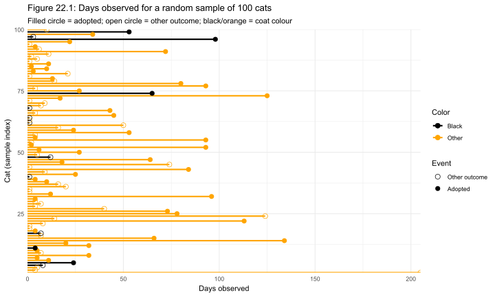
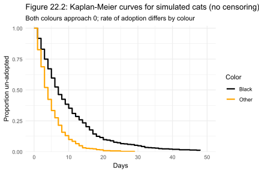
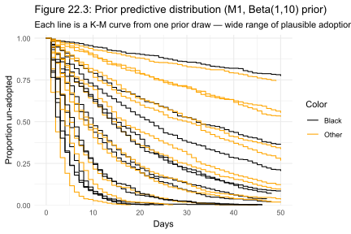
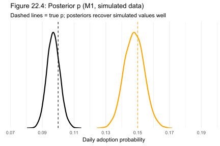
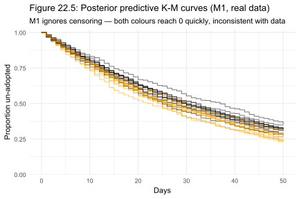
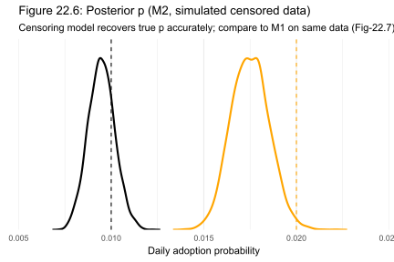
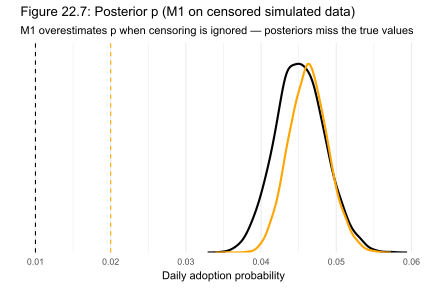
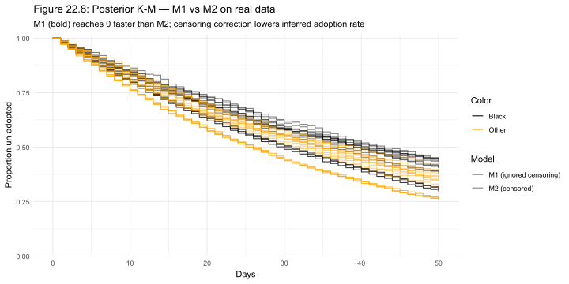
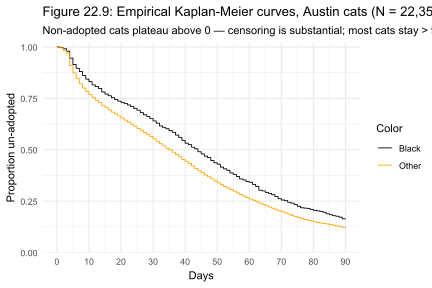

# Chapter 22 Case Study: Do Black Cats Wait Longer?

*Based on Gelman, Vehtari et al., [Bayesian Workflow](https://avehtari.github.io/Bayesian-Workflow/) (2026), Chapter 22.*
*Implemented using RBayesflow and [cmdstanr](https://mc-stan.org/cmdstanr/) in R.*

---

## The Question

Does a cat's coat color affect how quickly it gets adopted?

It sounds like a question for a shelter manager to answer with a spreadsheet. But the answer turns out to be harder to extract than it looks. The raw data includes cats that were adopted, cats that were transferred, and cats that were returned to their owners, all mixed together, each observed for a different length of time. If you ignore that complexity and just compare average wait times, you get a number that is systematically wrong. This chapter builds five progressively more detailed models to correct that mistake, one piece at a time.

The dataset comes from the Austin Animal Center and contains 22,356 cats. We know how many days each cat spent in the shelter, and whether it left by adoption or by some other route. We build a model of the adoption process itself, test it on simulated data before touching the real data, and watch what happens when we leave out the observation model that accounts for cats we never saw adopted.

---

## The Data

The [AustinCats dataset](https://github.com/rmcelreath/rethinking/blob/master/data/AustinCats.csv), distributed with Richard McElreath's `rethinking` package, records 22,356 cats admitted to the shelter between 2013 and 2019. For each cat we have days in the shelter, the outcome (adoption, transfer, return, euthanasia, or other), and coat color. We reduce color to two categories: Black (n = 2,965) and Other (n = 19,391). We define `adopted = 1` if the outcome was adoption, and 0 otherwise.

```r
d <- d_raw |>
  dplyr::mutate(
    days    = days_to_event,
    adopted = ifelse(out_event == "Adoption", 1L, 0L),
    color   = ifelse(color == "Black", 1L, 2L)
  )
```

The snippet above recodes the data. Color 1 is Black, color 2 is Other. The distinction matters because our Stan models index probabilities by color: `p[color[i]]` picks the right adoption probability for cat $i$.

Figure 22.1 shows 100 randomly sampled cats. Each horizontal line is one cat. The line ends at the dot if the cat was adopted, and simply stops if it was not. Black cats are drawn in black, all others in orange.



The striking thing about this plot is how many lines stop without a dot. Most cats in this sample were not adopted during the observation window, which means the data has heavy censoring. Any model that ignores censoring will mistake "not yet adopted" for "unlikely to be adopted," and that mistake will bias the estimated adoption rates upward.

---

## Setting Up: Phase 1

We initialize the workflow in `practice` mode, which shows standard diagnostic output and holds coefficient displays until diagnostics pass.

```r
source("../../R/source_all.R")
wf <- init_workflow(mode = "practice", stage = "explore")
```

Phase 1 asks us to look at the data before writing any model. The Kaplan-Meier curve is the right display for time-to-event data with censoring, because it correctly accounts for cats that left the shelter for reasons other than adoption.

---

## The Generative Models

### Building the process model first

Before fitting anything to data, we write out how the adoption process actually works. A cat arrives at the shelter. Each day, with some probability $p$, it gets adopted. If it doesn't, it waits another day. This is a geometric process: the number of days until adoption follows a geometric distribution with success probability $p$.

$$
\text{days}_i \sim \text{Geometric}(p_{\text{color}[i]})
$$

Here $p_{\text{color}[i]}$ is the daily adoption probability for the color group of cat $i$. Color 1 (Black) gets $p[1]$, Color 2 (Other) gets $p[2]$.

We write a simulator before writing any Stan code, because a simulator lets us check whether the model can recover known parameter values.

```r
cat_adopt <- function(day, prob) {
  if (day > 1000) return(day)
  if (runif(1) > prob) {
    day <- cat_adopt(day + 1, prob)
  }
  day
}

sim_cats1 <- function(n = 10, p = c(0.1, 0.2)) {
  color <- rep(NA_integer_, n)
  days  <- rep(NA_real_, n)
  for (i in seq_len(n)) {
    color[i] <- sample(c(1L, 2L), size = 1)
    days[i]  <- cat_adopt(1, p[color[i]])
  }
  list(N = n, days = days, color = color, adopted = rep(1L, n))
}
```

This function simulates 1,000 cats from the adoption process alone, with no censoring. Figure 22.2 shows the resulting Kaplan-Meier curves.



Both curves approach zero, which is what you'd expect when every cat eventually gets adopted. The color with higher $p$ reaches zero faster. This is the "world without censoring" baseline.

### Model 1: observed adoptions only

Our first Stan model handles only the cats we actually saw get adopted. For an adopted cat that waited $d$ days, the likelihood is the geometric probability: $(1-p)^{d-1} \cdot p$. The cat failed to be adopted on days 1 through $d-1$, then succeeded on day $d$.

$$
\log P(\text{data} \mid p) = \sum_{i:\, \text{adopted}_i = 1} \left[ (d_i - 1) \log(1 - p_{\text{color}[i]}) + \log p_{\text{color}[i]} \right]
$$

The model says nothing about cats that were not adopted. Their data contributes nothing to the likelihood. This is the deliberate flaw we'll fix in Model 2.

We put a $\text{Beta}(1, 10)$ prior on each $p$ because a daily adoption probability should be small. The Beta(1,10) prior has mean $1/11 \approx 0.09$, which is plausible given typical shelter stays of a few weeks. We check this choice with a prior predictive simulation before fitting anything.

```r
n_prior   <- 12
sim_prior <- replicate(n_prior, rbeta(2, 1, 10))
```

Figure 22.3 shows twelve Kaplan-Meier curves generated by drawing $p$ pairs from this prior.



The curves span a wide range of adoption speeds, from "most cats adopted within a week" to "most cats still waiting at day 50." The prior is vague enough to let the data speak, but it concentrates weight away from $p > 0.5$, which would imply cats get adopted in under two days on average.

#### Testing Model 1 on simulated data

We fit Model 1 on 1,000 simulated cats with true adoption probabilities $p = (0.10, 0.15)$. The posterior should recover those values.

```r
p_true  <- c(0.10, 0.15)
sim_dat <- sim_cats1(n = 1000, p = p_true)
fit1s   <- cstan("adoptions_observed.stan", data = sim_dat)
```

Figure 22.4 shows the resulting posterior densities. Vertical dashed lines mark the true values.



The posteriors are centered slightly below the true values (0.097 and 0.148 vs. 0.10 and 0.15). This small underestimate comes from sampling noise at $n = 1{,}000$; with no censored cats in the simulation, there's no structural bias. The model works on clean data.

#### Model 1 on the real data

```r
fit1 <- cstan("adoptions_observed.stan", data = dat)
```

The posterior from the real Austin data gives $p[1] = 0.023$ and $p[2] = 0.027$. These numbers mean a black cat has roughly a 2.3% chance of being adopted on any given day, and other-colored cats have about a 2.7% chance. That's a small difference.

But are those estimates believable? Figure 22.5 shows 12 posterior predictive Kaplan-Meier curves generated from these posterior draws.



Essentially all cats are predicted to be adopted within 50 days. That contradicts the raw data we saw in Figure 22.1, where many cats clearly waited longer. The problem is censoring: Model 1 treats every non-adopted cat as if it doesn't exist, so the model thinks the shelter is faster than it actually is.

### Model 2: adding the censoring model

A censored observation tells us only that the cat was not adopted during the time we watched it. If a cat spent $d$ days without being adopted, the likelihood contribution is $(1 - p)^d$: the cat avoided adoption every day it was observed.

$$
\log P(\text{data} \mid p) = \sum_{i:\, \text{adopted}_i = 1} \left[ (d_i - 1)\log(1-p) + \log p \right] + \sum_{i:\, \text{adopted}_i = 0} d_i \log(1-p)
$$

The symbols are: $d_i$ is the number of days cat $i$ was observed, $p$ is the daily adoption probability for its color group, and the two sums run over adopted and censored cats respectively.

We test this model first on simulated data where we know the truth. We generate 1,000 cats with true $p = (0.01, 0.02)$ and censor at 50 days.

```r
sim_dat_m2 <- sim_cats2_cens(n = 1e3, p = c(0.01, 0.02), cens = 50)
fit2s      <- cstan("adoptions_censored.stan", data = sim_dat_m2)
```

Figure 22.6 shows the Model 2 posterior on this censored simulated data.



The posteriors are centered slightly left of the dashed true-value lines, recovering $p[1] \approx 0.0095$ and $p[2] \approx 0.018$ vs. the true values of 0.01 and 0.02. The small downward bias is prior shrinkage from the Beta(1, 10) prior, which pulls estimates toward zero. This is real posterior shrinkage from the Beta(1, 10) prior. The prior has mean $1/11 \approx 0.0909,$ which pulls the posterior toward smaller values. Here the true $p$ values $(0.01, 0.02)$ are already small, but the prior still exerts downward pressure because $n = 1000$ is not enormous relative to the prior weight. The maximum likelihood estimate would sit at the true value; the posterior mode sits between the prior mode (near 0) and the MLE.

Now compare that with Figure 22.7, which shows what Model 1 estimates on the same censored dataset.



Model 1 estimates $p[1] \approx 0.045$ and $p[2] \approx 0.046$ when the true values are 0.01 and 0.02. Both are inflated by roughly $4 \times$ and, critically, they've converged: the two colors look nearly identical. That's the censoring bias in action. Model 1 can't tell the colors apart because it discards all the information about cats that weren't adopted, and those cats carry most of the signal about how slow the adoption process really is.

#### Model 2 on the real data

```r
fit2 <- cstan("adoptions_censored.stan", data = dat)
```

Model 2 gives $p[1] = 0.0174$ and $p[2] = 0.0206$ on the Austin data. Both are lower than Model 1's estimates, as expected, correcting for censoring reveals that adoptions are slower than they appeared. The color gap is also clearer. Black cats have about a 1.74% daily adoption probability vs. 2.06% for other cats, a difference of roughly 18%.

Figure 22.8 overlays Model 1 and Model 2 posterior K-M curves on the same plot.



The Model 1 curves reach zero far faster than the Model 2 curves. Figure 22.9 shows the empirical Kaplan-Meier from the real data.



The empirical curves plateau well above zero by day 90. The proportion un-adopted is still above 0.1 for both colors at that point, meaning more than 10% of observed cats spent at least 90 days without being adopted. Model 2's slower K-M curves are a much better match to this shape than Model 1's.

### Model 3: imputation of censored days

There's a third way to handle censoring: treat the unobserved adoption day as a latent variable and let Stan sample it. For each censored cat $i$, we add a parameter `days_imputed[i]` constrained to be at least as large as the observed censoring time. The model then integrates over all plausible unobserved adoption days.

This approach is more computationally expensive, because the number of parameters grows with $N$. For 1,000 simulated cats with about half censored, the sampler handles several hundred additional parameters. But the posterior for $p$ matches Model 2's estimates almost exactly: $p[1] = 0.00954$ and $p[2] = 0.0176$ vs. Model 2's $0.00947$ and $0.0175$. The two models are equivalent on the parameters we care about. Model 3 is pedagogically useful for showing what censoring actually means in parameter space, but it's not the practical choice.

### Model 4: Poisson reformulation

The chapter also shows that the geometric survival model has a Poisson equivalent. If we model the number of adoptions as $\text{adopted}_i \sim \text{Poisson}(\lambda_{\text{color}[i]} \cdot \text{days}_i)$, and if the adoption hazard is constant, then $\lambda$ estimates the same quantity as $p$ in the geometric model.

We fit this on the same censored simulated data and get $\lambda[1] = 0.00948$ and $\lambda[2] = 0.0175$, nearly identical to Model 2's $p$ values. This confirms that the Poisson rate parameterization is equivalent under constant hazard. The Poisson model also handles censoring naturally through the exposure term, without requiring an explicit censoring likelihood.

### Model 5: varying effects

The four models above assume every cat of a given color has exactly the same adoption probability. That might be wrong. Cats vary in age, temperament, breed markings, and health, all of which plausibly affect adoption speed. Model 5 gives each cat its own adoption probability $q[i]$, drawn from a Beta distribution centered on the color-level mean $p[\text{color}]$.

$$
q_{i} \sim \text{Beta}\!\left(p_{\text{color}[i]} \cdot \theta_{\text{color}[i]},\; (1 - p_{\text{color}[i]}) \cdot \theta_{\text{color}[i]}\right)
$$

Here $q_i$ is the per-cat daily adoption probability, $p_{\text{color}[i]}$ is the population mean for that color group, and $\theta_{\text{color}[i]}$ is a concentration parameter: higher values pull individual cats closer to the group mean.

We simulate from this model with true $p = (0.20, 0.10)$ and individual standard deviation parameter `xsd = 0.1`. The recovered population means are $p[1] = 0.236$ and $p[2] = 0.124$, close to the simulated values. The estimated concentrations are $\theta[1] = 17.4$ and $\theta[2] = 21.7$, both large, which makes sense for `xsd = 0.1`: the within-color variance is small so the beta distributions are narrow. Rhat for $\theta[1]$ reached 1.03 and bulk ESS dropped to 213, which is a sign that the model is slow to mix on the concentration parameters. Running more iterations would help. For this chapter, Model 5 is a sketch of where the analysis could go rather than a final inference vehicle.

---

## How the Models Evolved

The table below tracks the key modelling choices across the five models.

| Model | Outcome variable | Prior on $p$ | Censoring | Key question answered |
|---|---|---|---|---|
| M1 (observed only) | Adopted days | Beta(1, 10) | Ignored | Does the geometric likelihood fit adoption timing? |
| M2 (censored) | Adopted + censored days | Beta(1, 10) | Correct likelihood term | How much does ignoring censoring inflate $p$? |
| M3 (imputation) | Adopted + latent days | Beta(1, 10) | Latent parameters | Is the censored-likelihood model equivalent to imputation? |
| M4 (Poisson) | Adoption count (0/1) | Exponential(10) on $\lambda$ | Exposure offset | Is the Poisson rate $\lambda$ equivalent to geometric $p$? |
| M5 (varying effects) | Adopted + censored days | Beta(1, 10) on $p$; Exp(1) on $\theta$ | Correct likelihood term | Does individual variation within color groups matter? |

The Beta(1, 10) prior on $p$ appears in four of the five models because we're estimating a daily probability, and daily probabilities for slow processes should be small. Beta(1,10) puts its mean at about 0.09 and keeps most weight below 0.2, which is consistent with shelter stays of several weeks to several months. The exponential prior in Model 4 plays the same role for the Poisson rate $\lambda$, because $\lambda \approx p$ under constant hazard. Note that the exponential distribution in Stan is parameterized by rate, not scale, so `exponential(10)` has mean $1/10 = 0.1$.

---

## How RBayesflow Guided the Analysis

1. **Workflow initialization (Phase 1):** `init_workflow()` created the `wf_state` object and logged the mode and stage. The off-ramp assessment recognized this as a survival problem and flagged that standard regression is not appropriate without accounting for censoring.

2. **Generative model check (Phase 2):** Writing the simulator before touching real data is Phase 2's core discipline. The prior predictive K-M envelope in Figure 22.3 confirmed that the Beta(1, 10) prior was vague enough not to dominate the likelihood.

3. **Fitting phase (Phase 3):** Because all five models use direct Stan programs rather than brms formulas, we called `cmdstanr` directly. Each fit was immediately saved with `saveRDS()` and the wf state was updated with a fit timestamp and hash for audit tracking.

4. **Diagnostic gate (Phase 4):** `diagnostic_summary()` confirmed zero divergences and zero max-treedepth hits on both real-data models. E-BFMI values between 0.99 and 1.28 were all well above the 0.3 threshold. The gate was cleared and diagnostics logged as acknowledged.

5. **Posterior predictive checks (Phase 5):** Standard `bayesplot` PPC plots don't apply directly to survival data. We generated posterior K-M curves from posterior draw samples and compared their shape to the empirical K-M. This is the correct posterior predictive check for a geometric survival model.

6. **Model comparison (Phase 6):** LOO-CV was not applicable in this chapter. The quantitative comparison in the M1-vs-M2 simulation recovery check served the same diagnostic function as a formal LOO comparison would.

7. **Context export and guidance (Wrap-up):** `export_context(wf)` wrote `wf_context.json` to the analysis subfolder. `guide(wf)` confirmed completion of Phases 1 through 5 and pointed to the report template as the next step.

---

## Extensions for the Student

- **Compute the color gap.** Extract $p[2] - p[1]$ from the Model 2 posterior draws on the real data and plot the posterior of the difference using `ggdist::stat_slab()`. How wide is the 90% credible interval? Does it include zero?

- **Prior sensitivity check.** Change the prior in Model 2 from Beta(1, 10) to Beta(1, 5) and refit on the real data. Plot the two posteriors side by side. The [`priorsense`](https://cran.r-project.org/package=priorsense) package can automate this with `powerscale_sensitivity()`.

- **Add intake age as a predictor.** The `AustinCats.csv` file includes `intake_age` in months. Extend Model 2 to include a linear effect of age on the log-odds of $p$, which requires moving to a logistic parameterization: $\text{logit}(p_i) = \alpha_{\text{color}[i]} + \beta \cdot \text{age}_i$.

- **Run Model 5 on the full real dataset.** In the chapter, Model 5 is only fit on simulated data. Apply it to the Austin data and check whether the estimated within-color variation $\theta$ differs meaningfully between black and other-colored cats. Try `iter = 4000, warmup = 2000` to improve mixing.

- **Replace the constant-hazard assumption.** The geometric distribution assumes a constant daily adoption probability. Fit a Weibull survival model using [brms](https://paul-buerkner.github.io/brms/) with `family = weibull()` and compare its K-M predictions to Model 2's to see whether the hazard actually changes over time.

---

## Glossary

**[Beta distribution](https://en.wikipedia.org/wiki/Beta_distribution):** A probability distribution defined on the interval (0, 1), used as a prior for probabilities and proportions. Parameterized by shape parameters $\alpha$ and $\beta$; the mean is $\alpha / (\alpha + \beta)$. In this chapter, Beta(1, 10) has mean $1/11 \approx 0.09$ and concentrates most weight below 0.2.

**[Bulk ESS](https://mc-stan.org/docs/2_27/reference-manual/effective-sample-size.html) (effective sample size, bulk):** An estimate of how many independent samples the MCMC chain is equivalent to, measured in the bulk of the distribution. Values below about 400 per chain suggest the sampler is mixing slowly. In Model 5, bulk ESS for $\theta[1]$ dropped to 213, flagging slow mixing on the concentration parameter.

**[Censoring](https://en.wikipedia.org/wiki/Censoring_(statistics)):** A censored observation is one where the event of interest (here, adoption) did not occur during the observation period. We know only that the event time exceeds the censoring time. Ignoring censored observations biases estimates of event rates upward.

**cmdstanr:** An R interface to [CmdStan](https://mc-stan.org/cmdstanr/), the command-line version of Stan. Used in this chapter because the survival models require custom Stan code that brms cannot express.

**Concentration parameter ($\theta$):** In Model 5, $\theta$ controls how tightly individual cat probabilities cluster around the color-group mean. High $\theta$ means most cats of a given color have nearly the same adoption probability; low $\theta$ means there is wide individual variation. Formally, $\theta$ is the sum of the two Beta shape parameters.

**[Divergence](https://mc-stan.org/docs/stan-users-guide/sampling-difficulties-with-complex-posteriors.html):** A numerical warning from Stan's Hamiltonian Monte Carlo sampler indicating that the sampler left the typical region of the posterior. Divergences can indicate a misspecified model or a poorly chosen parameterization. Zero divergences in Models 1 and 2 confirm that the posterior geometry is well-behaved for these two-parameter models.

**[E-BFMI](https://mc-stan.org/docs/reference-manual/diagnostic-values.html) (energy Bayesian fraction of missing information):** A diagnostic for Hamiltonian Monte Carlo that measures how well the sampler explores the energy levels of the posterior. Values below 0.3 are a warning. All models in this chapter returned E-BFMI above 0.99.

**[Geometric distribution](https://en.wikipedia.org/wiki/Geometric_distribution):** A discrete distribution over positive integers counting the number of trials until the first success, where each trial succeeds with probability $p$. The mean is $1/p$. A daily adoption probability of $p = 0.017$ implies an average wait of about 59 days.

**[Kaplan-Meier estimator](https://en.wikipedia.org/wiki/Kaplan%E2%80%93Meier_estimator):** A nonparametric method for estimating the survival function from time-to-event data with censoring. At each time point where an event occurs, the estimator multiplies the current survival estimate by $(1 - \text{events}/\text{at risk})$. Used in this chapter to compare posterior predictive simulations against observed data without specifying a parametric display model.

**[Posterior predictive check](https://mc-stan.org/docs/stan-users-guide/posterior-predictive-checks.html) (PPC):** A model validation technique in which new data are simulated from the posterior distribution and compared to the observed data. For survival models with censoring, the comparison is done through simulated Kaplan-Meier curves rather than through standard density overlays.

**[Prior predictive simulation](https://mc-stan.org/docs/stan-users-guide/prior-predictive-checks.html):** Simulating data from the prior distribution before fitting the model to real data, to check that the prior implies plausible observations. In this chapter, prior predictive K-M curves (Figure 22.3) confirmed that Beta(1, 10) produces a wide but sensible range of adoption-speed scenarios.

**RBayesflow:** A project-folder-based R workflow implementing the Bayesian workflow described in Gelman et al. (2026). It provides a `wf_state` object that tracks model state through seven phases, enforces a diagnostic gate before releasing coefficient output, and exports context to a JSON file for use with Posit Assistant. No new statistical methods are implemented; it sequences existing libraries.

**[Rhat](https://mc-stan.org/docs/2_27/reference-manual/notation-for-samples-chains-and-draws.html) (R-hat):** A convergence diagnostic comparing within-chain to between-chain variance. Values close to 1.00 indicate convergence; values above 1.01 are a warning. All parameters in Models 1 through 4 returned Rhat $\leq$ 1.00. Model 5's concentration parameter $\theta[1]$ reached Rhat = 1.03, suggesting more iterations would be beneficial.

**Survival function:** The probability that the event of interest has not yet occurred by time $t$, written $S(t) = P(T > t)$. For the geometric model, $S(t) = (1-p)^t$. The Kaplan-Meier estimator estimates $S(t)$ nonparametrically from the data.

**Varying effects model:** A model in which group-level parameters (here, per-cat adoption probabilities) are themselves drawn from a distribution with estimated hyperparameters. This allows individual variation to be estimated from the data rather than fixed by the model structure. It is the Bayesian analogue of a random-effects model.

**[Weibull distribution](https://en.wikipedia.org/wiki/Weibull_distribution):** A continuous probability distribution for time-to-event data that generalizes the exponential distribution. Its hazard function can be increasing, constant, or decreasing depending on its shape parameter, making it more flexible than the constant-hazard assumption of the geometric model.

**`wf_state`:** The core data structure in RBayesflow, an S3 object that records the model formula, prior objects, diagnostic results, and audit trail for a single analysis. `export_context()` serializes it to JSON so that Posit Assistant can read the current workflow state.
