# Chapter 23 Case Study: Debugging a Model — World Cup Football

*Based on [Gelman, Vehtari et al., Bayesian Workflow (2026)](https://avehtari.github.io/Bayesian-Workflow/world_cup/world_cup.html), Chapter 23.*
*Implemented using RBayesflow and [cmdstanr](https://mc-stan.org/cmdstanr/) in R.*

---

## The Question

How do you know when your model is lying to you?

Chapter 23 doesn't introduce a new model family or a clever prior scheme. It shows what happens when a model's MCMC diagnostics are completely clean, its posteriors look plausible at first glance, and the underlying estimates are still wrong. The bug here is a missing factor of 2 in a data transformation. The fix is one line of code. And the thing that exposes it isn't Rhat or divergence counts; it's posterior retrodiction, checking whether the model can reproduce the data it was trained on.

We build eight distinct models for the 64 matches of the 2014 FIFA World Cup, starting with a broken continuous model and ending with naturally discrete Poisson models. Each stage exposes something about the gap between "the sampler ran fine" and "the model is right."

---

## The Data

The dataset has two components. The first is a table of all 64 match results from the 2014 World Cup: which two teams played and how many goals each scored. The second is FiveThirtyEight's [Soccer Power Index](https://projects.fivethirtyeight.com/soccer-predictions/) rankings from a month before the tournament, which placed all 32 teams on a scale from 1 (Australia, weakest) to 32 (Brazil, strongest). We rescale those rankings to have mean 0 and standard deviation 0.5, so the prior scores run from about $-0.83$ to $+0.83$.

We load both files and build a Stan data list:

```r
powerindex <- readr::read_csv("data/soccerpowerindex.csv") |>
  dplyr::mutate(prior_score = as.vector(scale(rev(index)) / 2))

worldcup2014 <- readr::read_csv("data/worldcup2014.csv") |>
  dplyr::mutate(
    team_1 = match(team1, powerindex$team),
    team_2 = match(team2, powerindex$team)
  )

stan_data <- list(
  N_teams     = 32,
  N_games     = 64,
  team_1      = worldcup2014$team_1,
  score_1     = worldcup2014$score1,
  team_2      = worldcup2014$team_2,
  score_2     = worldcup2014$score2,
  prior_score = powerindex$prior_score,
  df          = 7
)
```

The key variables are the score differential for each match, positive when team 1 wins, and the prior score for each team, which serves as an informative starting point for estimating team ability.

---

## Setting Up: Phase 1

We initialize an RBayesflow workflow in `practice` mode and run the Phase 1 off-ramp assessment. Modeling a continuous outcome (score differential) with 64 observations and a clear goal of estimating team ability, the workflow offers three options: a t-test plus effect size, a bootstrapped linear model, or a full Bayesian fit. We choose the full Bayesian path and log the decision.

```r
wf <- init_workflow(mode = "practice", stage = "explore")

offramps <- assess_offramps(
  data         = worldcup2014,
  outcome_var  = "score1",
  outcome_type = "continuous",
  goal         = "team ability estimation",
  n            = 64
)
```

All models in this chapter use [cmdstanr](https://mc-stan.org/cmdstanr/) directly rather than [brms](https://paul-buerkner.github.io/brms/), because the discrete likelihood models and the Jacobian-corrected sqrt models can't be expressed through brms formula interfaces. A thin `cstan()` helper wraps compilation and sampling:

```r
cstan <- function(stan_file, data = list(), seed = SEED, chains = 4,
                  iter_warmup = 1000, iter_sampling = 1000,
                  adapt_delta = 0.8) {
  model <- cmdstan_model(stan_file)
  model$sample(
    data            = data,
    seed            = seed,
    chains          = chains,
    parallel_chains = chains,
    iter_warmup     = iter_warmup,
    iter_sampling   = iter_sampling,
    adapt_delta     = adapt_delta,
    refresh         = 0
  )
}
```

---

## The Model Structure

All models in the first four sections share the same structural idea: each team $j$ has a latent ability parameter $a_j$, and the match outcome for game $i$ depends on the difference in ability between the two teams. The ability parameters are constructed as:
$$
a_j = b \cdot \text{prior\_score}_j + \sigma_a \cdot \alpha_j
$$

- $\text{prior\_score}_j$: the rescaled Soccer Power Index for team $j$, ranging from $-0.83$ to $+0.83$
- $b$: how much weight to give the pre-tournament ranking; estimated from the data
- $\sigma_a$: how much teams deviate from their rankings; estimated from the data
- $\alpha_j \sim \text{normal}(0, 1)$: standardized latent ability for team $j$

This is an [item-response model](https://en.wikipedia.org/wiki/Item_response_theory) in psychometrics terms. The prior score acts like a prior ability estimate, and the data updates it.

All priors are weakly informative: half-normals on the scale parameters and standard normals on the regression coefficients. We use $\text{normal}(0, 1)$ on $b$, $\alpha_j$, $\sigma_a$, and $\sigma_y$ throughout the continuous models, because the chapter's lesson comes from the data model and we want to keep priors out of the picture.

---

## The First Model: A Coding Bug

The first model applies a square root transformation to the score differential to compress large scorelines, then fits a Student-t likelihood on the transformed scale. If game $i$ has teams $j_1$ and $j_2$ scoring $z_1$ and $z_2$ goals, the data model is:
$$
\begin{aligned}
y_i &= \text{sign}(z_1 - z_2) \cdot \sqrt{|z_1 - z_2|} \\
y_i &\sim \text{t}_7(a_{j_1[i]} - a_{j_2[i]},\; \sigma_y)
\end{aligned}
$$

- $y_i$: signed square root of the score differential for game $i$
- $\nu = 7$: degrees of freedom for the Student-t, fixed to allow heavier tails than Gaussian without treating blowouts as completely uninformative
- $\sigma_y > 0$: residual scale on the sqrt-transformed outcome

The Stan code for the transformation contains the bug:

```r
# worldcup_first_try.stan — buggy version
transformed data {
  vector[N_games] dif = score_1 - score_2;
  vector[N_games] sqrt_dif;
  for (i in 1:N_games) {
    sqrt_dif[i] = (step(dif[i]) - 0.5) * sqrt(abs(dif[i]));
  }
}
```

The `step()` function returns 1 when `dif > 0` and 0 otherwise, so `step(dif[i]) - 0.5` gives $+0.5$ for a win and $-0.5$ for a loss. Multiplying by `sqrt(abs(dif))` gives the signed square root, but at half the intended scale. The correct formula needs a factor of 2, so that a one-goal win maps to $\sqrt{1} = 1$ on the transformed scale rather than $0.5 \cdot \sqrt{1} = 0.5$. That factor is missing.

We fit the model and check its posteriors:

```r
fit_1 <- cstan("worldcup_first_try.stan", data = stan_data)
fit_1$summary(c("b", "sigma_a", "sigma_y"))
```

```
  variable   mean  sd
  b         0.448 0.102
  sigma_a   0.164 0.0755
  sigma_y   0.422 0.0547
```

These look plausible. The Soccer Power Index gets moderate weight ($b \approx 0.45$), the team spread is modest ($\sigma_a \approx 0.16$), and the residual scale is small ($\sigma_y \approx 0.42$). Zero divergences, no treedepth issues, Rhat close to 1.0 throughout. Nothing looks wrong.

This is Figure 23.1.

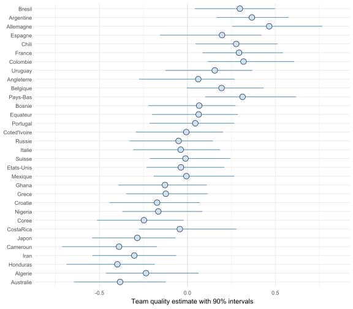

The 90% intervals for each team's ability run from roughly $-0.5$ to $+0.5$ on the x-axis, with most teams clustered near zero. Brazil, Argentina, and Germany sit at the top; Australia, Honduras, and Cameroon at the bottom. The spread looks reasonable and the rankings broadly match intuition. You'd never guess from this figure that anything is wrong.

### Checking the fit with retrodiction

The bug reveals itself once we generate replicated data and compare to observations. We refit the model with a `generated quantities` block that produces `y_rep_original_scale` by back-transforming the sqrt-scale predictions to goals. Figure 23.3 shows the result.

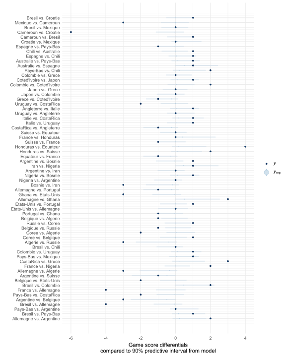

Every observed score differential (solid dots) sits comfortably inside absurdly wide predictive intervals. The x-axis runs from $-6$ to $+4$ goals, and the model's 90% intervals appear as broad horizontal bands spanning nearly that entire range for most matches. A model that can't be surprised by any outcome it sees isn't a useful model. The bug makes the model underconfident because `sigma_y` on the sqrt scale translates to a much larger spread on the original scale when the factor of 2 is missing.

---

## The Second Model: Dropping the Transformation

Before fixing the bug, we try removing the square root entirely, fitting a Student-t directly on the raw score differential:
$$
\text{dif}_i \sim \text{t}_7(a_{j_1[i]} - a_{j_2[i]},\; \sigma_y)
$$

```r
fit_2 <- cstan("worldcup_no_sqrt.stan", data = stan_data)
fit_2$summary(c("b", "sigma_a", "sigma_y"))
```

```
  variable   mean   sd
  b         1.114  0.275
  sigma_a   0.382  0.206
  sigma_y   1.285  0.154
```

The residual scale jumps to $\sigma_y \approx 1.3$ goals, which makes sense since we're now on the raw score scale. The ability spread grows to $\sigma_a \approx 0.38$. Figure 23.4 shows the updated team ability estimates.

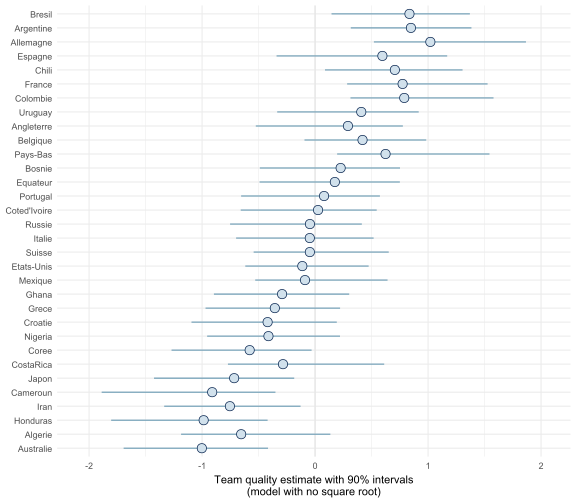

The team quality estimates span roughly $-2$ to $+2$ on the x-axis, wider than M1's $-0.5$ to $+0.5$. Germany's interval extends past $+1.5$, and Australia's extends below $-1.5$. The separation between strong and weak teams is more pronounced, and the intervals are wider, reflecting the heavier residual noise on the raw scale.

Figure 23.5 shows the retrodiction for M2.

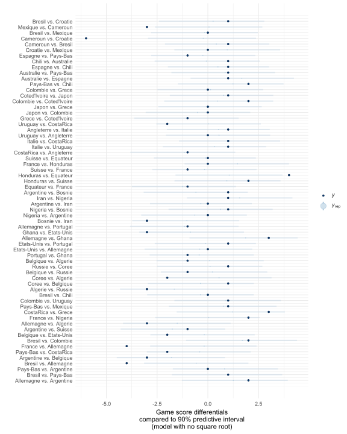

The predictive intervals are narrower than M1's but still span about $\pm 5$ goals for most matches. A handful of observed differentials sit near the edge of the intervals, including the Germany vs. Brazil semifinal. The model isn't dramatically miscalibrated, but operating on the raw scale throws away the natural compression that large margins provide.

---

## The Fixed Model: One Line of Code

The corrected sqrt transformation adds the missing factor of 2:

```r
# worldcup_fixed.stan — corrected version
for (i in 1:N_games){
  sqrt_dif[i] = 2 * (step(dif[i]) - 0.5) * sqrt(abs(dif[i]));
}
```

A one-goal win now maps to $2 \cdot 0.5 \cdot 1 = 1$ on the sqrt scale, a four-goal win to $2 \cdot 0.5 \cdot 2 = 2$, and so on. The transformation is antisymmetric and grows like $\sqrt{|\text{dif}|}$ in absolute value.

```r
fit_3 <- cstan("worldcup_fixed.stan", data = stan_data)
fit_3$summary(c("b", "sigma_a", "sigma_y"))
```

```
  variable   mean   sd
  b         0.870  0.203
  sigma_a   0.330  0.152
  sigma_y   0.838  0.105
```

The Power Index weight climbs to $b \approx 0.87$, the team spread to $\sigma_a \approx 0.33$, and the residual scale to $\sigma_y \approx 0.84$ on the sqrt scale. Figure 23.6 shows the corrected team ability estimates.

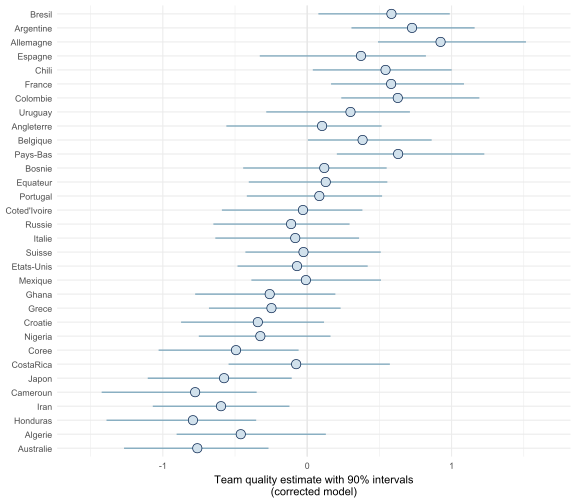

The corrected model's ability estimates span roughly $-1.5$ to $+1.5$, with Germany's interval reaching past $+1$ and Australia's well below $-1$. Compared to M1, the spread is wider and the intervals are longer, which is more physically plausible: we'd expect the actual gap between the best and worst World Cup teams to be larger than a tenth of a goal on a sqrt scale. The Power Index carries more weight here because the corrected transformation gives the data more dynamic range to work with.

Figure 23.7 shows the retrodiction for M3.

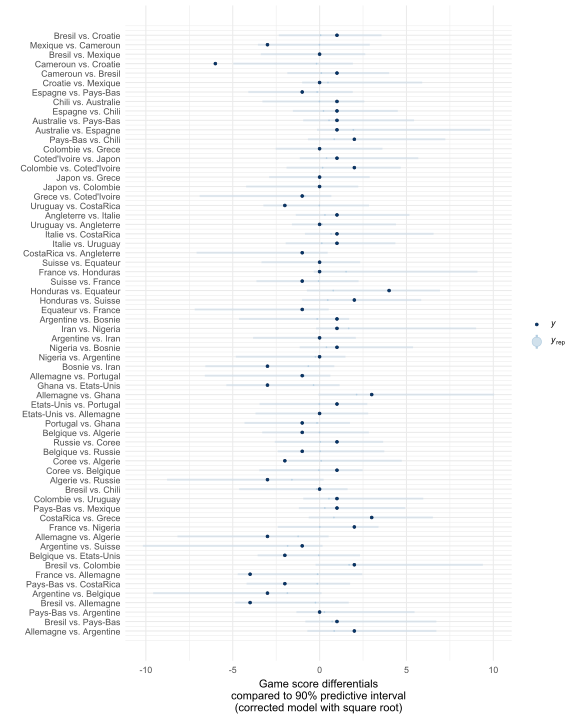

The x-axis now runs to $\pm 10$ goals on the back-transformed scale, because `sigma_y` $\approx 0.84$ on the sqrt scale corresponds to roughly $0.84^2 \approx 0.7$ goals at the low end but much larger values for big differentials. Most observed results (solid dots) sit well within the predictive intervals, and the intervals are considerably narrower than in Figure 23.3 for typical matches. The model can now be surprised.

We also fit M3 with the Power Index removed (fixing $b = 0$) to see how much the pre-tournament rankings matter. Figure 23.2 shows that fit.

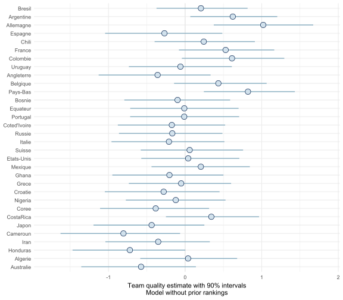

Without the Power Index, the intervals widen substantially for most teams and some surprising teams get high ability estimates. Costa Rica's interval extends to about $+1$, reflecting their unexpected run to the quarterfinals. When the rankings are absent, the model has to infer everything from 64 match results alone, and with only 2 or 3 games per team there's not much to go on.

---

## Discrete Models and LOO-CV

Score differentials are integers. Fitting a continuous model and then back-transforming is workable, but it ignores that. The rest of the chapter explores discrete likelihoods.

### Why discrete models need a different log-likelihood

When the outcome is an integer, the likelihood of observing score differential $d$ under a continuous model is an approximation. For a discrete model, we want the probability of observing exactly $d$, which is the integral of the continuous density over the interval $[d - 0.5, d + 0.5]$:
$$
P(Y_i = d) = \int_{d - 0.5}^{d + 0.5} f(z) \, dz
$$
In Stan, this becomes:

```stan
target += log_diff_exp(
  normal_lcdf(dif[n]+0.5 | a[team_1[n]] - a[team_2[n]], sigma_z),
  normal_lcdf(dif[n]-0.5 | a[team_1[n]] - a[team_2[n]], sigma_z)
);
```

Here `log_diff_exp(log(A), log(B))` computes `log(A - B)` stably, and the difference of two normal CDFs gives the probability of a normal draw falling in the interval $[d - 0.5, d + 0.5]$.

### Comparing four discrete model variants

We fit four discrete models, each using the same midpoint-interval log-likelihood but varying what information they include:

| Model | Description |
|---|---|
| M-discr | Hierarchical, power score included ($b$ estimated) |
| M-discr-poweronly | Power score only, no per-team ability ($\sigma_a = 0$) |
| M-discr-nopower | Hierarchical, no power score ($b = 0$) |
| M-discr-pool | Pooled: single mean, no team effects |

We also fit `M-discr-z`, which samples the latent continuous score $z$ explicitly rather than integrating it out. That version can't be used for LOO-CV reliably because the latent per-game parameters interact with the leave-one-out approximation, but it's useful as a sanity check.

The baseline discrete model (M-discr) recovers the expected parameters closely: $b \approx 1.06$, $\sigma_a \approx 0.51$, $\sigma_z \approx 1.49$.

The LOO-CV comparison for the four variants looks like this:

| Model | elpd_diff | se_diff |
|---|---|---|
| Hier. with power score | 0.0 | 0.0 |
| Power score only | -1.4 | 1.7 |
| Hier. without power score | -3.7 | 2.6 |
| Pooled | -8.4 | 3.4 |

The hierarchical model with both components is best, but only marginally over the power-score-only model: $\Delta\text{elpd} = -1.4$ with standard error 1.7 is well within sampling noise. The pooled model is clearly worse at $-8.4$. The book's interpretation holds: the Power Index and the match results carry similar information, so using both only helps a little.

---

## Comparing Continuous and Discrete Models

Does it actually matter whether we use a continuous or discrete likelihood? We fit two additional continuous models to check:

- **M-cont-midp**: continuous normal likelihood on the raw integer differential, using `normal_lpdf` (equivalent to evaluating the density at the midpoint rather than integrating)
- **M-cont**: the same model, but with `log_diff_exp` using a normal CDF for the exact discrete log-probability

```r
loo_compare(list(
  "Discrete model"               = loo_discr,
  "Continuous + midpoint log_lik" = loo_cont_midp,
  "Continuous model"             = loo_cont
))
```

```
                         model elpd_diff se_diff
              Continuous model       0.0     0.0
 Continuous + midpoint log_lik      -0.6     0.4
                Discrete model      -0.8     0.5
```

The differences are tiny and well within Monte Carlo variation. With 64 data points and integer outcomes in the range $[-7, +7]$, the approximation error from using a midpoint rule is negligible.

---

## The Square Root Models and the Jacobian

There's a subtlety when comparing the sqrt-transformed models to the raw-scale models via LOO-CV. The sqrt transformation changes the volume of the outcome space, which means the log-likelihood values aren't on the same scale unless we account for the [Jacobian](https://en.wikipedia.org/wiki/Jacobian_matrix_and_determinant) of the transformation.

For the transformation $y = \text{sign}(d) \cdot 2 \sqrt{|d|}$, the Jacobian is $|dy/dd| = 1/\sqrt{|d|}$ (ignoring the zero case), so:

$$
\log p(d) = \log p(y) - \frac{1}{2}\log|d| - \log 2
$$
When we ignore the Jacobian and compare the sqrt model to the discrete model using `normal_lpdf` on the sqrt scale, we get a misleading result: the sqrt model looks much better because it assigns high density to small sqrt-scale residuals that correspond to large differentials. Including the Jacobian reverses the ranking:

| Comparison | elpd_diff (without Jacobian) | elpd_diff (with Jacobian) |
|---|---|---|
| Discrete vs. Cont-sqrt-midp | -32.6 | n/a |
| Discrete vs. Cont-sqrt+Jacobian | n/a | 0.0 (discrete wins) |
| Cont-sqrt vs. Discrete | n/a | -7.2 |

Without accounting for the Jacobian, the sqrt model falsely appears to be 32.6 elpd points better. With the correct accounting, the discrete model wins by 7.2 points.

---

## Calibration: LOO-PIT Checks

The [LOO-PIT](https://mc-stan.org/loo/reference/loo-glossary.html) (probability integral transform under leave-one-out cross-validation) is a calibration check: if the model is well-calibrated, the PIT values should be roughly uniform, and the empirical CDF should track the diagonal.

Figure 23.8 shows the LOO-PIT for the discrete model.

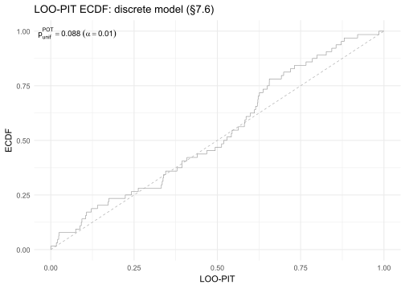

The ECDF tracks the diagonal closely throughout, with a test statistic $p_{\text{unif}} = 0.088$ at the 1% level. There are small deviations in the upper half of the distribution, where the ECDF runs slightly above the diagonal, but nothing that would worry us with only 64 observations.

The continuous sqrt model (with Jacobian) looks quite different. Figure 23.9 shows its LOO-PIT.

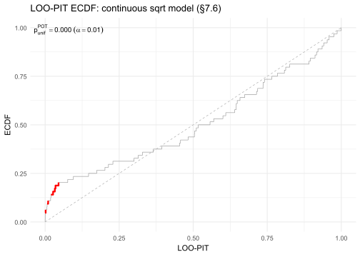

A cluster of red steps appears in the lower-left corner near PIT values of 0 to 0.1, with $p_{\text{unif}} = 0.000$. The ECDF rises steeply early and then runs below the diagonal across the rest of its range. The model assigns too much probability mass to the left tail of its predictive distribution, frequently predicting that a match result would be extreme when it isn't. The discrete model avoids this because the probability-of-interval formulation automatically handles the discreteness of the data.

---

## Poisson Models

The most natural likelihood for football goals is a [Poisson distribution](https://en.wikipedia.org/wiki/Poisson_distribution): goals are discrete, non-negative, and roughly independent within a match. The chapter's final section fits two Poisson-based models.

### Bivariate Poisson

The [bivariate Poisson model](https://doi.org/10.1111/1467-9884.00366) fits both teams' scores jointly, with a correlation parameter $\lambda_3$ that captures the tendency for both teams to score more in the same match (open, attacking games). Each team has separate attack ($o_j$) and defence ($d_j$) parameters:

$$
\text{score}_{1,i} \sim \text{BivariatePoisson}(e^{a + o_{j_1} + d_{j_2}},\; e^{a + o_{j_2} + d_{j_1}},\; \lambda_3)
$$
The bivariate Poisson log-likelihood involves a sum over the minimum of the two scores, which makes it more expensive to compute than the simpler models. We use `adapt_delta = 0.95` because the correlation parameter `c = log(lambda_3)` has a very wide prior (`normal(-1.5, 20)`) that can cause geometry problems.

```r
fit_bipois <- cstan("worldcup_bivariate_poisson.stan",
                    data         = stan_data_int_scores,
                    adapt_delta  = 0.95)
fit_bipois$summary(c("b_o", "b_d", "sigma_o", "sigma_d"))
```

```
  variable   mean
  b_o       0.517
  b_d      -0.441
  sigma_o   0.180
  sigma_d   0.281
```

The Power Index predicts attack positively ($b_o \approx 0.52$) and defence negatively ($b_d \approx -0.44$), which makes sense: better-ranked teams both score more and concede less. There were 2 divergences in this fit, expected given the wide prior on the correlation parameter.

### Poisson difference

The Poisson difference model works directly on score differentials. If $\lambda_1$ and $\lambda_2$ are the expected goal rates for the two teams, the log-likelihood of a difference $d = \text{score}_1 - \text{score}_2$ is:

$$
\log p(d) = -(\lambda_1 + \lambda_2) + \frac{d}{2}\log\frac{\lambda_1}{\lambda_2} + \log I_{|d|}(2\sqrt{\lambda_1\lambda_2})
$$
where $I_n$ is the [modified Bessel function of the first kind](https://en.wikipedia.org/wiki/Bessel_function#Modified_Bessel_functions), which Stan provides as `modified_bessel_first_kind`. This is mathematically equivalent to the marginal distribution of the bivariate Poisson after integrating out $\lambda_3$, since $\lambda_3$ cancels in the difference. The Poisson difference model is simpler, but it can't estimate the correlation between the two teams' scores.

```r
fit_poisdif <- cstan("worldcup_poisson_difference.stan", data = stan_data)
fit_poisdif$summary(c("b", "sigma_a"))
```

```
  variable   mean
  b         0.521
  sigma_a   0.236
```

The Power Index weight and team spread are both smaller here than in the normal-model family, because the Poisson parameterization operates on a log scale.

### LOO comparison of the Poisson models

```r
loo_compare(list(
  "Discrete"           = loo_discr,
  "Bivariate Poisson"  = loo_bipois,
  "Poisson difference" = loo_poisdif
))
```

```
              model elpd_diff se_diff
 Poisson difference       0.0     0.0
           Discrete      -1.6     1.6
  Bivariate Poisson      -1.7     0.9
```

The Poisson difference model wins narrowly, but all differences are within standard error. The bivariate Poisson has 9 of 64 observations with Pareto-k above 0.7, flagging some influential matches (likely the blowout games), while the Poisson difference has no such issues.

Figure 23.10 shows the LOO-PIT for the bivariate Poisson.

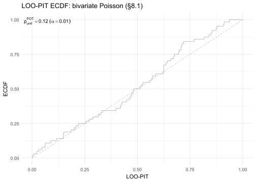

The ECDF tracks the diagonal reasonably well, with $p_{\text{unif}} = 0.12$. There's a slight S-curve shape, with the ECDF running below the diagonal in the middle range, but nothing dramatic given the sample size.

Figure 23.11 shows the Poisson difference model's LOO-PIT.

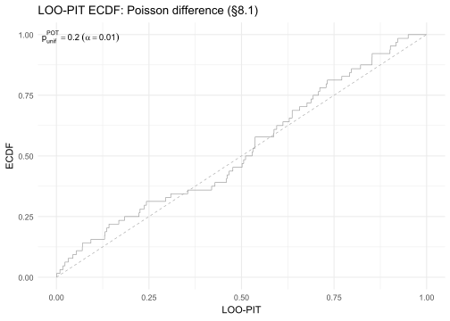

The Poisson difference model's ECDF is the closest to the diagonal of any model in this chapter, with $p_{\text{unif}} = 0.20$ and no visible systematic deviation. Among all the models here, it best matches the empirical distribution of the score differences.

---

## How the Models Evolved

The table below tracks the progression of modeling choices across the chapter's main models.

| Model | Likelihood | Key change | Purpose |
|---|---|---|---|
| M1 (buggy) | Student-t on buggy sqrt-dif | Missing factor of 2 in sqrt | Starting point; bug hidden by clean diagnostics |
| M2 | Student-t on raw dif | Remove sqrt entirely | Alternative without transformation |
| M3 (fixed) | Student-t on corrected sqrt-dif | Factor of 2 added | Correct continuous model |
| M-discr | Normal CDF interval on dif | Discrete log-likelihood | Respects integer nature of scores |
| M-cont | Normal CDF interval on dif | Exact integration vs. midpoint | Negligible improvement over midpoint |
| M-sqrt-cont | Normal CDF interval on sqrt-dif + Jacobian | Correct Jacobian accounting | Shows sqrt models are worse once Jacobian is included |
| M-bipois | Bivariate Poisson on (score1, score2) | Joint likelihood for both scores | Natural discrete model for goals |
| M-poisdif | Poisson difference on dif | Marginal of bivariate Poisson | Simpler; best LOO-PIT calibration |

---

## How RBayesflow Guided the Analysis

1. **Goal declaration (Phase 1):** `assess_offramps()` offered three paths for a continuous outcome with 64 observations. We selected the full Bayesian path and logged the decision to `wf$audit_trail`.
2. **Prior specification (Phase 2):** All models use weakly informative `normal(0,1)` priors on regression coefficients and half-normal priors on scale parameters. The chapter's pedagogical point is that the bug lives in the data transformation, not the priors, so we kept priors fixed across models.
3. **Model fitting (Phase 3):** Because the chapter's likelihoods — discrete normal intervals, Jacobian-corrected integrals, bivariate Poisson, Poisson difference — can't be expressed through brms formula interfaces, Phase 3 used `cmdstanr` directly via a thin `cstan()` helper. The `wf_mark_fit()` helper manually updated `wf_state` after each fit.
4. **MCMC diagnostics (Phase 4):** All models passed the standard checks (zero divergences for all but the bivariate Poisson, Rhat below 1.02 throughout). This is the chapter's central lesson: clean diagnostics didn't detect the bug in M1. Retrodiction did.
5. **Posterior predictive checks (Phase 5):** Retrodiction figures (23.3, 23.5, 23.7) compared back-transformed predictive intervals to observed score differentials. LOO-PIT plots (23.8 through 23.11) checked calibration for the discrete and Poisson models. We used `bayesplot::ppc_intervals()` on the original scale and `bayesplot::ppc_loo_pit_ecdf()` for the LOO checks.
6. **Model comparison (Phase 6):** LOO-CV was run on all comparable models (M-discr family, continuous vs. discrete, Poisson models). The sqrt models required Jacobian correction before they could be compared. Key finding: the Poisson difference model has the best LOO-PIT calibration, but predictive differences among the top models are small relative to standard errors.

---

## Extensions for the Student

- **Run the slow sqrt-discrete model.** Set `RUN_SQRT_DISCR <- TRUE` in `world_cup_analysis.R` and rerun section 7.4. The quadrature integration at each HMC leapfrog step makes this model very slow (expect 30 to 60 minutes per chain). Compare its LOO-PIT in Figure 23.9's style to the continuous sqrt version; the difference should be small.
- **Try a tighter prior on team spread.** Replace `sigma_a ~ normal(0, 1)` with `sigma_a ~ normal(0, 0.3)` in `worldcup_fixed.stan`. Rerun M3 and compare the team quality intervals in Figure 23.6's style. Does the tighter prior improve or hurt the retrodiction?
- **Swap in a different Power Index.** FiveThirtyEight's rankings are one choice. Try replacing `prior_score` with a uniform score of 0 for all teams (equivalent to M3-noprior) and with a ranking based on FIFA world rankings from mid-2014. Which prior leads to better LOO predictive performance on the discrete model?
- **Explore the bivariate Poisson correlation parameter.** The `c` parameter in `worldcup_bivariate_poisson.stan` measures the rate of simultaneous goals. Its posterior has very wide credible intervals given the `normal(-1.5, 20)` prior. Try `normal(-1.5, 1)` instead and check whether the LOO-PIT in Figure 23.10's style improves and whether divergences are eliminated.
- **Apply the [footBayes](https://CRAN.R-project.org/package=footBayes) package.** This R package implements several dynamic football models, including time-varying team strengths. Compare its static model's estimated team abilities to M-poisdif's `a[1]` through `a[32]`. How much does accounting for form over the tournament change the picture?

---

## Glossary

**[Bivariate Poisson model](https://doi.org/10.1111/1467-9884.00366):** A joint probability model for two correlated Poisson counts, here the goals scored by each team in a match. It introduces a third parameter $\lambda_3$ capturing the tendency for both teams to score in the same game.

**[E-BFMI](https://mc-stan.org/docs/reference-manual/hmc-algorithm-parameters.html) (Energy Bayesian Fraction of Missing Information):** A diagnostic for Hamiltonian Monte Carlo that measures how well the sampler explores the energy distribution of the posterior. Values below 0.3 suggest the sampler may be stuck. All models here had E-BFMI above 0.5.

**[Item-response model](https://en.wikipedia.org/wiki/Item_response_theory):** A model treating latent ability parameters as the primary unknowns, with observations arising from pairwise comparisons between those abilities. Originally developed in psychometrics to model test scores; directly applicable to sports.

**[Jacobian](https://en.wikipedia.org/wiki/Jacobian_matrix_and_determinant):** When transforming a continuous random variable, the Jacobian is the factor by which the transformation stretches or compresses the probability density. If $y = g(x)$, then $p_Y(y) = p_X(g^{-1}(y)) \cdot |dg^{-1}/dy|$. Ignoring the Jacobian when comparing log-likelihoods across differently-transformed models leads to incorrect LOO comparisons.

**[LOO-CV](https://mc-stan.org/loo/) (Leave-one-out cross-validation):** A method for estimating out-of-sample predictive accuracy by computing how well the model predicts each observation when it's left out of the fit. RBayesflow uses the `loo` package's PSIS-LOO approximation, which avoids refitting the model 64 times.

**[LOO-PIT](https://mc-stan.org/loo/reference/loo-glossary.html) (Leave-one-out probability integral transform):** A calibration check comparing each observation's rank within its LOO predictive distribution. If the model is calibrated, the PIT values are uniform and the empirical CDF tracks the diagonal line. Deviations indicate systematic misfit.

**[Modified Bessel function of the first kind](https://en.wikipedia.org/wiki/Bessel_function#Modified_Bessel_functions) ($I_n$):** A special function appearing in the probability mass function of the Poisson difference distribution. Stan provides it as `modified_bessel_first_kind(n, x)`.

**Pareto-k:** A diagnostic from the `loo` package indicating how influential an observation is for the LOO approximation. Values above 0.7 flag observations where the PSIS approximation may be unreliable; values above 1.0 mean the approximation has failed for that observation.

**[PSIS](https://mc-stan.org/loo/) (Pareto-smoothed importance sampling):** The method the `loo` package uses to approximate LOO-CV without refitting. It reweights draws from the full posterior to approximate the leave-one-out posterior. The Pareto-k diagnostic assesses whether the reweighting worked.

**Posterior retrodiction:** Generating replicated data from the posterior predictive distribution and comparing it to the observed data. Unlike prior predictive simulation (which runs before seeing data), retrodiction checks whether the model can reproduce what it was fitted on. In this chapter, retrodiction with `ppc_intervals()` revealed the coding bug that MCMC diagnostics missed.

**[Poisson difference distribution](https://en.wikipedia.org/wiki/Skellam_distribution):** Also called the Skellam distribution, it gives the probability that the difference of two independent Poisson random variables equals a particular integer. Its PMF involves the modified Bessel function $I_{|d|}(2\sqrt{\lambda_1 \lambda_2})$.

**Prior score:** In this chapter, the rescaled Soccer Power Index value assigned to each team before the tournament. It ranges from $-0.83$ (weakest) to $+0.83$ (strongest) and serves as an informative starting point for estimating team ability. The weight placed on it, $b$, is estimated from the match results.

**[Rhat](https://mc-stan.org/docs/reference-manual/analysis.html) ($\hat{R}$):** A convergence diagnostic that compares variance within chains to variance between chains. Values above 1.01 suggest the chains haven't mixed well. All models here had Rhat below 1.02.

**`sigma_a`:** The standard deviation of the latent team ability parameters around the Power Index prior. A larger value means teams deviate more from their pre-tournament rankings. In M3, the posterior mean is about 0.33 on the sqrt-differential scale.

**`sigma_y` / `sigma_z`:** The residual standard deviation of the score outcome, on whatever scale the model uses. In the sqrt models, `sigma_y` is on the signed-sqrt-differential scale; in the discrete normal models, `sigma_z` is on the raw-differential scale.

**[Soccer Power Index](https://projects.fivethirtyeight.com/soccer-predictions/):** FiveThirtyEight's pre-tournament ranking system for football teams, based on historical performance and opponent strength. Used here as a prior on team ability, rescaled to have mean 0 and standard deviation 0.5.

**[Student-t distribution](https://en.wikipedia.org/wiki/Student%27s_t-distribution):** A bell-shaped distribution with heavier tails than the normal, parameterized here by degrees of freedom $\nu = 7$. Heavier tails make the model less sensitive to blowout results, treating a 7-1 scoreline as less surprising than a Gaussian model would.

**`wf_state`:** RBayesflow's central workflow object. It tracks the current mode and stage, diagnostic results, phase completion flags, and a full audit trail of modelling decisions. In this chapter, `wf$diagnostics$passed = TRUE` for all models — which is precisely the point: clean diagnostics are necessary but not sufficient for a correct model.
