# Chapter 24 Case Study: When Poisson Isn't Enough

*Based on Gelman, Vehtari et al., [Bayesian Workflow](https://avehtari.github.io/Bayesian-Workflow/) (2026), Chapter 24.*
*Implemented using [RBayesflow](https://github.com/wildpeaches/RBayesflow) and [brms](https://paul-buerkner.github.io/brms/) in R.*

---

## The Question

Does pest control actually work, and how confident should you be in that answer?

Harder than it looks. If you're trying to estimate the effect of a roach-control treatment on cockroach counts in New York City apartment buildings, you have to pick a statistical model for count data, and a bad pick gives you overconfident intervals, misleading predictions, and a treatment estimate that shifts substantially when you change your modelling assumptions. Chapter 24 of *Bayesian Workflow* uses this dataset to teach a core skill: **leave-one-out cross-validation** (LOO-CV) for comparing models that are genuinely competing.

We fit five model families to 262 apartments: a simple Poisson, a negative-binomial, a Poisson with per-apartment varying intercepts, that same varying-intercept model with an analytically integrated LOO likelihood, and finally a zero-inflated negative binomial. Each step exposes a specific failure mode of the previous model. The LOO scores tell us which model fits best, by how much, and whether the difference is real or noise.

---

## The Data

The roaches dataset tracks a pest-control experiment across 262 New York City apartments. Each apartment's outcome is the raw roach count $y$ over a monitoring period. The key predictors are:

- $\sqrt{\text{roach1}}$: the square root of the pre-treatment roach count (we use the square root because the raw count is heavily right-skewed).
- `treatment`: a binary indicator for whether the apartment received treatment.
- `senior`: a binary indicator for whether the building houses senior residents.
- `exposure2`: the number of trap-days in the monitoring period, entered as an offset on the log scale.

Thirty-six percent of apartments had zero roaches observed. That's a lot of zeros. It turns out this matters enormously for model selection.

We load the data from the [countSTAR](https://cran.r-project.org/package=countSTAR) package and add the square root transform:

```r
data(roaches, package = "countSTAR")
roaches$sqrt_roach1 <- sqrt(roaches$roach1)
```

---

## What Is RBayesflow?

[RBayesflow](https://github.com/wildpeaches/RBayesflow) is a project folder, not a package. It sequences the seven phases of the Bayesian workflow described in Gelman et al. (2020) into a repeatable R session: goal declaration, prior specification, model fitting, diagnostics, posterior predictive checks, LOO-CV, and reporting. A `wf_state` object carries the audit trail through the session, and [Posit Assistant](https://posit.co/blog/posit-assistant/) reads it live to interpret diagnostics and suggest next steps. No new statistical methods are implemented; every computation delegates to [brms](https://paul-buerkner.github.io/brms/), [bayesplot](https://mc-stan.org/bayesplot/), [loo](https://mc-stan.org/loo/), and [posterior](https://mc-stan.org/posterior/).

---

## Setting Up: Phase 1

We initialise the workflow in `practice` mode, which shows standard coefficient output and runs the LOO display immediately once diagnostics pass:

```r
wf <- init_workflow(mode = "practice", stage = "explore")
```

The off-ramp assessment notes that the outcome is a count with possible overdispersion and a substantial zero fraction. The obvious Bayesian path is to start simple and add complexity only when the data demands it. We log the choice and move to priors.

---

## Phase 2: Priors

All slope priors are $\text{Normal}(0, 1)$ on the log-count scale. This puts 95% prior probability on multiplicative effects between roughly $e^{-2} \approx 0.13$ and $e^{2} \approx 7.4$ per unit of the predictor, which is generous without being absurd for a pest-count regression. For the zero-inflation component of the ZINB model we use the same $\text{Normal}(0, 1)$ for both the intercept and the slopes because we have no strong prior information about the baseline probability of structural zeros.

```r
priors_count <- c(
  brms::prior(normal(0, 1), class = b)
)

priors_zinb <- c(
  brms::prior(normal(0, 1), class = "b"),
  brms::prior(normal(0, 1), class = "b",         dpar = "zi"),
  brms::prior(normal(0, 1), class = "Intercept", dpar = "zi")
)
```

We don't touch the negative-binomial shape parameter prior; [brms](https://paul-buerkner.github.io/brms/) uses an inverse-gamma(0.4, 0.3) by default, which is appropriate for moderately overdispersed count data.

---

## Model 1: Poisson Regression

### The Model

The starting point is a Poisson log-linear regression:

$$
\begin{aligned}
y_i &\sim \text{Poisson}(\mu_i) \\
\log(\mu_i) &= \alpha + \beta_1 \sqrt{\text{roach1}_i} + \beta_2 \, \text{treatment}_i + \beta_3 \, \text{senior}_i + \log(\text{exposure2}_i)
\end{aligned}
$$

where $y_i$ is the roach count for apartment $i$, $\mu_i$ is the expected count, $\alpha$ is the intercept, $\beta_1, \beta_2, \beta_3$ are slopes on the log scale, and $\log(\text{exposure2}_i)$ is an offset that adjusts for differing trap-day exposure.

```r
fit_p <- brm(
  y ~ sqrt_roach1 + treatment + senior + offset(log(exposure2)),
  data    = roaches,
  family  = poisson,
  prior   = priors_count,
  backend = "cmdstanr",
  seed    = 298465,
  refresh = 0
)
```

### Posterior Coefficients

All three slope posteriors are clearly away from zero. This is Figure 24.1.


The three marginals are extremely tight. `b_sqrt_roach1` sits at a spike near 0.16, while `b_treatment` and `b_senior` cluster near −0.57 and −0.31 respectively with very narrow widths. The Poisson likelihood with 262 apartments leaves almost no posterior uncertainty. That narrowness is precisely the problem, as we'll see shortly.

The coefficient estimates confirm the expected direction: apartments with more pre-treatment roaches have higher post-treatment counts (positive slope on `sqrt_roach1`), treatment reduces counts by roughly half on the multiplicative scale ($e^{-0.57} \approx 0.57$), and senior buildings have modestly lower counts. But the intervals are suspiciously tight.

### Posterior Predictive Check

We check the Poisson fit by comparing the distribution of posterior-predictive replicates to the observed distribution, on a square-root scale to manage the long tail. This is Figure 24.2.


The overdispersion is immediately visible. The observed data (dark line) has a broad, slowly decaying density from 0 through about 400. The light replicate lines form a tight bundle peaking around count 10 and falling off much faster. The Poisson model is predicting a much narrower range of outcomes than the data actually contains.

The rootogram in Figure 24.3 makes the same point on the count scale.


The rootogram overlays observed bar heights (filled squares, marked "In" or "Out" depending on whether they fall inside the predictive interval) against the predicted envelope (light bars). The model's predictions run out of mass by count 30; the observed data has apartments with 100, 200, even 400 roaches, all sitting well outside the predicted range. The zero count alone (around 90 apartments) has its observed point far below the predicted envelope.

### LOO Diagnostics

The LOO score for the Poisson model is $\widehat{\text{elpd}}_\text{LOO} \approx -5454$, with an estimated effective number of parameters $p_\text{LOO} \approx 247$. A model with only four parameters having $p_\text{LOO} \approx 247$ is a specific signal: the Poisson model is so misspecified that each observation is essentially driving its own prediction, and the model doesn't generalise at all.

---

## Model 2: Negative-Binomial Regression

### The Model

The [negative-binomial](https://en.wikipedia.org/wiki/Negative_binomial_distribution) distribution adds a dispersion parameter $\phi$ (shape) to the Poisson, so the variance grows as $\mu + \mu^2/\phi$ rather than just $\mu$. For counts that are more spread out than Poisson predicts, that's the right generalisation:

$$
\begin{aligned}
y_i &\sim \text{NegBinomial}(\mu_i, \phi) \\
\log(\mu_i) &= \alpha + \beta_1 \sqrt{\text{roach1}_i} + \beta_2 \, \text{treatment}_i + \beta_3 \, \text{senior}_i + \log(\text{exposure2}_i)
\end{aligned}
$$

where $\phi > 0$ is the shape (precision) parameter; smaller $\phi$ means more overdispersion.

```r
fit_nb <- brm(
  y ~ sqrt_roach1 + treatment + senior + offset(log(exposure2)),
  data    = roaches,
  family  = negbinomial,
  prior   = priors_count,
  backend = "cmdstanr",
  seed    = 298465,
  refresh = 0
)
```

### What Changes in the Posterior

The NB posterior looks quite different from the Poisson. Figure 24.4 shows why.


The `b_treatment` slab has shifted left and widened dramatically: the posterior now runs from about −1.4 to −0.5, compared with the Poisson's razor-thin interval around −0.57. The `b_senior` slab now straddles zero, running from about −0.6 to +0.4. Once we allow for overdispersion, the evidence for a senior effect largely evaporates. This is a meaningful change in scientific interpretation.

### Shape Parameter

The overdispersion parameter $\phi$ has a well-defined posterior, shown in Figure 24.5. Its median is around 0.31, meaning the variance of each observation's count is roughly $\mu + 3.2\mu^2$. For apartments with high pre-treatment counts, this implies enormous predictive variance.


The `shape` posterior is a smooth bell centred near 0.31 with a 90% interval of roughly (0.27, 0.35). The tight posterior here reflects genuine information from the data: with 262 apartments and enormous count variability, the overdispersion parameter is well-identified.

Comparing the NB density overlay (Figure 24.6) to the Poisson version shows the improvement. The light replicate lines now bracket the observed dark curve much more closely across the full range from zero to 400.


The rootogram confirms it. The high-count apartments that sat outside the Poisson envelope now mostly land within the NB predictive bands. A few outliers remain in the very-high count region, but the gross failure of the plain Poisson is gone.

The per-apartment predictive intervals in Figure 24.7 show that the NB model is honest about its uncertainty: the gray intervals are wide, often spanning zero to several hundred.

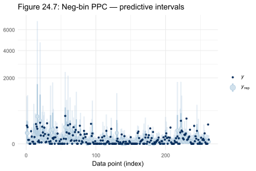

Most observed counts (dark dots) fall inside the predictive intervals, with a handful of dramatic exceptions where the observed count exceeds 2,000 or 6,000 roaches. These extreme apartments illustrate the model's remaining limitations.

### LOO Assessment

LOO-CV cuts the NB model's score to $\widehat{\text{elpd}}_\text{LOO} \approx -882$. The comparison with the Poisson model shows an elpd difference of about −4572 in favour of the NB, with a standard error of 673. This is not a close call.

The LOO-PIT-ECDF in Figure 24.8 shows the NB performing reasonably well in calibration terms: the empirical cumulative distribution of probability integral transform (PIT) values tracks close to the diagonal, with the statistical test giving $p_\text{unif}^\text{POT} = 0.30$. That $p$ value describes the pointwise test for uniformity; larger is more consistent with a well-calibrated model, but it's not a standard significance threshold.


The LOO-PIT trace runs close to but slightly below the dashed diagonal for PIT values in the 0.0–0.5 range, then converges back near the top. This mild S-shape suggests that the NB slightly underestimates the probability mass at low counts, consistent with the calibration diagnostic in the next section.

The LOO predictive intervals in Figure 24.9 look similar to the PPC intervals but use leave-one-out predictive distributions rather than in-sample ones.

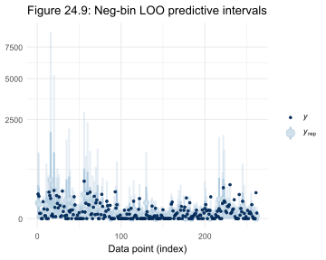

The LOO-PIT-ECDF (Figure 24.10) tightens the analysis: $p_\text{unif}^\text{POT} = 0.088$, which is better than 0.05 but still signals some miscalibration.

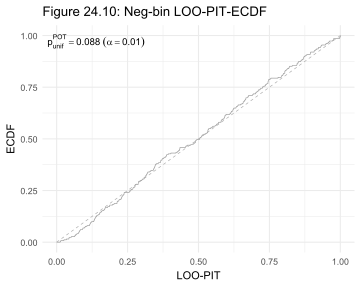

### Reliability Diagram

The reliability diagram in Figure 24.12 examines a specific aspect of calibration: when the NB model predicts a 50% probability that an apartment has at least one roach, does 50% of such apartments actually have one?


The red staircase tracks the empirical non-zero rate against the model's predicted probability. For predicted probabilities between 0.25 and 0.5, the staircase dips noticeably below the diagonal, meaning the NB model is over-predicting the probability of non-zero counts in that range. The uncertainty band (blue shading) is wide, so this isn't a confident diagnosis, but it motivates trying a model that explicitly handles zeros.

---

## Model 3: Poisson with Per-Apartment Varying Intercepts

Another explanation for the overdispersion: apartments differ from each other in unmeasured ways that persist throughout the study. A varying intercept for each apartment captures that:

$$
\begin{aligned}
y_i &\sim \text{Poisson}(\mu_i) \\
\log(\mu_i) &= \alpha + u_i + \beta_1 \sqrt{\text{roach1}_i} + \beta_2 \, \text{treatment}_i + \beta_3 \, \text{senior}_i + \log(\text{exposure2}_i) \\
u_i &\sim \text{Normal}(0, \sigma_z)
\end{aligned}
$$

where $u_i$ is a random offset specific to apartment $i$, and $\sigma_z$ controls how much apartments vary from each other.

```r
fit_pvi <- brm(
  y ~ sqrt_roach1 + treatment + senior + offset(log(exposure2)) + (1 | id),
  data    = roaches,
  family  = poisson,
  prior   = priors_count,
  backend = "cmdstanr",
  seed    = 298465,
  refresh = 0
)
```

### Effect on Slope Estimates

The varying-intercept model shifts the treatment and senior posteriors substantially, as Figure 24.13 shows.


The `b_treatment` slab now spans roughly −1.4 to −0.3, centred near −0.84, and `b_senior` runs from −1.4 to +0.0, centred near −0.75. Accounting for apartment-level heterogeneity strengthens the apparent treatment effect and makes the senior effect look more negative, though still quite uncertain.

### PPC Shows Clear Improvement

The density overlay (Figure 24.14) and rootogram (Figure 24.15) both look substantially better than the plain Poisson.

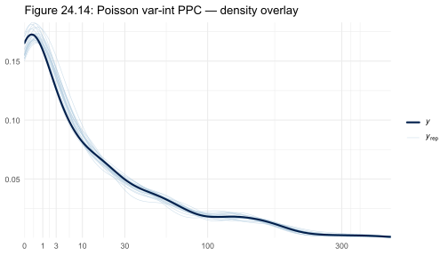

The replicate envelopes now track the observed curve tightly all the way from 0 to 300. Unlike the plain Poisson (Figure 24.2), the replicates don't diverge into a narrow bundle.

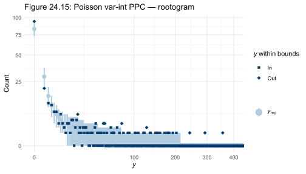

The rootogram still shows some misfit at very low counts (the zero-count bar has observed points outside the predicted envelope) and at very high counts, but the dramatic failure of the plain Poisson is gone.

### LOO Trouble

Despite the improved PPC, the PIT-ECDF (Figure 24.16) tells a different story.

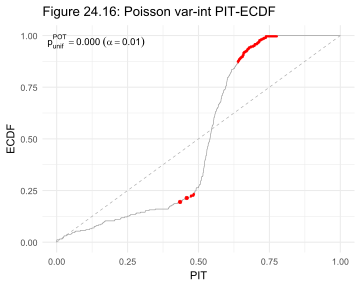

The PIT-ECDF deviates severely from the diagonal, with the empirical curve sweeping well below the dashed line for PIT values from 0 to 0.5, then arcing above it. Red segments mark the regions of significant deviation. The test gives $p_\text{unif}^\text{POT} = 0.000$. This is a failing grade.

The issue is that the LOO-PIT is assessing how well each observation is predicted by a model fitted on the other 261 apartments. With 262 varying intercepts, each apartment's intercept is informed almost entirely by its own data, so removing that apartment's observation leaves the model with almost nothing to predict it from. Standard PSIS-LOO breaks down here because the Pareto-k diagnostics are high for most observations.

The LOO-PIT-ECDF in Figure 24.18 confirms this:

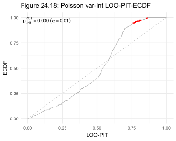

The curve bends dramatically below the diagonal, recovering only near PIT = 0.75. The LOO predictive distributions are too wide relative to what the data look like, which is exactly what happens when each apartment's random effect is poorly constrained once that apartment's data is held out.

For an honest LOO comparison, the right tool is $k$-fold cross-validation. We note this in the log and move on to the analytically integrated alternative.

The per-apartment PPC intervals in Figure 24.17 show the varying-intercept model capturing individual apartment-level patterns:

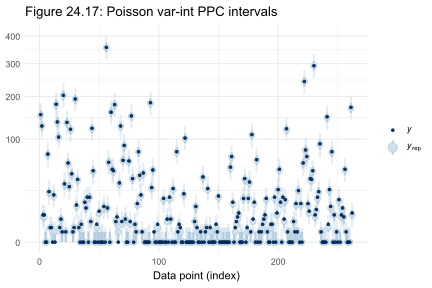

Compared to the NB intervals (Figure 24.7), the predictive intervals are much tighter: the varying intercepts absorb apartment-to-apartment differences, leaving tighter within-apartment predictions. The trade-off is that leaving any one apartment out removes its intercept from the model, making LOO estimates unreliable.

---

## Model 4: Integrated-LOO Poisson

To get reliable LOO estimates for the varying-intercept Poisson, we integrate the random effects out analytically. Given the normal prior on $u_i$, the marginal likelihood for apartment $i$ is:

$$
p(y_i \mid \beta, \sigma_z) = \int p(y_i \mid u_i, \beta) \, p(u_i \mid \sigma_z) \, du_i
$$

where the integral is over the Normal prior on $u_i$. This integral doesn't have a closed form for the Poisson likelihood, so we evaluate it by numerical quadrature inside a Stan program. With the random effect integrated out, the resulting LOO score avoids the Pareto-k problems entirely. [brms](https://paul-buerkner.github.io/brms/) can't express this marginal likelihood directly, so we use [cmdstanr](https://mc-stan.org/cmdstanr/) with a custom Stan file:

```r
model_p_vi <- cmdstanr::cmdstan_model("poisson_vi_integrate.stan")
fit_p_vi   <- model_p_vi$sample(
  data    = stan_data,
  seed    = 298465,
  chains  = 4,
  refresh = 0
)
```

### Posterior Coefficients

Figure 24.19 shows the four key parameters of the integrated-LOO Poisson model.


`beta[1]` (the sqrt_roach1 coefficient) is a spike near 0.33. `beta[2]` (treatment) and `beta[3]` (senior) are broad, running from about −1.2 to −0.4 and −1.2 to −0.25 respectively. `sigmaz` is centred near 2.0, confirming substantial between-apartment variability. The broad posteriors for treatment and senior reflect genuine uncertainty that the Poisson model suppressed.

### LOO and Calibration

The integrated-LOO model achieves $\widehat{\text{elpd}}_\text{LOO} \approx -878$ with $p_\text{LOO} \approx 4.7$. Compared against the negative-binomial model's −882, the difference is −3.5 elpd units with a standard error of 7.5. This is effectively a tie.

The LOO-PIT-ECDF (Figure 24.20) confirms good calibration:


The trace runs very close to the diagonal with $p_\text{unif}^\text{POT} = 0.26$. All Pareto-k diagnostics are below 0.7 because the random effects are integrated out, removing the leave-one-out problem entirely.

The reliability diagram (Figure 24.21) shows better calibration than the NB model:


The red staircase tracks the diagonal more faithfully across the full range of predicted non-zero probabilities. At predicted probabilities from 0.4 to 0.75, the staircase is noticeably closer to the diagonal than the NB version (Figure 24.12), where it sagged below. The uncertainty band is still wide, so we can't claim this model is definitively better calibrated, but it's the direction we'd hope to see.

The scientific implication: apartment-to-apartment heterogeneity and count overdispersion are capturing much of the same variation. Allowing each apartment to have its own baseline (integrated-LOO Poisson) achieves nearly the same predictive accuracy as allowing variance to scale with the mean (NB), at a cost of many more parameters.

---

## Model 5: Zero-Inflated Negative-Binomial

### The Model

The NB reliability diagram flagged a specific problem: the model was over-predicting the probability of non-zero counts in the middle of the predicted-probability range. One natural fix is to let some fraction of the zero counts be "structural" zeros that the treatment can't touch, rather than low-count outcomes from the NB process.

The [zero-inflated negative-binomial](https://en.wikipedia.org/wiki/Zero-inflated_model) (ZINB) model mixes two processes:

$$
\begin{aligned}
y_i &\sim \begin{cases} 0 & \text{with probability } \theta_i \\ \text{NegBinomial}(\mu_i, \phi) & \text{with probability } 1 - \theta_i \end{cases} \\
\text{logit}(\theta_i) &= \gamma_0 + \gamma_1 \sqrt{\text{roach1}_i} + \gamma_2 \, \text{treatment}_i + \gamma_3 \, \text{senior}_i + \log(\text{exposure2}_i) \\
\log(\mu_i) &= \alpha + \beta_1 \sqrt{\text{roach1}_i} + \beta_2 \, \text{treatment}_i + \beta_3 \, \text{senior}_i + \log(\text{exposure2}_i)
\end{aligned}
$$

where $\theta_i$ is the probability that apartment $i$ produces a structural zero (a roach-free apartment regardless of treatment), and the $\gamma$ coefficients govern that probability. We model both components with predictors because the factors that make an apartment structurally zero-prone (perhaps permanent physical barriers to infestation) might differ from the factors that determine count levels.

```r
fit_zinb <- brm(
  bf(y ~ sqrt_roach1 + treatment + senior + offset(log(exposure2)),
     zi ~ sqrt_roach1 + treatment + senior + offset(log(exposure2))),
  data    = roaches,
  family  = zero_inflated_negbinomial,
  prior   = priors_zinb,
  backend = "cmdstanr",
  seed    = 298465,
  refresh = 0
)
```

### PPC Checks

The density overlay (Figure 24.22) looks similar to the NB version:

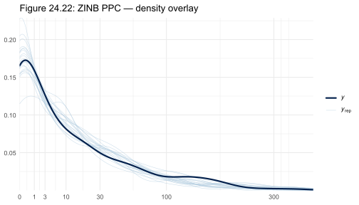

The replicate envelopes track the observed curve from 0 to 400. The ZINB is slightly better at the far left edge of the distribution, where the observed curve at zero and one closely matches the replicate envelopes, but the difference from the NB is subtle by eye.

The rootogram in Figure 24.23 shows a similar story: the zero-count bar's observed point is slightly closer to the predicted envelope than the NB rootogram, but there's still some misfit at the top of the count distribution.

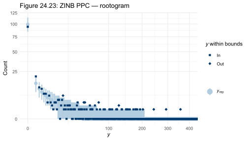

### LOO Calibration

Figure 24.24 shows the ZINB's LOO-PIT-ECDF:

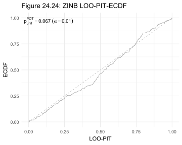

The trace is close to the diagonal with $p_\text{unif}^\text{POT} = 0.067$. This is slightly better than the NB ($p = 0.088$), and the ZINB achieves $\widehat{\text{elpd}}_\text{LOO} \approx -859$, a clear 22.6 elpd units better than the NB model (se = 6.9). That gap is real: the standard error comfortably excludes zero.

The reliability diagram (Figure 24.25) shows a marked improvement over both the NB (Figure 24.12) and the integrated-LOO Poisson (Figure 24.21).

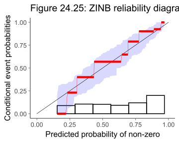

The red staircase tracks the diagonal closely across the full range of predicted non-zero probabilities, from 0.2 up to nearly 1.0. The S-shaped sag below the diagonal that appeared in the NB reliability diagram is largely gone. This is the concrete visual reason to prefer the ZINB: it's better calibrated for the probability of any roach being present.

### ZINB Posterior Coefficients

Figure 24.26 shows all six coefficient posteriors for the ZINB model:


The count-component slopes (`b_sqrt_roach1`, `b_treatment`, `b_senior`) have a broadly similar pattern to the NB model, though with some widening. The zero-inflation component tells a richer story: `b_zi_sqrt_roach1` is clearly negative (apartments with more pre-treatment roaches are less likely to be structural zeros), while `b_zi_treatment` is positive and spans 0 to 2.9, suggesting that treated apartments are more likely to become structural zeros, though uncertainty is substantial. `b_zi_senior` is also positive, suggesting senior buildings may have a higher proportion of structurally roach-free units.

### Treatment Effect as a Ratio

The coefficient on the log scale isn't the quantity we care about. The practical question is: by what fraction does treatment reduce expected roach counts? We compute the ratio of treated to control predicted counts as a posterior quantity. Figure 24.27 shows the ZINB model's posterior for that ratio.


The distribution of the ratio (treated expected count / control expected count) is centred near 0.35, with the bulk of the mass between 0.15 and 0.55. Treatment roughly cuts expected roach counts to about a third of what they'd be without it, though the credible interval is wide enough that effects as small as 0.15 or as large as 0.75 are plausible.

### Comparing All Three Models

Figure 24.28 overlays the treatment ratio posterior for Poisson, NB, and ZINB side by side.


Here's the key scientific result. The Poisson model (blue spike near 0.57) is far more confident than it has any right to be, its interval spanning only about 0.45 to 0.65. The NB (pink) and ZINB (green) posteriors are wider and shifted left, putting more probability below 0.5 and suggesting a stronger treatment effect than the Poisson estimated, but with honest uncertainty. The NB and ZINB look broadly similar, with the ZINB sitting slightly left. Any policy decision based on the Poisson model alone would be overconfident.

---

## Prior Sensitivity

Before treating the ZINB results as final, we check whether the treatment ratio posterior is sensitive to our prior choices. Using [priorsense](https://n-kall.github.io/priorsense/):

```r
ps_zinb <- priorsense::powerscale_sensitivity(
  fit_zinb,
  prediction = function(x, ...) ratio_zinb
)
```

The prior sensitivity index is 0.06 and the likelihood sensitivity is 0.15. Neither exceeds 0.5, which is the threshold that would raise concern. The data are genuinely informative about the treatment ratio, and scaling the priors up or down barely moves the posterior.

We also check whether treatment adds predictive value by fitting a ZINB without treatment predictors in either component. The LOO comparison shows $\widehat{\text{elpd}}_\text{diff} \approx -8.6$ (se = 4.7, $p_\text{worse} = 0.97$) in favour of keeping treatment: 97% posterior probability that the model without treatment is worse.

---

## How the Models Evolved

| Model | Family | Key addition | LOO elpd | $p_\text{LOO}$ |
|---|---|---|---|---|
| Poisson | Poisson log-linear | Baseline | −5454 | 247 |
| Negative-binomial | NB log-linear | Overdispersion parameter $\phi$ | −882 | 8.3 |
| Poisson varying-intercept | Poisson + random intercepts | Per-apartment $u_i$ | −628 (raw PSIS-LOO, unreliable) | 164 |
| Integrated-LOO Poisson | Poisson (marginalised) | Analytically integrated $u_i$ | −878 | 4.7 |
| ZINB | Zero-inflated NB | Structural zero probability $\theta_i$ | −859 | 10.3 |

The $p_\text{LOO}$ column tells its own story. For the plain Poisson it's 247, signalling extreme misspecification. For the NB and ZINB it's in single digits. The varying-intercept model has $p_\text{LOO} \approx 164$, which reflects the LOO-PIT failure rather than the model quality itself. Once we integrate out the random effects, $p_\text{LOO}$ drops to 4.7.

---

## How RBayesflow Guided the Analysis

1. **Goal declaration (Phase 1):** `init_workflow()` set the session to `practice` mode. `assess_offramps()` surfaced the overdispersion and zero-fraction observations and confirmed that a full Bayesian model comparison was appropriate. The off-ramp choice was logged to the audit trail.
2. **Prior specification (Phase 2):** We stored `priors_count` and `priors_zinb` in `wf$priors_objects` and called `export_context()` to write the state to `wf_context.json` so that Posit Assistant could read it.
3. **Model fitting (Phase 3):** Because this chapter compares multiple model families and includes one model requiring a custom Stan marginalisation, all fits used `brm()` directly rather than `run_phase3()`. The integrated-LOO Poisson used [cmdstanr](https://mc-stan.org/cmdstanr/) directly.
4. **Diagnostics (Phase 4):** `run_diagnostics()` caught the Rhat > 1.01 flag for the varying-intercept Poisson (bulk ESS fell to 679). We acknowledged the diagnostic manually and logged the reason: the per-apartment varying intercepts are the cause, and the LOO-PIT-ECDF confirms the model isn't appropriate for LOO comparison.
5. **Posterior predictive checks (Phase 5):** `pp_check(fit, type = "dens_overlay")` and `pp_check(fit, type = "rootogram")` were used because the outcome is a count. The rootogram explicitly shows discrete bin coverage and is more appropriate than a density overlay for count data.
6. **LOO-CV (Phase 6):** `add_criterion(fit, "loo", save_psis = TRUE)` ran for the NB and ZINB fits. Moment-matching via `loo::loo_moment_match()` recovered clean Pareto-k diagnostics for both. The varying-intercept Poisson required the integrated-LOO Stan program because PSIS-LOO was too unreliable.
7. **Reporting (Phase 7):** `export_context(wf)` wrote the final `wf_context.json`. `guide(wf)` confirmed all phases were complete and directed to the Quarto report template.

---

## Extensions for the Student

- **Fit a hurdle negative-binomial.** The ZINB assumes structural zeros are generated by a separate process, but a hurdle model assumes *all* zeros are structural and counts start at 1 for non-zero observations. Try `family = hurdle_negbinomial()` in brms and compare its LOO score to the ZINB.
- **Change the zero-inflation predictors.** The current ZINB uses the same predictors in both the count and zero-inflation components. Try dropping `senior` from the zero-inflation component and checking whether LOO changes materially. This tests whether senior-building status predicts structural zeros or only count levels.
- **Run $k$-fold CV on the varying-intercept model.** The PSIS-LOO failed for `fit_pvi`. Run `brms::kfold(fit_pvi, K = 10)` to get an honest LOO estimate. Does the varying-intercept Poisson look better or worse than the NB when evaluated by $k$-fold?
- **Examine the apartment-level random effects.** Extract the posterior means of each $u_i$ with `brms::ranef(fit_pvi)`. Do the apartments with the highest random effects correspond to apartments with the most extreme roach counts? Plot $u_i$ against `sqrt_roach1` to look for residual structure.
- **Explore the prior sensitivity more carefully.** The `priorsense::powerscale_sequence()` function traces how the posterior shifts as the prior is progressively tightened or widened. Apply it to the treatment coefficient in the NB model and in the ZINB. Do the two models respond differently to prior changes?
- **Add a time trend.** The current model treats each monitoring period as independent. If the dataset includes a time variable (month or season of the monitoring), add it to both the count and zero-inflation components of the ZINB. Does the treatment effect change over time?

---

## Glossary

**[Bayesian workflow](https://avehtari.github.io/Bayesian-Workflow/):** An iterative, structured approach to probabilistic modelling in which prior specification, fitting, diagnostics, predictive checks, and model comparison are treated as distinct but connected phases rather than a single fit-and-report step.

**[brms](https://paul-buerkner.github.io/brms/) (Bayesian Regression Models using Stan):** An R package that provides a high-level formula interface for fitting Stan models, covering a wide range of response families including Poisson, negative-binomial, zero-inflated, and hurdle models.

**Calibration:** A model is calibrated if its predicted probabilities match empirical event rates. If a model says there's a 30% chance of a non-zero roach count, then among all apartments where the model predicts 30%, roughly 30% should actually be non-zero. The reliability diagram plots predicted vs. empirical rates; perfect calibration is the diagonal.

**[cmdstanr](https://mc-stan.org/cmdstanr/):** The R interface to [CmdStan](https://mc-stan.org/users/interfaces/cmdstan), Stan's command-line tool. Used here to run the custom integrated-LOO Poisson Stan program that [brms](https://paul-buerkner.github.io/brms/) cannot express directly.

**ECDF (Empirical Cumulative Distribution Function):** A step function that estimates the cumulative distribution of a dataset. The PIT-ECDF and LOO-PIT-ECDF plots compare the empirical CDF of PIT values against the uniform CDF (the dashed diagonal), where a well-calibrated model produces uniform PIT values.

**E-BFMI (Expected Bayesian Fraction of Missing Information):** A sampler health statistic specific to [Stan](https://mc-stan.org/)'s Hamiltonian Monte Carlo. Values below 0.2 indicate that the energy distribution of the Markov chain is poorly explored, suggesting the need for model reparameterisation or more warmup.

**[loo](https://mc-stan.org/loo/) (Leave-One-Out cross-validation):** An R package implementing [Pareto-smoothed importance sampling](https://arxiv.org/abs/1507.02646) (PSIS-LOO) for efficient approximation of leave-one-out cross-validation. The package's `loo_compare()` function ranks models by their estimated expected log predictive density (elpd).

**LOO-CV (Leave-One-Out Cross-Validation):** A method for evaluating a model's out-of-sample predictive accuracy. Each observation is successively removed from the training data and the model is asked to predict it. The sum of log predictive densities across all held-out observations gives the LOO score (elpd).

**LOO-PIT-ECDF:** A calibration diagnostic that applies the probability integral transform to each observation's LOO predictive distribution. If the model is well-calibrated, PIT values should be uniformly distributed between 0 and 1. Departures from the diagonal in the ECDF plot reveal systematic miscalibration.

**[Negative-binomial distribution](https://en.wikipedia.org/wiki/Negative_binomial_distribution):** A count distribution that generalises the Poisson by adding a dispersion parameter $\phi$, giving variance $\mu + \mu^2/\phi$ rather than $\mu$. Smaller $\phi$ means more overdispersion relative to Poisson. Commonly used for count data that are more spread out than a Poisson model predicts.

**Offset:** A predictor term whose coefficient is fixed at 1. In a Poisson log-linear model, $\log(\text{exposure2})$ is an offset that adjusts for differing monitoring periods across apartments without estimating an additional coefficient.

**Overdispersion:** When observed count data have greater variance than the fitted model predicts. The clearest symptom in this case study is a Poisson $p_\text{LOO} \approx 247$ for a 4-parameter model: the model is so miscalibrated that each observation effectively drives its own prediction.

**[Pareto-k diagnostic](https://mc-stan.org/loo/reference/pareto-k-diagnostic.html):** A per-observation diagnostic from [PSIS-LOO](https://arxiv.org/abs/1507.02646). Values above 0.7 indicate that the importance weights for that observation are too heavy-tailed for reliable LOO estimation. High $k$ values arise when an observation has outsized influence on the posterior.

**PIT (Probability Integral Transform):** If a model correctly describes a continuous random variable $Y$, the CDF $F(Y)$ evaluated at the observed value should be uniformly distributed. For discrete distributions like the Poisson, a randomised version of the PIT achieves the same property.

**[Poisson distribution](https://en.wikipedia.org/wiki/Poisson_distribution):** A count distribution where events occur at a constant rate, with mean equal to variance. The variance constraint is often too restrictive for real count data, where clustering or contagion produces variance much greater than the mean.

**$p_\text{LOO}$ (effective number of parameters):** The LOO analogue of the effective degrees of freedom. It equals $\widehat{\text{elpd}}_\text{train} - \widehat{\text{elpd}}_\text{LOO}$, the difference between in-sample and out-of-sample log predictive density. Large values relative to the number of model parameters signal overfitting or misspecification.

**[priorsense](https://n-kall.github.io/priorsense/):** An R package for prior sensitivity analysis. It computes how much the posterior changes when the prior is scaled up or down (prior power-scaling) and reports summary indices for prior sensitivity and likelihood sensitivity.

**Reliability diagram:** A graphical calibration check that compares predicted event probabilities to observed event rates. The x-axis shows the model's predicted probability of a binary event (here, at least one roach); the y-axis shows the empirical rate within each probability bin. Perfect calibration is the diagonal.

**Rootogram:** A PPC plot for discrete count distributions. Observed and predicted bar heights are shown on a square-root scale to make small bars visible. Observed points colour-coded as "Out" indicate counts that fall outside the predictive interval, revealing systematic misfit at specific count values.

**[Stan](https://mc-stan.org/):** A probabilistic programming language and compiler for Bayesian statistical models, using Hamiltonian Monte Carlo (HMC) as its default sampler. [brms](https://paul-buerkner.github.io/brms/) generates Stan code from R formulas; [cmdstanr](https://mc-stan.org/cmdstanr/) provides direct access for custom programs.

**Structural zeros:** In a zero-inflated model, zeros that arise from a separate process unrelated to the count distribution. An apartment with no roaches because it's hermetically sealed is a structural zero; an apartment with no roaches this month by chance is a sampling zero from the count process.

**Varying intercept:** A random effect that shifts the expected response for each group (here, each apartment) by an amount drawn from a common Normal distribution. It captures between-group heterogeneity that would otherwise inflate residual variance.

**`wf_state`:** The RBayesflow workflow state object. It carries the current phase, mode, priors, diagnostic results, audit trail, and fit metadata through the analysis session. Posit Assistant reads the JSON export of `wf_state` to provide context-aware commentary.

**Zero-inflated negative-binomial (ZINB):** A model that mixes two processes: with probability $\theta_i$ the apartment produces a structural zero (no roaches regardless of conditions), and with probability $1 - \theta_i$ the count follows a negative-binomial distribution. Both $\theta_i$ and the NB mean $\mu_i$ are modelled with predictors on the logit and log scales respectively.
