# Chapter 24 Case Study: When the Model Can't Count

*Based on Gelman, Vehtari et al., [Bayesian Workflow](https://avehtari.github.io/Bayesian-Workflow/) (2026), Chapter 24.*
*Implemented using RBayesflow and [brms](https://paul-buerkner.github.io/brms/) in R.*

---

## The Question

If a pest-control treatment appears to work, how do you know whether your model is giving you the right answer, or just a plausible-sounding wrong one?

Chapter 24 of Bayesian Workflow uses a roach-count dataset to illustrate one of the sharpest tools in the Bayesian arsenal: leave-one-out cross-validation, or **LOO-CV**. The dataset records cockroach counts in 262 New York City apartments before and after a pest-control treatment. The outcome variable $y_i$ is a raw count of roaches caught in traps, with about 36% of apartments reporting zero. We build four model families in increasing order of complexity: a plain **Poisson**, a **negative binomial**, a **Poisson with per-apartment varying intercepts**, and a **zero-inflated negative binomial** (**ZINB**). Each one exposes a different failure mode, and LOO-CV is the instrument that catches them.

---

## The Data

The dataset, `roaches`, comes from the [rstanarm](https://mc-stan.org/rstanarm/) package. It has 262 rows, one per apartment. The key variables are $y$ (trap count), `roach1` (pre-treatment count), `treatment` (0/1 indicator), `senior` (0/1 for elderly buildings), and `exposure2` (trap-days, used as an offset). We add `sqrt_roach1 = sqrt(roach1)` because the raw pre-treatment count spans several orders of magnitude and compresses the model's dynamic range if used untransformed.

```r
roaches$sqrt_roach1 <- sqrt(roaches$roach1)
```

The distribution is extreme: the mean apartment had about 130 roaches in the pre-treatment period, but the median was far lower. Zero-counts make up 36% of the post-treatment observations. The combination of a heavy right tail and a substantial zero mass means a Poisson model has essentially no chance of fitting well, but it's the right place to start because its failure is instructive.

---

## What Is RBayesflow?

RBayesflow is a set of R scripts, [Quarto](https://quarto.org/) templates, and a workflow-state object (`wf`) that sequences the seven-phase Bayesian workflow described in [Gelman et al. (2020)](https://arxiv.org/abs/2011.01808). It integrates [brms](https://paul-buerkner.github.io/brms/), [bayesplot](https://mc-stan.org/bayesplot/), [posterior](https://mc-stan.org/posterior/), [loo](https://mc-stan.org/loo/), and [priorsense](https://cran.r-project.org/package=priorsense) into a single reproducible object. Because this chapter fits four model families with several variants each, we use `brm()` directly rather than the single-model `run_phase3()` wrapper, calling `record_fit()` after each fit to register the model in the workflow state.

See the [Chapter 17 case study](#) for a full introduction to RBayesflow's phase structure.

---

## Setting Up: Phase 1

We initialize the workflow in `"practice"` mode, which shows coefficient output once diagnostics pass and interprets LOO results on request.

```r
wf <- init_workflow(mode = "practice", stage = "explore")
```

The off-ramp assessment for a count outcome with goal "compare predictive performance across count models" confirms that the full Bayesian path is appropriate. We log the decision and proceed.

All models share the same predictor set:

$$
\log(\mu_i) = \alpha + \beta_1 \cdot \sqrt{\text{roach1}_i} + \beta_2 \cdot \text{treatment}_i + \beta_3 \cdot \text{senior}_i + \log(\text{exposure2}_i)
$$

where the log-exposure term enters as an offset, not a free coefficient. We use $\text{normal}(0, 1)$ priors on all slopes because the predictors are on different scales and a unit-normal prior keeps the posterior from wandering far from zero before the data speaks. That prior places 95% of prior probability on log-rate multipliers between about 0.14 and 7.4, which covers any plausible ecological effect.

```r
priors_count <- c(prior(normal(0, 1), class = b))
```

---

## Phase 3: Fitting the Models

### The Poisson model

The simplest count model assumes that the variance of $y_i$ equals its mean. We fit it first, knowing it will fail, because the magnitude of the failure tells us what's missing.

```r
fit_p <- brm(
  y ~ sqrt_roach1 + treatment + senior + offset(log(exposure2)),
  data    = roaches,
  family  = poisson,
  prior   = priors_count,
  backend = "cmdstanr",
  seed    = 298465
)
```

Diagnostics pass cleanly: Rhat $\leq 1.004$, bulk ESS $\geq 1773$, no divergences. The posterior marginals are tight and all three slopes are clearly separated from zero (Figure 24.1).

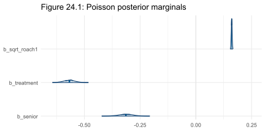

The three posterior slabs sit well away from zero. The `sqrt_roach1` coefficient is positive and narrow, near 0.16 on the log scale, confirming that pre-treatment count is the strongest predictor. The treatment coefficient is negative near $-0.57$, and the senior coefficient is negative near $-0.31$. The tight widths are the first warning sign: a Poisson model has no free dispersion parameter, so all uncertainty gets funnelled into the slopes.

### Poisson posterior predictive checks

The posterior predictive check shows what simulated datasets from the fitted Poisson model look like compared to the observed data. This is Figure 24.2.

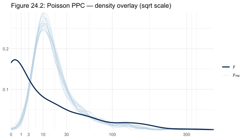

The observed density (dark line) has a long right tail extending past counts of 100 and a sharp mass near zero. The twenty light-blue replicate densities from the Poisson model cluster tightly near low counts and never come close to reproducing the observed tail. The gap between the observed curve and the replicates above counts of about 10 is the visual signature of overdispersion: the Poisson variance is too small.

The rootogram in Figure 24.3 makes the same point in discrete form.

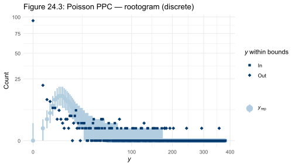

A suspended rootogram plots the square root of counts so that bars near zero don't dominate. The observed bars (dropping below the fitted curve at low counts, and hanging above it at high counts) show that the Poisson model predicts too few zeros and far too few large observations. The deficit at the right tail is substantial; the model predicts essentially no apartments with more than 30 roaches, while the data has many.

### Poisson LOO-CV

LOO-CV removes one observation at a time, refits the model, and evaluates the log predictive density for the held-out point. The sum over all observations gives the **elpd** (expected log predictive density). Higher elpd means better predictive accuracy.

```
Computed from 4000 by 262 log-likelihood matrix.

         Estimate     SE
elpd_loo  -5453.9  692.7
p_loo       246.8   52.1
```

The `p_loo` of 247 against a model with 4 fixed parameters is the diagnostic number here. When `p_loo` far exceeds the number of parameters, it means the model is forcing individual observations to carry implausibly large leave-one-out importance weights. The Poisson model is so misspecified that each observation provides almost no predictive information about any other, and PSIS-LOO (Pareto-smoothed importance sampling, the efficient leave-one-out estimator) degrades accordingly: 15 observations have Pareto $k > 0.7$, indicating that the importance weights for those points aren't reliable.

The covariate-dropping comparison (dropping each predictor in turn) is still informative. The table below summarizes it.

| Model | elpd_diff | SE | p_worse |
|---|---|---|---|
| Poisson, all predictors | 0.0 | 0.0 | |
| Poisson, drop `senior` | −8.5 | 174.9 | 0.52 |
| Poisson, drop `treatment` | −220.2 | 223.3 | 0.84 |
| Poisson, drop `sqrt_roach1` | −2755.9 | 634.4 | 1.00 |

Pre-treatment count dominates predictive performance: dropping it costs 2,756 elpd units and the probability it performs worse is 1.00. Treatment matters too. Senior status is noise at this sample size, but we keep it in subsequent models because it changes the zero-inflation structure.

---

### The negative binomial model

The **negative binomial** family adds a free **dispersion parameter** $\phi$ (called `shape` in brms). It relaxes the Poisson constraint that $\text{Var}(y_i) = \mu_i$ to $\text{Var}(y_i) = \mu_i + \mu_i^2/\phi$. Larger $\phi$ means less extra-Poisson variance. We update the Poisson fit:

```r
fit_nb <- update(fit_p, family = negbinomial,
                 save_pars = save_pars(all = TRUE),
                 chains = 2, seed = 298465)
```

Diagnostics pass: Rhat $\leq 1.006$, bulk ESS $\geq 993$. The posterior marginals shift noticeably (Figure 24.4).

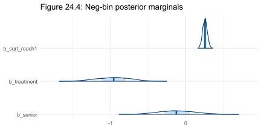

The three slabs have shifted and widened relative to the Poisson marginals in Figure 24.1. The `sqrt_roach1` coefficient moves up to about 0.26, the treatment effect deepens to near $-0.96$, and the senior coefficient, which was clearly negative under Poisson, now straddles zero with substantial mass on both sides. The widening reflects the honest uncertainty that a dispersion parameter introduces: with $\phi$ free, the slopes absorb less of the count variability, so their posteriors spread out.

The shape parameter posterior is in Figure 24.11.

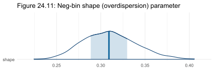

The shape (dispersion) parameter $\phi$ has its posterior concentrated near 0.35 to 0.45, far below 1. Values this small indicate severe overdispersion relative to Poisson. The narrow posterior width tells us the data is highly informative about how much overdispersion there is.

The negative binomial PPC dens overlay (Figure 24.5) and rootogram (Figure 24.6) both show a much better fit.

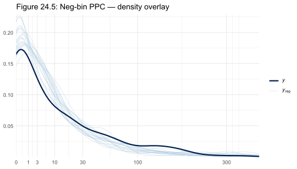

The twenty replicates now wrap tightly around the observed density across the full count range. The right tail is captured, the zero region is close, and there's no longer a systematic gap between replicated and observed distributions.

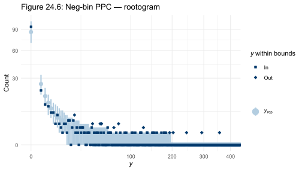

The rootogram bars are much closer to the fitted curve. Some discrepancy remains at the zero count, where the model slightly underestimates the zero mass. That gap is the first hint that a zero-inflated model might improve things further.

The LOO numbers confirm the improvement:

```
         Estimate   SE
elpd_loo   -881.8 38.3
p_loo         8.3  3.6
```

`p_loo` of 8.3 for a 5-parameter model is entirely reasonable. The comparison against Poisson:

```
   model elpd_diff se_diff p_worse
 Neg-bin       0.0     0.0
 Poisson   -4572.1   672.7    1.00
```

4,572 elpd units is an enormous gap. The Poisson model is thoroughly rejected on predictive grounds.

The LOO-PIT-ECDF (Figure 24.10) and reliability diagram (Figure 24.12) reveal the residual structure.

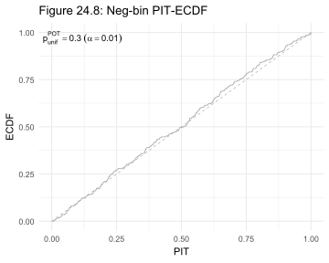

The PIT-ECDF for posterior predictive checks shows how the observed data ranks within the predictive distribution at each observation. A well-calibrated model produces a PIT-ECDF that stays close to the diagonal. The negative binomial PIT-ECDF curves slightly above the diagonal at low PIT values, indicating that the model assigns a bit too much probability to low counts, consistent with the slight underprediction of zeros in the rootogram.

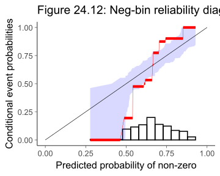

The reliability diagram plots the model's predicted probability of a non-zero count against the empirically observed rate of non-zero counts within bins of predicted probability. The dots here lie close to the diagonal for mid-range predictions but deviate at the extremes, particularly near predicted probability 1.0, where the model is overconfident. This calibration gap motivates the zero-inflation extension.

---

### The Poisson model with varying intercepts

The negative binomial borrows variance across all observations through a single shape parameter. Another approach is to give each apartment its own random intercept, absorbing apartment-level idiosyncracy directly. This is the **Poisson varying-intercept** model:

$$
\log(\mu_i) = \alpha + z_i + \beta_1 \cdot \sqrt{\text{roach1}_i} + \beta_2 \cdot \text{treatment}_i + \beta_3 \cdot \text{senior}_i + \log(\text{exposure2}_i)
$$

where $z_i \sim \text{Normal}(0, \sigma_z)$ is a per-apartment random intercept with $\sigma_z$ estimated from data. We use extended sampling to get adequate ESS across all 262 varying intercepts:

```r
fit_pvi <- brm(
  y ~ sqrt_roach1 + treatment + senior + (1 | id) + offset(log(exposure2)),
  data    = roaches, family  = poisson,
  warmup  = 1000, iter = 5000, thin = 4,
  backend = "cmdstanr", seed = 298465
)
```

The estimated `sigmaz` from the integrated-LOO version (§6 below) is approximately 2.0, meaning the apartment-level intercepts span roughly $\pm 4$ log-rate units. That's a huge amount of apartment-to-apartment variation, which explains why the model has 262 extra parameters and why `p_loo` of 164 far exceeds the number of fixed effects.

The fixed-effect posteriors shift again (Figure 24.13), now toward slightly more extreme values.

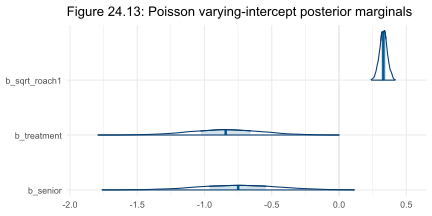

The three fixed-effect slabs are now wider and shifted: `sqrt_roach1` rises to about 0.33, treatment deepens to about $-0.84$, and senior is negative near $-0.75$ with most mass below zero. The widening relative to the negative binomial reflects partial pooling: the random intercepts absorb idiosyncratic variation, so the slopes are estimated from the residual structure rather than from raw counts.

The LOO diagnosis for this model is the chapter's methodological lesson:

```
         Estimate   SE
elpd_loo   -628.2 24.0
p_loo       163.9  4.4
```

The raw PSIS-LOO elpd of $-628$ looks better than the negative binomial's $-882$. But the Pareto $k$ values tell the real story: 77% of observations have $k > 0.7$, meaning the importance weights are unreliable. When every observation has its own intercept, removing that observation from the posterior leaves its intercept entirely unidentified. PSIS-LOO can't recover from that. The correct evaluation requires K-fold cross-validation, which refits the model on $K-1$ folds and evaluates on the held-out fold, but that's computationally expensive. The chapter's conclusion is that the varying-intercept model almost certainly overfits: each apartment is described so flexibly that it reveals little about unobserved apartments.

---

### Integrated LOO for the varying-intercept Poisson

The chapter's most elegant move is to analytically integrate out the apartment-level random effects from the LOO likelihood, making PSIS-LOO reliable again. For observation $i$, the marginal predictive density under leave-one-out is:

$$
p(y_i \mid y_{-i}) = \int p(y_i \mid z_i, \mu_i) \, p(z_i \mid \sigma_z, \mu_i) \, dz_i
$$

where the integration over $z_i$ is performed numerically using `integrate_1d` in Stan's generated quantities block. This requires a custom Stan file rather than brms, because brms can't express per-observation 1D quadrature in generated quantities:

```r
mod_p_vi <- cmdstanr::cmdstan_model("poisson_vi_integrate.stan")
fit_p_vi <- mod_p_vi$sample(
  data = datap, chains = 4, parallel_chains = 4,
  iter_sampling = 8000, thin = 8, seed = 298465
)
```

The fixed-effect posteriors from the integrated model (Figure 24.19) agree closely with the brms varying-intercept fit:

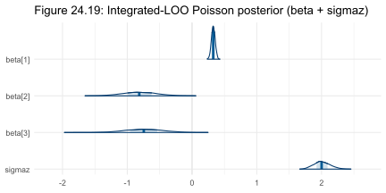

The four posterior slabs for $\beta_1$ (sqrt\_roach1), $\beta_2$ (treatment), $\beta_3$ (senior), and $\sigma_z$ are all well-concentrated. The treatment effect sits near $-0.81$ with the slab entirely below zero. The $\sigma_z$ slab is centered near 2.0 with a narrow width, confirming that apartment-level variation is large and well-estimated.

Now that the likelihood is integrated, PSIS-LOO works:

```
         Estimate   SE
elpd_loo   -878.3 38.2
p_loo         4.7  0.5
```

`p_loo` of 4.7 for a model with 4 fixed parameters is excellent: the integration is working. All Pareto $k$ values are below 0.7. And the LOO comparison with the negative binomial is essentially a tie:

```
                     model elpd_diff se_diff p_worse
 Poisson var. int. int-LOO       0.0     0.0
                   Neg-bin      -3.5     7.5    0.68
```

A difference of 3.5 elpd units with a standard error of 7.5 is not meaningful. The two models predict new observations equally well. The varying-intercept Poisson and the negative binomial are competing descriptions of the same overdispersion phenomenon: one models it explicitly through a shared dispersion parameter, the other through per-observation latent effects.

The LOO-PIT-ECDF (Figure 24.20) and reliability diagram (Figure 24.21) show the integrated model's calibration.

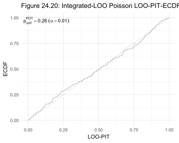

The LOO-PIT-ECDF stays close to the diagonal across the full range, with only minor departures in the tails. This is better than the negative binomial's PIT in Figure 24.8, particularly at low PIT values where the negative binomial was slightly off.

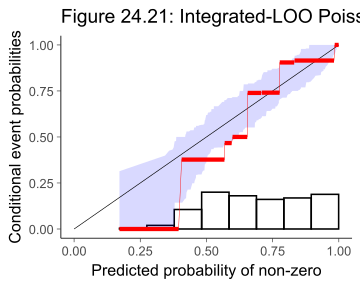

The reliability diagram shows the integrated model's predicted non-zero probabilities against observed non-zero rates. The dots are more tightly aligned with the diagonal than in the negative binomial diagram (Figure 24.12), particularly near predicted probability 1.0 where the negative binomial was overconfident. The remaining deviations are small and within sampling noise.

---

### The zero-inflated negative binomial

The reliability diagrams for both the negative binomial and the integrated Poisson showed a non-zero zero-calibration gap. The zero-inflated negative binomial (**ZINB**) addresses this by treating each apartment as coming from a mixture of two processes: a point mass at zero (structural zero, perhaps because the apartment has no roaches at all) and a negative binomial count process.

The mixture weight $\pi_i$ is itself modeled with a logistic regression on the same predictors:

$$
p(y_i) = \pi_i \cdot \mathbf{1}[y_i = 0] + (1 - \pi_i) \cdot \text{NegBin}(y_i \mid \mu_i, \phi)
$$

where $\pi_i = \text{logistic}(\gamma_0 + \gamma_1 \cdot \sqrt{\text{roach1}_i} + \gamma_2 \cdot \text{treatment}_i + \gamma_3 \cdot \text{senior}_i + \log(\text{exposure2}_i))$.

We use `brms::bf()` to specify both sub-models jointly:

```r
fit_zinb <- brm(
  bf(
    y  ~ sqrt_roach1 + treatment + senior + offset(log(exposure2)),
    zi ~ sqrt_roach1 + treatment + senior + offset(log(exposure2))
  ),
  family  = zero_inflated_negbinomial(),
  prior   = priors_zinb,
  backend = "cmdstanr", seed = 298465
)
```

Diagnostics pass cleanly: Rhat $\leq 1.003$, bulk ESS $\geq 1927$, no divergences.

The ZINB LOO:

```
         Estimate   SE
elpd_loo   -859.2 37.9
p_loo        10.3  2.8
```

The comparison with the negative binomial:

```
   model elpd_diff se_diff p_worse
    ZINB       0.0     0.0
 Neg-bin     -22.6     6.9    1.00
```

The ZINB beats the negative binomial by 22.6 elpd units with a standard error of 6.9. The probability that the negative binomial performs worse is 1.00. That's a meaningful, consistent difference. The zero-inflation structure is earning its parameters.

### ZINB posterior analysis

The full posterior for the ZINB model is in Figure 24.26.

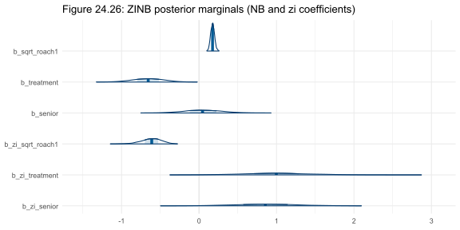

The eight coefficient slabs show the count component (top four) and zero-inflation logistic component (bottom four). In the count sub-model, `sqrt_roach1` is positive at about 0.18 and treatment is negative at about $-0.66$. In the zero-inflation sub-model, the pattern reverses: `zi_sqrt_roach1` is strongly negative near $-0.62$ (higher pre-treatment counts reduce the probability of structural zero), and `zi_treatment` is positive near 1.0 (treatment increases the probability of structural zero). The senior coefficient in the zero-inflation component is positive near 0.86, meaning elderly-building apartments are more likely to be structurally zero. The count and zero-inflation components each capture part of the story.

### Treatment effect

The treatment effect is ultimately what the pest-control company cares about. We compute the ratio of expected roach counts with treatment to without treatment, averaged over all apartments and all posterior draws. Figure 24.27 shows this ratio for the ZINB model.

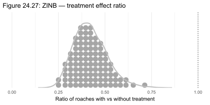

The dot-and-slab display for the ZINB treatment ratio is concentrated below 1.0 with most mass between 0.3 and 0.6, indicating a 40% to 70% reduction in expected roach counts due to treatment. The dotted line at 1.0 is well to the right of the posterior mass. The slab shows the full distribution is smooth and unimodal, with no substantial probability above 1.0.

Figure 24.28 compares all three main models.

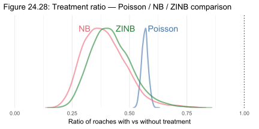

The three density curves for the treatment ratio differ substantially. The Poisson curve is much narrower than the other two, centered near 0.55, reflecting the artificially small posterior uncertainty of a model with no dispersion parameter. The negative binomial and ZINB curves are wider and centered lower, near 0.35 to 0.45. The Poisson model is not just wrong about the count distribution; it's also overconfident about the treatment effect. The negative binomial and ZINB agree on the treatment direction but assign more uncertainty to its magnitude.

---

### LOO comparison: does the treatment term earn its place?

We fit a ZINB without treatment in either sub-model and compare via LOO.

```
              model elpd_diff se_diff p_worse
    ZINB full model       0.0     0.0
 ZINB w/o treatment      -8.6     4.7    0.97
```

Dropping treatment costs 8.6 elpd units, with $p_\text{worse} = 0.97$. The treatment variable earns its place.

---

### Prior sensitivity

We check whether the ZINB treatment ratio is sensitive to the choice of prior using [priorsense](https://cran.r-project.org/package=priorsense)'s power-scaling approach, which inflates and deflates the prior and likelihood by small powers and measures how much the posterior shifts.

```
 variable prior likelihood
    ratio  0.06       0.15
```

Prior sensitivity of 0.06 means that scaling the prior up or down by a small factor barely moves the posterior treatment ratio. Likelihood sensitivity of 0.15 is larger, as expected: the data is informative about the treatment effect. The diagnosis of "potential prior-data conflict" is flagged at this sensitivity level but is mild. The $\text{normal}(0,1)$ slope prior is consistent with the data for this model.

---

## How the Models Evolved

The table below summarizes how the model families accumulate through the analysis.

| Model | New parameter | Prior | Reasoning |
|---|---|---|---|
| Poisson | $\alpha, \beta_1, \beta_2, \beta_3$ | $\text{Normal}(0, 1)$ on slopes | Flat-ish prior; let the data determine direction |
| Negative binomial | $\phi$ (shape) | brms default inverse-gamma | Adds free dispersion; PPC showed Poisson variance too small |
| Poisson + varying intercept | $z_i, \sigma_z$ | $z_i \sim \text{Normal}(0, \sigma_z)$ | Absorbs apartment-level heterogeneity directly |
| ZINB | $\pi_i$ (zero-inflation weight) | $\text{Normal}(0, 1)$ on logistic slopes | Reliability diagram showed zero-calibration gap in NB |

---

## How RBayesflow Guided the Analysis

1. **Goal declaration (Phase 1):** `init_workflow(mode = "practice")` set up the workflow state object and `assess_offramps()` confirmed the Bayesian path.
2. **Prior specification (Phase 2):** `wf$priors_objects` stored the $\text{normal}(0,1)$ priors for all four model families, recording the reasoning in the audit trail.
3. **Model fitting (Phase 3):** We called `brm()` directly for all brms models and `cmdstanr` directly for the integrated-LOO Poisson, because the per-observation `integrate_1d` call in the generated quantities block can't be expressed through brms formula interfaces. Each fit was registered with `record_fit(wf, fit)` before diagnostics.
4. **Diagnostics (Phase 4):** `run_diagnostics()` checked Rhat, bulk ESS, tail ESS, divergences, BFMI, and max treedepth for each brms fit. All models passed except `fit_pvi` (Rhat = 1.010 at the 1.01 threshold, flagged as marginal). Divergence-and-parameterization detection logged centered vs non-centered parameterization for the varying-intercept model.
5. **Posterior predictive checks (Phase 5):** `pp_check()` produced density overlays and rootograms for each model, making the Poisson overdispersion visible and the NB zero-calibration gap visible.
6. **LOO-CV (Phase 6):** `add_criterion(fit, "loo")` computed PSIS-LOO for all brms models. For the varying-intercept Poisson, PSIS-LOO is unreliable because each observation's random intercept is identified only by that observation; the integrated LOO via cmdstanr and `loo::loo()` on the extracted log-likelihood matrix was the solution. K-fold CV for `fit_pvi` was noted as the gold standard but was omitted due to computation time.
7. **Reporting (Phase 7):** `guide(wf)` confirmed completion and `export_context(wf)` wrote the final `wf_context.json` for Posit Assistant.

---

## Extensions for the Student

- **Rootogram practice.** Add `type = "rootogram"` to `pp_check()` for `fit_nb` and `fit_zinb` separately, then compare where the bars hang above and below the fitted envelope. `bayesplot::ppc_rootogram()` also works directly. The NB should show a small deficit at zero; the ZINB should eliminate it.
- **Covariate sensitivity.** Try dropping `senior` from the ZINB count sub-model but keeping it in the zero-inflation sub-model. Does the LOO comparison change? Is the senior effect stronger in one sub-model than the other?
- **Alternative link for zero-inflation.** brms allows a `cloglog` link for the zero-inflation component via `zi ~ ... + link("cloglog")`. Fit this variant and compare LOO to the logit-link ZINB. The cloglog link is asymmetric and may fit the heavy upper tail better.
- **Power-scale sensitivity by coefficient.** Run `priorsense::powerscale_sensitivity(fit_zinb)` without restricting to the ratio variable. Which coefficient is most prior-sensitive? Is it the zero-inflation intercept, where the prior has the most leverage?
- **Full K-fold evaluation for `fit_pvi`.** Run `brms::kfold(fit_pvi, K = 10)`. The book reports `elpd_kfold` near $-622$, very close to the integrated-LOO result. Verify this and compare the two estimates. The K-fold run takes around 30 minutes on four chains.

---

## Glossary

**[Bayesian workflow](https://arxiv.org/abs/2011.01808):** The iterative process of building, checking, and revising probabilistic models, as described by Gelman et al. (2020). It alternates between model fitting, predictive checking, and comparison rather than treating a single model as the final answer.

**[bayesplot](https://mc-stan.org/bayesplot/):** An R package providing diagnostic and posterior predictive check plots for Stan and brms models. Used here for `ppc_dens_overlay`, `ppc_rootogram`, and `mcmc_areas`.

**[brms](https://paul-buerkner.github.io/brms/):** An R package that compiles formula-specified Bayesian regression models to Stan. Supports a wide range of family arguments, including `poisson`, `negbinomial`, and `zero_inflated_negbinomial`, as well as `bf()` for multi-formula models.

**[cmdstanr](https://mc-stan.org/cmdstanr/):** The R interface to CmdStan, Stan's command-line tool. Used here for the integrated-LOO model because it allows custom Stan code not expressible through brms formula interfaces.

**Dispersion parameter ($\phi$):** The shape parameter of the negative binomial distribution. It controls extra-Poisson variance: $\text{Var}(y) = \mu + \mu^2/\phi$. Very small values of $\phi$ indicate severe overdispersion relative to Poisson.

**E-BFMI (Energy Bayesian Fraction of Missing Information):** A diagnostic for HMC samplers that measures how well the sampler explores the energy distribution. Values below 0.3 indicate the sampler may be struggling; values near 2.0 as seen here indicate healthy exploration.

**[elpd (expected log predictive density)](https://mc-stan.org/loo/reference/loo-glossary.html):** The sum of log predictive densities for held-out observations. Higher (less negative) elpd means better predictive accuracy. Differences in elpd between models are compared against their standard error to judge significance.

**ESS (effective sample size):** The number of effectively independent draws from the posterior, accounting for autocorrelation in the MCMC chain. Bulk ESS should exceed 100 per chain; values above 400 are comfortable.

**[integrate\_1d](https://mc-stan.org/docs/functions-reference/1d_integrators.html):** A Stan built-in function that performs 1D adaptive Gaussian quadrature. Used here to integrate out the per-apartment random effect from the LOO likelihood, making PSIS-LOO reliable for the varying-intercept model.

**[K-fold cross-validation](https://mc-stan.org/loo/reference/kfold-helpers.html):** A model evaluation method that partitions the data into $K$ folds, fits the model on $K-1$ folds, and evaluates predictive accuracy on the held-out fold, repeating $K$ times. More expensive than PSIS-LOO but reliable when PSIS-LOO's importance weights are unstable.

**[loo](https://mc-stan.org/loo/):** An R package implementing PSIS-LOO and related methods. The `loo()` function computes elpd, `loo_compare()` compares models, and `E_loo()` computes LOO-weighted expectations for diagnostics like reliability diagrams.

**LOO-CV (leave-one-out cross-validation):** A predictive evaluation strategy that holds out one observation at a time and evaluates how well the model predicts it from the rest. Approximated efficiently using PSIS without refitting.

**LOO-PIT-ECDF:** The empirical CDF of probability integral transform values computed using LOO predictive distributions. A well-calibrated model produces an LOO-PIT-ECDF close to the diagonal. Departures at low PIT values indicate the model assigns too much probability to low counts.

**Negative binomial distribution:** A count distribution that extends the Poisson by adding a free variance parameter. It can be derived as a Poisson distribution whose rate parameter is itself gamma-distributed. The variance is $\mu + \mu^2/\phi$, always at least as large as the Poisson variance $\mu$.

**Offset:** A covariate whose coefficient is fixed at 1 rather than estimated. Used here to account for variation in trap exposure time: `offset(log(exposure2))` means the model estimates count rates per trap-day rather than raw counts.

**[Overdispersion](https://en.wikipedia.org/wiki/Overdispersion):** A condition where observed count data have more variance than the fitted model predicts. Poisson models are particularly prone to this because they constrain variance to equal the mean.

**p\_loo (LOO effective number of parameters):** An estimate of how many effective parameters the model uses from the LOO perspective. A `p_loo` far larger than the number of actual parameters signals model misspecification or that some observations have very high leverage.

**[Pareto $k$ diagnostic](https://mc-stan.org/loo/reference/pareto-k-diagnostic.html):** A per-observation diagnostic for PSIS-LOO reliability. Values above 0.7 indicate that the importance weights for that observation are unreliable, and LOO estimates for such observations should be treated with caution. Very high $k$ values (above 1) mean PSIS-LOO is completely unreliable for those points.

**PIT (probability integral transform):** The probability assigned by the model to an observation being less than or equal to its actual value. Under a well-calibrated model, PIT values are uniformly distributed. Deviations from uniformity indicate miscalibration.

**Poisson distribution:** The standard count distribution, parameterised by rate $\lambda$ (mean count per unit exposure). Its key constraint, that variance equals mean, is almost always violated in ecological count data, making it a useful baseline that fails informatively.

**[priorsense](https://cran.r-project.org/package=priorsense):** An R package for prior sensitivity analysis using power-scaling. It inflates and deflates the prior and likelihood by a small power $\alpha$ and measures how much the posterior shifts, without refitting.

**PSIS (Pareto-smoothed importance sampling):** The importance-sampling algorithm underlying LOO-CV in the loo package. It smooths the tails of the importance-weight distribution using a generalized Pareto fit, making the estimates more stable than raw importance sampling.

**`record_fit()`:** An RBayesflow function that registers a fitted `brmsfit` object in the `wf_state` by computing and storing a hash of the formula and data. Required before calling `run_diagnostics()`.

**Reliability diagram:** A calibration plot that bins predicted probabilities and compares them against observed event rates. A perfectly calibrated model produces dots along the diagonal. Used here to check whether the models' predicted zero-count probabilities match observed zero rates.

**[Rhat ($\hat{R}$)](https://mc-stan.org/rstan/reference/Rhat.html):** A convergence diagnostic that compares within-chain to between-chain variance. Values above 1.01 suggest that the chains have not converged. All models here had Rhat $\leq 1.006$.

**Rootogram:** A diagnostic plot for count models that hangs observed count bars from the fitted expected curve (suspended rootogram). Counts are on a square-root scale to prevent small counts from dominating. Bars hanging below the x-axis indicate the model overpredicts that count; bars above indicate underprediction.

**`wf_state`:** The central R object in RBayesflow, an S3 list that stores the workflow phase, mode, fitted model hash, diagnostic results, and audit trail. It is serialized to `wf_context.json` after each phase for Posit Assistant to read.

**Zero-inflated model:** A mixture model that combines a point mass at zero with a standard count distribution. Appropriate when zeros arise from two distinct processes: structural zeros (the outcome is impossible in that context) and sampling zeros (the outcome is possible but didn't occur).

**[Zero-inflated negative binomial (ZINB)](https://paul-buerkner.github.io/brms/reference/zero_inflated_negbinomial.html):** A combination of zero-inflation and the negative binomial count process. Used here because the roach data has both a heavy right tail (requiring negative binomial dispersion) and excess zeros (requiring a structural zero component)
