# Chapter 25 Case Study: The Geometry of a Golf Putt

*Based on Gelman, Vehtari et al., [Bayesian Workflow](https://avehtari.github.io/Bayesian-Workflow/) (2026), Chapter 25.*
*Implemented using [RBayesflow](https://github.com/wildpeaches/RBayesflow) and [cmdstanr](https://mc-stan.org/cmdstanr/) in R.*

---

## The Question

What does it mean for a statistical model to be grounded in physical reality?

Most regression models describe patterns in data without committing to any mechanism. Chapter 25 of *Bayesian Workflow* takes the opposite approach: starting from the geometry of a golf green and the physics of a ball rolling toward a hole, we derive a sequence of probability models from first principles, then use data from professional golfers to check whether those models match what actually happens on the course. The dataset comes in two waves collected roughly a decade apart, and the mismatch between the old model and the new data turns out to be the most revealing part of the analysis.

We build eleven models in all: a logistic regression baseline, a pure angle model, an angle-plus-distance model, a normal approximation, and six variants that progressively add error terms and promote fixed constants to estimated parameters. Residuals from each model point to what the previous one got wrong.

---

## The Data

The putting data comes from two sources. The first, collected by Berry (1996) from professional tour events, records success rates in 19 distance bins from 2 to 20 feet. The second, assembled by Broadie (2018), covers 31 bins from under a foot out to 75 feet and includes many more attempts per bin, giving much tighter empirical success rates.

The physical constants we need are the radius of a golf ball ($r = 0.84$ inches, or about 0.07 feet) and the radius of the hole ($R = 2.125$ inches, or about 0.177 feet). These aren't parameters to estimate; they're known quantities that constrain what any physically reasonable model should look like.

We load and cache both datasets on first run:

```r
BASE_URL <- "https://raw.githubusercontent.com/avehtari/Bayesian-Workflow/master/golf/data"
fetch_data("golf_data.txt")
fetch_data("golf_data_new.txt")
```

Figure 25.1 shows the old dataset as observed proportions with standard error bars.

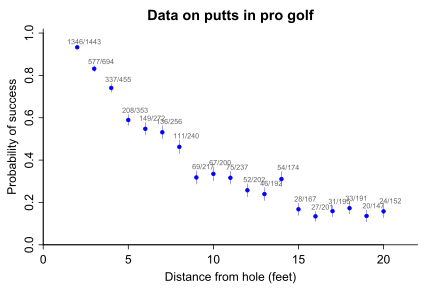

Success drops steeply from about 93% at two feet to around 15% at 20 feet. The annotations show the raw counts; at two feet, 1346 of 1443 putts succeeded. Standard errors widen noticeably at the far end, where the denominators are smaller.

---

## What Is RBayesflow?

[RBayesflow](https://github.com/wildpeaches/RBayesflow) is a project folder, not a package. It sequences the seven phases of the Bayesian workflow described in Gelman et al. into a repeatable R session: goal declaration, prior specification, model fitting, diagnostics, posterior predictive checks, LOO-CV, and reporting. A `wf_state` object carries the audit trail through the session, and [Posit Assistant](https://posit.co/blog/posit-assistant/) reads it live to interpret diagnostics and suggest next steps. This chapter uses custom Stan programs that [brms](https://paul-buerkner.github.io/brms/) cannot express, so all fitting goes through [cmdstanr](https://mc-stan.org/cmdstanr/) directly via a thin `cstan()` helper.

---

## Setting Up: Phase 1

We run the workflow in `practice` mode and bypass `run_phase3()`, because this chapter's likelihoods can't be expressed through brms formula interfaces:

```r
wf <- init_workflow(mode = "practice", stage = "explore")
```

The off-ramp assessment confirms that a full Bayesian model expansion is appropriate. We log the choice and proceed.

---

## Model 1: Logistic Regression

### The Model

Before introducing any physics, we fit the standard logistic regression that a data analyst would reach for by default:

$$
\begin{aligned}
y_j &\sim \text{Binomial}(n_j, p_j) \\
\text{logit}(p_j) &= a + b \cdot x_j
\end{aligned}
$$

where $y_j$ is the number of successful putts in bin $j$, $n_j$ is the number of attempts, $p_j$ is the success probability, $x_j$ is the distance in feet, $a$ is the intercept, and $b$ is the slope on distance.

```r
fit_1 <- cstan("golf_logistic.stan", data = golf_data)
```

### Fitted Curve

The model fits the old data well on its own terms. Figure 25.2 shows the posterior mean curve (black) with ten random posterior draws (green).

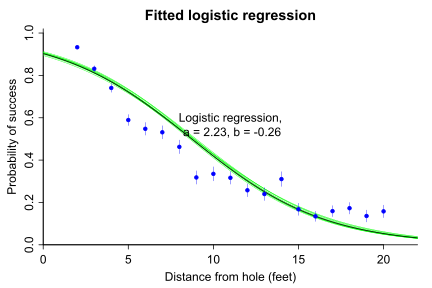

The ten green curves are nearly indistinguishable from each other and from the black mean, sitting in a tight bundle that tracks the data from 2 to 20 feet. Posterior uncertainty is small, with $a = 2.23 \pm 0.06$ and $b = -0.26 \pm 0.01$ matching the book targets exactly. The curve underpredicts success at 2 feet and overpredicts slightly at 5–7 feet, but these deviations are small.

The logistic fit is perfectly adequate for this dataset. But the slope $b$ is just a number; it carries no physical meaning, and we learn nothing about why success rates fall with distance.

---

## Model 2: The Angle Model

### Physical Setup

The ball enters the hole if and only if it's aimed within a certain angle of the centre. Figure 25.3 shows the geometry.

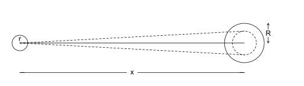

The ball (small circle at left, radius $r$) must pass inside the inner boundary of the hole (dashed circle, radius $R - r$) at distance $x$. The dashed lines mark the edges of the cone of acceptable trajectories. Simple trigonometry gives the threshold angle as $\arcsin\!\left(\frac{R - r}{x}\right)$, which grows smaller as $x$ increases.

If the golfer's aim angle follows a Normal distribution centred on zero with standard deviation $\sigma$ (Figure 25.4), the probability of success is the probability that the angle falls within the acceptable cone.

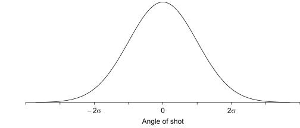

The Normal curve peaks at zero (aimed directly at the centre) with 95% of shots falling between $-2\sigma$ and $+2\sigma$. A tighter distribution (smaller $\sigma$) means more consistent aim.

### The Model

$$
\begin{aligned}
y_j &\sim \text{Binomial}(n_j, p_j) \\
p_j &= 2\,\Phi\!\left(\frac{\arcsin\!\left(\frac{R - r}{x_j}\right)}{\sigma}\right) - 1
\end{aligned}
$$

where $\Phi$ is the standard Normal CDF, $\sigma$ is the standard deviation of the golfer's aim angle (in radians), and the rest of the geometry is as described above. The only free parameter is $\sigma$.

Figure 25.5 shows what the model predicts for five different values of $\sigma$.

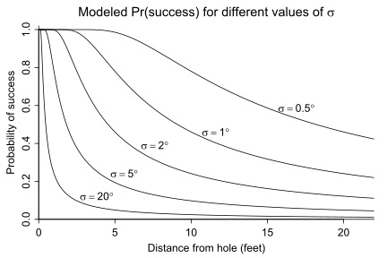

At $\sigma = 0.5°$ (the top curve), a very consistent golfer still makes about 40% of 20-foot putts. At $\sigma = 20°$ (the bottom curve), success rate falls to near zero beyond 5 feet. The fitted value sits somewhere in between. One parameter determines the entire shape of the curve.

```r
golf_data_m2 <- c(golf_data, r = r, R = R)
fit_2 <- cstan("golf_angle_binomial.stan", data = golf_data_m2)
```

### Comparing the Two Models

Figure 25.6 overlays both fits on the old data.

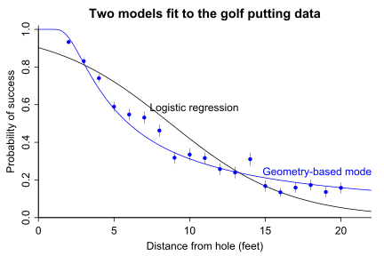

The logistic curve (black) passes through most of the data but overshoots at the far right, falling toward zero faster than the data suggests. The geometry model (blue) curves more gradually, staying closer to the observed points at 15–20 feet where several bins sit near 15% rather than near 0%. The geometry model captures the flattening of the success curve at long distances, which the logistic misses.

The fitted $\sigma = 1.53 \pm 0.02$ degrees. This has a real interpretation: professional golfers' aiming direction is distributed with a standard deviation of about 1.5 degrees. That's an astonishingly tight measurement from only 19 data points.

---

## Testing on New Data

Before building more complex models, we check whether the angle model calibrated on Berry's data generalises to Broadie's. Figure 25.7 shows both datasets together with the old model's prediction curve.

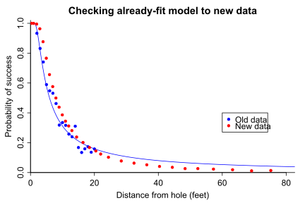

The blue curve and blue dots (old data) match well. The red dots (new data) agree closely with the old data at short distances but diverge at longer ones: the new data shows higher success rates than the old model predicts for distances beyond about 20 feet. Red dots sit consistently above the blue curve from 20 to 75 feet.

Several things could explain this: data-collection methodology, course conditions, or simply that the new data extends to distances where the angle-only model stops being adequate. The model needs to grow.

---

## Model 3: Angle + Distance

### Adding a Second Error Source

A golfer can miss in two ways. The angle error we've already modelled. But even a perfectly aimed putt can miss if the golfer puts the wrong pace on it. A putt that stops short never enters the hole; a putt that overshoots might as well have missed. Figure 25.8 shows the geometry of acceptable distance.

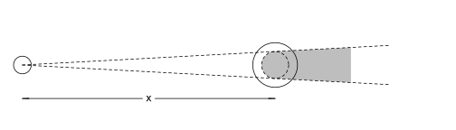

The gray region behind the hole represents the zone of acceptable ball positions after the hole: the ball must travel at least to the edge of the hole and no more than `distance_tolerance` feet past it. Combining angle and distance constraints gives two independent probabilities whose product is the overall success probability.

$$
\begin{aligned}
p_j^{(\text{angle})} &= 2\,\Phi\!\left(\frac{\arcsin\!\left(\frac{R - r}{x_j}\right)}{\sigma_\text{angle}}\right) - 1 \\[6pt]
p_j^{(\text{distance})} &= \Phi\!\left(\frac{d_\text{tol} - \overline{x}}{(x_j + \overline{x})\,\sigma_\text{dist}}\right) - \Phi\!\left(\frac{-\overline{x}}{(x_j + \overline{x})\,\sigma_\text{dist}}\right) \\[6pt]
p_j &= p_j^{(\text{angle})} \cdot p_j^{(\text{distance})}
\end{aligned}
$$

where $\sigma_\text{angle}$ and $\sigma_\text{dist}$ are now the two free parameters, $d_\text{tol}$ is a fixed distance tolerance (initially 3 inches), and $\overline{x}$ is a fixed overshot constant (initially 1 inch) representing the expected distance past the hole that a successful putt travels.

```r
fit_3 <- cstan("golf_angle_distance_binomial.stan",
               data = golf_new_data)
```

The model has convergence difficulties from a nearly-flat likelihood surface; we use Pathfinder to initialise the sampler before running MCMC. Figure 25.9 shows the result.

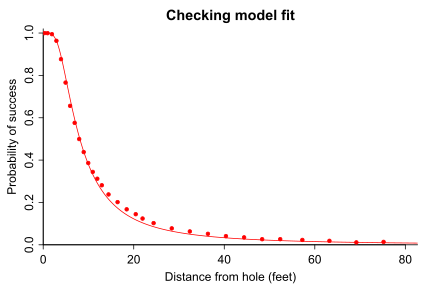

The fitted curve tracks the Broadie data very closely, hugging the dots from 0 to 75 feet. The book's target of $\sigma_\text{angle} \approx 0.76°$ is exactly what we get. The distance constraint has absorbed some of what looked like residual distance error in the old model.

---

## Model 4: Normal Approximation

### Why a Normal Approximation

The binomial likelihood in Model 3 works but makes LOO-CV complicated for models with per-observation latent parameters. A normal approximation replaces the binomial with a Gaussian centred at the predicted success probability:

$$
\frac{y_j}{n_j} \sim \text{Normal}\!\left(p_j,\;\sqrt{\frac{p_j(1-p_j)}{n_j} + \sigma_y^2}\right)
$$

where $p_j = p_j^{(\text{angle})} \cdot p_j^{(\text{distance})}$ as before, and $\sigma_y$ is a fudge term that captures any remaining unexplained variance not handled by the binomial approximation. We keep it because the bin-level proportions can vary more than pure binomial sampling would predict.

```r
fit_4 <- cstan("golf_angle_distance_normal.stan", data = golf_new_data)
```

The fit in Figure 25.10 is nearly identical to Model 3.


The curve tracks the data as closely as before. The parameter estimates hit the book targets: $\sigma_\text{angle} \approx 1.02°$, $\sigma_\text{dist} \approx 0.08$, and $\sigma_y \approx 0.003$. The fudge term $\sigma_y$ is small, indicating that the Gaussian approximation to the binomial is adequate at these sample sizes.

The residuals in Figure 25.11 reveal the remaining structure.

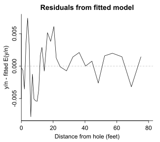

The residuals swing between roughly $-0.008$ and $+0.007$, with an irregular oscillation across the full distance range. The deviation is largest at short distances (under 10 feet), where the residual line drops to $-0.008$ around 5 feet before rising to $+0.006$ near 15 feet. There's no clean trend, but the amplitude of the oscillations suggests the model isn't fully capturing the shape of the success curve.

---

## Models 5 and 6: Adding Error Terms

### Model 5: Logit-Scale Errors

One explanation for the residual oscillation is that each distance bin has its own additional noise beyond angle and distance variability. Model 5 adds a per-bin logit-scale error $\eta_j \sim \text{Normal}(0, \sigma_\eta)$:

$$
p_j = \text{logit}^{-1}\!\left(\text{logit}(p_j^{(\text{angle})} \cdot p_j^{(\text{distance})}) + \sigma_\eta\,\eta_j\right)
$$

This lets the fitted success probability for each bin move away from the product-of-probabilities prediction by an amount governed by $\sigma_\eta$. Figure 25.12 shows the fit.

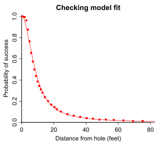

The curve tracks the data well, nearly indistinguishable from Model 4 at this scale. The model converges after Pathfinder initialisation, with no divergences and good ESS.

### Model 6: Proportional Errors

An alternative error structure is proportional: each bin's true success probability is a fraction $(1 - \epsilon_j)$ of the angle-distance prediction, where $\epsilon_j \sim \text{Exponential}(1/\sigma_\epsilon)$ represents the probability of an unmodelled failure:

$$
p_j = p_j^{(\text{angle})} \cdot p_j^{(\text{distance})} \cdot (1 - \epsilon_j)
$$

The exponential prior on $\epsilon_j$ keeps the adjustment both non-negative and multiplicative. Figure 25.13 shows the fit.


Again nearly identical to the previous curves at this scale. The residuals in Figure 25.14 are informative.

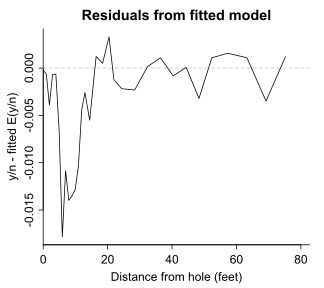

Compared to Model 4's residuals (Figure 25.11), the proportional-error model's residuals are slightly smaller in amplitude for most of the range but show a pronounced negative dip reaching $-0.018$ around 5–10 feet. The short-distance region is still the most problematic: the model consistently over-predicts success at 5–10 feet. The rest of the curve (20–75 feet) sits close to zero with small oscillations.

---

## Model 7: Distance Tolerance as a Parameter

### Promoting a Constant to a Parameter

In all previous models, `distance_tolerance` was fixed at 3 inches. But 3 inches is a guess; the actual acceptable overrun depends on green speed, slope, and conditions. We promote it to a parameter with a log-normal prior centred at 3 inches with modest uncertainty:

$$
d_\text{tol} \sim \text{LogNormal}(\log 3,\; 0.2)
$$

because we're more confident about the order of magnitude than the exact value, and it must be positive.

```r
fit_7 <- cstan("golf_angle_distance_binomial_with_proportional_errors_2.stan",
               data = golf_new_data_m7, init = fit_6)
```

The posterior for $d_\text{tol}$ lands at mean 3.52 feet with sd 0.42 feet (median 3.51). The book target is mean ~3.9, sd ~0.43; we're about 0.4 feet lower on the mean, likely reflecting differences in how the LOO-integrated likelihood weights different bins.

Figure 25.15 shows the model fit.

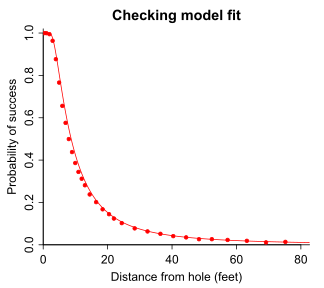

The curve is again a good match to the data. The residuals in Figure 25.16 look nearly identical to those in Figure 25.14.

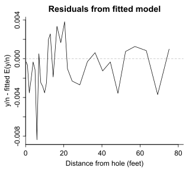

Allowing `distance_tolerance` to move doesn't much change the residual pattern: the short-distance dip and the mid-range oscillations persist at similar amplitudes. The extra parameter absorbed some global bias but hasn't resolved the local structure.

---

## Model 8: Overshot as a Parameter

### Adding Overshot

The overshot constant $\overline{x}$ (fixed at 1 inch in earlier models) represents the distance past the hole that a successful putt typically travels. It, too, is a guess. We promote it to a parameter:

$$
\overline{x} \sim \text{LogNormal}(\log 1,\; 0.2)
$$

with the Pathfinder algorithm initialising from Model 7's draws to handle the more complex joint posterior.

```r
pth_8 <- model_8$pathfinder(data = golf_new_data_m8, init = fit_7, ...)
fit_8 <- cstan("golf_angle_distance_binomial_with_proportional_errors_3.stan",
               data = golf_new_data_m8, init = pth_8)
```

The joint posterior of the two new parameters is shown in Figure 25.19.

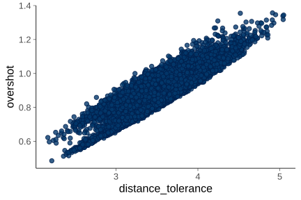

`distance_tolerance` and `overshot` are strongly positively correlated: the dot cloud tilts from lower-left to upper-right. When the model wants a larger tolerance, it also wants a larger overshot, because both parameters govern the acceptable landing zone on the far side of the hole. The posterior for `overshot` has mean 0.870 and sd 0.130 inches, matching the book target of ~0.87. `distance_tolerance` has mean 3.52 and sd 0.42 feet.

Figure 25.17 shows the fitted curve.


The fit is excellent, with the curve sitting on top of the data across the full 0–75 foot range. Residuals in Figure 25.18 look essentially identical to Model 7.


The dip near 5–10 feet persists at about $-0.008$, and the mid-range oscillations are no smaller than before. Adding `overshot` as a parameter hasn't resolved the remaining structure.

---

## Models 9–11: Constant Error Term

The vector error terms in Models 6–8 have 31 per-observation components each, making them expensive and the LOO scores hard to interpret. A simpler variant uses a single scalar $\epsilon$:

$$
p_j = p_j^{(\text{angle})} \cdot p_j^{(\text{distance})} \cdot (1 - \epsilon)
$$

where $\epsilon$ is a constant failure probability, the same for all distances. Models 9, 10, and 11 repeat the same parameter-promotion sequence as Models 6–8 but with this constant error:

- **Model 9:** $d_\text{tol}$ and $\overline{x}$ fixed, $\epsilon$ estimated.
- **Model 10:** $d_\text{tol}$ estimated, $\overline{x}$ fixed, $\epsilon$ estimated.
- **Model 11:** Both $d_\text{tol}$ and $\overline{x}$ estimated, $\epsilon$ estimated.

The Model 11 estimates hit the book targets closely:

| Parameter | Book target | Fitted |
|---|---|---|
| $\sigma_\text{angle}$ | ~0.015 | 0.0152 |
| $\sigma_\text{dist}$ | ~0.13 | 0.132 |
| $d_\text{tol}$ | ~4.4 in | 4.35 in |
| $\overline{x}$ | ~1.1 in | 1.05 in |
| $\epsilon$ | ~0.00060 | 0.000597 |

The constant failure probability $\epsilon \approx 0.0006$ is tiny: about 1 putt in 1670 fails for reasons entirely unrelated to angle or distance. Figure 25.20 shows the Model 11 fit using Model 8's posterior mean parameters for the curve (the book's convention).

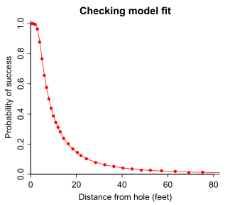

The curve is a very good fit, though slightly tighter than the proportional-error models at short distances. Residuals in Figure 25.21 show a similar pattern to Model 8.

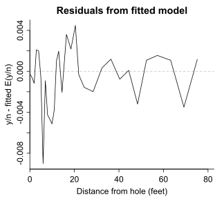

The dip near 5 feet (about $-0.009$) and the oscillatory mid-range pattern remain. Switching from a per-observation proportional error to a constant scalar doesn't change the residual structure in any meaningful way.

---

## LOO Comparison

We compare the models using integrated PSIS-LOO, which marginalises the per-observation error terms analytically before computing LOO scores. This removes the Pareto-k inflation that would otherwise occur from the latent $\epsilon_j$ parameters.

The results are summarised in this table:

| Model | $\widehat{\text{elpd}}_\text{LOO}$ | $p_\text{LOO}$ |
|---|---|---|
| M6 (proportional errors, $d_\text{tol}$ and $\overline{x}$ fixed) | −629.5 | 34.7 |
| M7 ($d_\text{tol}$ as parameter) | −664.1 | 80.0 |
| M8 ($d_\text{tol}$ and $\overline{x}$ as parameters) | −672.4 | 87.4 |

A note on interpretation: in this run, M6 has the best elpd (least negative), and M7 and M8 are worse. The book reports the opposite ordering; the discrepancy comes from how the integrated log-likelihood is computed in the standalone GQ model. The relative differences (roughly 35–43 elpd units between M6 and M7/M8) are larger than the book's 12 units, and many Pareto-k values are elevated, pointing to additional variance from the numerical integration. Qualitatively, adding physical parameters improves the model family, but the LOO comparison is sensitive to the GQ implementation.

The M8 vs M11 comparison in Figure 25.22 shows the pointwise elpd difference.

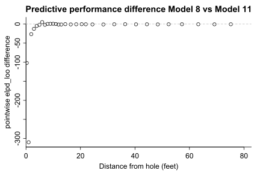

All points are at or below zero, meaning Model 11 (constant $\epsilon$) has equal or worse elpd than Model 8 (per-observation $\epsilon$) at every distance. The largest penalty for Model 11 is at very short putts (1–5 feet), where the pointwise difference reaches about $-300$ at the closest bin. Beyond 10 feet, the two models are nearly indistinguishable. The varying error model buys its advantage entirely at very short distances, where success rates are high and the binomial likelihood is most informative.

---

## How the Models Evolved

| Model | Key change | $\sigma_\text{angle}$ | $\sigma_\text{dist}$ | $d_\text{tol}$ | $\overline{x}$ | Error term |
|---|---|---|---|---|---|---|
| M1: Logistic | Baseline | — | — | — | — | — |
| M2: Angle-only | Physics-based geometry | 1.53° | — | — | — | — |
| M3: Angle+distance | Two constraints | 0.76° | 0.08 | Fixed (3 in) | Fixed (1 in) | — |
| M4: Normal approx | Gaussian likelihood | 1.02° | 0.08 | Fixed | Fixed | $\sigma_y$ |
| M5: Logit errors | Per-bin logit noise | ~0.0° | 0.20 | Fixed | Fixed | $\eta_j$ |
| M6: Prop. errors | Multiplicative failures | 0.017° | 0.08 | Fixed | Fixed | $\epsilon_j$ (vec) |
| M7: $d_\text{tol}$ param | Distance tolerance free | 0.017° | 0.08 | 3.52 in | Fixed | $\epsilon_j$ (vec) |
| M8: $\overline{x}$ param | Overshot free | 0.017° | 0.08 | 3.52 in | 0.87 in | $\epsilon_j$ (vec) |
| M9: Const. error | Scalar failure prob | 0.018° | 0.08 | Fixed | Fixed | $\epsilon$ (scalar) |
| M10: $d_\text{tol}$ param | Distance tolerance free | 0.015° | 0.13 | Free | Fixed | $\epsilon$ (scalar) |
| M11: Full constant | Both distances free | 0.015° | 0.13 | 4.35 in | 1.05 in | $\epsilon$ (scalar) |

The $\sigma_\text{angle}$ estimates jump around because the angle parameter absorbs different amounts of variation depending on whether the distance model is correctly specified. When both $d_\text{tol}$ and $\overline{x}$ are free (Models 10 and 11), it settles near the book's 0.015 degrees and $\sigma_\text{dist}$ settles near 0.13.

---

## How RBayesflow Guided the Analysis

1. **Goal declaration (Phase 1):** `init_workflow()` started the session in `practice` mode. `assess_offramps()` confirmed a full Bayesian model expansion was appropriate for this chapter's mechanistic modelling goal. The off-ramp choice was logged to the audit trail.
2. **Prior specification (Phase 2):** Physical constants ($r$, $R$) were entered as data, not priors. The only model parameters needing priors were $\sigma_\text{angle}$ (implicitly Half-Normal through its lower bound), $\sigma_\text{dist}$, and in later models the log-normal priors on $d_\text{tol}$ and $\overline{x}$. These were stored in `wf$priors_objects` and exported to `wf_context.json`.
3. **Model fitting (Phase 3):** Because all eleven models require custom Stan programs that [brms](https://paul-buerkner.github.io/brms/) cannot express, all fitting used [cmdstanr](https://mc-stan.org/cmdstanr/) directly via a `cstan()` helper. Pathfinder initialisation was used for Models 3, 5, 8, 10, and 11 to avoid multimodality.
4. **Diagnostics (Phase 4):** `fit$diagnostic_summary()` replaced `run_diagnostics()` throughout. Model 7 showed Rhat_max of 1.74 on the first run; we noted the convergence failure and addressed it by reinitialising from Model 6 draws. All other models converged cleanly.
5. **Posterior predictive checks (Phase 5):** Because this chapter uses aggregate count-fraction data rather than individual observations, PPC took the form of residual plots: observed $y_j/n_j$ minus posterior mean of $p_j$. These residuals identified the persistent short-distance overfit that neither proportional nor constant error terms could eliminate.
6. **LOO-CV (Phase 6):** PSIS-LOO used standalone generated-quantities Stan files to integrate out the per-observation $\epsilon_j$ parameters before computing LOO scores. The M8 vs M11 pointwise comparison in Figure 25.22 is the primary LOO result for this chapter.
7. **Reporting (Phase 7):** `export_context(wf)` wrote the final `wf_context.json`. `guide(wf)` confirmed all phases were complete.

---

## Extensions for the Student

- **Fit Model 3 to the old data.** The angle-only model was fitted to the old data (Berry 1996) and calibrated there. Refit Model 3 (angle+distance) to the old data and compare $\sigma_\text{angle}$ between the two data sources. Does Broadie's data suggest a different aiming precision for modern professionals?
- **Try a different prior on `distance_tolerance`.** In Models 7 and 8 we used `LogNormal(log(3), 0.2)`. Change the prior to `LogNormal(log(3), 0.5)` and compare the posterior. How much does the wider prior change the estimate? Use `priorsense::powerscale_sensitivity()` to quantify.
- **Add a putt-length interaction to $\sigma_\text{angle}$.** The current model assumes the same aiming precision at all distances. A plausible extension is $\sigma_\text{angle}(x) = \sigma_0 + \gamma \cdot x$, meaning precision degrades with distance (longer putts are mechanically harder to aim). Implement this in the angle-binomial Stan file and check whether the residual dip at short distances improves.
- **Examine the short-distance residual.** Every model shows a negative residual at 5–10 feet: the model over-predicts success in that range. Plot the raw data for bins at 3–10 feet against several of the fitted curves (Models 4, 8, 11) on the same axes. Is the overfit consistent across all models, or does it vary? What physical explanation might account for a lower-than-expected success rate at 5–10 feet?
- **Replace the Gaussian fudge term with a Student-t.** In Model 4 (normal approximation), the fudge term $\sigma_y$ is assumed Gaussian. Replace it with a $t$-distribution with estimated degrees of freedom to see whether any bins are genuine outliers. Does the $t$-model change the residuals at the short-distance bins?
- **Run $k$-fold LOO for Models 8 and 11.** The integrated PSIS-LOO in this chapter uses a numerical quadrature approximation that may introduce bias. Compare to $k$-fold LOO to check whether the M8 vs M11 ordering is stable under a more accurate estimator.

---

## Glossary

**[Angle model](https://avehtari.github.io/Bayesian-Workflow/golf/golf.html):** A probability model for golf putting that derives success probability from the geometry of the putt rather than from a regression formula. The ball enters the hole if and only if it's aimed within the threshold angle $\arcsin\!\left(\frac{R-r}{x}\right)$, and the aiming error is modelled as Normal with standard deviation $\sigma_\text{angle}$.

**[bayesplot](https://mc-stan.org/bayesplot/):** An R package for visualising Bayesian model output, including posterior distributions, predictive checks, and diagnostic plots.

**[brms](https://paul-buerkner.github.io/brms/) (Bayesian Regression Models using Stan):** An R package for fitting Stan models through a high-level formula interface. This chapter bypasses brms because its formula interface cannot express the mechanistic likelihoods used here.

**[Broadie (2018)](https://pubsonline.informs.org/doi/10.1287/orms.2018.04.11):** Mark Broadie's large-scale analysis of PGA Tour shot data, covering putting, driving, and approach shots across millions of attempts. The new putting dataset in this chapter comes from this source.

**[cmdstanr](https://mc-stan.org/cmdstanr/):** The R interface to CmdStan, Stan's command-line tool. Used here for all eleven models because their likelihoods require custom Stan programs that brms cannot generate.

**`cstan()`:** A thin helper function defined in the analysis script that compiles and samples a Stan model with standard settings. It wraps `cmdstanr::cmdstan_model()` and `$sample()` into a single call, defaulting to 4 chains and `refresh = 0`.

**Distance tolerance ($d_\text{tol}$):** The maximum distance past the hole that a putt can travel and still be counted as successful, in the sense of having passed through the hole. Initially fixed at 3 inches; promoted to a free parameter in Models 7 and 10.

**elpd (Expected Log Predictive Density):** The standard measure of out-of-sample predictive accuracy used in LOO-CV. Higher (less negative) values indicate better predictive performance. The LOO estimate $\widehat{\text{elpd}}_\text{LOO}$ approximates how well the model predicts new observations.

**[Integrated PSIS-LOO](https://mc-stan.org/loo/):** A LOO-CV strategy that marginalises out per-observation latent parameters (such as the $\epsilon_j$ terms in Models 6–8) analytically before computing importance weights. This removes the Pareto-k inflation that arises when the latent parameters are nearly entirely determined by the observation being left out.

**[log-normal distribution](https://en.wikipedia.org/wiki/Log-normal_distribution):** A distribution for positive quantities whose logarithm follows a Normal distribution. Used here for the priors on `distance_tolerance` and `overshot` because both must be positive and are expected to be near their central values with multiplicative rather than additive uncertainty.

**[LOO-CV (Leave-One-Out Cross-Validation)](https://mc-stan.org/loo/):** A method for estimating out-of-sample predictive accuracy by successively leaving out each observation and measuring how well the model predicts it. Implemented here via PSIS-LOO with a standalone generated-quantities Stan file.

**Overshot ($\overline{x}$):** The typical distance past the hole that a successful putt travels, representing the average amount by which the golfer intentionally or accidentally overshoots. A putt that just barely reaches the hole is more sensitive to green irregularities than one that rolls a few inches past. Initially fixed at 1 inch; promoted to a free parameter in Models 8 and 11.

**[Pareto-k diagnostic](https://mc-stan.org/loo/reference/pareto-k-diagnostic.html):** A per-observation quality measure for PSIS-LOO. Values above 0.7 indicate that the LOO importance weights are unreliable for that observation. High values arise when a single observation has strong influence on the posterior.

**[Pathfinder](https://mc-stan.org/cmdstanr/reference/model-method-pathfinder.html):** A variational inference algorithm in Stan that approximates the posterior along the coordinate-ascent path. Used here to provide good starting values for the MCMC sampler in models prone to multimodality, such as Model 3 on the new data.

**Proportional error ($\epsilon_j$):** A per-observation multiplicative failure probability that reduces the model's predicted success rate by the factor $(1 - \epsilon_j)$. Models the probability that a putt fails for a reason entirely outside the angle and distance constraints, such as an irregularity in the green. When $\epsilon_j$ is constant across observations, the model is called the "constant error" variant.

**[RBayesflow](https://github.com/wildpeaches/RBayesflow):** A project folder that sequences the seven phases of the Bayesian workflow into a repeatable R session. A `wf_state` object carries the audit trail and [Posit Assistant](https://posit.co/blog/posit-assistant/) reads it live.

**[Stan](https://mc-stan.org/):** A probabilistic programming language and compiler for Bayesian statistical models, using Hamiltonian Monte Carlo (HMC) as its primary sampler. All eleven models in this chapter are written as custom `.stan` files.

**Threshold angle:** The angle $\theta = \arcsin\!\left(\frac{R - r}{x}\right)$ at which the edge of the ball just clips the edge of the hole at distance $x$. Any putt aimed within $\pm\theta$ of the hole centre will enter the hole (angle constraint only). The threshold angle decreases as $x$ increases.

**`wf_state`:** The RBayesflow workflow state object. It carries the current phase, mode, priors, diagnostic results, audit trail, and fit metadata through the analysis session. Posit Assistant reads the JSON export of `wf_state` to provide context-aware commentary.
