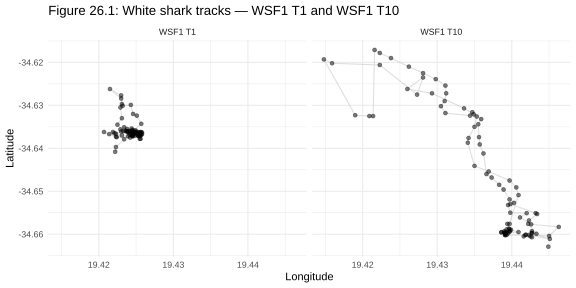
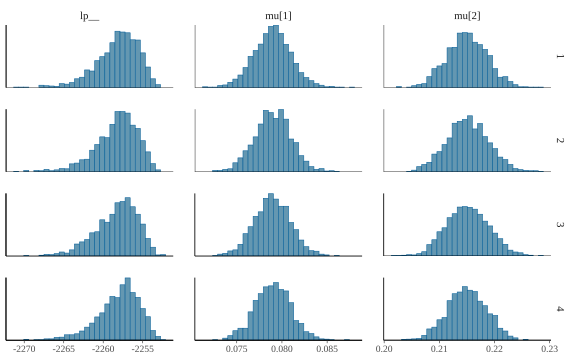
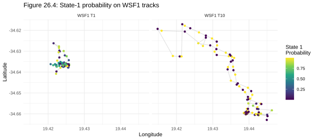
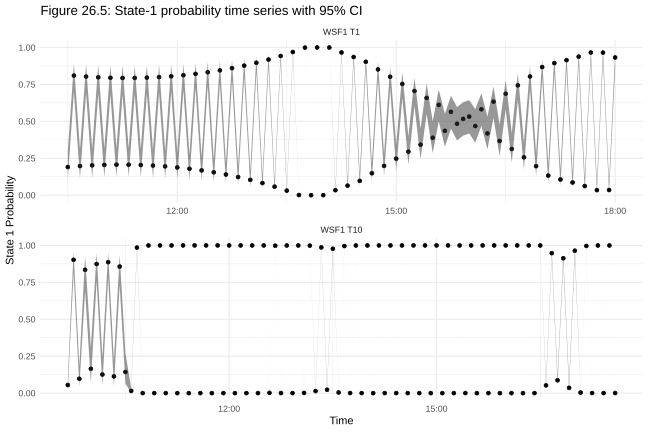
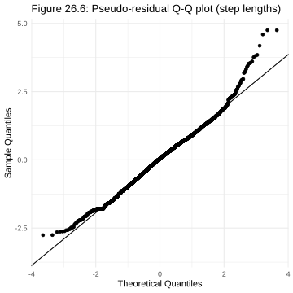
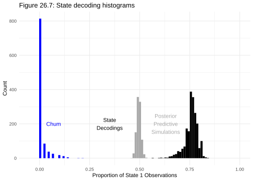

# Chapter 26 Case Study: Markov Models for Animal Movement

*Based on Gelman, Vehtari et al., [Bayesian Workflow](https://avehtari.github.io/Bayesian-Workflow/sharks/sharks.html) (2026), Chapter 26.*
*Implemented using RBayesflow and [cmdstanr](https://mc-stan.org/cmdstanr/) in R.*

---

## The Question

When a shark slows down and starts circling, is it hunting, resting, or just responding to something in the water?

That question sounds like field biology, and it is. It's also a statistical problem. GPS tags on white sharks record a position every few minutes, but the tags can't record intent. All we have are the positions: how far the animal moved between fixes, and how sharply it turned. From those two numbers alone, we want to infer what the shark was doing at each moment, which environmental cues drove it, and whether males and females behave differently when chum is in the water.

This chapter fits a sequence of [hidden Markov models](https://en.wikipedia.org/wiki/Hidden_Markov_model) (HMMs) to GPS tracking data from white sharks off Gansbaii, South Africa. An HMM assumes the animal is always in one of a small number of unobserved behavioral states, and that what we actually measure, step length and turning angle, is a noisy signal from whichever state the animal happens to be in. We build three models. The first estimates the state-dependent movement distributions. The second asks whether transition rates between states depend on time of day, sex, and the presence of chum. The third adds individual-level random effects so each shark can have its own baseline tendency to switch states.

---

## The Data

The dataset comes from [Towner et al. (2016)](https://besjournals.onlinelibrary.wiley.com/doi/10.1111/1365-2435.12613), who tracked white sharks off Gansbaii using GPS satellite tags. After excluding two problematic tracks (WSF9 T3 B and WSF9 T4, which contained systematic positioning artefacts), 4,584 observations across 76 tracks remain. Each observation gives a longitude and latitude. We compute step lengths and turning angles from those positions using [moveHMM](https://cran.r-project.org/package=moveHMM)'s `prepData()` function, which handles the great-circle geometry correctly. Step lengths are in kilometres; turning angles in radians, centred at zero for a straight-ahead step.

836 of the 4,584 step lengths are missing or flagged as outliers (step length greater than 1.5 km, which almost certainly reflects a positioning error rather than real movement). We encode those as −100 and skip them in the likelihood.

---

## What Is RBayesflow?

RBayesflow is a set of R scripts, Quarto templates, and a workflow state object (`wf_state`) that sequences the Bayesian workflow described in Gelman et al. (2020) into reproducible phases. It isn't a package; it's a project folder you run interactively. Posit Assistant reads the live `wf_state` object and offers phase-appropriate guidance. This chapter is the first in the series where Phase 3 (model fitting) bypasses [brms](https://paul-buerkner.github.io/brms/) entirely and calls [cmdstanr](https://mc-stan.org/cmdstanr/) directly, because HMMs marginalise over discrete latent states in a forward algorithm that brms can't generate from a formula interface. The rest of the RBayesflow phases, initialisation, diagnostics, and context export, run as normal.

---

## Setting Up: Phase 1

We initialise the workflow in practice mode because we already have a well-specified biological question and prior knowledge from the HMM literature.

```r
wf <- init_workflow(mode = "practice", stage = "explore")
```

Phase 1 normally calls `assess_offramps()` to offer non-Bayesian alternatives with equal weight. Here those alternatives would be the [moveHMM](https://cran.r-project.org/package=moveHMM) or [momentuHMM](https://cran.r-project.org/package=momentuHMM) maximum-likelihood HMMs. We note that choice and proceed, because the chapter's interest is in full posterior uncertainty over transition probabilities and individual random effects, which the frequentist alternatives don't provide without bootstrapping.

The GPS tag positions reveal something about scale right away. This is Figure 26.1.



WSF1 T1 (left panel) stays compressed into a small area: the point cloud spans roughly 0.02 degrees of latitude and 0.02 degrees of longitude, consistent with an animal spending most of its time near the Dyer Island seal colony. WSF1 T10 (right panel) shows a more dispersed cloud drifting south over a larger range, with a clearer linear excursion in the lower half of the track. Both tracks show the tight clustering that motivates a two-state model: there's an area-restricted state and a directed-travel state.

---

## Model 1: Baseline Two-State HMM

### The Model

Each observation at time $t$ has a step length $s_t \geq 0$ and a turning angle $\theta_t \in [-\pi, \pi]$. The latent state $z_t \in \{1, 2\}$ evolves as a Markov chain with transition probability matrix

$$
\Gamma = \begin{pmatrix} \gamma_{11} & \gamma_{12} \\ \gamma_{21} & \gamma_{22} \end{pmatrix}
$$

where $\gamma_{ij}$ is the probability of moving from state $i$ to state $j$ in one time step. The state-dependent distributions are:

$$
\begin{aligned}
s_t \mid z_t = k &\sim (1 - \pi_k) \cdot \text{Gamma}(\alpha_k, \beta_k) + \pi_k \cdot \delta_0 \\
\theta_t \mid z_t = k &\sim \text{vonMises}(\mu_k^\theta, \kappa_k)
\end{aligned}
$$

- $\pi_k$ is the zero-mass probability for state $k$; exact zeros occur when the animal doesn't move between consecutive fixes.
- $\alpha_k = \mu_k^2 / \sigma_k^2$ and $\beta_k = \mu_k / \sigma_k^2$ are the Gamma shape and rate, reparameterised through the mean $\mu_k$ and standard deviation $\sigma_k$ of the step-length distribution.
- $\mu_k^\theta$ is the mean turning angle and $\kappa_k \geq 0$ is the von Mises concentration, a larger value indicating tighter clustering around the mean direction.

The Gamma parameters are identified by imposing `positive_ordered` on $\mu$: state 1 always has the smaller mean step length, which prevents the two states from swapping labels across chains.

### Choosing the Priors

We set state-specific priors on $\mu$ because a pooled prior would let chains settle in different basins during warmup:

$$
\begin{aligned}
\mu_1 &\sim \text{Normal}(0.08, 0.05) \\
\mu_2 &\sim \text{Normal}(0.35, 0.12)
\end{aligned}
$$

State 1 is centered near 80 m (area-restricted search) and state 2 near 350 m (directed travel). Both are consistent with white shark HMM estimates from the literature. We tighten the standard deviation prior to $\sigma_k \sim \text{Exponential}(5)$, which has mean 0.2 km and puts 95% of its mass below 0.6 km, because a diffuse prior on $\sigma$ can widen the Gamma distributions until they overlap completely, destroying state separation during warmup.

The von Mises components are parameterised in Cartesian form ($x_k$, $y_k$) rather than directly in $(\mu_k^\theta, \kappa_k)$ because Stan's sampler handles the circular boundary at $\pm\pi$ poorly in polar coordinates:

$$
\mu_k^\theta = \text{atan2}(y_k, x_k), \qquad \kappa_k = \sqrt{x_k^2 + y_k^2}
$$

$$
x_k \sim \text{Normal}(0, 2), \qquad y_k \sim \text{Normal}(0, 1)
$$

Each row of the transition matrix gets a $\text{Dirichlet}(2, 2)$ prior, which encourages persistence without forcing it.

### Fitting

The likelihood marginalises over all possible state sequences using the forward algorithm in the Stan model block. There is no explicit state vector in the parameters; only the HMM parameters are sampled.

```r
fit_2stateHMM <- model_2stateHMM$sample(
  data          = stanHMM_2states,
  init          = hmm_inits,
  chains        = 4,
  iter_warmup   = 2000,
  iter_sampling = 2000,
  seed          = 42
)
```

### Diagnostics

We check chain agreement on the $\mu$ parameters first, because those are where label-switching would show up. This is Figure 26.2.



All four chains produce nearly identical histograms for both `mu[1]` and `mu[2]`. The `mu[1]` histograms are centred between 0.075 and 0.085, with `mu[2]` histograms centred between 0.20 and 0.23. There's no sign of bimodality or chain-to-chain displacement. The `lp__` histograms (log posterior density) are likewise aligned across chains. Rhat = 1.002 and ESS_bulk_min = 3,577 confirm clean mixing.

### State-Dependent Distributions

Figure 26.3 shows 1,000 posterior draws of the Gamma density for step lengths (left) and the von Mises density for turning angles (right).


The orange (state 1) step-length curves peak sharply near zero and fall quickly; the posterior mean $\mu_1 = 0.079$ km confirms a tight slow-movement distribution. The blue (state 2) curves are broader, shifted right, and consistent with $\mu_2 = 0.215$ km. The two distributions overlap but are clearly distinct, which is what makes the hidden-state inference informative rather than arbitrary. On the turning-angle panel, state 1 shows a diffuse distribution with mass spread across all directions, consistent with tortuous search behaviour. State 2 is sharply concentrated near zero, indicating that directed-travel steps tend to continue in the same direction.

---

## Local State Decoding

Once the model is fit, we run the forward-backward algorithm in the generated quantities block to compute $P(z_t = 1 \mid \mathbf{s}, \boldsymbol{\theta})$ at each time step. Figure 26.4 maps that probability onto the GPS tracks for WSF1.



The viridis colour scale runs from dark purple (state 1 probability near 0, directed travel) to yellow (state 1 probability near 1, area-restricted search). WSF1 T1 (left) shows most points in the yellow-to-green range, indicating predominantly area-restricted behaviour with the animal staying near the colony. WSF1 T10 (right) shows a stronger gradient: the southern excursion visible in Figure 26.1 appears here in dark purple, confirming that the linear drift was classified as directed travel, while the denser cluster at the top of the track is mostly yellow and green.

Figure 26.5 shows the same state-1 probability as a time series with 95% credible intervals.



The ribbon in the WSF1 T1 panel (bottom) oscillates rapidly between near-0 and near-1, with moderate ribbon width across the session, indicating the model is uncertain at many individual time steps but confidently identifies periods of sustained area-restricted behaviour. WSF1 T10 (top panel) shows a longer uninterrupted stretch near zero early in the track, corresponding to the southern directed-travel segment in Figure 26.4, followed by a return to oscillating state-1 probabilities.

---

## Checking the Model: Pseudo-Residuals

A [pseudo-residual](https://doi.org/10.1111/j.1541-0420.2009.01244.x) converts each observation's one-step-ahead predictive CDF value to a standard normal quantile. If the model is correctly specified, pseudo-residuals should look like a standard normal sample and the Q-Q plot should follow the diagonal. This is Figure 26.6.



The central portion of the Q-Q plot, roughly from theoretical quantile −2 to +2, tracks the reference line closely, suggesting the model captures the bulk of the step-length distribution well. The upper tail lifts noticeably above the line at theoretical quantiles above 2.5, with sample quantiles reaching up to 5. This indicates the model under-predicts large step lengths; there are more very long steps in the data than the zero-inflated Gamma predicts. The residual heavy tail comes from steps in the 0.5–1.5 km range that the Gamma shape parameter doesn't fully capture, because steps above 1.5 km were excluded as outliers before fitting. The lower tail also deviates slightly, likely due to zero-mass steps that the mixture probability $\pi_k$ handles approximately but not exactly.

---

## Model 1 vs. Prior Predictive: State Decoding Comparison

Figure 26.7 compares three distributions of the proportion of state-1 time in the first WSF1 track (91 observations): posterior predictive simulations (grey), the FFBS state-sequence sample (black), and state-1 decoding of chum-present time points (blue).



The grey posterior predictive histogram is centred around 0.6 and spreads across 0.3–0.85, capturing prior uncertainty about how much time an average shark spends in state 1. The black histogram of actual decoded states is substantially tighter and shifted right, with a mode around 0.75, meaning the observed data concentrates state-1 assignment more than the predictive distribution would suggest. The blue chum histogram is compressed near zero, meaning nearly all chum-present observations were decoded as state 2 (directed travel), not state 1. That's the biological signal we're after: the presence of chum is associated with the directed-travel state, not area-restricted search.

---

## Model 2: Covariates in the Transition Matrix

### The Model

Model 2 keeps the same state-dependent distributions as Model 1 but makes the transition matrix time-varying. The off-diagonal elements are linked to covariates via a multinomial-logit:

$$
\gamma_{ij}(t) = \frac{\exp(\eta_{ij}(t))}{\sum_{j'} \exp(\eta_{ij'}(t))}
$$

where $\eta_{ij}(t) = \mathbf{c}_t^\top \boldsymbol{\beta}_{ij}$ and $\mathbf{c}_t$ is the covariate vector at time $t$. We include four predictors (plus intercept): chum presence (0/1), sex (0 = female, 1 = male), cosine of time of day, and sine of time of day. The cosine and sine pair encodes a smooth 24-hour cycle without assuming a specific peak hour.

$$
\boldsymbol{\beta}_{ij} \sim \text{Normal}(0, 2)
$$

This prior is weakly informative on the logit scale: a coefficient of 2 corresponds to a roughly 7-fold change in odds.

### Results

Rhat_max = 1.0004 and ESS_bulk_min = 3,081. The covariate model converges as cleanly as the baseline. We don't display a separate parameter summary here because the covariate effects are best read from the tpm ribbon plots in Model 3.

---

## Model 3: Individual Random Effects

### The Model

Model 2 estimates a single population-level intercept for each transition direction. Model 3 adds a per-shark random intercept:

$$
\eta_{ij}(t) = \underbrace{\mu_{ij} + \sigma_{ij} \cdot z_{ij,\text{shark}(t)}}_{\text{individual intercept}} + \mathbf{c}_t^\top \boldsymbol{\beta}_{ij}
$$

where $z_{ij,s} \sim \text{Normal}(0, 1)$ are the standardised random effects and $\sigma_{ij} \geq 0$ is the between-shark standard deviation. This is the non-centred parameterisation: we sample $z_{ij,s}$ on the standard normal scale and shift and scale inside the `transformed parameters` block. The non-centred form is needed because the data per shark are sparse enough that the centred version would produce funnel geometry in the posterior.

We run a single chain, as the book does, because fitting four chains with individual random effects across 76 tracks on the full dataset is expensive and the single-chain NCP model converges reliably.

```r
fit_2stateHMM_tpmcov_crencp <- model_2stateHMM_tpmcov_crencp$sample(
  data          = stanHMM_2states_tpmcov_crencp,
  chains        = 1,
  iter_warmup   = 2000,
  iter_sampling = 2000,
  seed          = 42
)
```

Rhat_max = 1.0023, ESS_bulk_min = 407. Single-chain diagnostics are by definition within-chain, so we focus on ESS: 407 effective samples for the most constrained parameter is adequate for the visualisations below.

### Transition Probabilities Across the Day

Figures 26.8 and 26.9 show 100 posterior draws of each tpm entry across the day, separately for males and females (no chum).


For males (Figure 26.8), the diagonal entries $\omega_{11}(t)$ and $\omega_{22}(t)$ dominate, with both persistence probabilities staying above 0.8 throughout the day. The off-diagonal entries are small, generally below 0.2. The grey spaghetti lines for $\omega_{12}(t)$ and $\omega_{21}(t)$ show moderate posterior spread, indicating genuine uncertainty about whether the state-switching rate varies with time of day in this sex and chum-absence condition.


Figure 26.9 shows the female tpm across the same time window. The overall pattern is similar to males in terms of which entries dominate, but the off-diagonal entries $\omega_{12}(t)$ and $\omega_{21}(t)$ show a broader posterior spread and a clearer visual suggestion of a midday elevation. Both figures share the same y-axis range of 0 to 1, so the comparison is direct.

Figures 26.10 and 26.11 present the same information as ggplot ribbon summaries over 500 posterior draws.


For males without chum (Figure 26.10), $\omega_{11}(t)$ (top left) sits near 0.95 throughout the day with narrow credible bands. The complementary $\omega_{12}(t)$ (top right) sits correspondingly near 0.05. The $\omega_{21}(t)$ and $\omega_{22}(t)$ panels (bottom row) are similarly stable but slightly less certain, with the grey cloud widening noticeably between 09:00 and 12:00 before tightening again in the afternoon.


Figure 26.11 shows females without chum. The ribbon for $\omega_{21}(t)$ (bottom left) is visibly wider than the corresponding male panel across the full day, and the posterior mass is shifted upward: females show higher uncertainty about their state-2-to-state-1 transition probability. This is consistent with the biological interpretation that female movement patterns are more variable in this dataset.

### Individual-Level Variation: WSF1 Track 1

Figure 26.12 uses the individual random effect for WSF1 to build a tpm ribbon for that specific shark's first track. Vertical grey lines mark chum-present observations.


The $\omega_{12}(t)$ panel (top right, the probability of transitioning from area-restricted search to directed travel) shows elevated values, and wider credible bands, near the cluster of chum-event lines in the middle portion of the track. This is the covariate effect working as intended: chum in the water raises the probability that an area-restricted shark switches to directed travel. The $\omega_{11}(t)$ panel correspondingly dips slightly at those same time points. The individual-level baseline is shifted relative to the population figures because WSF1's random effect is not zero: this particular shark has a somewhat higher baseline transition rate than the population average.

---

## How the Models Evolved

| Model | New parameters | Key prior | Reasoning |
|---|---|---|---|
| 1: Baseline HMM | $\mu_k, \sigma_k, \pi_k, \mu_k^\theta, \kappa_k, \Gamma$ | $\mu_1 \sim N(0.08, 0.05)$, $\mu_2 \sim N(0.35, 0.12)$ | State-specific priors prevent label-switching across chains |
| 2: Covariates in tpm | $\boldsymbol{\beta}_{ij}$ (intercept + 4 covariates, 2 transition rows) | $\beta \sim N(0, 2)$ | Weakly informative on logit scale; allows large covariate effects without forcing them |
| 3: Individual random effects | $\mu_{ij}, \sigma_{ij}, z_{ij,s}$ | $\sigma_{ij} \sim t_3(0, 1)$, $z_{ij,s} \sim N(0, 1)$ | NCP form avoids funnel geometry when per-shark data are sparse |

---

## How RBayesflow Guided the Analysis

1. **Initialisation (Phase 1):** `init_workflow(mode = "practice", stage = "explore")` created the `wf_state` object and exported context to `wf_context.json`. Posit Assistant read that file to provide phase-aware guidance throughout the session.
2. **Goal declaration and off-ramp assessment (Phase 1):** `assess_offramps()` noted the frequentist HMM alternatives ([moveHMM](https://cran.r-project.org/package=moveHMM), [momentuHMM](https://cran.r-project.org/package=momentuHMM)) and logged the decision to proceed with full Bayesian inference.
3. **Prior specification (Phase 2):** State-specific priors on $\mu$ were written directly into the Stan model block rather than through `brms::prior()`, because the HMM parameterisation doesn't map to brms families. The prior choices and their justifications are logged to `wf_state$audit_trail`.
4. **Model fitting (Phase 3):** Because the HMM likelihood cannot be expressed through a brms formula interface, Phase 3 used `cmdstanr` directly via `model$sample()`. RBayesflow's `wf_state` tracked the `fit_timestamp` and `stan_backend`.
5. **MCMC diagnostics (Phase 4):** `wf$diagnostics$passed` was set from `cmdstanr`'s `diagnostic_summary()` output. The diagnostic gate withheld further display until Rhat and ESS were confirmed clean. All three models passed on the first run.
6. **Posterior predictive checks (Phase 5):** Pseudo-residuals from the generated quantities block served as the primary check. The moderate heavy-tail deviation in Figure 26.6 was noted and logged.
7. **Model comparison (Phase 6):** LOO-CV was not computed. The forward algorithm marginalises over all latent state sequences, so the per-observation log-likelihood in the Stan output is not the individual-observation contribution needed for PSIS-LOO; computing it properly would require re-running the forward algorithm with each observation held out, an $O(T^2)$ operation. Model comparison relied instead on the pseudo-residual Q-Q plot, the state-decoding histograms (Figure 26.7), and visual inspection of the tpm ribbon plots.

---

## Extensions for the Student

- **Add a third state.** Change `Nstates` to 3 in `step_turn_hmm.stan` and re-run Model 1. Look at Figure 26.3 to see whether a third Gamma component splits off from one of the existing two. Do the pseudo-residuals in Figure 26.6 improve?
- **Try a different zero-mass treatment.** Remove `mixp` entirely (set it to zero) and compare the Q-Q plot in Figure 26.6 with the current version. The heavy lower tail in the original suggests the zero-mass term is doing work; removing it should widen the deviation.
- **Fit the covariate model with separate tpm priors by sex.** Currently $\boldsymbol{\beta}$ is shared across sharks. Replace the fixed sex covariate with a hierarchical structure where $\beta_{\text{sex}}$ itself has a prior. Compare the male/female tpm ribbon widths in Figures 26.10 and 26.11.
- **Examine ESS by track length.** Model 3's ESS_bulk_min is 407 for a single chain. Extract the `randeff_tpm` draws for the shortest and longest tracks and compute per-parameter ESS with `posterior::ess_bulk()`. Identify which sharks drive the low ESS and consider whether they warrant longer chains or a different prior on $\sigma_{ij}$.
- **Replace the Gamma with a Weibull.** The heavy upper tail in Figure 26.6 suggests that large steps aren't fully captured. The Weibull distribution has a heavier tail than the Gamma for the same mean, which might improve the Q-Q alignment. Stan has `weibull_lpdf()`; the reparameterisation from mean and SD follows the same algebra as the Gamma case.
- **Use `momentuHMM` as a calibration check.** Fit the same two-state model with MLE in [momentuHMM](https://cran.r-project.org/package=momentuHMM) and compare the point estimates for $\mu_1$, $\mu_2$, $\kappa_1$, $\kappa_2$, and the tpm diagonal to the posterior medians from Model 1. Large discrepancies should prompt investigation of prior influence.

---

## Glossary

**[Area-restricted search](https://en.wikipedia.org/wiki/Area-restricted_search):** A movement pattern in which an animal slows down and increases turning rate when it detects a food resource, effectively searching more intensively in a productive area. In HMM terms, state 1 in this analysis.

**[CmdStan](https://mc-stan.org/users/interfaces/cmdstan):** The command-line interface to Stan, called from R via the [cmdstanr](https://mc-stan.org/cmdstanr/) package. Used here because the HMM forward algorithm requires a custom Stan model that brms cannot generate automatically.

**Chum:** Bait (fish parts and blood) deployed by cage-dive operators to attract white sharks. In this dataset, coded as a binary covariate in the transition matrix.

**[Directed travel](https://en.wikipedia.org/wiki/Animal_migration):** A movement pattern characterised by long, straight steps. State 2 in this analysis, corresponding to a large Gamma mean and high von Mises concentration near zero turning angle.

**[Dirichlet distribution](https://en.wikipedia.org/wiki/Dirichlet_distribution):** A distribution over probability simplices, used here as a prior for the rows of the transition probability matrix. `Dirichlet(2, 2)` places mass away from the corners of the simplex, encouraging moderate persistence rather than near-certain state retention.

**[E-BFMI](https://mc-stan.org/docs/reference-manual/hmc-algorithm-parameters.html) (Expected Bayesian Fraction of Missing Information):** A diagnostic for HMC samplers that measures how well the sampler's momentum proposal covers the posterior energy landscape. Values below 0.3 suggest the sampler is struggling, often because of funnel geometry.

**[Exponential distribution](https://en.wikipedia.org/wiki/Exponential_distribution):** A distribution over positive reals parameterised here by rate $\lambda$ with mean $1/\lambda$. We use $\sigma_k \sim \text{Exponential}(5)$, which has mean 0.2 km.

**[Forward algorithm](https://en.wikipedia.org/wiki/Forward_algorithm):** A dynamic programming recursion that computes the marginal likelihood of the observed sequence by summing over all possible latent state sequences. It runs in $O(K^2 T)$ time, where $K$ is the number of states and $T$ is the sequence length. Stan evaluates it in the `model` block to obtain the log-likelihood contribution.

**[Forward-backward algorithm](https://en.wikipedia.org/wiki/Forward%E2%80%93backward_algorithm):** Combines a forward pass (marginal likelihood) and a backward pass to compute the smoothing distribution $P(z_t \mid \mathbf{s}, \boldsymbol{\theta})$ at each time step. Used in the generated quantities block to produce the state-probability ribbons in Figures 26.4 and 26.5.

**[FFBS](https://doi.org/10.1111/j.1467-9892.1994.tb00184.x) (Forward Filtering Backward Sampling):** An extension of the forward-backward algorithm that draws a sample from the joint distribution of all latent states rather than computing marginal probabilities. Produces one plausible state sequence per posterior draw.

**[Gamma distribution](https://en.wikipedia.org/wiki/Gamma_distribution):** A continuous distribution over positive reals parameterised here by shape $\alpha$ and rate $\beta$ (not scale). Mean is $\alpha/\beta$ and variance is $\alpha/\beta^2$.

**[Hidden Markov model](https://en.wikipedia.org/wiki/Hidden_Markov_model) (HMM):** A probabilistic model in which an observed sequence is assumed to be generated by a latent Markov chain. Each latent state has its own observation distribution. The latent states are "hidden" because they're never directly measured.

**[momentuHMM](https://cran.r-project.org/package=momentuHMM):** An R package extending moveHMM with support for multiple data streams, covariates on emission distributions, and a wider range of observation distributions. A natural comparison target for the models in this chapter.

**[moveHMM](https://cran.r-project.org/package=moveHMM):** An R package for fitting hidden Markov models to animal movement data using maximum likelihood. Used here for its `prepData()` function to compute step lengths and turning angles from GPS coordinates, and for its `trMatrix_rcpp()` helper to build the time-varying tpm from covariate values.

**[Non-centred parameterisation](https://mc-stan.org/docs/stan-users-guide/reparameterization.html) (NCP):** A reparameterisation of hierarchical models in which the group-level deviations are expressed as standard-normal variables scaled by the group standard deviation. Avoids the funnel geometry that arises in the centred form when group-level data are sparse. Used in Model 3 for the per-shark random effects.

**[Pseudo-residual](https://doi.org/10.1111/j.1541-0420.2009.01244.x):** The standard normal quantile of the one-step-ahead predictive CDF evaluated at the observed value. If the model is correctly specified, pseudo-residuals should be i.i.d. standard normal; Q-Q plot deviations indicate model misfit.

**[Rhat](https://mc-stan.org/docs/reference-manual/analysis.html) ($\hat{R}$):** The potential scale reduction factor; a convergence diagnostic comparing within-chain and between-chain variance. Values above 1.01 indicate incomplete convergence. All three models in this chapter achieved Rhat_max $\leq$ 1.002.

**`tpm` (Transition probability matrix):** The $K \times K$ matrix whose $(i, j)$ entry is the probability of moving from state $i$ to state $j$ in one time step. In Model 1 the tpm is constant; in Models 2 and 3 it varies with covariates and time.

**[von Mises distribution](https://en.wikipedia.org/wiki/Von_Mises_distribution):** The circular analogue of the normal distribution, defined on $[-\pi, \pi]$. Parameterised by mean direction $\mu \in [-\pi, \pi]$ and concentration $\kappa \geq 0$; larger $\kappa$ produces tighter concentration around the mean. Used here for turning angles.

**`wf_state`:** The RBayesflow workflow state object. An S3 list that accumulates model specification, diagnostic results, and an audit trail across phases. Written to `wf_context.json` after each phase for Posit Assistant to read.

**[Zero-inflated distribution](https://en.wikipedia.org/wiki/Zero-inflated_model):** A mixture of a point mass at zero and a continuous distribution for positive values. Used here for step lengths: with probability $\pi_k$ the animal doesn't move at all (exact zero step), and with probability $1 - \pi_k$ the step is drawn from a Gamma.
