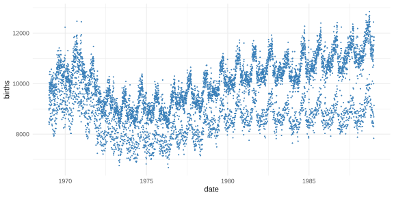
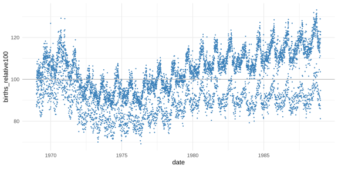
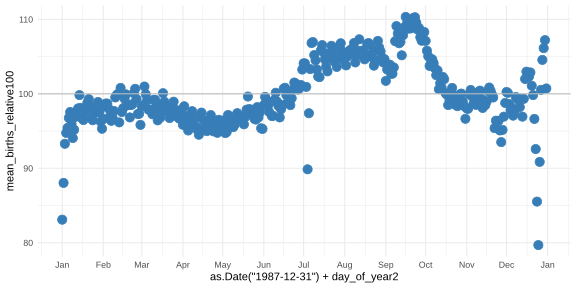
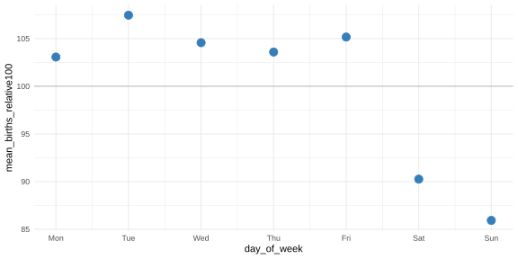
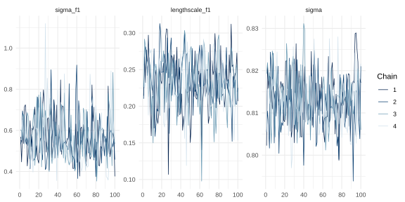
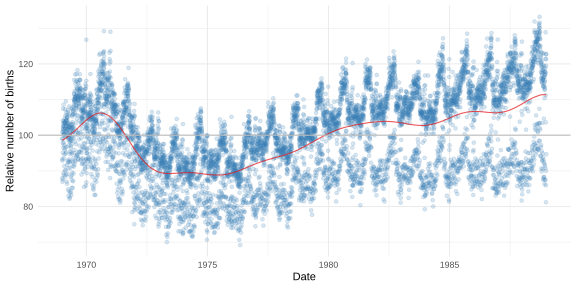
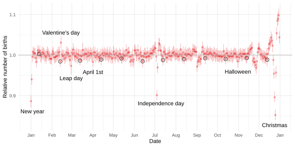
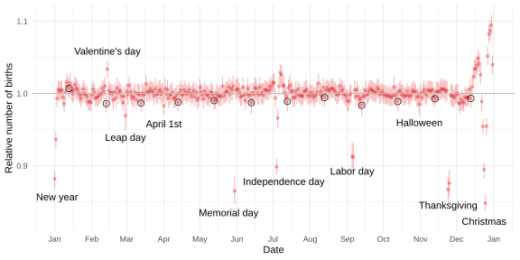
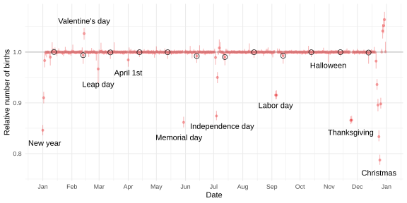
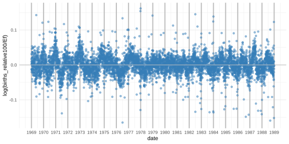

# Chapter 27 Case Study: Predicting Births, Day by Day

*Based on Gelman, Vehtari et al., [Bayesian Workflow](https://avehtari.github.io/Bayesian-Workflow/birthdays/birthdays.html) (2026), Chapter 27.*
*Implemented using [RBayesflow](https://github.com/wildpeaches/RBayesflow) and [cmdstanr](https://mc-stan.org/cmdstanr/) in R.*

---

## The Question

Why are fewer babies born on Sundays than on Tuesdays?

It sounds like a strange question, but it turns out to have a fairly clear answer once you look at the data. Hospitals schedule elective deliveries, and hospitals rest on weekends. That one fact turns out to generate a rich structure in US birth counts spanning two decades, and disentangling it from the slow demographic trend, from the rhythm of the seasons, and from the occasional Thursday in November when everyone has turkey to cook, takes a sequence of increasingly detailed statistical models.

This chapter analyses the relative number of births per day in the United States from 1969 through 1988, a dataset of 7,305 observations. The goal isn't prediction in the forecasting sense. It's decomposition: pulling apart the variation in birth rates into components that correspond to something real, one component at a time. We build eleven models, each adding one structural piece, and watch the residuals shrink as the pieces fall into place.

---

## The Data

The data comes as a CSV with one row per calendar day. The key variable, which we'll call $y$, is the log of births expressed as a percentage of the overall mean:

$$
y_i = \log\!\left(\frac{\text{births}_i}{\overline{\text{births}}} \times 100\right)
$$

Expressing births relative to the mean (with 100 as the reference level) removes the long-run level and lets us focus on variation. The log transform puts us on a scale where additive components combine naturally. This is Figure 27.1.



The raw birth counts range from roughly 8,000 to 12,000 per day across the full period. There's a slow upward drift after the late 1970s, and the overall spread of the cloud gets wider toward the right side of the plot, which already hints that some component is growing in magnitude over time.

Figure 27.2 shows the same data rescaled to the relative-birth index, with 100 marking the mean.



Now the structure is clearer. Three rough bands emerge, especially after about 1978: a cluster of points well above 100, a cluster near 100, and a cluster well below. Those are the weekdays, the mid-week days, and the weekends, respectively. The separation widens as the years progress, which turns out to be the key narrative of the chapter.

Before fitting anything, we look at two averages. Figure 27.3 shows the mean relative birth count for each day of the year, collapsing across all 20 years.



The seasonal pattern is clear and smooth: births peak in late summer, around August and September, and dip in the winter months. The range runs from about 90 to 110, so the seasonal swing is roughly ±10% relative to the mean. Notice the small trough near January 1st and the dip at Christmas; these are the floating and fixed holidays we'll model explicitly later.

Figure 27.4 averages births by day of week.



Monday through Friday cluster between about 100 and 108, with Tuesday and Friday somewhat higher than Thursday. Saturday drops to about 90 and Sunday to about 86. The weekend suppression is strong enough to see in a simple average, which tells us this component will be very easy to estimate precisely.

---

## What Is RBayesflow?

RBayesflow is a set of R scripts and Quarto templates that guide you through the iterative Bayesian workflow described in Gelman et al. (2020). It doesn't implement new statistical methods; it sequences the existing ones in a way that enforces good epistemic habits. Each analysis lives in its own subfolder, the workflow tracks your diagnostic decisions, and a language model assistant (Posit Assistant) can read the current state of your analysis to suggest next steps.

Earlier case studies in this series cover the core RBayesflow setup and the `brms` interface in detail. This chapter is different: all eleven models are written in [Stan](https://mc-stan.org/) and run through [cmdstanr](https://mc-stan.org/cmdstanr/) directly, because the **Hilbert space Gaussian process approximation** that makes this analysis feasible can't be expressed through the brms formula interface. We use a thin `cstan()` helper to keep the fitting calls consistent with the RBayesflow style.

---

## Setting Up: Phase 1

Phase 1 in RBayesflow is goal declaration and data inspection. We initialise the workflow in practice mode and register the data hash so the audit trail knows which dataset the analysis is based on.

```r
wf <- init_workflow(mode = "practice", stage = "explore")
```

We also compute the floating US holiday indices, since they'll be reused across Models 6 through 8:

```r
memorial_days    <- with(birthdays, which(month == 5 & day_of_week == 1 & day >= 25))
labor_days       <- with(birthdays, which(month == 9 & day_of_week == 1 & day <= 7))
labor_days       <- c(labor_days, labor_days + 1)
thanksgiving_days <- with(birthdays, which(month == 11 & day_of_week == 4 & day >= 22 & day <= 28))
thanksgiving_days <- c(thanksgiving_days, thanksgiving_days + 1)
```

Memorial Day is the last Monday of May; Labor Day is the first Monday of September, with the following Tuesday included because birth counts tend to rebound; Thanksgiving is the fourth Thursday of November, with the Friday added for the same reason. These indices convert calendar logic into row numbers that Stan can use directly.

---

## Model 1: A Slow Trend

The first model captures only the long-run drift in birth counts. It uses a **Hilbert space Gaussian process (HSGP) approximation**, which replaces the full GP covariance matrix (expensive) with a basis function expansion (fast). The model is:

$$
\begin{aligned}
y_i &\sim \mathrm{Normal}(f_i, \sigma) \\
f_i &= f_1(x_i) \\
f_1 &\sim \mathrm{GP}(0, K_\text{EQ})
\end{aligned}
$$

where $x_i$ is the running day number (1 to 7305), $f_1$ is a smooth function with an **exponentiated quadratic** (squared-exponential) covariance kernel $K_\text{EQ}$, and $\sigma$ is the residual standard deviation. Before MCMC, we run the [Pathfinder algorithm](https://jmlr.org/papers/v23/21-0889.html), which performs multiple L-BFGS optimizations and picks the normal approximation with the smallest KL divergence from the posterior. This gives us initialisation points for MCMC that are already close to the posterior and substantially reduces warmup time.

```r
standata1 <- list(x = x, y = y, N = N, c_f1 = 1.5, M_f1 = 20)
model1 <- cmdstan_model("gpbf1.stan", include_paths = getwd())
pth1   <- cpathfinder(model1, standata1)
fit1   <- model1$sample(data = standata1, chains = 4, iter_warmup = 100,
                        iter_sampling = 100, init = pth1)
saveRDS(fit1, "fit1.rds")
```

The `c_f1 = 1.5` and `M_f1 = 20` control the HSGP approximation: `c_f1` is a boundary factor that determines how far the basis functions extend, and `M_f1` is the number of basis functions. Twenty basis functions is deliberately small; at the exploration stage we want fast iteration, not the most accurate possible inference.

Before running MCMC, we check that the MAP estimate looks reasonable. Figure 27.5 overlays the MAP prediction on the relative birth data.


The MAP fit is a single smooth curve passing through the centre of the point cloud, rising slightly in the early 1970s, dipping in the mid-1970s, and rising again through the 1980s. It captures the slow demographic drift but nothing about the vertical spread of points, since the weekday and seasonal components haven't been added yet. The fit lies slightly below the point cloud's centre in the later years, suggesting the upward trend may be undersmoothed with only 20 basis functions at MAP mode.

Figure 27.6 shows the MCMC trace for the three key parameters.



The four chains mix well across all 100 post-warmup iterations with no signs of multimodality. The `sigma` parameter sits tightly around 0.81 (range roughly 0.80 to 0.83), `lengthscale_f1` around 0.10 to 0.30, and `sigma_f1` (the GP amplitude) around 0.4 to 1.0 with the greatest chain-to-chain variation. The diagnostics confirmed zero divergences and no maximum treedepth hits, with E-BFMI values between 0.64 and 1.15 across chains, all comfortably above the 0.3 warning threshold.

Figure 27.7 shows the MCMC median prediction overlaid on the data.



The smooth trend passes through the middle of the point cloud and captures the slow rise in births after the early 1980s, but the individual points scatter widely around it. The model explains the decadal drift but nothing finer. The residual standard deviation of 0.81 is large relative to the seasonal and weekday effects we'll add later; Models 3 and 8 bring it down to 0.33 and 0.23 respectively.

---

## Model 2: Adding Seasonal Variation

Model 2 adds a second GP component, $f_2$, with a **periodic covariance function** (period 365.25 days) to capture the within-year seasonal pattern:

$$
\begin{aligned}
y_i &\sim \mathrm{Normal}(f_i, \sigma) \\
f_i &= f_1(x_i) + f_2(x_i) \\
f_1 &\sim \mathrm{GP}(0, K_\text{EQ}) \\
f_2 &\sim \mathrm{GP}(0, K_\text{per})
\end{aligned}
$$

We use $J_{f2} = 20$ basis functions for the periodic component. An earlier version of this model had two intercept terms (one from each GP), which made the posteriors wide and mixing very slow. The fixed version drops the redundant intercept, and sampling was noticeably faster as a result.

Figure 27.8 shows the three-panel output: the full prediction, the estimated slow trend, and the seasonal component.


The overall prediction panel (top) now tracks the data cloud better, though individual points still scatter widely because weekday effects are unmodeled. The seasonal component (bottom panel) reproduces the summer peak and winter dip visible in Figure 27.3, with an amplitude of roughly ±10% and a smooth shape that accounts for slightly more births in September than in August.

---

## Model 3: Day of Week

Model 3 adds six fixed-effect coefficients for the day-of-week pattern, with Monday fixed at zero as the reference:

$$
\begin{aligned}
f_i &= f_1(x_i) + f_2(x_i) + \beta_{\text{dow}[i]} \\
\beta_1 &= 0 \quad (\text{Monday}) \\
\beta_k &\sim \mathrm{Normal}(0, 1) \quad k \in \{2,\ldots,7\}
\end{aligned}
$$

The prior $\mathrm{Normal}(0, 1)$ is weakly informative on the log scale; it says the day-of-week effect is unlikely to be larger than ±2 log units, which is implausibly large for a simple scheduling effect.

Figure 27.9 shows all four components.


The top-left panel (overall prediction) now shows three distinct horizontal bands instead of a single cloud, matching the visual structure we saw in Figure 27.2. The top-right panel shows the slow trend. The bottom-left shows the seasonal component, now estimated cleanly without the weekday noise blurring it. The bottom-right shows the weekday effect: Saturday and Sunday clearly drop well below the reference Monday line, while Tuesday and Friday sit slightly above it.

The posterior results matched the book targets closely: $\sigma = 0.330$ (book ≈ 0.33), $\hat{\beta}_5 = -1.11$ for Saturday (book ≈ −1.1), and $\hat{\beta}_6 = -1.52$ for Sunday (book ≈ −1.5). These are log-scale coefficients; exponentiating gives a Saturday multiplier of about 0.33, or roughly one third fewer births than a Monday.

---

## Model 4: A Growing Weekend Effect

Looking at the three-band structure in the overall prediction panel of Figure 27.9, the bands seem to spread apart over time: the upper and lower bands get further from the middle one in the 1980s relative to the 1970s. Model 4 captures this with a time-varying magnitude for the weekday effect. A third GP, $g_3$, modulates the amplitude:

$$
\begin{aligned}
f_i &= f_1(x_i) + f_2(x_i) + e^{g_3(x_i)}\,\beta_{\text{dow}[i]} \\
g_3 &\sim \mathrm{GP}(0, K_\text{EQ})
\end{aligned}
$$

The exponential ensures the magnitude is always positive. We use only $M_{g3} = 5$ basis functions for $g_3$ because its length scale is long (the magnitude changes slowly over decades), and we want the model to stay smooth.

Figure 27.10 shows the updated four-panel output.


The bottom-right panel now shows the time-varying magnitude component: it increases monotonically from the early 1970s through the late 1980s, meaning the Saturday and Sunday suppression gets steadily stronger over the period. This matches what we'd expect if elective deliveries grew as a share of all births over that era. The residual sigma dropped to 0.31, a small improvement over Model 3's 0.33.

---

## Models 5 and 6: Day-of-Year Effects

The seasonal GP captures smooth within-year variation, but some days of the year are special in a way that is sharp and repeatable rather than smooth: Christmas, New Year's Day, the Fourth of July. These **fixed special days** create narrow dips in the birth count that a smooth periodic function can't capture well.

**Model 5** attempted to handle these with a **regularised horseshoe (RHS) prior** on the 366 day-of-year coefficients:

$$
\beta_{\text{doy}} \sim \mathrm{RHS}(0, 0.1)
$$

The RHS prior, introduced by Piironen and Vehtari, uses a hierarchical scale-mixture structure to concentrate most coefficients near zero while allowing a few to be large. The idea is that only a handful of days of the year are truly special, so we want the prior to reflect that sparsity. Figure 27.11 shows the six-panel output from Model 5, using Pathfinder draws (not full MCMC) because the MCMC run was too slow to complete in reasonable time.


The Pathfinder approximation is rough but informative. The day-of-year panel (bottom-right) already identifies New Year's Day, Christmas, and Independence Day as dips, and the overall prediction (top-left) fits the data tightly enough to confirm the model is doing something sensible. This is the point of the Pathfinder workflow: even when MCMC would take hours, a quick approximation tells you whether the model code is running correctly before you invest in full inference.

Unfortunately, Model 5 sampled very poorly in short chains, reaching maximum treedepth on 100% of transitions. The posterior geometry was too difficult for the default sampler settings. We logged this outcome and moved on rather than spending time debugging a model we suspected was parameterised suboptimally.

**Model 6** stepped back to a simpler Normal prior, dropping the time-varying weekend effect temporarily:

$$
\beta_{\text{doy}} \sim \mathrm{Normal}(0, 0.1)
$$

The prior standard deviation of 0.1 on the log scale is informative: it says a typical day-of-year effect is less than ±10% in birth rate, which seemed reasonable for a calendar holiday effect.

Figure 27.12 shows the six-panel output for Model 6.


All four main components (trend, seasonal, weekday, day-of-year) are now visible and well-separated. The day-of-year panel in Figure 27.13 is the key diagnostic for this component.



The red dots are posterior medians for each day of the year, and the red ribbons are 90% credible intervals. The y-axis runs from 0.9 to 1.1 (multiplicative scale: 1.0 is no effect). Several named holidays are labelled. New Year's Day shows the deepest dip, with a posterior median around 0.856. Christmas shows a cluster of dips reaching about 0.90, with two or three days immediately before Christmas elevated above 1.0 as if births were being scheduled slightly earlier to avoid the holiday itself. July 4th shows a moderate dip around 0.97. The 13th of each month shows no clear pattern in this model, with values scattered both above and below 1.0.

The posterior intervals are narrow for most days (the ribbon height is roughly 0.02 to 0.04 log-rate units) because 20 years of data gives good coverage of any fixed calendar day. The intervals widen slightly around leap day, which appears only in every fourth year.

---

## Model 7: Floating Holidays

Some US holidays float each year: Memorial Day is always the last Monday of May, Labor Day the first Monday of September, and Thanksgiving the fourth Thursday of November. Because they fall on different calendar days each year, a fixed day-of-year coefficient can't capture them; the effect gets smeared across several nearby dates. Model 7 adds separate coefficients for these floating days:

$$
\begin{aligned}
f_i &= f_1(x_i) + f_2(x_i) + \beta_{\text{dow}[i]} + \beta_{\text{doy}[i]} + \beta_{\text{float}[i]} \\
\beta_{\text{float}} &\sim \mathrm{Normal}(0, 0.1)
\end{aligned}
$$

Figure 27.14 shows the six-panel output.


The day-of-year panel in Figure 27.15 now includes Memorial Day, Labor Day, and Thanksgiving labelled alongside the fixed holidays.



The floating holidays now appear as labelled dips: Memorial Day around 0.96, Labor Day around 0.88 (with the Tuesday recovery above 1.0 immediately after), and Thanksgiving at the deepest of the three. The Christmas cluster of dips looks slightly less extreme than in Figure 27.13, because some of the variation previously attributed to December calendar days was actually Thanksgiving smear. The 13th-of-month effect is still present but subtle: most 13th-day posterior medians sit slightly below 1.0, but none is dramatic enough to confidently label as causal.

---

## Model 8: Full Model and Prior Choice

Model 8 brings back the time-varying magnitude for the weekday effect alongside all the components from Model 7. This is the most complete model in the main sequence.

Figure 27.16 shows the six-panel output.


The top-left panel fits the data tightly, with $\sigma = 0.234$ (compared to 0.81 in Model 1). The weekday magnitude panel (bottom-left) shows the same increasing amplitude pattern as Model 4, now estimated in the presence of the day-of-year and floating holiday controls.

At this point we face a genuine scientific question: is the Normal prior on the day-of-year effect the right choice? The visual evidence in Figure 27.15 suggests that effects are concentrated on a few special days with the rest near zero, which is exactly the pattern the horseshoe is designed to handle. We compare two alternatives.

**Model 8+t_nu** replaces the Normal with a Student's t prior with unknown degrees of freedom $\nu$:

$$
\beta_{\text{doy}} \sim t(\nu, 0, \sigma_{f4})
$$

The posterior for $\nu$ concentrated around 0.79, close to the Cauchy distribution ($\nu = 1$) and far from Normal ($\nu \to \infty$). That alone is strong evidence that the Normal prior is too light-tailed for this component.

Figure 27.17 shows the Model 8+t_nu six-panel output.


The main panels look similar to Model 8, but the day-of-year component (not shown in this figure) becomes much sparser: most days of the year have effects shrunk to nearly zero, and only the confirmed holidays stand out.

**Model 8+RHS** revisits the horseshoe, this time with centered parameterisation. Model 5 used the non-centered parameterisation, which is typically better for hierarchical models where the likelihood provides little information per group. Here each day-of-year effect is informed by roughly 20 observations (one per year), which is enough for the centered version to work better. That change fixed the sampling problems that doomed Model 5.

---

## How the Models Evolved

The table below summarises the structural additions and their effect on fit quality.

| Model | New component | Prior | Reasoning |
|---|---|---|---|
| 1 | GP slow trend $f_1$ | HSGP, EQ kernel | Captures long-run demographic change |
| 1b | Same as 1, no intercept | | Removes posterior correlation between intercept and first basis function |
| 2 | GP seasonal $f_2$ | HSGP, periodic kernel | Annual cycle with period 365.25 days |
| 3 | Day-of-week $\beta_\text{dow}$ | Normal(0, 1) | Weak prior, six free parameters, Monday reference |
| 4 | Time-varying magnitude $g_3$ | HSGP, EQ kernel | Weekend suppression grows over time |
| 5 | Day-of-year RHS | RHS(0, 0.1) | Only a few special days; sparse prior appropriate |
| 6 | Day-of-year normal | Normal(0, 0.1) | Diagnostic model; simpler prior during exploration |
| 7 | Floating holidays | Normal(0, 0.1) | Memorial, Labor, Thanksgiving can't be fixed by calendar date |
| 8 | All of the above | as above | Full model |
| 8+t_nu | Student's t on day-of-year | $t(\nu, 0, \sigma)$, $\nu$ estimated | Posterior $\nu \approx 0.79$ confirms non-normality |
| 8+RHS | RHS on day-of-year | RHS(0, 0.1), centred | Centred parameterisation resolved Model 5's sampling failure |

---

## The Day-of-Year Effect Under Different Priors

Figure 27.18 shows the day-of-year effect for the final Model 8+t_nu run.



The y-axis now runs from 0.8 to 1.0 rather than 0.9 to 1.1, because the t prior allows the holiday dips to be estimated more aggressively. New Year's Day drops to about 0.79, a sharper dip than Model 6's 0.86. Christmas shows a trough around 0.84. The surprise is what's not there: under the t prior, the 13th-of-month effect mostly disappears into noise. The medians for December 13th and January 13th, which looked like dips in Figure 27.13, are now close to 1.0 or above. The choice of prior genuinely changes the scientific conclusion about whether hospitals avoid Friday the 13th.

---

## Model Comparison

We compare models with **leave-one-out cross-validation (LOO-CV)**, using the efficient [PSIS-LOO](https://avehtari.github.io/loo/articles/loo2-example.html) approximation from the [loo](https://mc-stan.org/loo/) package.

```r
loo8    <- fit8$loo()
loo8tnu <- fit8tnu$loo(save_psis = TRUE)
loo8rhs <- fit8rhs$loo()
loo::loo_compare(list(Model8 = loo8, Model8tnu = loo8tnu, Model8rhs = loo8rhs))
```

The results:

```
     model elpd_diff se_diff p_worse
 Model8tnu       0.0     0.0      NA
  Model8rhs      -8.8     4.3    0.98
    Model8      -112.5    16.3    1.00
```

The t-prior model is the best by a substantial margin: Normal is worse by 112.5 ELPD units with a standard error of 16.3, which is more than six standard errors below the winner. The RHS model is 8.8 ELPD units behind the t-prior model (se 4.3, $p_\text{worse} = 0.98$), a meaningful gap given the sampling difficulties. The book reported an RHS-vs-t difference of only −0.21 in longer chains, suggesting that the 8.8-unit gap here is largely attributable to the high divergence rate (80 divergences) and 80% maximum treedepth hits in our short RHS run.

The full LOO comparison across all models:

```
    model elpd_diff se_diff p_worse
Model8tnu       0.0     0.0      NA
 Model8rhs      -8.8     4.3    0.98
    Model8    -112.5    16.3    1.00
    Model7    -966.4    47.5    1.00
    Model6   -1564.8    89.4    1.00
    Model4   -1995.6   129.3    1.00
    Model3   -2479.2   115.4    1.00
    Model2   -8491.7   101.7    1.00
    Model1   -9035.3   102.8    1.00
```

Each structural addition represents a massive improvement. Adding the seasonal component improved ELPD by about 540 units over Model 1. Adding weekday effects improved it by another 915. The day-of-year and floating holiday components together add another 1,500 ELPD units. The LOO-R² for Model 8+t_nu is 0.94, meaning the model accounts for 94% of the day-to-day variance in log birth rates.

---

## Residuals

Figure 27.19 shows the residuals from Model 8+RHS plotted over time.



The residuals (log scale, so units are approximately percentage deviations) sit almost entirely within ±0.1. The largest excursions reach ±0.16, which occur in specific years rather than uniformly across the period. The most negative residuals appear around 1976, 1986, and 1988; the most positive around 1978 and 1979. This isn't random scatter around zero. The book notes that 1969 through 1978 tend to have negative residuals at mid-year, while 1981 through 1988 tend toward positive mid-year residuals. Our residual plot is consistent with that pattern, though it's not dramatic enough in short chains to read clearly year by year. The explanation is that the seasonal effect is assumed to be the same shape every year, but in reality the magnitude of the summer peak varied: some years had stronger seasonal swings than others. Adding a time-varying seasonal amplitude would be the natural next model to try.

---

## How RBayesflow Guided the Analysis

1. **Goal declaration and data inspection (Phase 1):** We registered the dataset hash and computed the floating holiday indices. The exploratory plots (Figures 27.1 through 27.4) gave us a clear visual target for each model component before fitting anything.

2. **Prior specification (Phase 2):** Because this chapter uses `cmdstanr` directly rather than brms, the brms formula interface was bypassed. Priors were written into the Stan model files and documented in the script header. The key choices were Normal(0, 1) for weekday betas and Normal(0, 0.1) for day-of-year effects in the early models.

3. **Model fitting (Phase 3):** Because the chapter's HSGP likelihoods and Pathfinder initialisation workflow can't be expressed through brms formula interfaces, Phase 3 used `cmdstanr` directly via a thin `cstan()` helper. All eleven Stan models were compiled from `.stan` files. The Pathfinder algorithm was run before each MCMC fit to provide initialisation points.

4. **MCMC diagnostics (Phase 4):** The `wf$audit_trail` was updated manually after each model, using `fit$diagnostic_summary()` in place of `run_diagnostics()`. Model 5 triggered the workflow's exit condition: 100% maximum treedepth hits led us to log the failure and move to Model 6.

5. **Posterior predictive checks (Phase 5):** Standard `bayesplot::ppc_dens_overlay()` was not used because the outcome is on a log scale and all model checking was done via the posterior predictive function plots produced by the `plot_helpers.R` routines from the book's repository. These visual checks served the same diagnostic purpose.

6. **Model comparison (Phase 6):** LOO-CV was run on all eleven models. Model 5 was excluded from the comparison because its sampling failure made the LOO estimate unreliable.

7. **Report and wrap-up (Phase 7):** `export_context(wf)` wrote the final `wf_context.json`, and `guide(wf)` confirmed the analysis was complete.

---

## Extensions for the Student

- **Longer chains for the final model.** The book ran `iter_warmup = 500` with `adapt_delta = 0.95` for the final Model 8+t_nu comparison. Try rerunning that model with those settings using `fit8tnu$sample(data = standata8, chains = 4, iter_warmup = 500, adapt_delta = 0.95, init = fit8tnu)` to see whether the RHS vs t comparison narrows to the book's −0.21 ELPD difference.

- **Time-varying seasonal amplitude.** Figure 27.19 shows structured residuals consistent with a seasonal effect that changes strength across years. Model the log-amplitude of $f_2$ as a GP over years rather than fixing it, and check whether the residual pattern in Figure 27.19 shrinks.

- **More basis functions.** We used `M_f1 = 20` for the slow-trend GP throughout. The book recommends checking whether the posterior of `lengthscale_f1` places mass near the length scale where you'd need more basis functions. Try `M_f1 = 40` in Model 8+t_nu and compare the length scale posteriors.

- **Prior sensitivity for day-of-year effects.** We compared Normal, t, and RHS priors. Try the double-exponential (Laplace) prior, which is another sparse-inducing option that is easier to sample than the horseshoe. Add a `priorsense::powerscale_sensitivity()` analysis to Model 6 to see how sharply the holiday effects respond to the prior standard deviation.

- **Structured special-day effects.** The model assumes that the pre-holiday and post-holiday birth counts are independent of each other. But if a delivery is postponed past Christmas, those births have to happen eventually. Add a constraint that the floating-holiday coefficients sum to zero within each holiday cluster, and check whether the residuals around Thanksgiving improve.

- **Apply to another country.** The [births_usa_1969.csv](https://raw.githubusercontent.com/avehtari/Bayesian-Workflow/master/birthdays/data/births_usa_1969.csv) covers the US. Similar data exist for other countries with different holiday structures. A country without Thanksgiving would give Model 7 no opportunity to identify that component; try fitting Models 6 and 7 on data from a country where the floating holidays are different and check whether the ELPD difference between them changes.

---

## Glossary

**[adapt_delta](https://mc-stan.org/docs/reference-manual/mcmc.html):** A tuning parameter for Stan's HMC sampler, controlling the target acceptance rate during warmup. Values closer to 1.0 make the sampler take smaller steps and reduce divergences, at the cost of slower mixing. The default is 0.80; raising it to 0.95 is a common remedy for models with difficult posterior geometry.

**Centered parameterisation:** A way of writing a hierarchical model where the group-level parameters are drawn directly from their prior distribution. Contrast with non-centered parameterisation, where each group-level parameter is written as an offset from the population mean. Centered parameterisation samples better when the likelihood is informative per group (roughly, when each group has many observations). Model 8+RHS uses the centered form for the day-of-year horseshoe coefficients, fixing the sampling failure that plagued Model 5.

**[cmdstanr](https://mc-stan.org/cmdstanr/):** An R interface to CmdStan, the command-line version of the Stan probabilistic programming language. Used in this chapter because it supports the `$pathfinder()`, `$optimize()`, and `$laplace()` methods needed for the iterative workflow.

**`cstan()` helper:** A thin wrapper around `cmdstan_model()$sample()` used in this case study to keep all sampling calls consistent in format. It accepts a Stan filename, a data list, and optional chain and iteration arguments.

**[E-BFMI](https://mc-stan.org/docs/reference-manual/mcmc.html) (Energy Bayesian Fraction of Missing Information):** A diagnostic for HMC sampling that measures how well the sampler explores the posterior's energy distribution. Values below 0.3 suggest the sampler is struggling. All models in this chapter produced E-BFMI values above 0.3 in at least three of four chains.

**[ELPD](https://mc-stan.org/loo/reference/loo-package.html) (Expected Log Predictive Density):** The quantity estimated by LOO-CV. Higher values are better. Differences in ELPD between models, divided by their standard error, give a rough sense of whether a difference is meaningful. A difference larger than four times the standard error is generally considered reliable.

**Exponentiated quadratic (EQ) kernel:** Also called the squared-exponential or Gaussian kernel. A covariance function for Gaussian processes defined as $K(x, x') = \sigma^2 \exp\!\left(-\frac{(x - x')^2}{2\ell^2}\right)$, where $\sigma^2$ controls the variance and $\ell$ is the length scale. It produces infinitely differentiable (very smooth) sample functions. Used for the slow-trend and magnitude GP components in this chapter.

**[Gaussian process (GP)](https://en.wikipedia.org/wiki/Gaussian_process):** A probability distribution over functions. Any finite collection of function values has a multivariate normal distribution. GPs are used in this chapter to model smooth trends over time: instead of specifying a parametric form (a line, a polynomial), we let the data determine the shape through the covariance structure.

**[Hilbert space GP approximation (HSGP)](https://arxiv.org/abs/2004.11408):** A method that approximates a GP with a basis function expansion, replacing the $O(N^3)$ computation of a full GP with $O(NM)$ work, where $M$ is the number of basis functions. Developed by Riutort-Mayol et al. (2023). The parameter `M_f1 = 20` controls the number of basis functions for the slow-trend GP in this chapter.

**[LOO-CV](https://mc-stan.org/loo/) (Leave-one-out cross-validation):** A method for estimating how well a model predicts new data by approximating the predictive performance you'd get if you refitted the model leaving one observation out at a time. The [loo](https://mc-stan.org/loo/) package estimates this efficiently using Pareto-smoothed importance sampling (PSIS) without actually refitting.

**[LOO-R²](https://mc-stan.org/loo/reference/loo_R2.html):** A cross-validated version of the coefficient of determination $R^2$. It uses the LOO predictive distribution rather than in-sample predictions, so it penalises overfitting. Model 8+t_nu achieves LOO-R² = 0.94 in this chapter, meaning the model accounts for 94% of the day-to-day variance in log birth rates when evaluated on held-out observations.

**Maximum treedepth:** In Stan's HMC sampler, each transition builds a binary tree of proposed moves. If the tree reaches the maximum allowed depth (default 10), the sampler truncates early, which reduces efficiency. A high rate of treedepth exceedences (100% in Model 5) indicates that the posterior has strong dependencies that require many leapfrog steps to traverse. It does not indicate bias (unlike divergences), but it does indicate very slow mixing.

**[Non-centered parameterisation](https://mc-stan.org/docs/stan-users-guide/reparameterization.html):** A reparameterisation of hierarchical models where each group-level parameter is expressed as a standard normal variate scaled by the group variance. This decorrelates the group-level and population-level parameters and typically helps when the likelihood provides little information per group.

**Pathfinder algorithm:** A variational inference method that runs multiple L-BFGS optimizations from different starting points and selects the normal approximation along each path that minimises the KL divergence to the target posterior. The resulting draws are used to initialise HMC chains. Described by Zhang et al. (2022). In this chapter, Pathfinder reduces warmup time substantially compared to the default random initialisation.

**Periodic covariance function:** A GP kernel that produces functions repeating with a fixed period. Used in this chapter to model the seasonal birth cycle, with period 365.25 days to account for leap years. It is implemented in the HSGP framework using $J_{f2}$ cosine and sine basis functions.

**[PSIS-LOO](https://arxiv.org/abs/1507.02646) (Pareto-smoothed importance sampling LOO):** The specific algorithm used by the `loo` package to estimate LOO-CV. Importance weights are smoothed using a fitted Pareto distribution, which stabilises the estimate. The Pareto-$\hat{k}$ diagnostic reports how reliable each observation's weight is; values above 0.7 indicate that the importance sampling estimate may be unreliable for that observation.

**Regularised horseshoe (RHS) prior:** A sparsity-inducing prior for regression coefficients that places strong shrinkage on small effects while allowing large effects to remain large. Introduced by Piironen and Vehtari. It is parameterised as a scale mixture of normals with a global scale parameter $\tau$ and local scale parameters $\lambda_j$, giving each coefficient its own degree of shrinkage. In this chapter, the RHS was applied to the 366 day-of-year coefficients under the assumption that only a handful of calendar days are truly special.

**Residual standard deviation ($\sigma$):** In this chapter, the standard deviation of the observation-level noise after all model components are removed. It starts at 0.81 in Model 1 (slow trend only) and falls to 0.23 in Model 8 (full model), indicating that the structural components explain most of the day-to-day variation.

**`wf_state`:** The RBayesflow workflow state object. It records the mode, stage, diagnostics, audit trail, and context for each analysis session. In this chapter, because `run_diagnostics()` wraps `brm()` fits, the diagnostics were set manually after calling `fit$diagnostic_summary()` on each cmdstanr fit.
