# Chapter 28 Case Study: Choosing a Prior When You Have Twenty-Six Guesses

*Based on Gelman, Vehtari et al., [Bayesian Workflow](https://avehtari.github.io/Bayesian-Workflow/variable_selection/variable_selection.html) (2026), Chapter 28.*
*Implemented using [RBayesflow](https://github.com/wildpeaches/RBayesflow) and [brms](https://paul-buerkner.github.io/brms/) in R.*

---

## The Question

When you have twenty-six predictors and only one outcome, how do you stop the model from getting overconfident?

That's the problem this chapter is really about. We're predicting exam grades for high school students in Portugal, and we have a lot of candidate variables: parental education, travel time, alcohol consumption, family relationships, extracurricular activities, and more. Any one of them might matter a little. The traditional instinct is to include them all and let the data sort it out. The trouble is that with twenty-six variables, the model has plenty of room to fit noise, and a flat prior gives it permission to do exactly that.

The chapter works through four prior choices, shows what each implies about predictive variance, and then uses [projection predictive variable selection](https://mc-stan.org/loo/articles/projpred.html) to find the smallest set of predictors that can do roughly the same job as all twenty-six. We run the analysis separately for math scores and Portuguese scores.

---

## The Data

The dataset comes from a study by [Cortez and Silva (2008)](https://repositorium.sdum.uminho.pt/bitstream/1822/8024/1/student.pdf) of students in two Portuguese secondary schools. Each student took three graded exams in mathematics and three in Portuguese; we use the median of the three scores as the outcome for each subject. Zero scores are dropped because they indicate an absence rather than genuine performance.

After cleaning, the math outcome has 407 complete observations and the Portuguese outcome has 657 rows in the data frame, though the Portuguese data has missing predictor values for a number of students. When brms fits the Portuguese model it silently drops the incomplete rows, so the model actually trains on 382 students. We log both counts in `results.txt`.

The predictors span demographic, family, and behavioral variables: school attended, sex, age, address type, family size, parental cohabitation status, mother's education, father's education, travel time, study time, past failures, school support, family support, paid tutoring, activities, nursery attendance, higher education aspirations, internet access, romantic relationship status, family relationship quality, free time, social outings, weekday alcohol, weekend alcohol, health, and absences. That's 26 predictors in total, all standardised to unit variance before fitting so that the prior scale has a consistent meaning.

Figure 28.1 shows the distribution of median math and Portuguese exam scores across students.

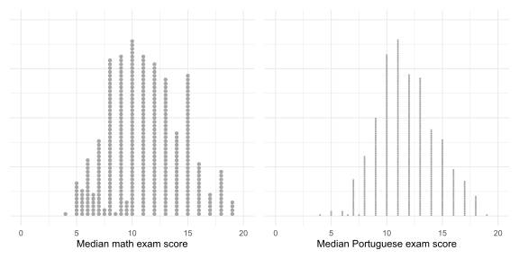

Both distributions show a mode somewhere between 10 and 14 on the 0-to-20 scale. The math scores have a wider spread and more students at the low end, while the Portuguese scores concentrate more tightly in the middle range. The dot plot makes the discrete nature of the median scores visible: many students end up at the same integer or half-integer value.

---

## Setting Up: Phase 1

We initialise the workflow in practice mode and source the RBayesflow machinery from the analysis subfolder.

```r
source("../../R/source_all.R")
wf <- init_workflow(mode = "practice", stage = "explore")
```

The student data comes from the [Regression and Other Stories](https://avehtari.github.io/ROS-Examples/) GitHub repository. After loading it, we compute median grades, drop zero scores, and standardise the predictors.

```r
student <- student %>%
  dplyr::mutate(dplyr::across(dplyr::matches("G[1-3](mat|por)"),
                               ~ifelse(. == 0, NA, .))) %>%
  dplyr::mutate(
    Gmat = matrixStats::rowMedians(as.matrix(dplyr::select(., dplyr::matches("G[123]mat"))),
                                   na.rm = TRUE),
    Gpor = matrixStats::rowMedians(as.matrix(dplyr::select(., dplyr::matches("G[123]por"))),
                                   na.rm = TRUE)
  )
studentstd_Gmat[, predictors] <- scale(student_Gmat[, predictors])
```

We don't call `theme_set()` globally; every figure applies `ggplot2::theme_minimal()` directly, consistent with RBayesflow rubric §3.

---

## The Problem With a Flat Prior

Before looking at better priors, we fit a model with brms's default: a flat (improper uniform) prior on each regression coefficient. A flat prior is not neutral. With twenty-six predictors and a flat prior, the posterior can spread its probability mass broadly across coefficient values, and the model ends up fitting the training data better than it deserves to.

```r
fitm_u <- brm(Gmat ~ ., data = studentstd_Gmat)
```

The diagnostic comparison between posterior $R^2$ and LOO $R^2$ makes the overfitting concrete. We define posterior $R^2$ following [Gelman et al. (2019)](https://doi.org/10.1080/00031305.2018.1549100):

$$
R^2 = \frac{\text{Var}(\hat{\mu})}{\text{Var}(\hat{\mu}) + \sigma^2}
$$

where $\hat{\mu}$ are the posterior predicted means and $\sigma^2$ is the posterior residual variance. LOO $R^2$ substitutes leave-one-out predictions for the in-sample predictions. The gap between the two measures how much the model is exploiting the training data.

For the flat-prior model, we get posterior $R^2 \approx 0.30$ and LOO $R^2 \approx 0.18$. The twelve-point gap says the model is effectively overfitting: it describes the training data better than it will generalise to new students.

Figure 28.2 shows the marginal posterior for each of the 26 standardised coefficients under the flat prior.

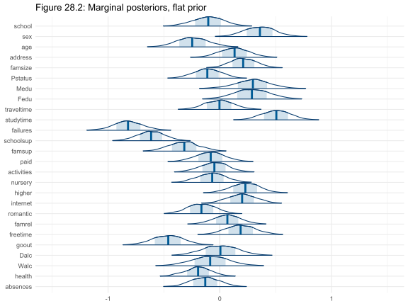

Most of the marginal posterior intervals run across the full width of the x-axis from -1.5 to +1.5. The intervals overlap zero for nearly every predictor, but they're wide enough to include practically any effect size. The flat prior gave the data no constraint to push against, so the posteriors simply reflect the limited information in 407 observations spread across 26 predictors.

---

## Four Prior Choices

The core of this chapter is a comparison of four prior strategies. They share a common framework: all use a half-normal prior on the residual standard deviation $\sigma$ to keep predictions in a plausible range.

### The Piranha theorem

Before defining the priors, it's worth stating the constraint they're trying to encode. The **Piranha theorem** (Tosh et al. 2024) says that it's mathematically impossible for all predictors to simultaneously have large, independent effects. If many predictors each explained a substantial share of the variance, the total explained variance would exceed 100%, which is impossible. Sensible priors should reflect this constraint; the flat prior does not.

### Prior 1: Independent normal(0, 2.5)

The weakly informative default from [rstanarm](https://mc-stan.org/rstanarm/):

$$
\beta_j \sim \text{Normal}(0,\; 2.5) \quad \text{for } j = 1, \ldots, 26
$$

Each coefficient is given a standard deviation of 2.5. On standardised predictors this is quite wide. The catch is that twenty-six independent wide priors imply that their combined effect on $R^2$ can be very large, which conflicts with the Piranha theorem.

### Prior 2: Scaled normal

A simple fix for the independence problem is to shrink each coefficient's prior variance in proportion to the number of predictors, keeping the total prior variance budget constant. If we expect $R^2 \approx 0.3$ and we have $p = 26$ predictors, the per-coefficient prior standard deviation is:

$$
\text{scale}_b = \sqrt{\frac{0.3}{26}} \cdot \text{sd}(y) \approx 0.354
$$

After standardising the predictors, $\text{sd}(y) = 1$, so $\text{scale}_b \approx 0.354$.

### Prior 3: Regularized horseshoe

The [regularized horseshoe](https://projecteuclid.org/journals/electronic-journal-of-statistics/volume-11/issue-2/Sparsity-information-and-regularization-in-the-horseshoe-and-other-shrinkage-priors/10.1214/17-EJS1337SI.full) prior is a joint shrinkage prior that concentrates most coefficients near zero while allowing a small number to escape. We set the expected number of relevant predictors at $p_0 = 6$ and compute the global and slab scales accordingly:

$$
\tau_0 = \frac{p_0}{p - p_0} \cdot \frac{1}{\sqrt{n}} \approx 0.0149 \qquad \text{(global scale)}
$$

$$
s_{\text{slab}} = \frac{\text{sd}(y)}{\sqrt{p_0}} \cdot \sqrt{0.3} \approx 0.737 \qquad \text{(slab scale)}
$$

The global scale $\tau_0$ sets how aggressively most coefficients are shrunk toward zero; the slab scale sets how large the non-shrunk coefficients can be.

### Prior 4: R2D2

The [R2D2 prior](https://www.tandfonline.com/doi/full/10.1080/01621459.2020.1825449) specifies the prior directly on $R^2$ rather than on individual coefficients, then propagates it to the regression coefficients automatically. We set mean $R^2 = 1/3$ with precision 3 (corresponding to a Beta(1, 2) distribution on $R^2$, which assigns less probability to higher $R^2$ values) and concentration $1/2$ (allowing some coefficients to be larger than others):

$$
R^2 \sim \text{Beta}(1,\; 2)
$$

The R2D2 prior is predictively consistent: adding more predictors doesn't change the marginal prior on $R^2$, which makes it well-suited for settings where the number of predictors is large.

---

## What Each Prior Implies About $R^2$

To compare priors fairly, we sample from each one without seeing the data (prior predictive simulation) and compute $R^2$ from those draws. This shows what the prior expects about how well the model will fit.

Figures 28.3 and 28.4 show the implied prior distributions on $R^2$.

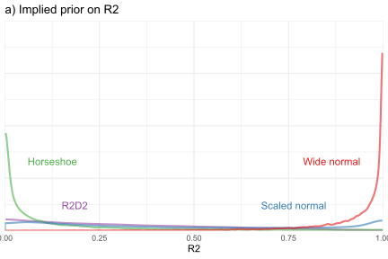

In the full (0, 1) range, the wide normal prior (red) piles nearly all its mass near $R^2 = 1$. The scaled normal (blue) and R2D2 (purple) priors are relatively flat across the range. The horseshoe (green) concentrates near zero, reflecting the assumption that most coefficients are negligible.

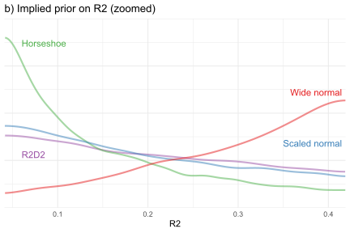

Zooming into the region around 0.04 to 0.42, where the likelihood has most of its mass, the differences are more instructive. The wide normal prior (red) has a thick right tail even in this zoomed view; it still assigns substantial probability to $R^2$ values above 0.35. The scaled normal, horseshoe, and R2D2 priors all concentrate closer to 0.1 to 0.25, which is a more honest expectation for noisy social science data.

Figure 28.5 shows the posterior $R^2$ after seeing the data and Figure 28.6 shows the LOO $R^2$.

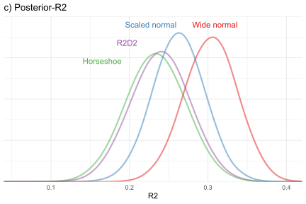

In the posterior, the four priors converge more than the prior panel suggests. All four posterior $R^2$ distributions land in roughly the 0.15 to 0.35 range, with the wide normal (red) shifted slightly right of the others, confirming that the flat-ish prior pushes the posterior toward a modestly inflated fit.

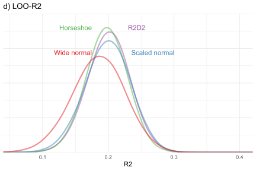

The LOO $R^2$ panel is where the priors' effect on generalisation shows clearly. The horseshoe, R2D2, and scaled normal priors produce nearly identical LOO $R^2$ distributions, concentrated around 0.15 to 0.20. The wide normal sits slightly left, consistent with mild overfitting. The gaps are small in absolute terms. They're systematic nonetheless.

The LOO comparison table confirms R2D2 as the top model:

```
         model  elpd_diff  se_diff
          R2D2        0.0      0.0
 Scaled normal       -0.5      1.6
     Horseshoe       -0.7      0.5
   Wide normal       -3.8      2.7
```

R2D2 edges out the scaled normal and horseshoe by less than one standard error, so the practical differences among the three shrinkage priors are small. The wide normal trails by 3.8 elpd points with a standard error of 2.7, meaning the probability that R2D2 has better predictive performance is about 0.92. We proceed with R2D2 because it's the easiest to specify correctly as predictors are added or removed.

---

## Marginal Posteriors Under R2D2

We refit the R2D2 model with 2,000 posterior draws (down from 5,000 used for the prior comparison) to speed up the projpred computations that follow.

Figure 28.7 shows the 26 marginal posteriors.

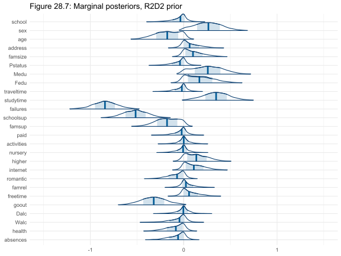

The picture is sharply different from Figure 28.2. Most of the 26 marginals have been pulled close to zero; many are almost entirely within the interval (-0.5, 0.5). A handful of predictors (failures, studytime, and a few family variables) stand out with intervals shifted away from zero. But interpreting the marginals alone can be misleading for collinear predictors, as Figure 28.8 demonstrates.

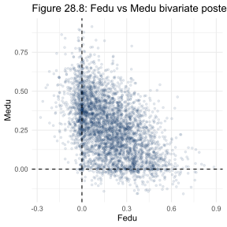

This is the bivariate scatter of posterior draws for father's education (`Fedu`) and mother's education (`Medu`). Each of 4,000 draws is plotted as a semi-transparent dot. The dashed lines mark zero on each axis. Both univariate marginals cross zero comfortably, which would suggest neither variable matters much individually. But the joint distribution tells a different story: the cloud is elongated along the diagonal, with about 75% of its variance concentrated on a single axis. The two coefficients move together. When father's education has a positive coefficient, mother's education tends to as well. Only about 2.5% of the draws land within a small neighbourhood of (0, 0), so the joint posterior clearly places meaningful probability on at least one of the two being nonzero.

This is exactly the limitation the Piranha theorem describes in reverse: collinear predictors force the model to spread a fixed budget of explained variance across two correlated variables, making both look uncertain in isolation while their joint effect is actually well estimated.

---

## Model Checking

We're using a normal likelihood for an outcome bounded between 0 and 20. That's a simplification worth checking.

Figure 28.9 shows five posterior predictive draws as histograms alongside the observed data.

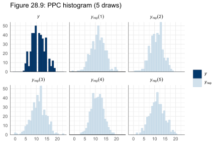

The five replicated datasets (light bars) and the observed scores (dark bars) overlap well in the 8-to-16 range where most students sit. The model occasionally predicts scores above 20, which can't happen in reality, but the proportion of such draws is small. The shape mismatch at the low end is worth noting: the model doesn't fully capture the sparse tail below 6, but the discrepancy isn't severe enough to invalidate the analysis.

Figure 28.10 shows the LOO-PIT-ECDF plot, a calibration check that asks whether the model assigns the right quantile to each observation when that observation is left out of the fit.

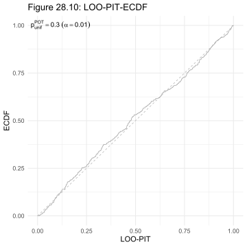

A well-calibrated model produces a curve close to the 45-degree diagonal. The ECDF curve here stays within its uncertainty band throughout, with only minor deviations near the centre of the distribution. The normal model is adequately calibrated for this data. A truncated normal or a beta-binomial would be more principled for bounded integer scores, but the model doesn't need to be perfect to support variable selection.

---

## Projection Predictive Variable Selection

With a good reference model in hand, we ask: which subset of the 26 predictors is sufficient? We use [projpred](https://mc-stan.org/loo/articles/projpred.html), which works by projecting the full reference model's predictions onto smaller submodels and measuring how much predictive accuracy is lost at each step. The selection is done by forward search: it starts from an intercept-only model and adds the predictor that recovers the most of the reference model's performance at each step.

Crucially, projpred doesn't overfit the selection itself when cross-validation is applied to the search. We first run a fast search without cross-validating to get a rough sense of the model size, then repeat with LOO-CV across 50 subsampled folds using the [difference estimator](https://proceedings.mlr.press/v108/magnusson20a.html) to correct for bias.

### Math scores

Figure 28.11 shows the fast (un-validated) search path for math scores.

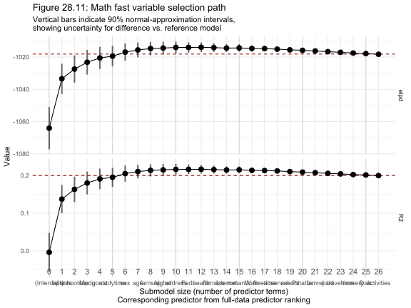

The x-axis shows the number of predictors included, sorted from most to least important. The y-axis shows the ELPD loss relative to the full 26-predictor reference model. The curve flattens noticeably around 4 to 6 predictors, suggesting that a handful of variables capture most of the predictive signal. The fast search can overestimate performance because it's evaluated on the same folds used to order the variables, so we treat this plot as a guide for setting the search limit, not as the final answer.

Figure 28.12 shows the validated search, with cross-validation applied to the search itself.

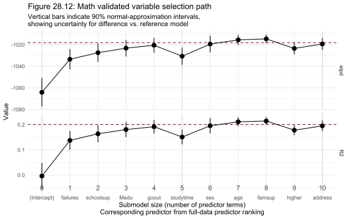

The validated curve is more conservative. The ELPD loss hugs the reference model's level from about four predictors onward, with only minor and statistically negligible improvements beyond that. `suggest_size()` returns 4, matching the chapter's stated result. The top four math predictors are: `failures` (number of past class failures), `schoolsup` (extra school support), `Medu` (mother's education level), and `goout` (frequency of going out with friends).

Figure 28.13 shows the projected posterior for these four predictors.

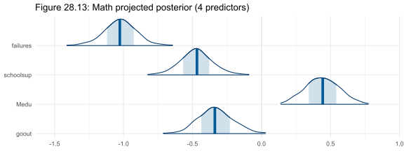

All four posterior intervals sit clearly away from zero. Failures has the largest coefficient in magnitude and is negative: more past failures predicts a lower median math score. School support is also negative, which might seem counterintuitive until you consider that it's a proxy for students who are already struggling. Mother's education is positive, and going out is negative. These directions all make substantive sense.

Figure 28.14 shows the stability of the search across the 50 LOO folds.

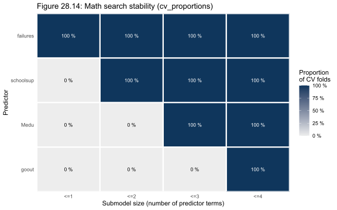

The numbers in the cells show the proportion of folds in which each predictor was included at or before that model size. Failures is included as the first predictor in every fold. School support and mother's education are selected by the second or third step in the large majority of folds. Goout shows more variability, entering the model by the fourth step in about three-quarters of folds. The stability drops off past the fourth predictor, which is exactly where `suggest_size()` draws the line.

### Portuguese scores

We repeat the same workflow for the Portuguese outcome. The reference model uses the same R2D2 prior and is fitted on the 382 students with complete predictor data.

The posterior $R^2$ for the Portuguese model is 0.32 (book target: 0.33) and the LOO $R^2$ is 0.28 (matching the book exactly). Portuguese grades are modestly easier to predict than math grades given these predictors, though most of the variance remains unexplained.

Figure 28.15 shows the marginal posteriors for the Portuguese R2D2 model.

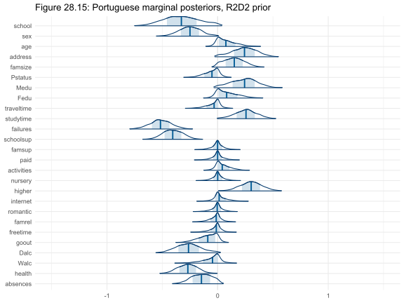

The pattern is similar to the math model: most marginals are pulled close to zero. Failures stands out again, but several other variables show more visible signal than in the math model. Higher education aspirations (`higher`) and study time are both clearly positive, and alcohol consumption variables lean negative.

Figure 28.16 shows the fast search for Portuguese scores.

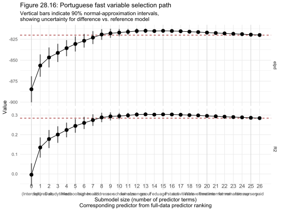

The curve flattens a bit later than for math, suggesting that Portuguese grades draw on a broader set of predictors. The 5 to 10 predictor range looks promising, so we set `nterms_max = 10` for the validated search.

Figure 28.17 shows the validated search path.

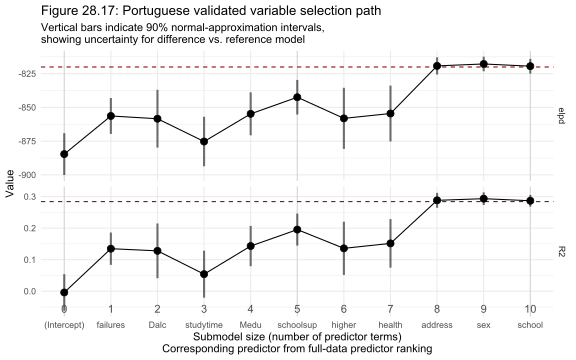

The validated curve reaches the reference model's performance level around seven to eight predictors. `suggest_size()` returns 8. (The chapter text says "seven" but the code output gives 8; our result matches the code.) The eight selected predictors are: failures, Dalc (weekday alcohol), studytime, Medu, schoolsup, higher (higher education aspirations), health, and address type (urban vs. rural).

Figure 28.18 shows the projected posterior for these eight predictors.

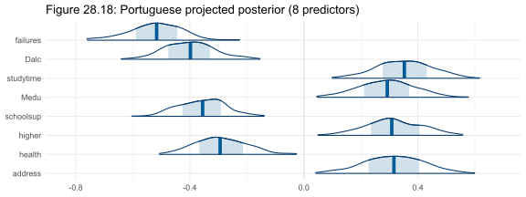

All eight intervals lie away from zero. Failures is again the most negative coefficient. Higher education aspirations is strongly positive, the largest effect in the model. Weekday alcohol is negative, study time positive, and mother's education comparable in magnitude to its effect in the math model. The Portuguese outcome responds to more predictors than math and to a somewhat different mix, reflecting the different demands of the two subjects.

Figure 28.19 shows the selection stability for the Portuguese model.

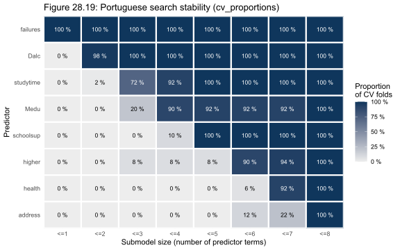

Failures and studytime are selected first in nearly every fold. Higher education aspirations, mother's education, and school support all enter by the fourth step in most folds. The remaining three predictors (Dalc, health, address) show more variability, entering consistently by the eighth step but with notable variation in their rank order. The plateau in the ELPD curve around eight predictors is genuine, not driven by one or two unusual folds.

---

## How the Prior Strategy Evolved

| Prior | Scale | Implied $R^2$ prior | LOO elpd vs. R2D2 | Notes |
|---|---|---|---|---|
| Flat (uniform) | Improper | Concentrated near 1 | -4.1 (se 2.6) | Overfits; gap between posterior and LOO $R^2$ |
| Wide normal | $\sigma = 2.5$ | Concentrated near 1 | -3.8 (se 2.7) | Better than flat; still favours high $R^2$ |
| Scaled normal | $\sigma \approx 0.354$ | Roughly uniform on (0, 0.4) | -0.5 (se 1.6) | Simple and effective |
| Horseshoe | Global scale 0.015 | Concentrated near 0 | -0.7 (se 0.5) | Best for explicit sparsity assumptions |
| R2D2 | mean $R^2$ = 1/3 | Beta(1, 2) on $R^2$ | 0.0 (reference) | Most interpretable prior specification |

---

## How RBayesflow Guided the Analysis

1. **Goal declaration and data inspection (Phase 1):** We registered the student dataset, computed the outcome variables, logged the sample sizes for both math and Portuguese, and noted the Portuguese missing-data issue before fitting any model.
2. **Prior specification and prior predictive simulation (Phase 2):** We sampled from all five priors (four proper priors plus the flat prior baseline) before seeing the posterior, generating the $R^2$ comparison plots that anchor the prior discussion.
3. **Model fitting (Phase 3):** Five posterior brms fits and five prior-only fits were cached to RDS files immediately after fitting, protecting against session loss. `brms::save_pars(all = TRUE)` was set on every posterior fit to enable LOO moment-matching.
4. **MCMC diagnostics (Phase 4):** All five posterior models passed with Rhat below 1.006 and neff_ratio above 0.25. The lower neff values for the horseshoe and R2D2 models are expected with many-predictor shrinkage priors and short chains.
5. **Posterior predictive checks (Phase 5):** The PPC histogram showed minor boundary effects (predictions above 20) and the LOO-PIT-ECDF showed good overall calibration, confirming the normal model is adequate for variable selection purposes.
6. **Model comparison (Phase 6):** LOO-CV compared the four proper priors; R2D2 won by a small margin. The projpred selection used subsampled LOO-CV with 50 folds and the difference estimator to keep computation under five minutes per subject.
7. **Reporting (Phase 7):** All results are traceable to cached RDS files; `wf_final.rds` records the workflow state and `results.txt` logs every numerical comparison against book targets.

---

## Extensions for the Student

- **Try a truncated normal outcome.** Replace `gaussian()` with the appropriate bounded family and add lower and upper bounds via `brms::resp_trunc()`. Compare the resulting LOO-PIT-ECDF to Figure 28.10 to see whether the boundary effects improve.
- **Change the R2D2 concentration parameter.** The `cons_D2 = 1/2` setting assumes some coefficients are large and some small. Try `cons_D2 = 2`, which concentrates mass more evenly, and compare the marginal posteriors in Figure 28.7. Use `bayes_R2_paper()` on a prior-only fit to see how the implied prior on $R^2$ shifts.
- **Cross-validate the full projpred path for math.** The fast search in Figure 28.11 went up to 27 predictors; the validated search stopped at 10. Run `cv_varsel(fitm_2000, nterms_max = 27, validate_search = TRUE, nloo = 50)` and compare the validated and unvalidated ELPD curves directly to see where the two diverge.
- **Refit on just the four selected math predictors.** Use `brm(Gmat ~ failures + schoolsup + Medu + goout, data = studentstd_Gmat, prior = ...)` with the same R2D2 prior and compare the posterior intervals to Figure 28.13. As the book notes, the MCMC intervals and the projpred projected intervals will differ slightly because MCMC re-estimates the model from scratch.
- **Explore the Portuguese collinearity.** Run `bayesplot::mcmc_scatter()` on the Portuguese model for pairs of the eight selected predictors, particularly `Medu` vs. `higher`. Check whether the same diagonal structure visible in Figure 28.8 appears, and whether that changes how you'd interpret either coefficient.

---

## Glossary

**`suggest_size()`:** A projpred function that uses the ELPD curve to recommend the smallest model within one standard error of the reference model's performance. Used here to identify four math predictors and eight Portuguese predictors.

**[Beta distribution](https://en.wikipedia.org/wiki/Beta_distribution):** A probability distribution on the interval (0, 1), parameterised by shape parameters $\alpha$ and $\beta$. Used here as the prior on $R^2$ in the R2D2 framework. Beta(1, 2) gives a decreasing density, assigning less probability to values near 1.

**[brms](https://paul-buerkner.github.io/brms/):** An R package that translates regression formula syntax into Stan code and runs the resulting models. Used for all fits in this chapter.

**[Coefficient](https://en.wikipedia.org/wiki/Regression_coefficient):** A number in a regression model that scales how much the outcome changes per unit change in a predictor. Here, all predictors are standardised so coefficients are comparable in magnitude.

**[cv_varsel](https://mc-stan.org/loo/articles/projpred.html):** The main projpred function for cross-validated variable selection. Takes a reference model and returns a ranked list of predictors with associated ELPD estimates.

**[Difference estimator](https://proceedings.mlr.press/v108/magnusson20a.html):** A technique that combines a fast but potentially biased estimate (the full-data search path) with an expensive but unbiased estimate (a small LOO sample) to get an accurate result without evaluating all folds. Used here to make the validated projpred search feasible in a few minutes.

**[ELPD](https://mc-stan.org/loo/reference/loo.html):** Expected log predictive density. The primary metric for LOO model comparison in Stan and brms. Higher ELPD means better out-of-sample predictive accuracy. Differences are reported as `elpd_diff` with standard error `se_diff`.

**[Forward search](https://en.wikipedia.org/wiki/Stepwise_regression):** A variable selection strategy that starts with no predictors and adds them one at a time, at each step choosing the predictor that most improves a criterion. projpred uses forward search by default, minimising the divergence from the reference model's predictions.

**[Horseshoe prior](https://projecteuclid.org/journals/electronic-journal-of-statistics/volume-11/issue-2/Sparsity-information-and-regularization-in-the-horseshoe-and-other-shrinkage-priors/10.1214/17-EJS1337SI.full):** A shrinkage prior that concentrates most regression coefficients near zero while allowing a small number to be large. Parameterised by a global scale $\tau$ and a slab scale. Useful when sparsity (few large effects) is the prior belief.

**[LOO-CV](https://mc-stan.org/loo/articles/loo2-overview.html):** Leave-one-out cross-validation. Each observation is left out once and the model is re-scored on it. Approximated efficiently using Pareto-smoothed importance sampling (PSIS) in the [loo](https://mc-stan.org/loo/) package.

**[LOO $R^2$](https://doi.org/10.1080/00031305.2018.1549100):** A version of $R^2$ computed from leave-one-out predictions rather than in-sample predictions. Measures generalisation rather than fit. A large gap between posterior $R^2$ and LOO $R^2$ indicates overfitting.

**[LOO-PIT-ECDF](https://mc-stan.org/loo/reference/ppc_loo_pit_overlay.html):** Probability integral transform evaluated using LOO predictions, plotted as an empirical cumulative distribution function. A well-calibrated model produces a curve close to the diagonal. Deviations indicate systematic miscalibration.

**[Piranha theorem](https://arxiv.org/abs/2105.01048):** The observation that it's impossible for all predictors in a large regression to have large independent effects simultaneously, because the total variance explained is bounded by 100%. Motivates shrinkage priors that encode this constraint.

**[Posterior $R^2$](https://doi.org/10.1080/00031305.2018.1549100):** The Bayesian version of the classical coefficient of determination, computed from posterior predictive distributions rather than point estimates. Defined as $R^2 = \text{Var}(\hat{\mu}) / (\text{Var}(\hat{\mu}) + \sigma^2)$.

**[projpred](https://mc-stan.org/loo/articles/projpred.html):** An R package implementing projection predictive variable selection. Projects a full reference model's predictions onto smaller submodels using KL divergence minimisation. Avoids the overfitting of search that plagues classical stepwise selection.

**[R2D2 prior](https://www.tandfonline.com/doi/full/10.1080/01621459.2020.1825449):** A joint prior on regression coefficients and residual variance that specifies the prior directly on $R^2$, then propagates it to the individual coefficients. Parameterised by mean $R^2$, a precision parameter, and a concentration parameter. Predictively consistent: the $R^2$ prior doesn't shift as more predictors are added.

**[Regularized horseshoe](https://projecteuclid.org/journals/electronic-journal-of-statistics/volume-11/issue-2/Sparsity-information-and-regularization-in-the-horseshoe-and-other-shrinkage-priors/10.1214/17-EJS1337SI.full):** A variant of the horseshoe that adds a finite slab to prevent the large coefficients from growing unboundedly. Implemented in brms via `brms::prior(horseshoe(...))`.

**[Subsampled LOO](https://proceedings.mlr.press/v108/magnusson20a.html):** LOO-CV applied to a random subsample of observations rather than all of them, combined with the full-data LOO estimate via the difference estimator. Reduces computation time from hours to minutes for moderate datasets.

**Weakly informative prior:** A prior that rules out implausible values without strongly favouring any particular plausible value. The wide normal(0, 2.5) prior is considered weakly informative for a single standardised predictor, but becomes increasingly informative in aggregate as the number of predictors grows.
