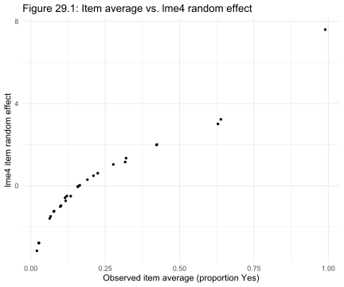
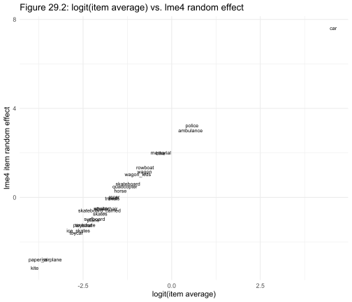
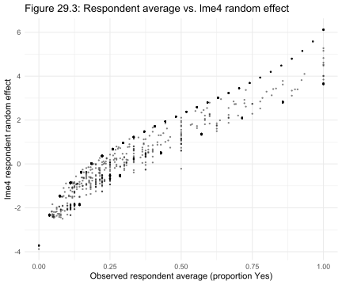
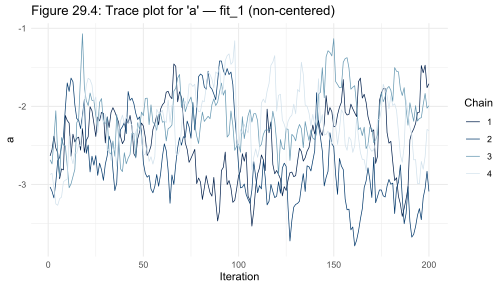
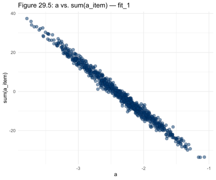
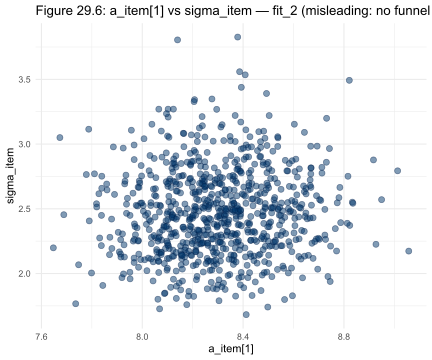
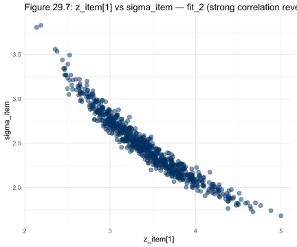
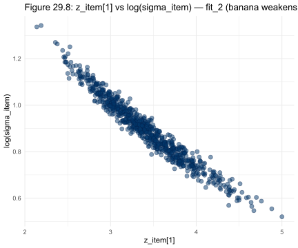
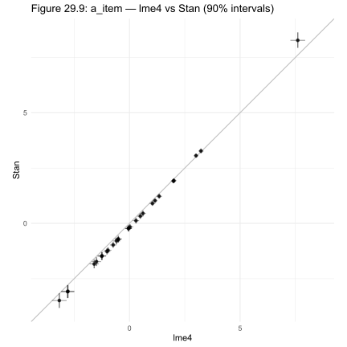
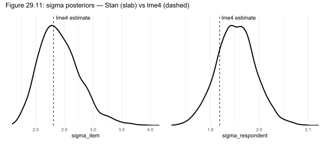

# Chapter 29 Case Study: When the Sampler Gets Confused

*Based on Gelman, Vehtari et al., [Bayesian Workflow](https://avehtari.github.io/Bayesian-Workflow/park_rule/park_rule.html) (2026), Chapter 29.*
*Implemented using [RBayesflow](https://github.com/wildpeaches/RBayesflow) and [cmdstanr](https://mc-stan.org/cmdstanr/) in R.*

---

## The Question

If your model is well-specified and your data are plentiful, why would the sampler still struggle?

The usual suspects for poor [Markov chain Monte Carlo](https://en.wikipedia.org/wiki/Markov_chain_Monte_Carlo) (MCMC) sampling are a misspecified likelihood, sparse data, or an extremely multimodal posterior. But here, none of those apply. The data are 51,953 survey responses. The model is a straightforward hierarchical logistic regression. The problem is structural: the way the parameters are related to each other makes the posterior hard to explore, and changing the parameterization fixes it.

The survey from this chapter asked 2,409 people whether 27 different scenarios violated a rule prohibiting "vehicles" in a park. Should an ambulance be allowed? A kite? A car? Responses are coded 1 (violates the rule) or 0 (doesn't), giving a binary outcome with two crossed grouping structures: respondents and items. 

We fit four versions of the same hierarchical logistic regression in [Stan](https://mc-stan.org/), each addressing a different parameterization issue. [lme4](https://cran.r-project.org/package=lme4) gives us a fast approximation to start with, and the full Bayesian fit from the best-parameterized model is our target.

---

## The Data

The survey was designed by [Turner (2024)](https://dvt.name/novehicles) and adapted from a classic legal thought experiment by [Hart (1958)](https://www.jstor.org/stable/1340268) on the relationship between rules and their application. Each of the 27 questions presents a scenario involving a named person (with gender and race signals embedded in the name) and asks whether their action violates the no-vehicles rule.

The dataset has 51,953 rows, one per response, with columns for the respondent index, item index, binary name gender indicator, binary name race indicator, and the outcome. After reading the data in, we recode the response count per respondent into the number of items *skipped* rather than items answered, so that zero is a natural baseline.

```r
park <- read.csv("park.csv")
N <- nrow(park)         # 51,953
J <- length(unique(park$submission_id))  # 2,409 respondents
K <- length(unique(park$question_id))    # 27 items
```

The overall "yes, this violates the rule" rate is 23.9%. For respondents who answered every question with a gender-neutral, race-neutral name, the rate drops to 21.5%.

---

## Setting Up: Phase 1

We initialize the [RBayesflow](https://github.com/wildpeaches/RBayesflow) workflow in practice mode. This chapter uses cmdstanr directly rather than [brms](https://paul-buerkner.github.io/brms/) because the chapter's parameterization experiments require explicit control over the Stan model code. The `run_phase3()` wrapper, which calls `brm()`, is bypassed for all four fits.

```r
source("../../R/source_all.R")
wf <- init_workflow(mode = "practice", stage = "explore")
```

We set the global seed to 123 to match the book's simulation section, and we create a `stan_output/` directory so cmdstanr can write its CSV chain files locally without polluting the working directory.

---

## The lme4 Baseline

Before touching Stan, we use [lme4](https://cran.r-project.org/package=lme4)'s `glmer()` for a fast approximate fit. The model includes crossed random intercepts for respondents and items, plus three fixed predictors: whether the name sounds male, whether it sounds white, and how many items the respondent skipped.

We fit the model twice. The first version uses the raw count of items answered as a predictor; the second recodes it as items skipped so that zero is a sensible reference point. The coefficient estimates and Akaike Information Criterion (AIC) are identical between the two fits; only the intercept changes from -1.50 to -2.42 because the baseline category shifts.

```r
fit_lme4 <- lme4::glmer(
  y ~ (1 | item) + (1 | respondent) + male_name + white_name + n_skipped_full,
  family = binomial(link = "logit"),
  data   = data_park
)
```

The lme4 estimates for the final model match the book's reported values closely: intercept -2.42, male name coefficient 0.07, white name coefficient 0.08, skipped items coefficient 0.03, respondent standard deviation 1.92, item standard deviation 2.31.

The item random effects tell a clear story about which scenarios people see as vehicle-like. Figure 29.1 plots each item's raw average response rate against its lme4 random effect estimate.



The scatter shows a tight monotone relationship: items where few people said "yes, this violates the rule" have strongly negative random effects, while the car item sits far to the upper right. The relationship is nonlinear because the link function is logistic, which Figure 29.2 makes explicit.



On the logit scale, the relationship between item average and item random effect is nearly linear. The car item is a visible outlier in the upper right, and kite, paper airplane, and ISS cluster together at the lower left. The labels identify each item by name, making it easy to read off which objects people treat as vehicles and which they don't.

We also check how individual respondents vary. Figure 29.3 shows respondent-level averages against lme4 respondent random effects.



The respondent cloud is much denser than the item scatter and shows a smooth, strongly monotone pattern. Respondents who said "yes" to almost every question have high positive random effects; those who said "no" to almost everything have large negative effects. The item effects span a wider range (roughly -3 to +8) than the respondent effects (roughly -5 to +5), which already hints that items are harder to estimate than respondents.

We also run a simulation recovery check: we generate synthetic responses from the lme4 estimates and refit. The recovered coefficients land close to the generating values, confirming the model is identifiable under lme4.

---

## The Statistical Model

The model for all four Stan fits shares the same likelihood. Each response $y_{ij}$ from respondent $j$ to item $k$ follows:

$$
\begin{aligned}
y_{ij} &\sim \text{Bernoulli}(\text{logit}^{-1}(\eta_{ij})) \\
\eta_{ij} &= a + a_{\text{respondent}[j]} + a_{\text{item}[k]} + X_{ij}^\top b
\end{aligned}
$$

where:
- $a$ is the global intercept
- $a_{\text{respondent}[j]}$ is the random intercept for respondent $j$, drawn from $\text{Normal}(0, \sigma_\text{respondent})$
- $a_{\text{item}[k]}$ is the random intercept for item $k$, drawn from $\text{Normal}(0, \sigma_\text{item})$
- $X_{ij}$ is the vector of fixed predictors (male name indicator, white name indicator, items skipped) for observation $ij$
- $b$ is the vector of fixed-effect coefficients

Priors on the fixed effects and variance components:

$$
\begin{aligned}
b &\sim \text{Normal}(0, 1) \\
\sigma_\text{respondent}, \sigma_\text{item} &\sim \text{Normal}(0, 3)
\end{aligned}
$$

The priors on $b$ are weakly informative because the predictors are binary or lightly scaled integers; a coefficient of 1 on a binary predictor roughly doubles the odds, which is already a strong effect. The half-normal on $\sigma$ permits large group-level variation, consistent with what lme4 suggested ($\sigma_\text{item} \approx 2.3$), without being completely flat.

The four Stan models differ only in how they parameterize $a_{\text{respondent}}$ and $a_{\text{item}}$ and whether the predictors are centered. That's the whole story of the chapter.

---

## fit_1: The Identifiability Problem

The first Stan model uses a non-centered parameterization implemented through Stan's `<multiplier=sigma>` declaration. In a non-centered parameterization, the sampler works with a standardized variable $z \sim \text{Normal}(0, 1)$ and scales it by $\sigma$ in the code, so the sampled parameters are on a unit scale.

```r
fit_1 <- cstan("park_1.stan", data = stan_data,
               iter_warmup = 200, iter_sampling = 200)
```

We use only 200 warmup and 200 sampling iterations here, deliberately matching the book's exploratory run length. The goal is to expose the diagnostic problem quickly, not to get a polished posterior.

The results show suspiciously high $\hat{R}$ for the global intercept `a`:

```
variable          mean  sd   rhat  ess_bulk
a                -2.38  0.50  1.22    13
sigma_respondent  1.95  0.04  1.02   198
sigma_item        2.44  0.34  1.01   179
```

The intercept's posterior standard deviation is 0.50. With 51,953 observations, we'd expect something like 0.03. The effective sample size of 13 confirms the chain barely moved. Figure 29.4 shows why.



The trace plot for `a` shows four chains drifting slowly through the same region without mixing. High autocorrelation within each chain and poor agreement across chains are both visible as slow, wandering trajectories rather than the rapid, overlapping oscillations of a healthy trace plot.

The cause is a classic identifiability trap. Look at the likelihood:

```
y ~ bernoulli_logit_glm(X, a + a_respondent[respondent] + a_item[item], b)
```

Three quantities all contribute to the total intercept. If `a` increases by 1, the likelihood is unchanged if every element of `a_item` decreases by $1/K$. The parameters aren't separately identified; the sampler can slide `a` and the sum of `a_item` in opposite directions forever. Figure 29.5 makes the dependency visible.



The scatter of `a` against `sum(a_item)` shows a strong negative linear relationship, exactly as expected from the identifiability argument. The points trace a long ridge in the posterior rather than a compact cloud.

---

## fit_2: Sum-to-Zero Fixes the Intercept, Reveals a New Problem

The sum-to-zero constraint forces the item and respondent random effects to sum to zero across their respective groups. Stan's `sum_to_zero_vector` type handles this automatically. The constraint eliminates the identifiability problem because the global intercept `a` now has a unique role: it's the baseline when item and respondent effects are at their group mean, not an arbitrary offset.

But sum-to-zero doesn't mix with the `<multiplier=sigma>` syntax, so model 2 separates the parameterization explicitly. The sampled parameters are `z_respondent` and `z_item` (both on a unit scale), and the actual effects `a_respondent` and `a_item` are computed in a `transformed parameters` block.

```r
fit_2 <- cstan("park_2.stan", data = stan_data,
               iter_warmup = 200, iter_sampling = 200)
```

The intercept problem is fixed. The posterior standard deviation of `a` drops from 0.50 to 0.04, and $\hat{R}$ falls to 1.01. But now `sigma_item` shows elevated $\hat{R}$ (1.02), and the effective sample size for `z_item` parameters is around 70-130, much lower than we want.

The problem is now in `z_item` rather than `a`, and it's easy to miss because examining the wrong parameter gives a false sense of security. Figure 29.6 shows what you'd see if you looked at `a_item[1]` against `sigma_item`.



The scatter looks fine: a roughly oval cloud with no obvious problematic structure. But `a_item[1]` is a derived quantity, not a sampled one. The sampler works in `z_item` space. Figure 29.7 shows the same comparison using the actual sampled parameter.



Now the strong positive linear correlation between `z_item[1]` and `sigma_item` is clear. If `sigma_item` is large, `z_item` must be small for `a_item` to stay at the right value; if `sigma_item` is small, `z_item` must be large. The two parameters are tightly coupled, and the sampler struggles to move them jointly. Figure 29.8 replots on a log scale for `sigma_item`.



On the log scale, the banana shape visible in Figure 29.7 weakens to something closer to linear, which matches the diagnostic summary: the problem is correlation, not a severe funnel. This is the key diagnostic lesson of the chapter: when non-centered parameterization is used, inspect the latent parameters (`z_item`), not the derived ones (`a_item`). The transformation hides the coupling.

---

## fit_3: Centered Parameterization Solves the Item Problem

The insight from fit_2 is that we have a lot of data per item (about 1,900 observations per item on average). With that much information, the likelihood dominates the prior for each item effect, and the centered parameterization is more efficient. In the centered version, `a_item` is sampled directly from its prior, and there's no `z_item` to create a coupling with `sigma_item`.

Model 3 keeps the sum-to-zero constraint but switches to centered parameterization for both `a_respondent` and `a_item`.

```r
fit_3 <- cstan("park_3.stan", data = stan_data,
               iter_warmup = 200, iter_sampling = 200)
```

The improvement is immediate. `sigma_item` drops to $\hat{R} = 1.00$ and mean treedepth falls from 6.5 to 5.0. The sampler is taking larger steps because the posterior geometry is simpler.

```
variable          mean  sd   rhat  ess_bulk
a                -2.42  0.04  1.01   376
sigma_respondent  1.95  0.04  1.00   532
sigma_item        2.42  0.33  1.00  2198
```

No diagnostics look problematic. Mean treedepth is 5, down from 6.5 in fit_2 and 6.8 in fit_1.

---

## fit_4: Centering the Predictors

One more improvement remains. The fixed predictors in $X$ are not centered around their means. The global intercept `a` therefore represents the log-odds of a "yes" response when male indicator, white indicator, and items-skipped are all zero, which isn't the average respondent. Because `a` is correlated with the item and respondent effects through the data, this introduces additional posterior correlation.

Model 4 adds a `transformed data` block that centers each column of $X$ before fitting. The math changes only the intercept's interpretation: after centering, `a` is the log-odds for an average respondent answering an average item.

```r
fit_4 <- cstan("park_4.stan", data = stan_data,
               iter_warmup = 200, iter_sampling = 200)
```

We run the 200/200 exploratory version first to confirm that the diagnostics look similar to fit_3 (mean treedepth 5.0, no divergences), then refit at the default 1,000 warmup / 1,000 sampling iterations.

```r
fit_4 <- cstan("park_4.stan", data = stan_data,
               iter_warmup = 1000, iter_sampling = 1000)
```

The full run produces clean diagnostics across all parameters:

```
variable          mean   sd    rhat  ess_bulk
a                -2.27  0.03   1.00   2414
b[1] (male)       0.07  0.03   1.00   6720
b[2] (white)      0.08  0.03   1.00   8998
b[3] (n_skipped)  0.03  0.01   1.00   2162
sigma_respondent  1.95  0.04   1.00   2564
sigma_item        2.42  0.36   1.00   6748
```

Mean treedepth drops further to 4.93, down from 5.0 in models 3 and 4 short run, because longer warmup gives the sampler more time to adapt the mass matrix and step size.

All fixed effect estimates match the lme4 values closely. The male name coefficient stays at 0.07, the white name coefficient at 0.08, and the items-skipped coefficient at 0.03. These numbers suggest small but real effects of demographic signals on whether someone says a scenario violates the rule.

---

## How the Parameterization Evolved

The four models address a sequence of identifiability and sampling-efficiency problems, each one revealed by examining the previous model's diagnostics.

| Model | Change | Problem fixed | Rhat(a) | Rhat(sigma_item) | Mean treedepth |
|-------|--------|---------------|---------|-----------------|----------------|
| fit_1 | Non-centered, no constraint | Baseline | 1.22 | 1.01 | 7.0 |
| fit_2 | Sum-to-zero added | Intercept identifiability | 1.01 | 1.02 | 6.5 |
| fit_3 | Centered parameterization | z-sigma coupling | 1.01 | 1.00 | 5.0 |
| fit_4 | Predictor centering | Intercept-effect correlation | 1.00 | 1.00 | 4.93 |

Each step costs nothing in statistical validity and reduces sampling time by 10-30%.

---

## lme4 vs Bayesian: How Different Are the Estimates?

With 51,953 observations and relatively simple random effects structure, lme4 and the full Bayesian fit should agree closely. Figures 29.9 and 29.10 compare the two.



The item-level comparison shows Stan posterior means (y-axis) plotted against lme4 conditional modes (x-axis), with horizontal bars for lme4's normal-approximation 90% intervals and vertical bars for Stan's 90% posterior intervals. The points cluster tightly along the diagonal, confirming the two methods agree on the direction and rough magnitude of each item's effect. The Stan intervals are somewhat wider than lme4's, because lme4 conditions on its point estimates of $\sigma_\text{item}$ while Stan integrates over uncertainty in $\sigma_\text{item}$.

The one notable outlier is the car item (far upper right), where `a_item[1]` from Stan has a posterior mean of 8.27, somewhat higher than lme4's estimate of 7.61. This offset is consistent with the sum-to-zero constraint shifting the absolute item scale slightly. The direction is the same: car is unambiguously the item people treat most consistently as a vehicle.


The respondent comparison tells a similar story at smaller scale. With 2,409 respondents, each contributing around 22 responses on average, the Bayesian estimates are again slightly wider than lme4's. The cloud of points is more symmetric than the item comparison, because respondents don't have any single extreme outlier like the car item.

Figure 29.11 shows why Stan's intervals are wider: it integrates over the uncertainty in $\sigma_\text{item}$ and $\sigma_\text{respondent}$, while lme4 treats those variance components as known.



Both panels show the Stan posterior as a slab (a smoothed density curve) with lme4's point estimate as a dashed vertical line. For $\sigma_\text{item}$, the posterior slab sits slightly to the right of the lme4 line, peaking around 2.4 with a right skew extending past 3.0. For $\sigma_\text{respondent}$, the slab is narrower and the lme4 line passes through the bulk of the posterior mass. The pattern reflects the fact that $\sigma_\text{item}$ is estimated from only 27 items, so there's more uncertainty in it than in $\sigma_\text{respondent}$, which is estimated from 2,409 respondents. Full Bayes accounts for that uncertainty; lme4 does not.

---

## How RBayesflow Guided the Analysis

1. **Goal declaration (Phase 1):** We assessed whether a full Bayesian fit was necessary, given the data size. The off-ramp assessment noted that lme4 was a viable alternative, and we used it as a baseline before fitting Stan.
2. **Data inspection (Phase 1):** We constructed the index vectors and summary statistics that feed both the lme4 and Stan models, and logged dimension checks to `results.txt`.
3. **Prior specification (Phase 2):** We documented the weakly informative priors on fixed effects and variance components, with a "because" sentence for each: unit-normal priors on $b$ because the predictors are binary or lightly scaled, and half-normal priors on $\sigma$ because lme4 estimates suggest the true values are around 2.
4. **Model fitting (Phase 3):** Because the chapter's likelihoods cannot be expressed through brms formula interfaces, Phase 3 used `cmdstanr` directly via a thin `cstan()` helper. We set `wf$fit_timestamp` and `wf$fit_hash` manually after each fit to maintain the audit trail.
5. **Diagnostics (Phase 4):** The diagnostic block ran `fit$diagnostic_summary()` after each fit and logged $\hat{R}$, ESS, BFMI, divergences, and treedepth. The wf gate fields were set manually. The progression from fit_1 to fit_4 is the core content of the chapter.
6. **Posterior comparison (Phase 5):** Standard `bayesplot::ppc_dens_overlay()` was not appropriate because the outcome is binary and the chapter's comparison is qualitative. We compared lme4 and Stan estimates using `ggdist::stat_pointinterval()` instead.
7. **LOO-CV (Phase 6):** LOO-CV was not performed. All four Stan models fit the same likelihood; only the parameterization differs. A LOO comparison would not be meaningful, and we logged the reason in `results.txt`.

---

## Extensions for the Student

- **Vary the prior on $\sigma$.** The models use `Normal(0, 3)` for both variance components. Try `Exponential(0.5)` instead and observe how the posterior for $\sigma_\text{item}$ changes. The car item's random effect is large enough that a tighter prior on $\sigma_\text{item}$ would compress it noticeably.
- **Check the non-centered respondent effects.** Model 3 switches both `a_respondent` and `a_item` to centered parameterization. The chapter notes that keeping `a_respondent` non-centered makes little difference. Verify this by fitting a hybrid model with centered `a_item` and non-centered `a_respondent` and comparing treedepth.
- **Examine the name-signal coefficients.** `b[1]` (male name) and `b[2]` (white name) are small but nonzero. Use `bayesplot::mcmc_areas()` to plot their marginal posteriors alongside zero to assess how confidently the data exclude a null effect.
- **Run the sum-to-zero version with more items.** The sum-to-zero constraint interacts with the number of groups $K$. Subset the data to 5 items and refit fit_2 and fit_3. The advantage of centered parameterization depends on how much data each item has, and with fewer items the non-centered version may perform better.
- **Compare HMC efficiency metrics.** The book uses mean treedepth and mean leapfrog steps as proxies for sampling efficiency. Plot `n_leapfrog__` over iterations for each of the four fits to see how the adaptation phase changes the sampler's behavior across parameterizations.

---

## Glossary

**[Akaike information criterion](https://en.wikipedia.org/wiki/Akaike_information_criterion)** (**AIC**) estimates the prediction error and relative quality of different statistical models for a given set of data, giving a method to select the optimal model for fitting the data.

**[Bernoulli distribution](https://en.wikipedia.org/wiki/Bernoulli_distribution):** A probability distribution for a binary outcome (0 or 1) parameterized by a single probability $p$. Used here as the likelihood for each yes/no survey response.

**[brms](https://paul-buerkner.github.io/brms/):** An R package that translates R model formulas into Stan code and fits them via HMC. Not used in this chapter because the parameterization experiments require direct Stan code.

**[cmdstanr](https://mc-stan.org/cmdstanr/):** An R interface to CmdStan, the command-line version of Stan. Allows direct control over Stan model code and sampling options. Used for all four fits in this chapter.

**Centered parameterization:** A parameterization of a hierarchical model in which the group-level effects are sampled directly from their prior distribution, rather than as standardized deviations scaled by $\sigma$. More efficient when the likelihood provides strong information about each group.

**[Crossed random effects](https://en.wikipedia.org/wiki/Mixed_model#Crossed_vs._nested_random_effects):** A model structure where observations belong to multiple grouping factors that are not nested within each other. Here, each response belongs to both a respondent and an item; a given respondent may have answered any item, and a given item may have been seen by any respondent.

**[E-BFMI](https://mc-stan.org/docs/reference-manual/hamiltonian-monte-carlo.html):** Energy Bayesian Fraction of Missing Information. A diagnostic for HMC that measures how well the sampler explores the energy levels of the posterior. Values below 0.3 suggest the sampler may be stuck. In this chapter, fit_1 produced values around 0.62-0.71; fit_4 full run produced 0.78-0.96.

**[ESS](https://mc-stan.org/docs/reference-manual/effective-sample-size.html) (Effective Sample Size):** The number of effectively independent draws from the posterior, accounting for autocorrelation between successive MCMC samples. Low ESS (below a few hundred for most purposes) indicates the chain is mixing slowly.

**[glmer](https://www.rdocumentation.org/packages/lme4/versions/1.1-35.3/topics/glmer):** The generalized linear mixed model fitting function in [lme4](https://cran.r-project.org/package=lme4). Uses the Laplace approximation for the marginal likelihood and is substantially faster than full Bayes for large datasets.

**[Hamiltonian Monte Carlo (HMC)](https://mc-stan.org/docs/reference-manual/hamiltonian-monte-carlo.html):** A Markov chain Monte Carlo method that uses gradient information to make large, efficient jumps through the posterior. Stan's default sampler, No-U-Turn Sampler (NUTS), is a self-tuning variant of HMC.

**Hierarchical logistic regression:** A logistic regression model that includes group-level random effects. Here, respondents and items each get their own intercept offset, allowing the baseline probability to vary across both groups.

**Identifiability:** A model is identifiable when there is a unique parameter value that maximizes the likelihood for any dataset. The intercept in fit_1 is not identified because adding a constant to `a` and subtracting the same constant from the sum of `a_item` leaves the likelihood unchanged.

**[lme4](https://cran.r-project.org/package=lme4):** An R package for fitting linear and generalized linear mixed models using maximum likelihood with the Laplace approximation. Used here as a fast baseline before full Bayesian inference.

**[Logit function](https://en.wikipedia.org/wiki/Logit):** The inverse of the logistic function, defined as $\text{logit}(p) = \log(p / (1-p))$. Maps a probability in $(0, 1)$ to the real line.

**[Markov chain Monte Carlo (MCMC)](https://en.wikipedia.org/wiki/Markov_chain_Monte_Carlo):** A family of algorithms for sampling from probability distributions by constructing a Markov chain whose stationary distribution is the target. Stan uses HMC/NUTS, a particularly efficient variant.

**[No-U-Turn Sampler (NUTS)](https://mc-stan.org/docs/reference-manual/hamiltonian-monte-carlo.html):** Stan's default HMC algorithm. It automatically determines how far to travel along each trajectory before turning around, avoiding the need to manually tune the number of leapfrog steps.

**Non-centered parameterization:** A parameterization in which the group-level effects are expressed as a standardized deviation multiplied by $\sigma$. More efficient than centered parameterization when the data carry little information about individual groups (few observations per group). Less efficient when information per group is high.

**[Posterior](https://en.wikipedia.org/wiki/Posterior_probability):** The probability distribution over parameters given the observed data. Calculated by Bayes' theorem as proportional to the likelihood times the prior.

**[Prior](https://en.wikipedia.org/wiki/Prior_probability):** A probability distribution that encodes beliefs about a parameter before observing the data. In this chapter, we use `Normal(0, 1)` priors on fixed effects and `Normal(0, 3)` on variance components.

**Random intercept:** A model parameter that shifts the baseline prediction for a particular group (respondent or item). Random intercepts are drawn from a shared distribution rather than estimated independently, allowing information to be pooled across groups.

**[$\hat{R}$ (R-hat)](https://mc-stan.org/docs/reference-manual/effective-sample-size.html#r-hat-convergence-diagnostic):** A convergence diagnostic that compares variance within chains to variance between chains. Values at or below 1.01 indicate the chains have mixed; values above 1.05 indicate a problem. In fit_1, $\hat{R}$ for `a` was 1.22, a clear failure.

**[Stan](https://mc-stan.org/):** A probabilistic programming language for Bayesian inference. Models are written in a C++-like syntax, compiled, and sampled using HMC/NUTS.

**Sum-to-zero constraint:** A constraint on a vector of parameters that forces their sum to equal zero. Used here to make the global intercept `a` identifiable, because without the constraint, adding a constant to `a` and subtracting the same amount from the mean of `a_item` leaves the likelihood unchanged.

**`sum_to_zero_vector`:** A Stan data type that parameterizes a constrained vector on the $K-1$ dimensional simplex where all elements sum to zero. Allows sum-to-zero constraints to be enforced efficiently within the sampler.

**Transformed parameters (Stan):** A Stan program block where variables are computed deterministically from sampled parameters. In model 2, `a_respondent = z_respondent * sigma_respondent` appears here. Examining transformed parameters rather than the sampled ones can hide coupling between the sampled parameters.

**Treedepth:** In NUTS, the depth of the binary tree built to find the next proposal. Mean treedepth is a proxy for how many leapfrog steps (gradient evaluations) the sampler takes per iteration. Treedepth of 7 in fit_1 corresponds to about 127 leapfrog steps per iteration; treedepth of 5 in fit_4 corresponds to about 31.
